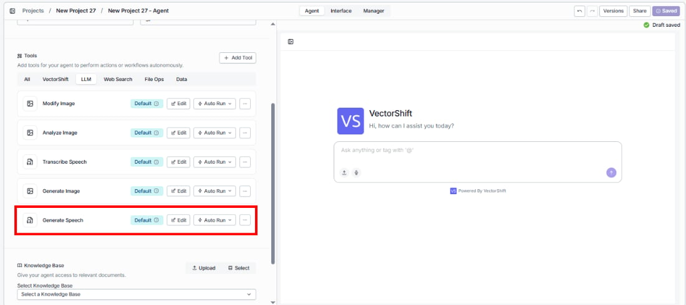
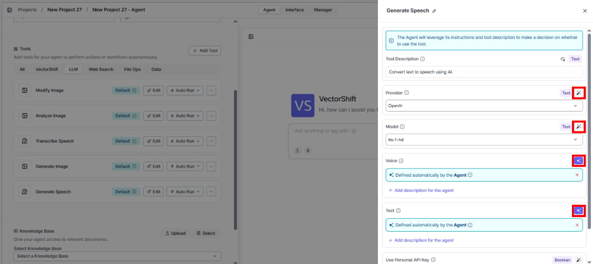
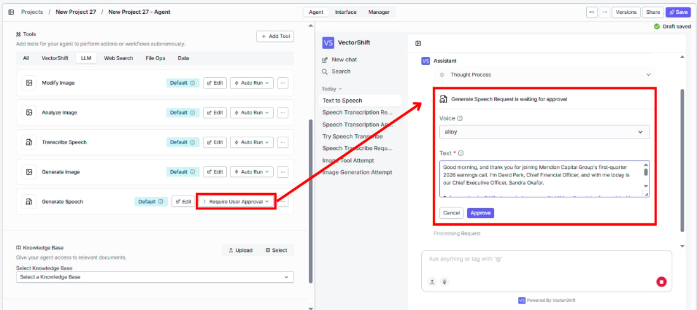
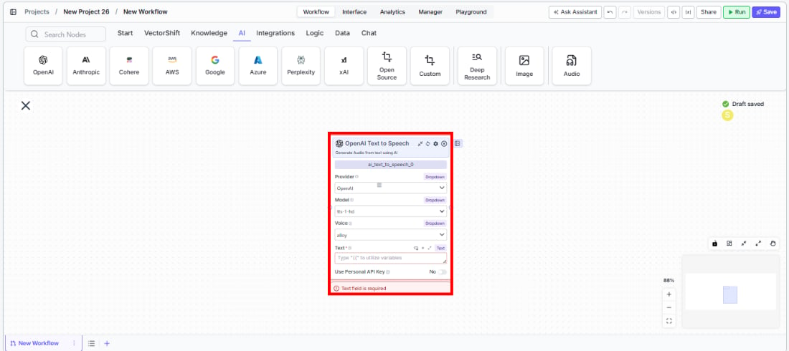

> ## Documentation Index
> Fetch the complete documentation index at: https://docs.vectorshift.ai/llms.txt
> Use this file to discover all available pages before exploring further.

# Text to Speech

> Convert text to audio using AI voice models in your workflows and agents.

<Card title="Use this node from the SDK" icon="code" href="/sdk/pipeline/nodes/multi-modal#ai_text_to_speech">
  Add it in Python with `pipeline.add(name="...").ai_text_to_speech(...)`. See the SDK reference.
</Card>

The Text to Speech node converts text input into natural-sounding audio using AI voice models. Use it to generate audio narrations, voice responses, or spoken content — for example, creating audio summaries of financial reports, generating voice responses for phone-based client interactions, or producing narrated presentations from text content.

## Core Functionality

* Convert text to natural-sounding audio using AI voice models
* Support multiple providers including OpenAI and Eleven Labs
* Choose from multiple voice options per model
* Use personal API keys for dedicated access

## Tool Inputs

* `Provider` \* — (Enum (Dropdown), default: `OpenAI`) Select the voice provider (OpenAI, Eleven Labs)
* `Model` \* — (Enum (Dropdown), default: `tts-1-hd`) Select the text-to-speech model
* `Voice` \* — (Enum (Dropdown), default: `alloy`) Select the voice. Options vary by model
* `Text` \* — (String) The text to convert to audio. Required — the node will show a validation error if empty
* `Use Personal API Key` — (Boolean, default: `No`) Toggle to use your own API key
* `Api Key` — (String) Your API key. Only visible when `Use Personal API Key` is enabled

\* indicates a required field

## Tool Outputs

* `audio` — (Audio) The generated audio file

<Tabs>
  <Tab title="Agents">
    ## Overview

    The Text to Speech tool in agents allows the AI to convert text into audio during conversations. The agent can generate voice output from any text, enabling voice-based interactions and audio content creation.

    ## Use Cases

    * **Voice-enabled client interactions** — Generate spoken responses for phone or voice-based client communication systems.
    * **Audio report summaries** — Convert written financial summaries into audio format for on-the-go consumption.
    * **Accessibility** — Provide audio versions of text content for accessibility needs.
    * **Narrated presentations** — Generate voice narration for presentation slides based on text content.

    ## How It Works

    1. **Add the tool to your agent.** In the agent builder, click **Add Tool** and select **Text to Speech** from the available tools.

    <Frame>
      
    </Frame>

    2. **Configure input fields.** Each field can either be filled automatically by the agent based on conversation context, or locked to a fixed value:
       * `Provider` — Select the voice provider (e.g., OpenAI)
       * `Model` — Choose the TTS model
       * `Voice` — Select the voice
       * `Text` — The agent fills this from conversation context

    <Frame>
      
    </Frame>

    3. **Write the Tool Description.** Describe what the tool does so the agent knows when to use it.

    4. **Set Auto Run behavior.** Choose: Auto Run, Require User Approval, or Let Agent Decide.

    <Frame>
      
    </Frame>

    5. **Test the tool.** Ask the agent to read something aloud and verify the audio output.

    ## Settings

    | Setting                | Type     | Default    | Description               |
    | ---------------------- | -------- | ---------- | ------------------------- |
    | `Provider`             | Dropdown | OpenAI     | The voice provider.       |
    | `Model`                | Dropdown | `tts-1-hd` | The text-to-speech model. |
    | `Voice`                | Dropdown | `alloy`    | The voice to use.         |
    | `Use Personal API Key` | Boolean  | No         | Use your own API key.     |

    ## Best Practices

    * **Choose the right voice.** Test different voice options to find one that matches your brand or use case.
    * **Keep text concise.** Shorter text inputs produce cleaner audio. Break long content into paragraphs for better results.
    * **Use Eleven Labs for premium quality.** If voice quality is critical (e.g., client-facing audio), consider Eleven Labs.

    ## Common Issues

    For troubleshooting common issues with this node, see the [Common Issues](/support) documentation.
  </Tab>

  <Tab title="Workflows">
    ## Overview

    The Text to Speech node in workflows converts text from upstream nodes into audio output. This enables automated audio generation workflows.

    ## Use Cases

    * **Automated audio reports** — Convert financial report summaries into audio files for distribution.
    * **Voice response generation** — Generate audio responses for IVR or voice bot systems.
    * **Batch audio creation** — Convert multiple text items into audio files in a single workflow run.
    * **Multimodal content** — Combine text-to-speech with other nodes to create rich multimedia content.

    ## How It Works

    1. **Add the node to your workflow.** From the toolbar, open the **Audio** category and drag the **Text to Speech** node onto the canvas.

    <Frame>
      
    </Frame>

    2. **Select a provider, model, and voice.** Choose the `Provider` (e.g., OpenAI), `Model` (e.g., `tts-1-hd`), and `Voice` (e.g., `alloy`) from the dropdowns.

    3. **Connect the text input.** Wire a text output from an upstream node to the `Text` input, or enter text directly.

    4. **Connect the audio output.** Wire the `audio` output to downstream nodes or an Output node.

    5. **Run your workflow.** Execute the workflow to generate audio from text.

    ## Settings

    | Setting                | Type     | Default    | Description                                           |
    | ---------------------- | -------- | ---------- | ----------------------------------------------------- |
    | `Provider`             | Dropdown | OpenAI     | The voice provider (OpenAI, Eleven Labs).             |
    | `Model`                | Dropdown | `tts-1-hd` | The text-to-speech model.                             |
    | `Voice`                | Dropdown | `alloy`    | The voice to use. Options vary by model and provider. |
    | `Use Personal API Key` | Boolean  | No         | Use your own API key.                                 |

    ## Best Practices

    * **Match voice to content.** Choose voices appropriate for your content type and audience.
    * **Use HD models for quality-critical audio.** The `tts-1-hd` model produces higher quality audio at a higher cost.
    * **Test voice options.** Different voices suit different content — test with representative text before deploying.

    ## Common Issues

    For troubleshooting common issues with this node, see the [Common Issues](/support) documentation.
  </Tab>
</Tabs>
