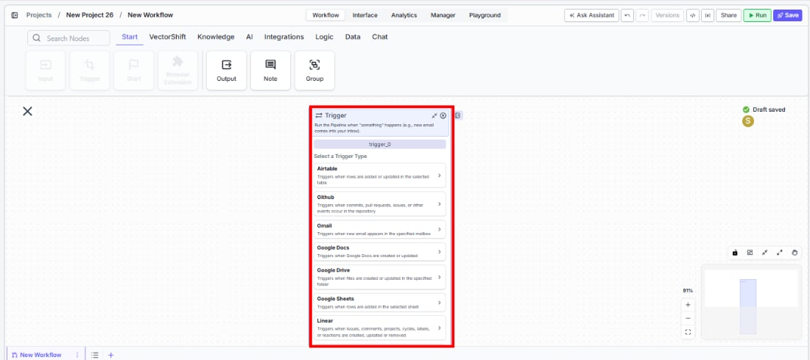
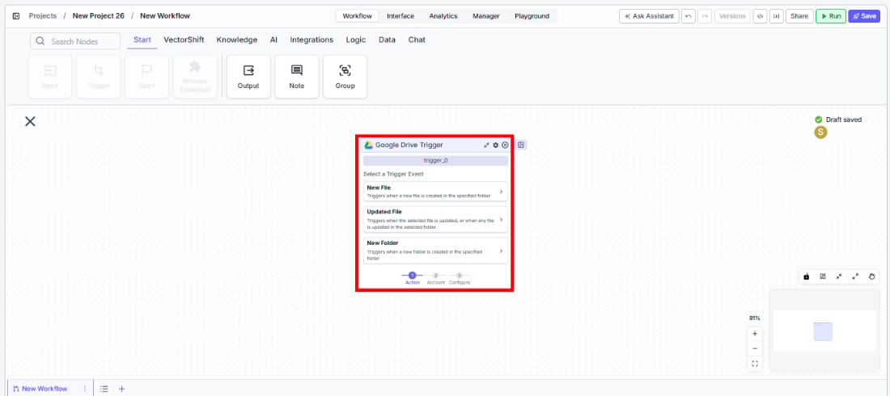
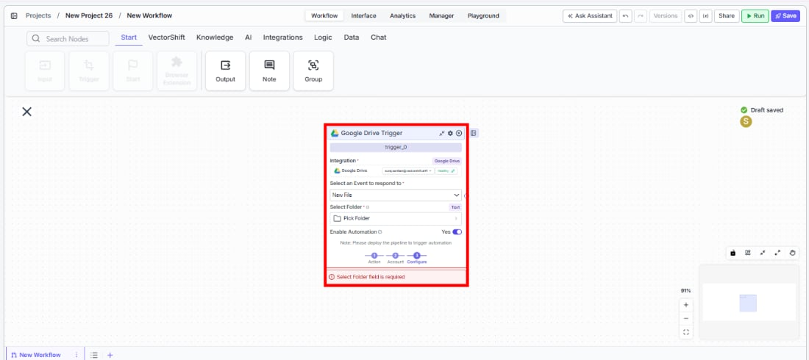
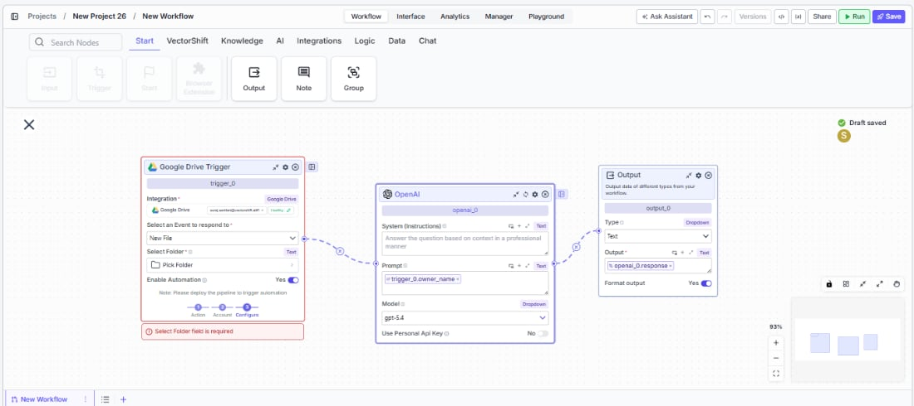

> ## Documentation Index
> Fetch the complete documentation index at: https://docs.vectorshift.ai/llms.txt
> Use this file to discover all available pages before exploring further.

# Trigger

> Automatically run workflows when external events occur across your connected integrations.

<Card title="Use this node from the SDK" icon="code" href="/sdk/pipeline/nodes/triggers#trigger">
  Add it in Python with `pipeline.add(name="...").trigger(...)`. See the SDK reference.
</Card>

The Trigger node starts a workflow automatically when a specific event happens in a connected service -- for example, a new email arriving in Gmail, a file being uploaded to Google Drive, or a row being added to Airtable. Instead of running workflows manually, you wire a Trigger at the start of your workflow so it fires on its own whenever the selected event occurs.

## Core Functionality

* Start workflows automatically in response to external events across 17 supported integrations
* Select a trigger type, then pick a specific event within that integration (e.g., Gmail > New Email)
* Outputs structured event data (sender, subject, file name, etc.) that downstream nodes can consume
* Enable or disable automation per trigger without removing it from the workflow
* Schedule time-based runs using the Cron trigger with daily, weekly, monthly, or custom cron expressions

## Supported Trigger Types

* **Airtable** -- Triggers when rows are added or updated in the selected table
* **GitHub** -- Triggers when commits, pull requests, issues, or other events occur in the repository
* **Gmail** -- Triggers when new email appears in the specified mailbox
* **Google Docs** -- Triggers when Google Docs are created or updated
* **Google Drive** -- Triggers when files are created or updated in the specified folder
* **Google Sheets** -- Triggers when rows are added in the selected sheet
* **Linear** -- Triggers when issues, comments, projects, cycles, labels, or reactions are created, updated, or removed
* **Monday** -- Triggers when items are created, status changes, or column values update on a Monday board
* **OneDrive** -- Triggers when files or folders are created or updated in the specified folder
* **Outlook** -- Triggers when new email appears in the specified mailbox
* **SharePoint** -- Triggers when files are created or updated in the specified folder
* **Slack** -- Triggers when new message appears in the specified channel
* **Teams** -- Triggers when messages are posted in Microsoft Teams channels or chats
* **Typeform** -- Triggers when a new form submission is received
* **Zendesk** -- Triggers when tickets are created or updated in your Zendesk account
* **Cron** -- Triggers the workflow at specific intervals (daily, weekly, monthly, or custom cron expression)

## Tool Inputs

* `Trigger Type` \* -- (Selection list) Choose the integration to monitor. Selecting a type reveals event-specific settings and an integration connection field.
* `Event` \* -- (Enum (Dropdown)) The specific event within the selected trigger type (e.g., "New Email" for Gmail, "New Message" for Slack)
* `Enable/Disable Automation` -- (Boolean, default: `true`) Turn the trigger on or off without removing it from the workflow
* `Integration` \* -- (Integration) The connected account for the selected service (shown after selecting a trigger type)

Additional inputs vary by trigger type and event. For example:

* Gmail/Outlook: no additional inputs beyond the integration
* Slack: `Team`, `Channel`
* Google Drive/OneDrive/SharePoint: folder selection
* Cron: `Timezone`, `Time of Day`, `Day of Week`, `Day of Month`, or custom cron expression
* GitHub: `Owner`, `Repository`, event type selection

\* indicates a required field

## Tool Outputs

Outputs vary by trigger type and event. Common output patterns include:

**Email triggers (Gmail, Outlook):**

* `email_id` -- (String) Unique identifier of the email
* `subject` -- (String) Subject of the email
* `sender_email` -- (String) Email address of the sender
* `recipient_email` -- (String) Email address of the recipient
* `received_time` -- (String) When the email was received
* `contents_of_email` -- (String) Contents of the email
* `attachments` -- (File\[]) Attachments of the email

**Messaging triggers (Slack, Teams):**

* `message` -- (String) The message content
* `user_id` -- (String) Unique identifier of the message sender
* `channel_id` / `channel_name` -- (String) Channel information
* `attachments` -- (File\[]) Files attached to the message
* `permalink` -- (String) Direct link to the message

**File/folder triggers (Google Drive, OneDrive, SharePoint):**

* `file_id` -- (String) Unique identifier of the file
* `file_name` -- (String) Name of the file

**Cron trigger:**

* `timestamp` -- (String) The timestamp when the trigger fired

***

<Tabs>
  <Tab title="Workflows">
    ## Overview

    The Trigger node sits at the start of a workflow and automatically runs the workflow when the configured event fires. Each trigger type monitors a specific integration for changes and passes structured event data to downstream nodes for processing.

    ## Use Cases

    * **Automated invoice processing** -- Trigger on new Gmail attachments to extract invoice data, validate amounts, and update an ERP or spreadsheet.
    * **Real-time trade alert routing** -- Trigger on Slack messages in a trading channel to parse alerts, enrich with market data, and route to the appropriate team.
    * **Scheduled portfolio reporting** -- Use a Cron trigger to generate daily or weekly portfolio performance summaries and distribute via email.
    * **Document compliance monitoring** -- Trigger on Google Drive or SharePoint file updates to scan new documents for regulatory compliance keywords.
    * **Support ticket triage** -- Trigger on new Zendesk tickets to classify urgency, extract key details, and assign to the right agent queue.

    ## How It Works

    1. **Add the node to your workflow.** From the toolbar, open the **Start** tab and drag the **Trigger** node onto the canvas.

    <Frame>
      
    </Frame>

    2. **Select a trigger type.** In the node panel, choose the integration you want to monitor (e.g., Gmail, Slack, Google Drive, Cron).

    <Frame>
      
    </Frame>

    3. **Connect your integration.** Authenticate with the selected service using the integration picker. This grants VectorShift permission to listen for events.

    4. **Choose a specific event.** Select the event that should fire the trigger (e.g., "New Email", "New Message", "New File"). Configure any additional fields the event requires (team, channel, folder, schedule, etc.).

    <Frame>
      
    </Frame>

    5. **Wire the outputs.** Connect the trigger's output fields (email content, file IDs, message text, etc.) to downstream nodes in your workflow.

    <Frame>
      
    </Frame>

    6. **Enable the trigger.** Ensure `Enable/Disable Automation` is set to `true`, then save the workflow. The trigger is now active and will run the workflow automatically when the event occurs.

    ## Settings

    | Setting                     | Type               | Default  | Description                                                 |
    | --------------------------- | ------------------ | -------- | ----------------------------------------------------------- |
    | `Trigger Type`              | Selection list     | --       | The integration to monitor for events.                      |
    | `Event`                     | Dropdown           | --       | The specific event within the selected integration.         |
    | `Enable/Disable Automation` | Boolean            | `true`   | Turn the trigger on or off.                                 |
    | `Integration`               | Integration picker | --       | The authenticated account for the selected service.         |
    | `Timezone`                  | Dropdown           | `UTC`    | Timezone for Cron triggers.                                 |
    | `Time of Day`               | String             | `00:00`  | Time of day for daily/weekly/monthly Cron triggers (HH:MM). |
    | `Day of Week`               | Dropdown           | `Monday` | Day for weekly Cron triggers.                               |
    | `Day of Month`              | Integer            | `1`      | Day for monthly Cron triggers.                              |
    | `Trigger on Weekends`       | Boolean            | `false`  | Include weekends for daily Cron triggers.                   |

    ## Best Practices

    * **Use one trigger per workflow.** Each workflow should have a single Trigger node at its start to keep event handling predictable.
    * **Test with the automation disabled first.** Build and validate your downstream logic before enabling the trigger to avoid processing unexpected events.
    * **Filter events early.** Use a Condition node immediately after the Trigger to discard irrelevant events (e.g., emails from specific senders) before heavier processing.
    * **Monitor Cron expressions carefully.** Verify that custom cron expressions fire at the intended frequency to avoid excessive or missed runs.
    * **Keep integrations active.** If an integration token expires or is revoked, the trigger will stop firing silently. Periodically verify your connected accounts.

    ## Related Templates

    <CardGroup cols={2}>
      <Card title="CapEx Classification AI Agent" href="https://app.vectorshift.ai/marketplace">
        Classifies capital expenditure items against accounting standards and internal policies.
      </Card>

      <Card title="Application Risk Agent" href="https://app.vectorshift.ai/marketplace">
        Assesses risk levels in incoming applications using scoring models and policy rules.
      </Card>

      <Card title="Document Classification Agent" href="https://app.vectorshift.ai/marketplace">
        Automatically categorizes and tags incoming documents based on content and type.
      </Card>

      <Card title="Financial Statement Reconciliation Assistant" href="https://app.vectorshift.ai/marketplace">
        Reconciles financial statements by identifying mismatches and resolving discrepancies.
      </Card>
    </CardGroup>

    ## Common Issues

    For troubleshooting common issues with this node, see the [Common Issues](/support) documentation.
  </Tab>
</Tabs>
