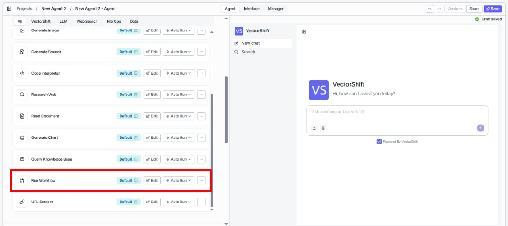
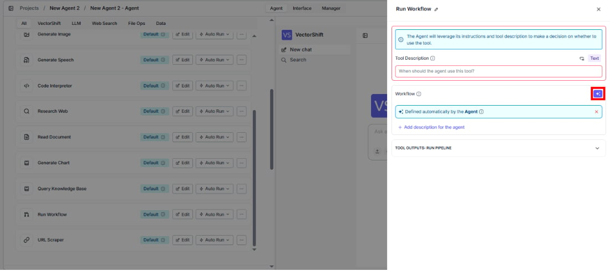
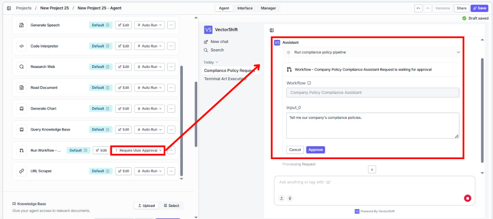
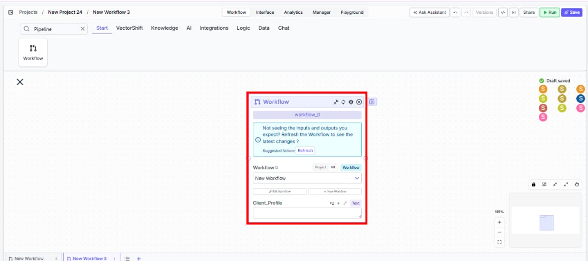
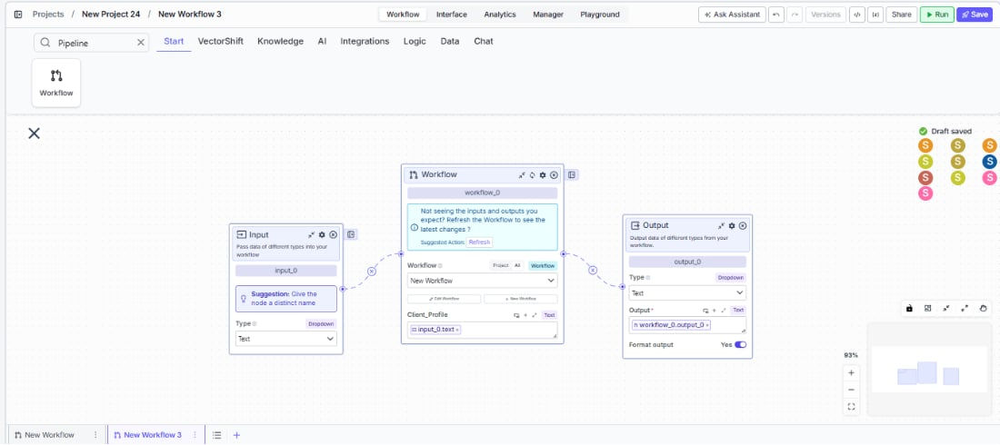

> ## Documentation Index
> Fetch the complete documentation index at: https://docs.vectorshift.ai/llms.txt
> Use this file to discover all available pages before exploring further.

# Workflow Node

> Run an existing workflow as a sub-step within another workflow or as a tool inside an agent.

<Card title="Use this node from the SDK" icon="code" href="/sdk/pipeline/nodes/general#pipeline">
  Add it in Python with `pipeline.add(name="...").pipeline(...)`. See the SDK reference.
</Card>

The Workflow node lets you run an existing workflow as a sub-step within your current workflow, or as a tool inside an agent. When you select a workflow, its input and output nodes are automatically exposed as input and output handles on the node. Use it to modularize complex workflows — for example, calling a document processing sub-workflow from a larger orchestration workflow, or giving an agent the ability to trigger a pre-built analytics workflow on demand.

## Core Functionality

* Run any deployed workflow as a sub-step within another workflow or as a tool in an agent
* Automatically inherit the selected workflow's inputs and outputs as node handles
* Create new workflows directly from the node configuration
* Pass data into the sub-workflow's inputs and receive its outputs for downstream use

## Tool Inputs

* `Workflow` \* — **Required** · Workflow selector · The deployed workflow to run. Once selected, the node dynamically generates input fields matching the sub-workflow's input nodes.
* Dynamic inputs — One input per input node defined in the selected workflow. Names and types match the sub-workflow's input configuration.

\* indicates a required field.

## Tool Outputs

* Dynamic outputs — One output per output node defined in the selected workflow. Names and types match the sub-workflow's output configuration.

<Note>
  The Workflow node uses the most recent **deployed** version of your sub-workflow. If you don't see the inputs and outputs you expect, make sure the sub-workflow has been deployed.
</Note>

<Tabs>
  <Tab title="Agents">
    ## Overview

    When added as a tool inside an agent, the Workflow node (labeled "Run Workflow") lets the agent trigger an existing workflow during a conversation. The agent passes inputs to the workflow, waits for execution, and incorporates the workflow's outputs into its response. This is ideal for giving agents access to pre-built, deterministic processing workflows — such as running a calculation, generating a report, or executing a multi-step data transformation.

    ## Use Cases

    * **On-demand report generation** — An agent triggers a report-building workflow when a user requests a financial summary, passing the date range and account as inputs.
    * **Data processing on request** — An agent runs a CSV processing workflow when a user uploads a file, returning the cleaned and formatted results.
    * **Calculation workflows** — An agent invokes a risk calculation workflow with portfolio parameters and returns the computed metrics to the user.
    * **Document generation** — An agent triggers a document assembly workflow to produce contracts, proposals, or compliance reports from user-provided data.
    * **Integration orchestration** — An agent runs a workflow that coordinates multiple API calls (e.g., fetching market data, running calculations, updating a CRM) as a single operation.

    ## How It Works

    1. **Add the tool** — In the agent builder, open the tool panel and navigate to the **VectorShift** category. Select **Workflow** to add it as a tool.

    <Frame>
      
    </Frame>

    2. **Select the workflow** — Use the `Workflow` selector to choose the deployed workflow to run. Its inputs automatically appear as configurable fields.
    3. **Configure input fields** — Each input from the selected workflow appears as a field. You can leave fields open for the agent to fill dynamically based on conversation context, or lock them to fixed values. Click the sparkle icon to switch a field between dynamic (agent-determined) and static (fixed) mode.

    <Frame>
      
    </Frame>

    4. **Write a Tool Description** — Describe when and why the agent should run this workflow. Example: *"Use this tool to generate a portfolio performance report. Provide the client name and reporting period."*
    5. **Set Auto Run behavior** — Choose how the tool executes:
       * **Auto Run** — Runs the workflow immediately.
       * **Require User Approval** — Pauses for user confirmation before running.
       * **Let Agent Decide** — The agent determines whether approval is needed.

    <Frame>
      
    </Frame>

    6. **Test the tool** — In the chat interface, trigger a request that should invoke the workflow and verify the results are returned correctly.

    ## Settings

    * `Workflow` — Workflow selector · Default: none · The deployed workflow to run.
    * Dynamic input fields — Generated from the selected workflow's input nodes.
    * `Tool Description` — Text · Default: none · Describes the tool's purpose to the agent.
    * `Auto Run` — Dropdown · Default: Auto Run · Controls execution behavior.

    ## Best Practices

    * **Deploy before using** — The Workflow node runs the most recently deployed version of the sub-workflow. Always deploy your workflow after making changes to ensure the agent uses the latest version.
    * **Write clear tool descriptions** — Include what the workflow does, what inputs it needs, and what outputs to expect. The agent uses this to decide when to invoke it.
    * **Lock configuration inputs** — For inputs that should not vary (e.g., API keys, model settings, output formats), lock them to fixed values and only leave user-facing parameters open.
    * **Use approval for side-effect workflows** — If the workflow performs write operations (sending emails, updating databases, creating records), set Auto Run to "Require User Approval".
    * **Create dedicated workflows for agent use** — Design sub-workflows with clean, well-named inputs and outputs that make sense as agent tool parameters.

    ## Related Templates

    <CardGroup cols={2}>
      <Card title="Investment Memo Generator" href="https://app.vectorshift.ai/marketplace">
        Automatically generates structured investment memos from deal data and research inputs.
      </Card>

      <Card title="Spreadsheet Comparison Assistant" href="https://app.vectorshift.ai/marketplace">
        Compares two or more spreadsheets to identify discrepancies, changes, and anomalies.
      </Card>

      <Card title="Closing Package Review Agent" href="https://app.vectorshift.ai/marketplace">
        Reviews closing packages for completeness, accuracy, and compliance before deal finalization.
      </Card>

      <Card title="Validation Agent" href="https://app.vectorshift.ai/marketplace">
        Validates data and documents against predefined rules, schemas, or compliance standards.
      </Card>
    </CardGroup>

    ## Common Issues

    For troubleshooting and common issues, see the [Common Issues](/docs/common-issues) page.
  </Tab>

  <Tab title="Workflows">
    ## Overview

    In workflows, the Workflow node lets you embed another workflow as a sub-step within your current workflow. This enables modular workflow design — you can break complex workflows into reusable components and compose them together. The node inherits the sub-workflow's inputs and outputs, letting you wire data in and out seamlessly.

    ## Use Cases

    * **Modular workflow design** — Break a large financial processing workflow into reusable sub-workflows (data extraction, transformation, validation, output) and compose them using Workflow nodes.
    * **Shared processing steps** — Use a common data cleaning workflow across multiple parent workflows without duplicating the logic.
    * **Conditional workflow execution** — Route data to different sub-workflows based on conditions (e.g., different processing workflows for equities vs. fixed income).
    * **Team collaboration** — Different team members build and maintain separate sub-workflows, which are composed into a master workflow using Workflow nodes.

    ## How It Works

    1. **Add the node** — On the workflow canvas, open the node panel and navigate to the **VectorShift** category. Drag **Workflow** onto the canvas.

    <Frame>
      
    </Frame>

    2. **Select or create a workflow** — Use the workflow selector to choose an existing deployed workflow, or click **Create Workflow** to build a new one. The creation dialog offers two options: start from scratch or use AI to generate a workflow from a description.
    3. **Connect inputs** — Wire upstream node outputs to the Workflow node's input handles. Each handle corresponds to an input node in the selected sub-workflow.
    4. **Connect outputs** — Wire the Workflow node's output handles to downstream nodes. Each handle corresponds to an output node in the sub-workflow.

    <Frame>
      
    </Frame>

    5. **Run the workflow** — Execute the workflow. The Workflow node runs the sub-workflow with the provided inputs and passes its outputs downstream.

    ## Settings

    * `Workflow` — Workflow selector · **Required** · The deployed workflow to run as a sub-step.
    * Dynamic input fields — Generated from the selected workflow's input nodes.
    * Dynamic output fields — Generated from the selected workflow's output nodes.

    ## Best Practices

    * **Deploy sub-workflows first** — The Workflow node uses the most recently deployed version. If inputs or outputs appear missing, redeploy the sub-workflow.
    * **Keep sub-workflows focused** — Each sub-workflow should handle a single logical step. This makes them reusable and easier to debug.
    * **Match input/output types** — Ensure the types of upstream outputs match the expected input types of the sub-workflow to avoid type-mismatch errors.
    * **Use for abstraction, not duplication** — If you find yourself copying node configurations across workflows, extract the shared logic into a sub-workflow and use Workflow nodes to reference it.
    * **Version control through deployment** — The Workflow node always runs the deployed version. You can safely edit a sub-workflow without affecting parent workflows until you redeploy.

    ## Related Templates

    <CardGroup cols={2}>
      <Card title="Investment Memo Generator" href="https://app.vectorshift.ai/marketplace">
        Automatically generates structured investment memos from deal data and research inputs.
      </Card>

      <Card title="Spreadsheet Comparison Assistant" href="https://app.vectorshift.ai/marketplace">
        Compares two or more spreadsheets to identify discrepancies, changes, and anomalies.
      </Card>

      <Card title="Closing Package Review Agent" href="https://app.vectorshift.ai/marketplace">
        Reviews closing packages for completeness, accuracy, and compliance before deal finalization.
      </Card>

      <Card title="Validation Agent" href="https://app.vectorshift.ai/marketplace">
        Validates data and documents against predefined rules, schemas, or compliance standards.
      </Card>
    </CardGroup>

    ## Common Issues

    For troubleshooting and common issues, see the [Common Issues](/docs/common-issues) page.
  </Tab>
</Tabs>
