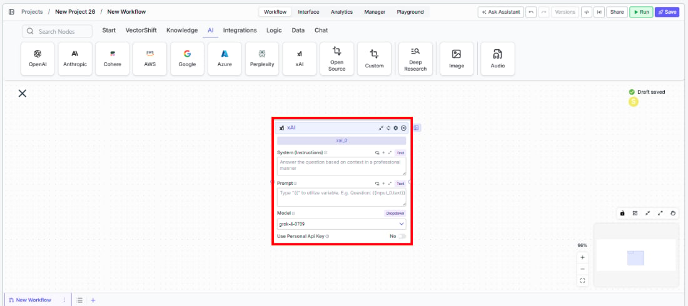
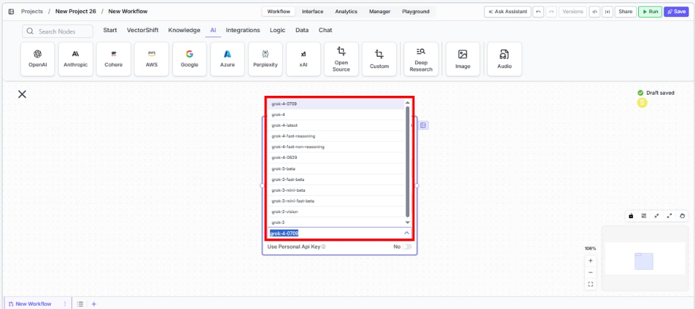
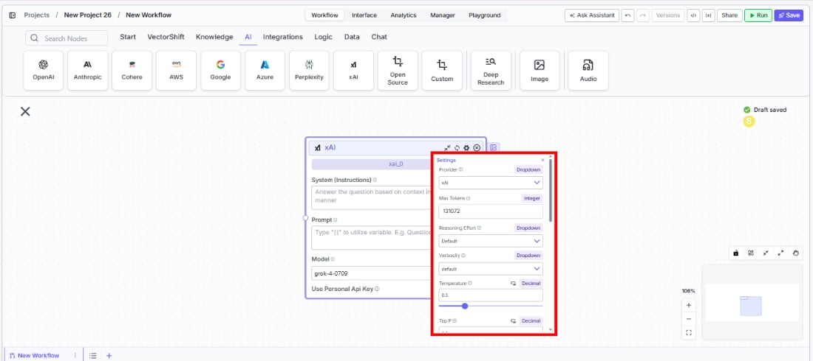
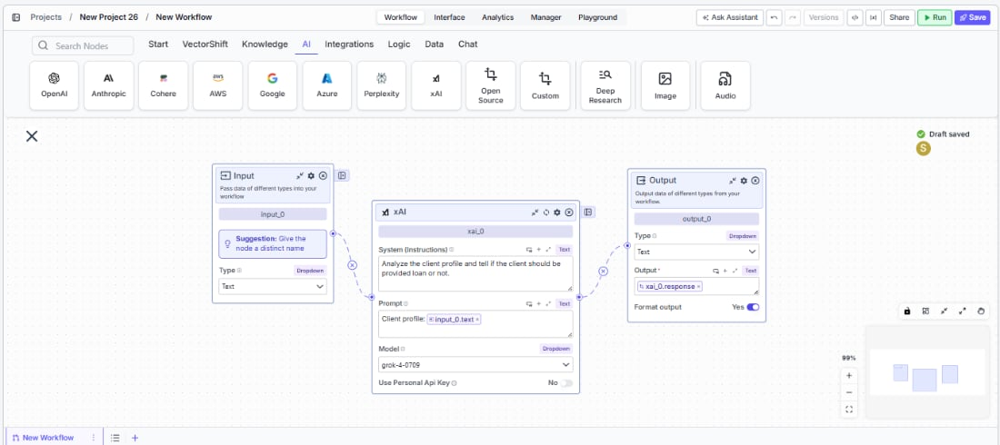

> ## Documentation Index
> Fetch the complete documentation index at: https://docs.vectorshift.ai/llms.txt
> Use this file to discover all available pages before exploring further.

# xAI LLM

> Generate text responses using xAI's Grok models in your workflows.

<Card title="Use this node from the SDK" icon="code" href="/sdk/pipeline/nodes/llms#llm">
  Add it in Python with `pipeline.add(name="...").llm(...)`. See the SDK reference.
</Card>

The xAI LLM node connects your workflows to xAI's Grok family of language models. Use it to generate text responses, analyze documents, or build AI-powered workflows — for example, generating market commentary, classifying financial documents, or building chatbots that leverage Grok's reasoning and search capabilities.

## Core Functionality

* Generate text completions and conversational responses using Grok models
* Access specialized model variants including search-enabled and fast-reasoning models
* Process system instructions and dynamic prompts with variable interpolation
* Stream responses in real time for long-running generations
* Return structured JSON output with optional schema enforcement
* Track token usage and credit consumption per run
* Apply content moderation, PII detection, and safety guardrails
* Retry failed executions automatically with configurable intervals

## Tool Inputs

* `System Instructions` — (String) Instructions that guide the model's behavior, tone, and how it should use data provided in the prompt
* `Prompt` — (String) The data sent to the model. Type `{{` to open the variable builder and reference outputs from other nodes
* `Model` \* — (Enum (Dropdown), default: `grok-4-0709`) Select from available Grok models
* `Use Personal Api Key` — (Boolean, default: `Yes`) Toggle to use your own xAI API key
* `Api Key` — (String) Your xAI API key. Visible when `Use Personal Api Key` is enabled

\* indicates a required field

## Tool Outputs

* `response` — (String (or Stream\<String> when streaming)) The generated text response from the model
* `prompt_response` — (String) The combined prompt and response content
* `tokens_used` — (Integer) Total number of tokens consumed (input + output)
* `input_tokens` — (Integer) Number of input tokens sent to the model
* `output_tokens` — (Integer) Number of output tokens generated by the model
* `credits_used` — (Decimal) VectorShift AI credits consumed for this run

<Tabs>
  <Tab title="Workflows">
    ## Overview

    The xAI LLM node in workflows lets you place a Grok model on the canvas and configure it through the settings panel. xAI offers models with different speed-reasoning tradeoffs and built-in search capabilities.

    ## Use Cases

    * **Market commentary generation** — Generate real-time market commentary using Grok's search-enabled models that can access current data.
    * **Financial document analysis** — Analyze earnings reports, SEC filings, or research notes using Grok's reasoning capabilities.
    * **Fast classification tasks** — Use fast-reasoning variants for high-throughput classification of financial transactions or documents.
    * **Research synthesis** — Combine search capabilities with reasoning to synthesize information across multiple sources for investment research.
    * **Client communication drafting** — Draft personalized financial communications using Grok's conversational capabilities.

    ## How It Works

    1. **Add the node to your workflow.** From the toolbar, open the **AI** category and drag the **xAI** node onto the canvas.

    <Frame>
      
    </Frame>

    2. **Write your System Instructions.** Enter instructions in the `System Instructions` field.

    3. **Configure the Prompt.** In the `Prompt` field, type `{{` to reference upstream node outputs.

    4. **Select a model.** Use the `Model` dropdown to choose a Grok model. Available options include `grok-4-0709`, `grok-4`, `grok-4-search`, `grok-4-fast-reasoning`, `grok-4-fast-non-reasoning`, `grok-4-0625`, `grok-3-fast`, `grok-3-fast-beta`, `grok-3-mini-beta`, and others.

    <Frame>
      
    </Frame>

    5. **Provide an API key.** The `Use Personal Api Key` toggle defaults to **Yes**. Enter your xAI API key in the `Api Key` field.

    6. **Open settings.** Click the **gear icon** (⚙) to configure settings.

    <Frame>
      
    </Frame>

    7. **Connect outputs.** Wire the `response` output to downstream nodes. Click the **Outputs** button to see all available outputs.

    <Frame>
      
    </Frame>

    8. **Run your workflow.** Execute the workflow to process inputs through the Grok model.

    ## Settings

    All settings below are accessed via the **gear icon** (⚙) on the node.

    | Setting                        | Type     | Default | Description                                                                    |
    | ------------------------------ | -------- | ------- | ------------------------------------------------------------------------------ |
    | `Provider`                     | Dropdown | xAI     | The LLM provider.                                                              |
    | `Max Tokens`                   | Integer  | 131072  | Maximum number of input + output tokens per run.                               |
    | `Reasoning Effort`             | Dropdown | Default | Controls the depth of reasoning.                                               |
    | `Verbosity`                    | Dropdown | Default | Controls the verbosity of responses.                                           |
    | `Temperature`                  | Float    | 0.5     | Controls response creativity. Range: 0–1.                                      |
    | `Top P`                        | Float    | 0.5     | Controls token sampling diversity. Range: 0–1.                                 |
    | `Stream Response`              | Boolean  | Off     | Stream responses token-by-token.                                               |
    | `JSON Output`                  | Boolean  | Off     | Return output as structured JSON.                                              |
    | `Show Sources`                 | Boolean  | Off     | Display source documents used for the response.                                |
    | `Toxic Input Filtration`       | Boolean  | Off     | Filter toxic input content.                                                    |
    | `Safe Context Token Window`    | Boolean  | On      | Automatically reduce context to fit within the model's maximum context window. |
    | `Retry On Failure`             | Boolean  | Off     | Enable automatic retries when execution fails.                                 |
    | `Max Retries`                  | Integer  | —       | Maximum retry attempts.                                                        |
    | `Max Interval b/w re-try`      | Integer  | —       | Interval in milliseconds between retries.                                      |
    | `Show Success/Failure Outputs` | Boolean  | —       | Display additional success and failure output ports.                           |

    ## Best Practices

    * **Choose the right Grok variant.** Use `grok-4-search` for queries needing current web data, `grok-4-fast-reasoning` for speed-optimized reasoning, and `grok-4` for general-purpose tasks.
    * **Use JSON mode for structured extraction.** Enable `JSON Output` for consistent output when extracting financial data from documents.
    * **Monitor token usage.** Connect `tokens_used` and `credits_used` for cost tracking across high-volume workloads.
    * **Enable Safe Context Token Window.** This is on by default for xAI — keep it enabled to prevent token-limit errors.
    * **Apply PII detection for sensitive data.** Enable PII toggles when processing client financial information.

    ## Common Issues

    For troubleshooting common issues with this node, see the [Common Issues](/support) documentation.
  </Tab>
</Tabs>
