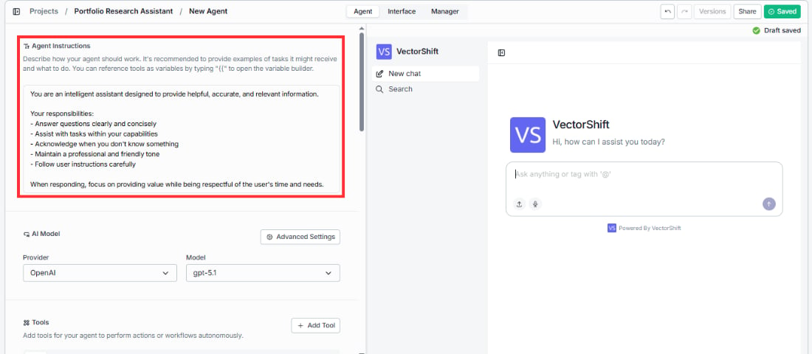

> ## Documentation Index
> Fetch the complete documentation index at: https://docs.vectorshift.ai/llms.txt
> Use this file to discover all available pages before exploring further.

# Agent Instructions

> Define your Agent's role, behavior, tone, and task scope

This is the first thing you see when you open the Agent tab, and it's the most important part of your setup. The instructions tell your Agent how it should behave, what kind of tasks it should handle, what tone to use, and what to do (or not do) in different situations.

You'll see a text area with a helper note above it: *"Describe how your agent should work. It's recommended to provide examples of tasks it might receive and what to do. You can reference tools/inputs as variables by typing '`{{`' to open the variable builder."*

Write your instructions in plain language. The default template looks like this:

> "You are an intelligent assistant designed to provide helpful, accurate, and relevant information. Your responsibilities:
>
> * Answer questions clearly and concisely
> * Assist with tasks within your capabilities
> * Acknowledge when you don't know something
> * Maintain a professional and friendly tone
> * Follow user instructions carefully
>
> When responding, focus on providing value while being respectful of the user's time and needs."

You can replace this entirely with your own instructions.

You can reference tools and inputs in your instructions by typing `{{` in the text field. This opens a variable builder that lets you insert references to specific tools or input variables (e.g., `input_0`) by name. This is useful when you want to explicitly tell the Agent when or how to use a particular tool, or when you need to inject input values directly into the instructions.

<Note>
  Input variables are only available when the agent variant is set to **Functional**. If you're using a different variant, only tool references will appear in the variable builder.
</Note>

There is also an expand button on the text area that opens the instructions in a full-screen editor, which is helpful when working with longer instruction sets.

<Note>
  If you reference a variable that doesn't exist or has been removed, the instructions field will show a red border to indicate the invalid reference.
</Note>

The more specific your instructions are, the better your Agent will perform. Include examples of tasks the Agent might receive, describe how it should handle edge cases, and be explicit about what it should not do.

<Tip>
  **Example: Compliance Assistant instructions**

  *You are a compliance assistant for Meridian Financial. You help team members with questions about SEC regulations, internal audit policies, and trade reporting requirements. Your responsibilities:*

  * *Answer questions using the Query Knowledge Base tool to search our compliance documentation*
  * *Always cite the specific policy or regulation section in your response*
  * *If a question falls outside SEC, FINRA, or internal policy scope, say so clearly*
  * *Never provide legal advice — direct users to the legal team for interpretation questions*

  Vague instructions like "help with compliance stuff" lead to unpredictable behavior. Specific instructions like the above give the Agent clear boundaries and consistent behavior.
</Tip>
