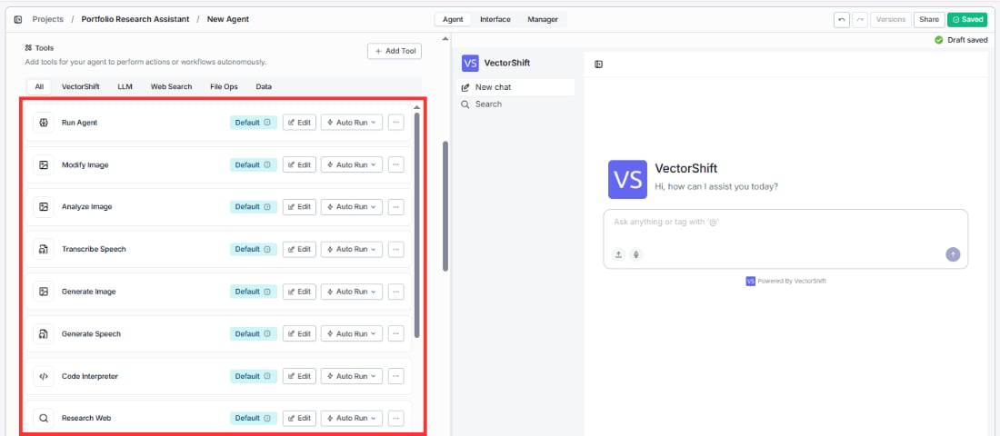
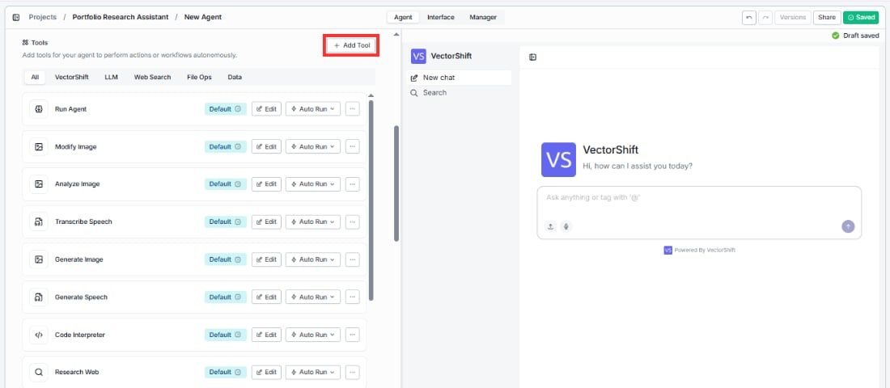
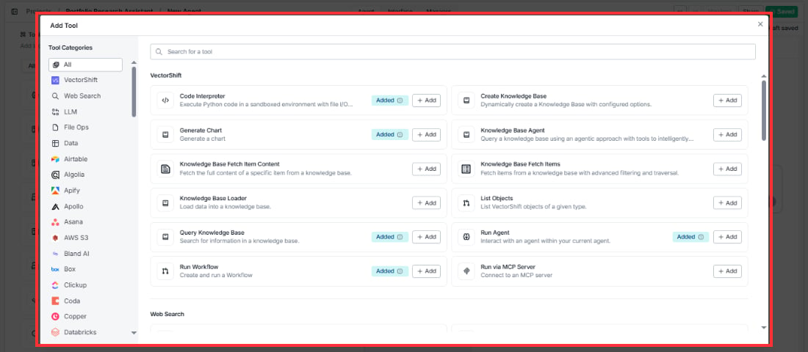
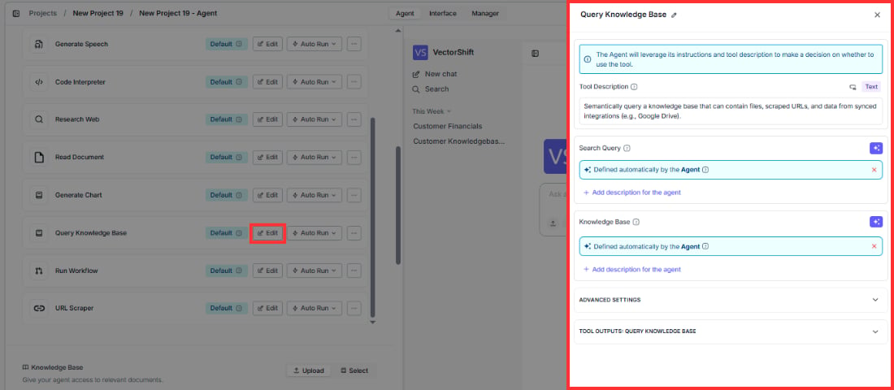
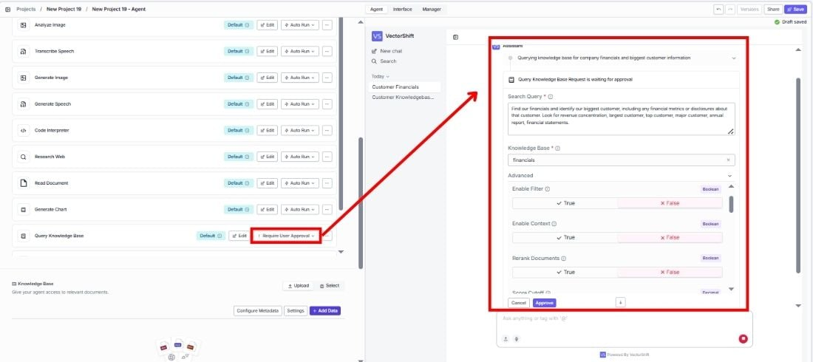
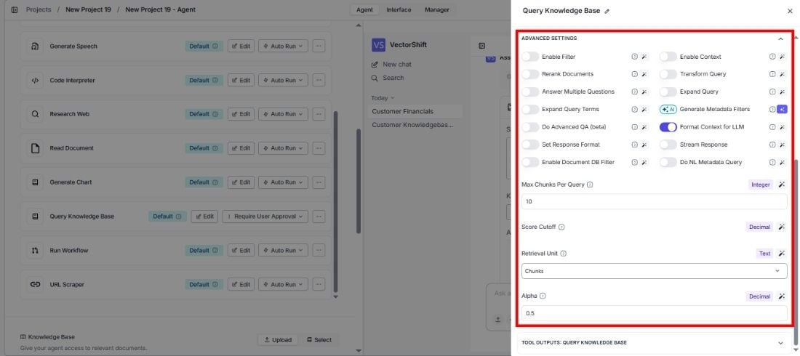

> ## Documentation Index
> Fetch the complete documentation index at: https://docs.vectorshift.ai/llms.txt
> Use this file to discover all available pages before exploring further.

# Agent Tools

> Add, configure, and manage the tools your Agent can use

<Card title="Use these tools from the SDK" icon="code" href="/sdk/agent/tools/vectorshift">
  Add any tool in Python via `AgentTools.<name>(tool_name="...")` or `agent.add_tool.<name>(...)`. See the SDK tool reference.
</Card>

Tools give your Agent the ability to take actions — not just talk. With tools, your Agent can search the web, generate images, read documents, run code, query databases, and connect to third-party apps to get real work done.

Click **+ Add Tool** to browse and add tools, or use the category filter tabs (**All**, **VectorShift**, **LLM**, **Web Search**, **File Ops**, **Data**) to quickly find what you need.

Every new Conversational agent comes with 13 tools pre-added so you can start building immediately:

1. Run Agent
2. Modify Image
3. Analyze Image
4. Transcribe Speech
5. Generate Image
6. Generate Speech
7. Code Interpreter
8. Research Web
9. Read Document
10. Generate Chart
11. Query Knowledge Base
12. Run Workflow
13. URL Scraper

Each tool row gives you quick access to:

* **Edit** — customize the tool's description, inputs, and outputs to fit your use case.
* **Auto Run / Require Approval** — control whether the tool runs automatically or waits for user confirmation (Conversational agents only).
* **"…" menu** — remove the tool from your Agent.

<Note>
  If a tool has required inputs that haven't been filled in, you'll see a red **Fill required inputs** warning on the tool row.
</Note>

During testing, tool cards show live status: a spinner when running, green on success, and red on error.

## Adding tools

Click **+ Add Tool** to open the tool browser. On the left side, you'll see Tool Categories for navigation. On the right, you'll see all available tools grouped by category, each with a short description and an **+ Add** button. Tools that are already added to your Agent show an **Added** badge.

You can also use the **Search** bar at the top to find a specific tool by name.

## Tool categories

Tools are organized into the following categories:

* **VectorShift:** Run code, generate charts, query your knowledge bases, delegate to sub-agents, trigger workflows, and more — all using platform-native tools like Code Interpreter, Generate Chart, Query Knowledge Base, Run Agent, and Run Workflow.
* **Web Search:** Pull real-time information from the internet using Google Search, Exa AI Search, Perplexity Search, or Parallel AI Search.
* **LLM:** Generate images from text, analyze images, convert speech to text, and create voiceovers — powered by tools like Generate Image, Analyze Image, Transcribe Speech, and Generate Speech.
* **File Ops:** Read, write, and process files like Excel spreadsheets and documents so your Agent can work with uploaded data directly.
* **Data:** Access external data sources — query APIs, scrape URLs, pull Wikipedia articles, fetch YouTube transcripts, and search ArXiv or Crunchbase.
* **Integration tools:** Connect to 50+ third-party services like Airtable, Slack, Asana, Salesforce, Google Sheets, HubSpot, and more — so your Agent can take actions across your existing tools.

Each integration offers its own set of tools specific to that service. For example, Airtable provides tools for Add New Record, Column List Writer, Delete Record, Get Row, Get Table, Get Table Schema, List Bases, Search Records, and Update Records.

You can add tools individually with **+ Add**, or use the **+ Add All** button to add every tool from an integration at once.

## Configuring a tool

Click **Edit** on any tool to customize how it behaves. The Agent uses each tool's description along with its instructions to decide when to use it — so tailoring these helps your Agent make smarter decisions.

Every tool configuration panel has these sections:

### Tool description

The tool description helps your Agent decide when to use the tool. A more specific description leads to better decisions about when the tool gets called.

For example, instead of the default *"Semantically query a knowledge base…"*, you could write *"Search the customer financials database for revenue data, account details, and quarterly reports."* — this helps the Agent match the right tool to the right question.

<Tip>
  Think of the tool description as a label for the Agent. The Agent reads every tool description before deciding which tool to call, so be specific about what the tool does and what kind of questions it answers. A well-written description reduces tool misuse and speeds up responses.
</Tip>

### Static vs. dynamic inputs

Each tool input has a sparkle icon (✦) toggle button in the top-right corner that switches between **static** and **dynamic** mode. Click it to toggle:

* **Dynamic** (sparkle icon active/highlighted): The input shows a green pill labeled "Defined automatically by the Agent". This means the Agent will autonomously decide what value to use based on the conversation context. For example, when the sparkle icon is active on a Knowledge Base input, the Agent will analyze the user's question and automatically pick the most relevant Knowledge Base from your available options.

* **Static** (sparkle icon inactive): The input switches to a text field, dropdown, or other input control where you set a fixed value. The Agent will always use this exact value every time it calls the tool.

<Tip>Use static inputs when you want to lock a value — for example, always querying a specific Knowledge Base. Use dynamic inputs when the Agent should decide the value based on context — for example, letting it compose its own search query from the user's message.</Tip>

When you set an input to static and it is required, you must fill in a value before saving. If you don't, the tool row will show a red **Fill required inputs** warning.

### Input descriptions

Below each dynamic input, you'll see a **+ Add description for the agent** link. Click it to provide guidance that helps the Agent understand what kind of value to generate for that input. This is especially useful when the input name alone isn't descriptive enough.

### Advanced settings

Most tools have an **Advanced Settings** section at the bottom of the configuration panel. Click it to expand additional options specific to that tool. These settings vary by tool — for example, the Query Knowledge Base tool lets you configure retrieval options like reranking, query expansion, and chunk limits, while the Code Interpreter tool has options for execution environment settings.

<Tip>
  For most use cases, the default advanced settings work well. Only adjust these if you notice the Agent returning unexpected results — for instance, increasing **Max Chunks Per Query** can help when answers span multiple document sections.
</Tip>

### Tool outputs

The **Tool Outputs** section at the bottom of the panel shows what the tool returns to the Agent after it runs. Each output has a name and type (e.g., text, file, image). The Agent uses these outputs to compose its response to the user. You can review the output configuration to understand what data the tool provides — for example, the Query Knowledge Base tool returns the matched text chunks, while the Generate Chart tool returns an image.

## Execution modes

Each tool can run in one of two execution modes. You can toggle between them directly on the tool row in the tools list.

### Auto Run

The Agent calls the tool automatically whenever it's needed — no user intervention required. This is the default and works best for most use cases where you want a seamless, hands-off experience.

For example, if a user asks *"What's the latest news on NVIDIA?"* and you have the Research Web tool set to Auto Run, the Agent will immediately search the web and return results without any pause.

### Require User Approval

The Agent pauses and shows the user exactly what it's about to do before running the tool. An approval form appears in the chat showing all the inputs the Agent has pre-filled. Users can review, edit any field, and then approve or cancel.

The approval form includes:

* All tool inputs pre-filled by the Agent, editable before approval
* An **Advanced** section for fine-tuning settings
* **Cancel** and **Approve** buttons

Users can modify any field — change the search query, pick a different Knowledge Base, or adjust advanced settings — before clicking **Approve**.

<Tip>Use Require User Approval for sensitive actions — like querying confidential documents, updating CRM records, or making external API calls — so users can review and refine inputs before execution. For example, a compliance team might require approval on all Knowledge Base queries to ensure the right documents are being searched.</Tip>
