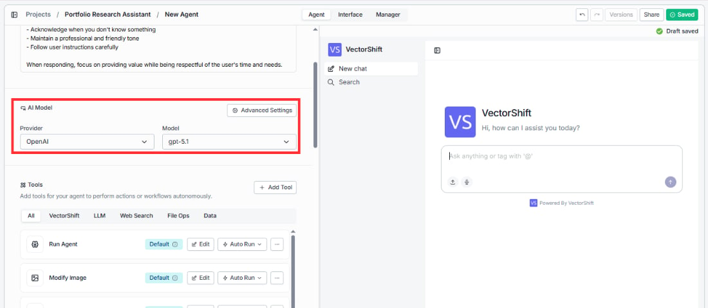
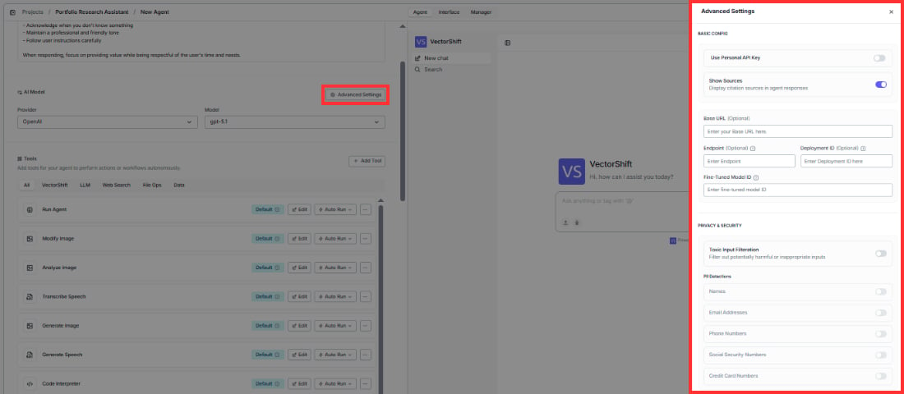

> ## Documentation Index
> Fetch the complete documentation index at: https://docs.vectorshift.ai/llms.txt
> Use this file to discover all available pages before exploring further.

# AI Model

> Choose the language model and configure advanced settings for your Agent

Directly below the instructions, you'll find the AI Model section. This is where you choose the large language model that powers your Agent's reasoning.

* **Provider:** A dropdown that lets you select the AI provider. The available options are OpenAI, Anthropic, Google, and Groq.
* **Model:** A dropdown that lets you pick a specific model from your chosen provider (e.g., gpt-5.1 for OpenAI).

## Advanced settings

Click the **Advanced Settings** button to open a side panel with additional configuration. These are organized into two groups.

### Basic config

The following fields appear in order from top to bottom:

* **Use Personal API Key:** Toggle this on if you want to use your own API key instead of VectorShift's default key. This is useful if you have a separate billing arrangement or need access to specific model versions.
* **Show Sources:** When enabled, the Agent will display citation sources in its responses. This is helpful when your Agent pulls answers from a Knowledge Base and you want users to see where the information came from. Enabled by default.
* **Base URL (optional):** If you're using a custom or self-hosted model endpoint, enter the base URL here.
* **Endpoint (optional):** Specify a custom API endpoint if your setup requires one.
* **Deployment ID (optional):** For Azure OpenAI or similar deployments, enter the deployment ID here.
* **Fine-Tuned Model ID (optional):** If you've fine-tuned a model, enter its ID here so the Agent uses your custom model.

### Privacy and security

Below the basic config, you'll find privacy and security controls.

**Toxic Input Filtration:** Toggle this on to automatically filter out potentially harmful or inappropriate inputs before they reach the AI model.

**PII Detections:** A set of individual toggles that let you detect and flag personally identifiable information in user inputs. These toggles are only interactive when Toxic Input Filtration is turned on. Each type can be enabled or disabled independently:

* Names
* Email Addresses
* Phone Numbers
* Social Security Numbers
* Credit Card Numbers
