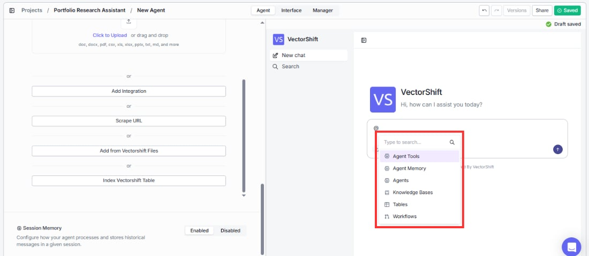

> ## Documentation Index
> Fetch the complete documentation index at: https://docs.vectorshift.ai/llms.txt
> Use this file to discover all available pages before exploring further.

# @ Tag References

> Directly reference tools, knowledge bases, and other resources in the chat

The @ tag menu is one of the most powerful ways to direct your Agent's behavior during a conversation. It lets you explicitly point the Agent to specific resources instead of relying on it to choose automatically.

In the chat input, you can type **@** to open a searchable dropdown menu that lets you reference specific resources directly in your message. This works both in the builder preview and in the deployed chatbot.

The available resource types, in the order they appear in the dropdown, are:

* **Agent Tools:** Reference a specific tool to prompt the Agent to use it.
* **Agent Memory:** Reference the Agent's stored memory from the current session.
* **Agents:** Tag another Agent to bring it into the conversation.
* **Knowledge Bases:** Point the Agent to a specific Knowledge Base for its response.
* **Tables:** Reference a VectorShift Table for data lookups.
* **Workflows:** Trigger a specific Workflow from within the chat.

You can also type to search within the dropdown to quickly find the resource you need.

For example, in a multi-desk finance setup you could type "`@Fixed Income Agent` What is the current yield curve?" to send that question directly to the Fixed Income sub-agent, or "`@Q4 Holdings Report` what is our NVIDIA allocation?" to force the Agent to query that specific document rather than its general knowledge base.

<Tip>
  **When to use @ tags:**

  * **Reference a specific Knowledge Base:** *"`@Customer FAQ` What is the return policy for international orders?"* — forces the Agent to search that specific KB instead of choosing on its own.
  * **Route to a sub-agent:** *"`@Compliance Agent` Does this trade require pre-clearance?"* — sends the question directly to the Compliance sub-agent.
  * **Force a specific tool:** *"`@Code Interpreter` Plot a bar chart of Q3 revenue by region"* — ensures the Agent uses the Code Interpreter rather than another tool.
  * **Reference a Table:** *"`@Sales Pipeline` Show me all deals closing this month"* — points the Agent to a specific VectorShift Table for data lookups.

  You can combine @ tags with natural language to be precise about what you want the Agent to do.
</Tip>
