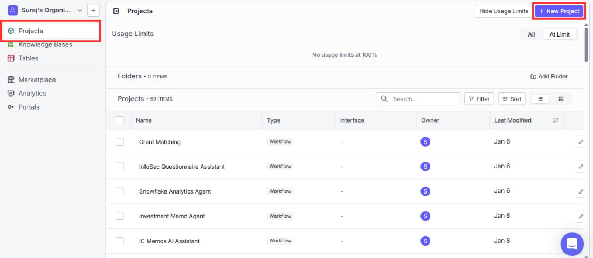
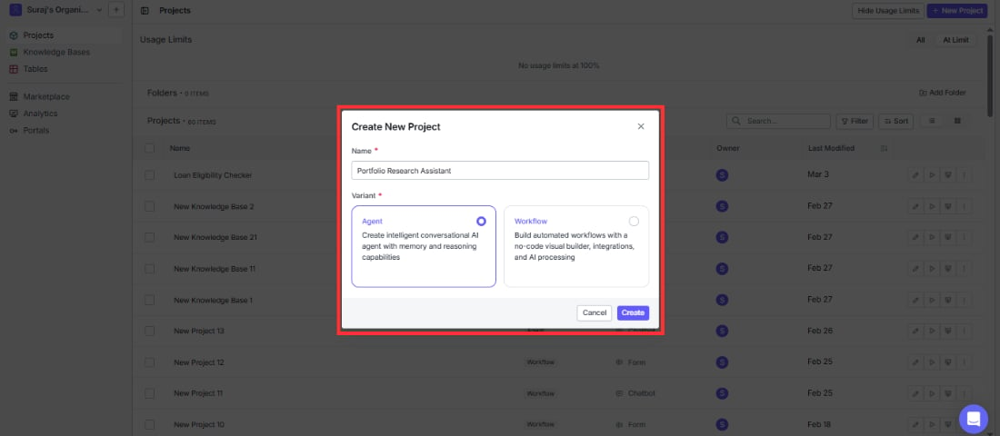
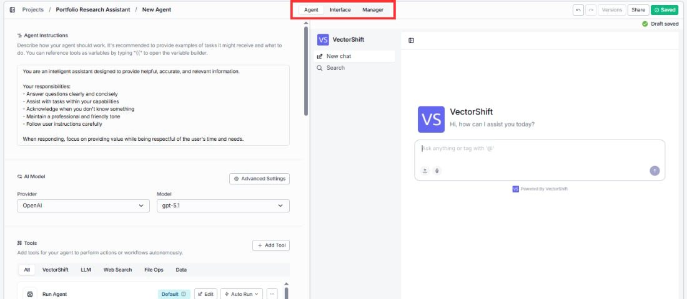
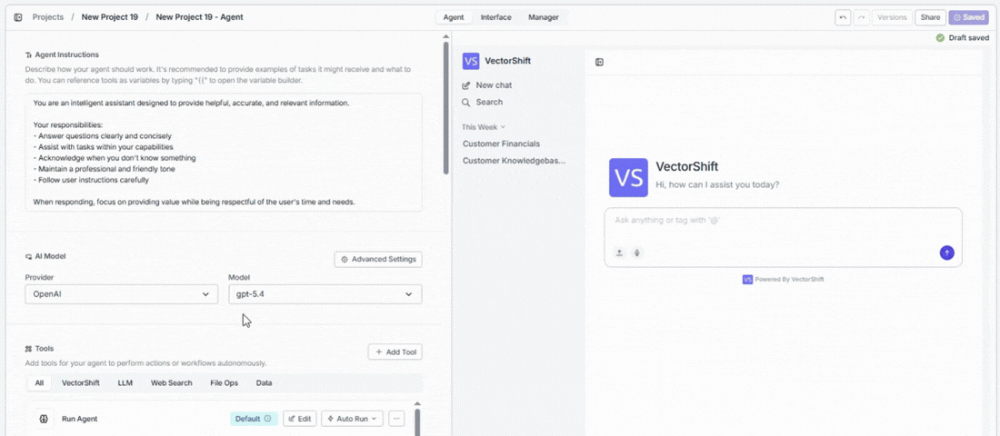
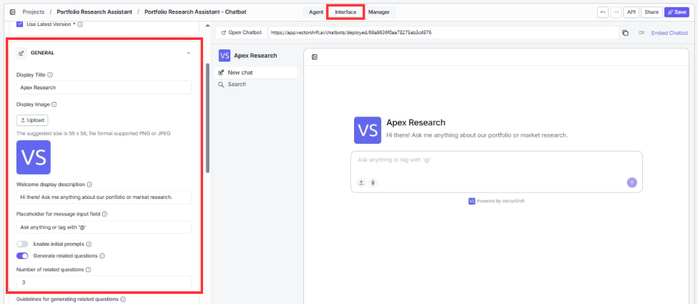
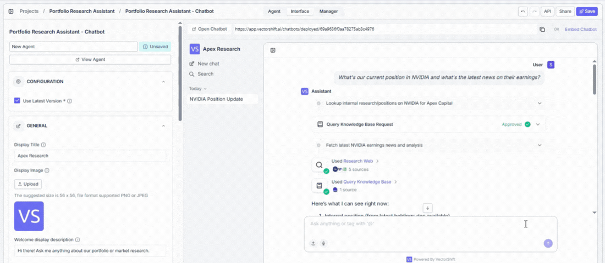

> ## Documentation Index
> Fetch the complete documentation index at: https://docs.vectorshift.ai/llms.txt
> Use this file to discover all available pages before exploring further.

# Build an Agent

> Create a new Agent from scratch, orient yourself in the builder, and build your first working Agent step by step

This page walks you through creating a new Agent from scratch, orienting yourself in the builder, and building your first working Agent step by step.

## Create a new Conversational agent

### 1. Open the Projects page

Go to the **Projects** page from the left sidebar and click the **+ New Project** button in the top-right corner.

### 2. Configure the project

In the Create New Project dialog, fill in the following:

* **Name:** Give your project a descriptive name like "Portfolio Research Assistant" or "Compliance Assistant." VectorShift will auto-generate one (e.g., "New Project 1"), but something meaningful makes it easier to find later.
* **Variant:** Choose **Agent**. You'll see the description: "Create conversational agents that deploy directly to VectorShift chat interfaces."

### 3. Click Create

Click **Create** to open the Agent Builder.

After a moment, the Agent Builder opens with your new agent pre-loaded with default instructions, an AI model, and 13 built-in tools that let you do the following out of the box:

* Search the web for real-time information
* Generate, modify, and analyze images
* Transcribe speech and generate audio
* Execute Python code to analyze data and create files
* Read and extract text from uploaded documents
* Generate charts and visualizations from data
* Query your knowledge base for grounded answers
* Run other agents as sub-agents for complex tasks
* Trigger Workflows for multi-step automations
* Scrape content from web URLs

If you need specialized capabilities beyond these, you can add more tools from the tool browser, including 30+ third-party integrations.

The builder is split into two areas. On the left is the configuration panel where you'll set up everything about your Agent. On the right is a live chat preview that lets you test your Agent as you build it.

At the top of the screen, you'll see three tabs: **Agent**, **Interface**, and **Manager**. We'll walk through each of these in the sections that follow.

The builder also has a few controls in the top-right corner:

* **Versions** lets you manage saved versions of your Agent.
* **Share** lets you collaborate with teammates.
* **Save** saves your work.

You'll also notice a **Draft saved** indicator that confirms your changes are being auto-saved as you go.

## Example: creating a portfolio research assistant

Let's walk through creating a Portfolio Research Assistant Agent from scratch.

### Step 1: Create the Agent

Go to Projects and click **+ New Project**. Name it "Portfolio Research Assistant" and select **Agent** as the variant. Click **Create**.

### Step 2: Add Agent Instructions

In the Agent Instructions field, replace the default text with:

<Tip>
  *You are a financial research assistant for Apex Capital. You help analysts with market research, company analysis, and portfolio questions. When an analyst asks about a company, use the Research Web tool to find the latest news and the Query Knowledge Base tool to look up internal research notes. Always cite your sources and flag when information may be outdated.*
</Tip>

### Step 3: Configure the AI Model

Under AI Model, select **OpenAI** as the provider and **gpt-5.1** as the model.

### Step 4: Configure Tools

In the Tools section, keep the default tools. Then click **+ Add Tool**, find **Google Search** under Web Search, and click **+ Add**.

### Step 5: Connect your Knowledge Base

Find the **Query Knowledge Base** tool in the tools list — it is added by default. Click **Edit** to open its configuration panel. Click the sparkle icon (✦) next to the **Knowledge Base** input to switch it from dynamic to static. When the sparkle icon is active (highlighted), it means the Agent will automatically decide which Knowledge Base to pick based on the conversation context. Switching it to static locks the tool to always search your selected documents.

A dropdown appears — select your Knowledge Base or click **+ New Knowledge Base** to create one.

### Step 6: Configure the Interface

Switch to the **Interface** tab and set:

* Display Title: `Apex Research`
* Welcome Description: `Hi there! Ask me anything about our portfolio or market research.`

### Step 7: Save

Click **Save** in the top-right corner.

### Step 8: Test it

In the chat preview on the right, type: *"What's our current position in NVIDIA and what's the latest news on their earnings?"* — the agent should query your Apex Capital KB for the holdings data and use Google Search for the latest news, without any approval prompts.

Your Agent is now ready to test in the chat preview on the right side of the builder, and you can open the deployed chatbot URL to share it with users.

### Other common use cases

The portfolio research example above is just one way to use Agents. Here are a few other finance-focused setups you can create following the same process:

* **Financial document analyst:** Upload quarterly reports and balance sheets. Keep the Code Interpreter and Generate Chart tools. Users can ask "Show me a breakdown of operating expenses by quarter" and get a chart back instantly.
* **Compliance assistant:** Upload regulatory guidelines and internal policies to the Knowledge Base. Team members can ask "What are our reporting requirements for trades over \$1M?" and get answers sourced from actual compliance documents.
* **Risk assessment assistant:** Add the Research Web and Query Knowledge Base tools. Instruct the Agent to cross-reference real-time market data with internal risk frameworks to help analysts draft risk assessments.
* **Client onboarding assistant:** Connect your CRM through integration tools. Upload your onboarding playbook. Relationship managers can ask "What documents do we still need from Client X?" and the Agent pulls the answer from both the CRM and the playbook.
* **Multi-desk router:** Use the Run Agent tool to connect specialized sub-agents for equities, fixed income, compliance, and operations. The main Agent reads the user's question and delegates to the right desk automatically. See the Run Agent tool section for setup details.
