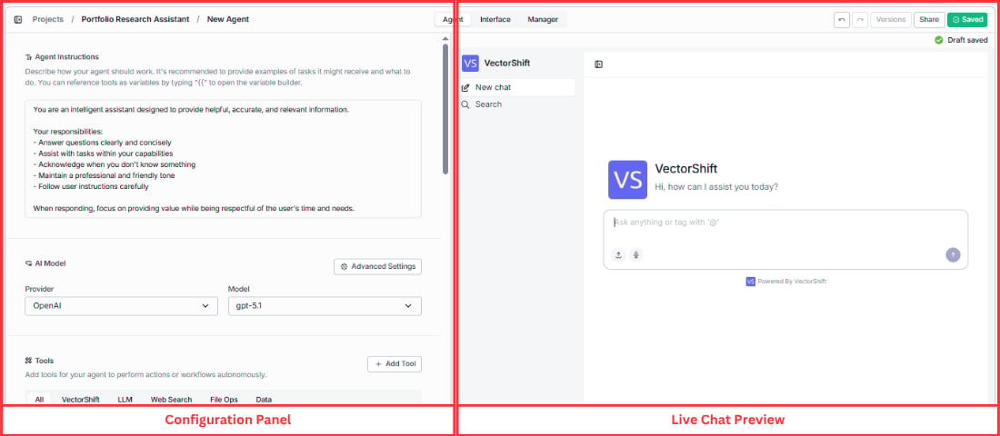
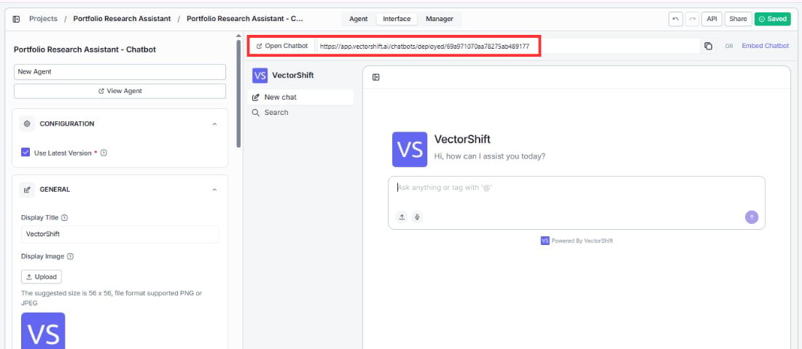

> ## Documentation Index
> Fetch the complete documentation index at: https://docs.vectorshift.ai/llms.txt
> Use this file to discover all available pages before exploring further.

# Test and Deploy

> Test your Agent in the builder preview and deploy it as a chatbot

## Builder chat preview

Test your Agent in real time without leaving the builder. The live preview on the right side of the Agent Builder behaves exactly like the deployed chatbot — so you can validate instructions, tools, and knowledge base responses as you build.

The preview supports full conversations, file uploads, voice input, and [@ tag references](/platform/agents/at-tag-references) for targeting specific tools and knowledge bases.

## Deployed chatbot

When your Agent is ready, click **Open Chatbot** in the Interface tab to launch the deployed version. Your chatbot gets a shareable URL that you can send directly to users.

The deployed chatbot reflects everything you configured — display title, avatar, accent color, font, welcome message, and branding. You can also deploy to [Slack and WhatsApp](/platform/agents/interface-tab) to meet users where they already work.
