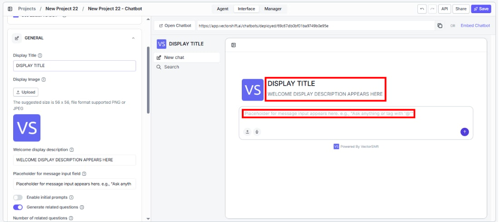
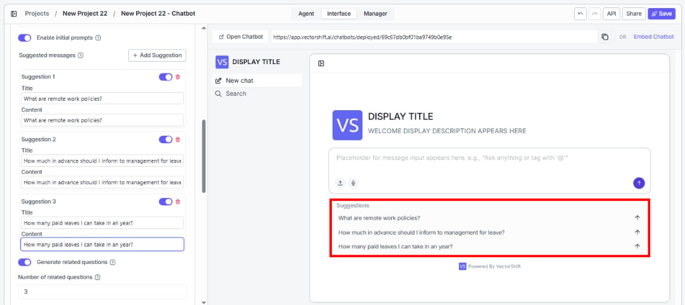
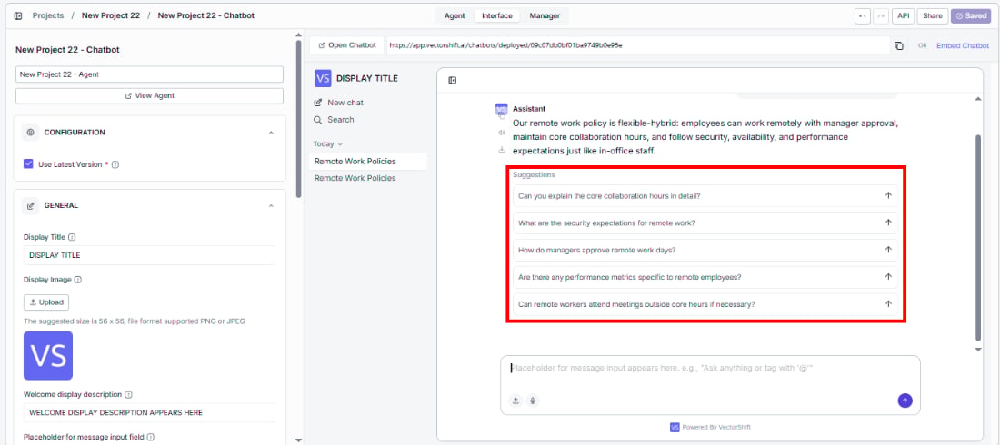
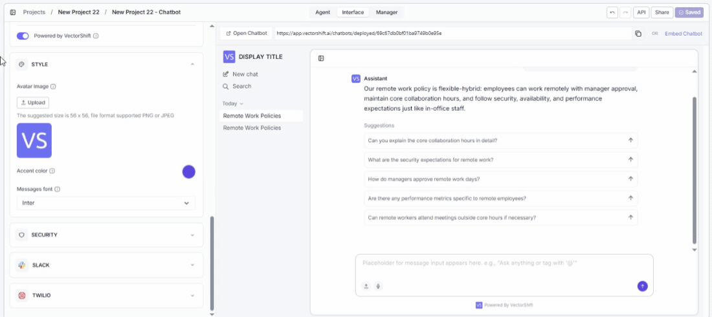
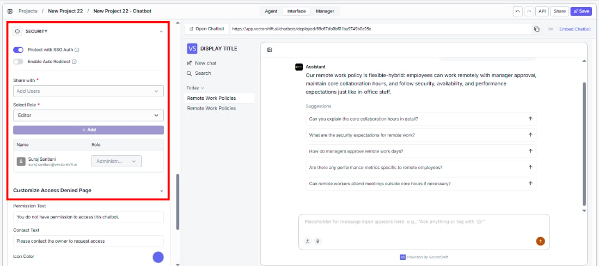
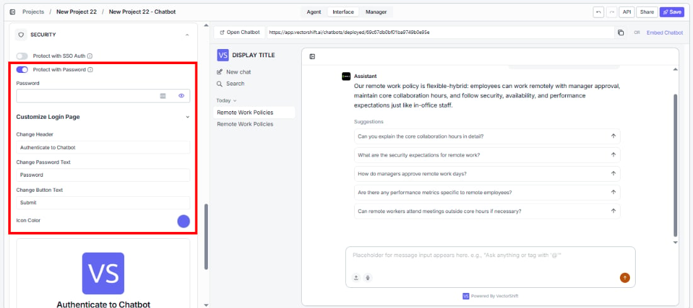

> ## Documentation Index
> Fetch the complete documentation index at: https://docs.vectorshift.ai/llms.txt
> Use this file to discover all available pages before exploring further.

# Customize Your Agent

> Configure the chatbot interface, appearance, security, and deployment integrations

For detailed documentation on chatbot configuration and embedding options, see [Chatbot Documentation](/platform/interfaces/chatbots/getting-started).

The Interface tab lets you control how your Agent looks and feels to end users — from branding and welcome messages to security and deployment channels.

## Configuration

**Use Latest Version** (enabled by default) ensures your deployed chatbot always runs the most recently saved version of your Agent.

<Note>
  The builder preview always reflects your latest changes — including unsaved edits — so you can test instantly. However, the deployed chatbot your end users see only updates when you click **Save**. In Projects, saving is all you need — no separate deploy step required.
</Note>

## General

Brand your chatbot and shape the first impression users get when they open it.

* **Display Title** and **Display Image** — set the name and logo users see at the top of the chatbot.
* **Welcome display description** — write a greeting that appears when the chatbot loads (e.g., "Hi, how can I assist you today?").
* **Placeholder for message input field** — guide users on what to type (e.g., "Ask anything or tag with '@'").

* **Enable initial prompts** — show clickable prompt suggestions so users can get started with one click.

* **Generate related questions** — automatically suggest follow-up questions after each response to keep the conversation going. You can control how many suggestions appear and add guidelines for what types of questions to suggest.

* **Processing message and icon** — customize what users see while the Agent is thinking (e.g., "Understanding your request…").
* **User and bot message names** — label who's speaking in the chat (defaults: "User" and "Assistant").
* **Powered by VectorShift** — toggle the branding badge on or off.

## Style

Match the chatbot's look to your brand.

* **Avatar Image** — give your Agent a recognizable face next to its messages.
* **Accent color** — apply your brand color across buttons, highlights, and UI elements.
* **Messages font** — choose a typeface that fits your brand's tone (e.g., Inter).

## Security

Control who can access your deployed chatbot and what unauthorized users see.

### Protect with SSO Auth

Require Single Sign-On authentication so only authorized users in your organization can access the chatbot. When enabled, you can:

* **Enable Auto Redirect** — automatically send users to your SSO login instead of showing the access denied page.
* **Share with** — invite specific users by email and assign them a role (e.g., Editor) to control who can access the chatbot.

#### Customize Access Denied Page

Tailor the message unauthorized users see when they don't have access:

* **Permission Text** — the main message displayed (e.g., "You do not have permission to access this chatbot.").
* **Contact Text** — instructions for requesting access (e.g., "Please contact the owner to request access").
* **Icon Color** — match the access denied page icon to your brand.

### Protect with Password

Gate access behind a password so only users with the credentials can interact with the chatbot.

* **Password** — set the password users must enter to access the chatbot.

#### Customize Login Page

Brand the authentication screen users see before entering the chatbot:

* **Change Header** — set the page title (e.g., "Authenticate to Chatbot").
* **Change Password Text** — customize the label for the password field.
* **Change Button Text** — customize the submit button text.
* **Icon Color** — match the login page icon to your brand.

## Slack

Deploy your Agent directly into Slack so your team can interact with it where they already work. For detailed step-by-step setup instructions, see [Deploy to Slack](/platform/interfaces/chatbots/export-slack).

## Twilio

Reach users on WhatsApp by connecting your Agent to Twilio. For detailed step-by-step setup instructions, see [Deploy to WhatsApp](/platform/interfaces/chatbots/export-whatsapp).
