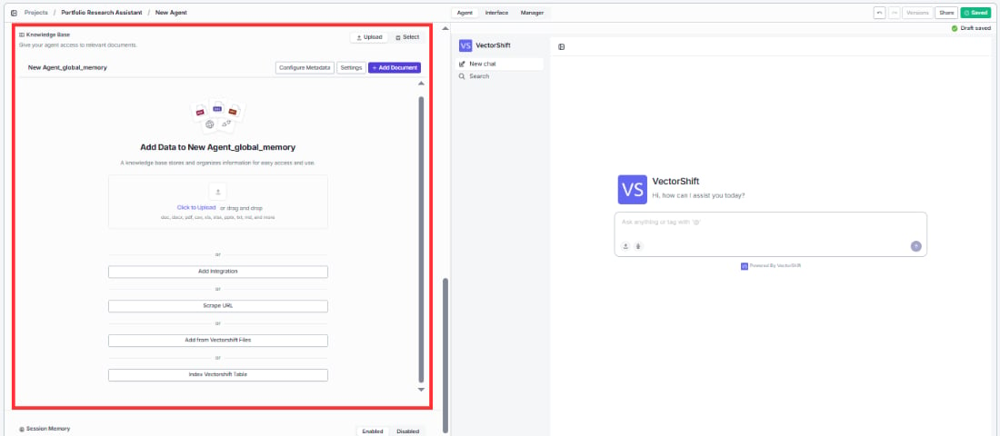
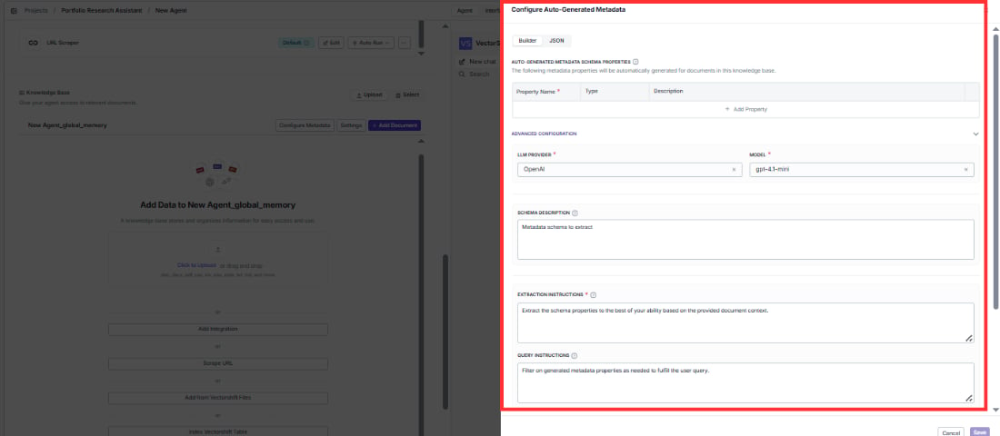
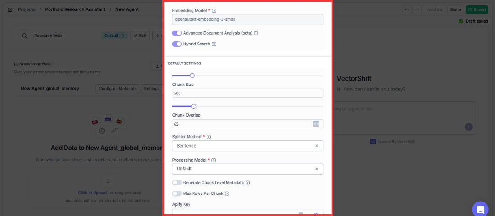

> ## Documentation Index
> Fetch the complete documentation index at: https://docs.vectorshift.ai/llms.txt
> Use this file to discover all available pages before exploring further.

# Knowledge Base

> Give your Agent persistent knowledge that stays available throughout every session

The **Knowledge Base** section in the Agent tab is where you attach persistent knowledge directly to your Agent. This is different from the **Query Knowledge Base** tool — the Knowledge Base section defines the Agent's own background knowledge that is always available, while the Query Knowledge Base tool is a tool the Agent calls on-demand to search specific documents.

Think of it this way: the Knowledge Base section is like giving an employee a reference manual they always have on their desk, while the Query Knowledge Base tool is like sending them to search through filing cabinets when a specific question comes up.

## How it works

Knowledge attached through this section is persisted for the entire Agent session. The Agent can draw on this knowledge at any time without needing to call a tool. This makes it ideal for:

* **Static reference knowledge** — product catalogs, company policies, FAQs, brand guidelines, or any information the Agent should always know.
* **Accumulated session knowledge** — information the Agent gathers and stores during a conversation that should persist across messages.

For example, an Agent can have three **Query Knowledge Base** tools configured to search different document collections on demand, and *also* have a static global Knowledge Base attached through this section that provides foundational context the Agent always has access to — even if no tool is called.

## Adding a Knowledge Base

1. In the **Knowledge Base** section of the Agent tab, click to attach an existing Knowledge Base or create a new one.
2. Select one or more Knowledge Bases from the dropdown.

<Tip>
  Create your Knowledge Bases from the **Knowledge Base** section in the main sidebar before building your Agent. Upload your documents and wait for each file to show a green checkmark confirming it has been indexed. Then come back to the Agent builder and attach it here.
</Tip>

## Configure Metadata

Click **Configure Metadata** to add metadata to your Knowledge Base documents. Metadata helps the Agent filter and prioritize information — for example, tagging documents by department, date, or document type.

## Settings

Click **Settings** to adjust how the Knowledge Base behaves within your Agent. These settings control retrieval behavior like chunk size, overlap, and relevance scoring.

## Knowledge Base vs. Query Knowledge Base tool

|                    | Knowledge Base section                                           | Query Knowledge Base tool                                                  |
| ------------------ | ---------------------------------------------------------------- | -------------------------------------------------------------------------- |
| **What it does**   | Attaches persistent knowledge the Agent always has access to     | A tool the Agent calls on-demand to search specific documents              |
| **When it's used** | Always available — no tool call needed                           | Only when the Agent decides to search (or is prompted to)                  |
| **Best for**       | Static reference material, global context, accumulated knowledge | Searching large document collections, querying specific data               |
| **Example**        | Company brand guidelines the Agent should always follow          | Searching a collection of quarterly earnings reports for a specific metric |

<Tip>
  Use the Knowledge Base section for information your Agent should always know. Use the Query Knowledge Base tool when the Agent needs to search through large or varied document collections on demand. You can use both together — for example, attach a company overview as persistent knowledge and add Query KB tools for searching detailed financial records.
</Tip>
