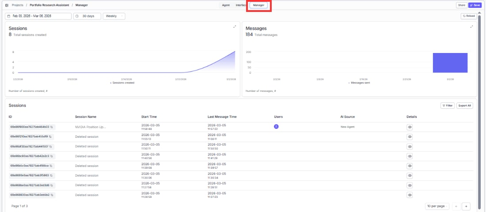
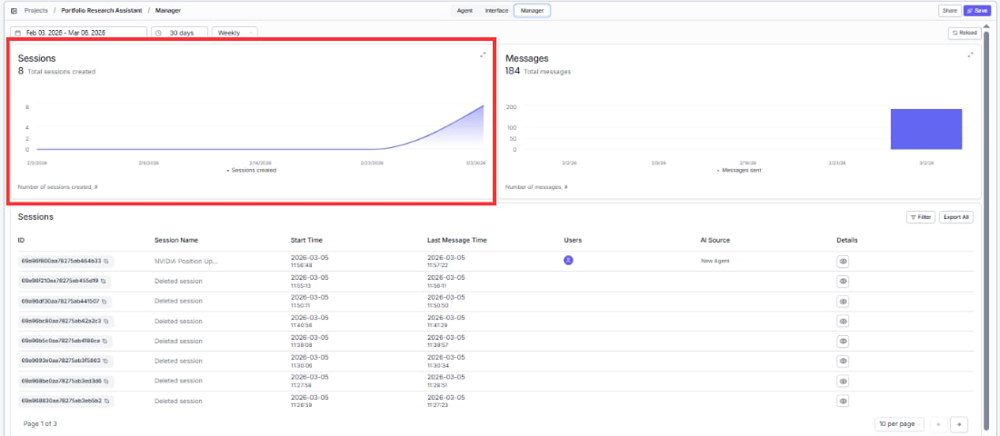
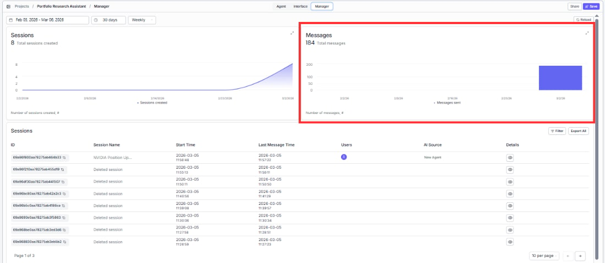
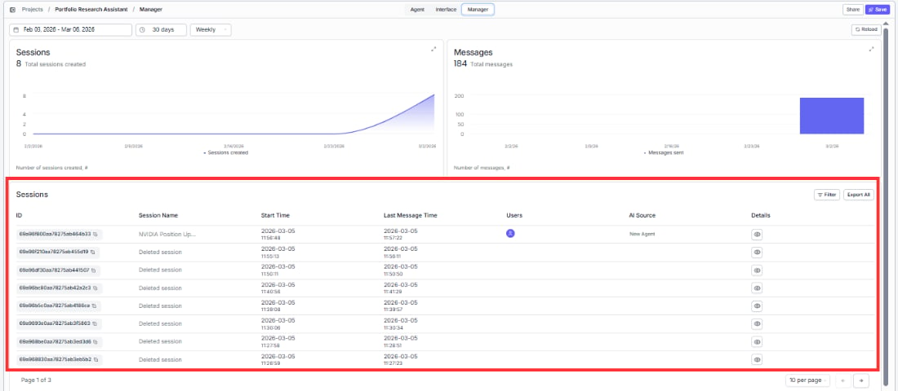

> ## Documentation Index
> Fetch the complete documentation index at: https://docs.vectorshift.ai/llms.txt
> Use this file to discover all available pages before exploring further.

# Monitor Your Agent

> View session and message analytics, and access individual conversation logs

The Manager tab gives you visibility into how your Agent is being used — track adoption trends, spot issues, and review individual conversations.

## Date and time controls

Filter analytics by date range, duration preset (e.g., 30 days), and frequency (e.g., Weekly) to focus on the time period that matters.

## Analytics charts

Two charts give you a quick pulse on usage:

* **Sessions** — see how many conversations are being started over time.
* **Messages** — track total message volume to understand engagement depth.

## Sessions table

Drill into individual conversations to understand what users are asking and how your Agent is responding.

Each session shows the session ID, name, start time, last message time, participating users, AI model used, and a link to view the full conversation log.

Use the **Filter** button to narrow results or **Export All** to download session data for deeper analysis.
