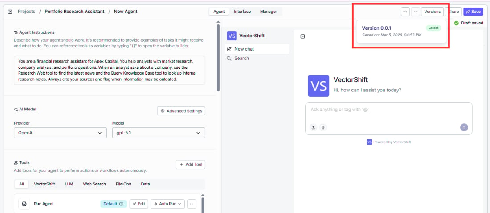

> ## Documentation Index
> Fetch the complete documentation index at: https://docs.vectorshift.ai/llms.txt
> Use this file to discover all available pages before exploring further.

# Save and Version

> Auto-save, manual save, and version history for your Agent

## Saving

Your work in the Agent Builder is auto-saved as you make changes. You'll see a **Draft saved** indicator in the top-right corner confirming this.

To explicitly save, click the **Save** button in the top-right corner. The button will show a green **Saved** state when the save is complete.

## Versioning

Click the **Versions** button in the top-right corner to access version history for your Agent. This lets you manage and track changes over time.

In the Interface tab, the **Use Latest Version** checkbox (enabled by default) ensures that the deployed chatbot always runs the most recently saved version of your Agent.

<Note>
  Before making significant changes to a working Agent, save a version first. This gives you a safe point to roll back to if the new changes don't work as expected.
</Note>
