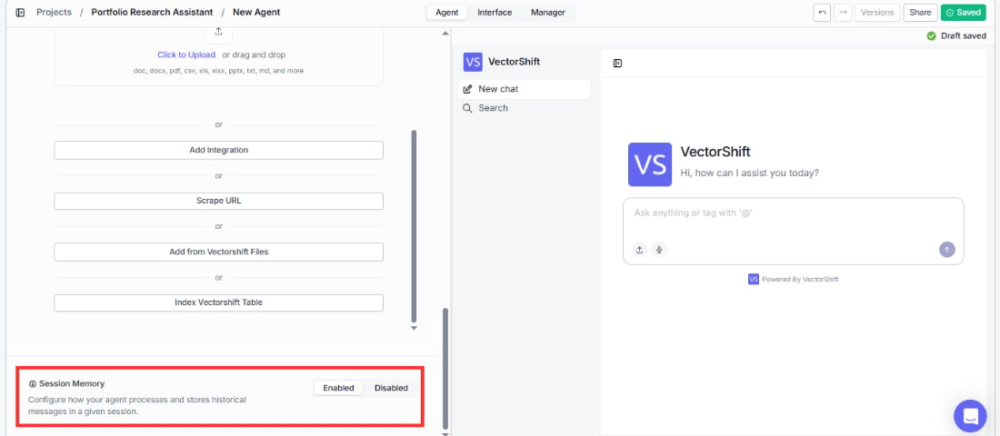

> ## Documentation Index
> Fetch the complete documentation index at: https://docs.vectorshift.ai/llms.txt
> Use this file to discover all available pages before exploring further.

# Session Memory

> Control whether your Agent retains context across a conversation

At the very bottom of the Agent tab, you'll find the Session Memory section. This controls whether your Agent remembers previous messages within a single conversation session.

There is a toggle with two options: **Enabled** and **Disabled**. The default state is Enabled.

When enabled, the Agent will retain the context of earlier messages in the conversation, allowing it to reference things the user said previously and maintain a coherent, multi-turn dialogue. When disabled, each message is treated independently with no memory of prior exchanges.

When Session Memory is enabled, a **Configure** button appears that opens a settings drawer. This drawer lets you control how session memory data is processed and stored. The configuration options mirror those found in the Knowledge Base settings panel, including Embedding Model, Advanced Document Analysis, Hybrid search, Chunk Size, Chunk Overlap, Splitter Method, Segmentation Method, Processing Model, and Apify Key. Refer to the [Knowledge Base Settings](/platform/agents/knowledge-base#settings) section for details on each field.

<Note>
  Enable session memory for most conversational use cases so your Agent can maintain context across a multi-turn dialogue. For example, a portfolio research assistant needs to remember that an analyst said "focus on emerging markets" earlier in the conversation so follow-up questions like "which ones have the highest risk?" still make sense. Only leave session memory disabled if you have a specific reason, such as building an Agent that answers standalone, one-off questions where prior context could cause confusion.
</Note>
