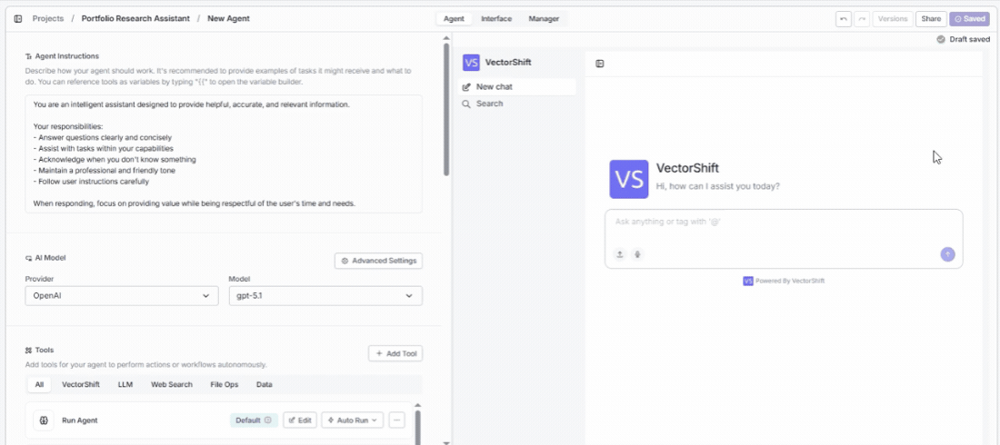

> ## Documentation Index
> Fetch the complete documentation index at: https://docs.vectorshift.ai/llms.txt
> Use this file to discover all available pages before exploring further.

# Share with Teammates

> Invite teammates to view or edit your Agent project

Collaborate on your Agent by inviting teammates as viewers or editors — so your team can build, review, and improve the Agent together.

To share your Agent, click the **Share** button in the top-right corner of the Agent builder (next to the **Save** and **Versions** buttons). This opens the share dialog:

In the share dialog, search for teammates by name or email, assign a role (e.g., Editor or Viewer), and click **+ Add**. You'll see all current members listed with their name, email, and role. The project creator is the **Administrator**.
