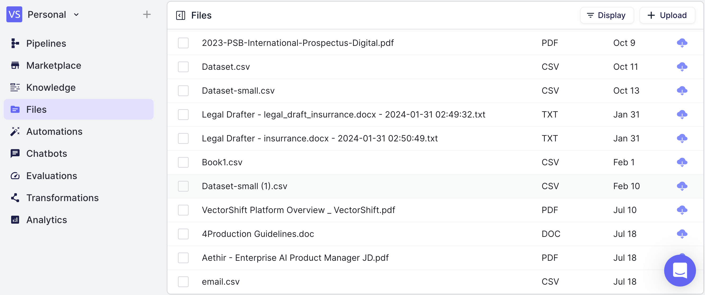

> ## Documentation Index
> Fetch the complete documentation index at: https://docs.vectorshift.ai/llms.txt
> Use this file to discover all available pages before exploring further.

# Files

> Upload and manage files

You can view your Files under the Files sub-tab in the Storage tab. Here, you can upload files to be utilized in Workflows.
To upload a File, click "New" and then "Upload File".

Utilize Files in your Workflows with the [File Node](/platform/pipelines/data-loaders/file).
Additionally, you can leverage files in vector stores.
You can also save Workflow outputs to your Files by using a [File Save Node](/platform/pipelines/general/file-save).
