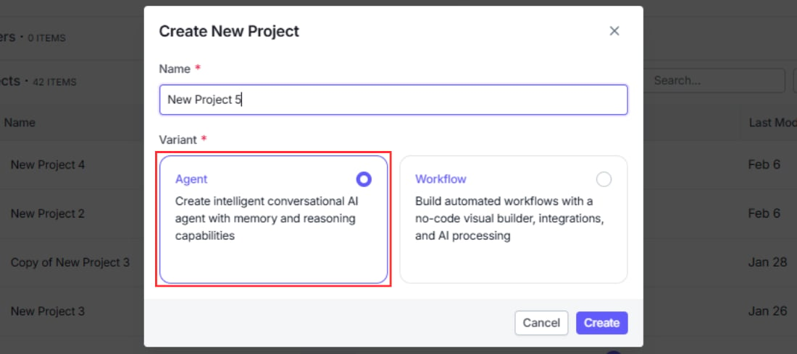
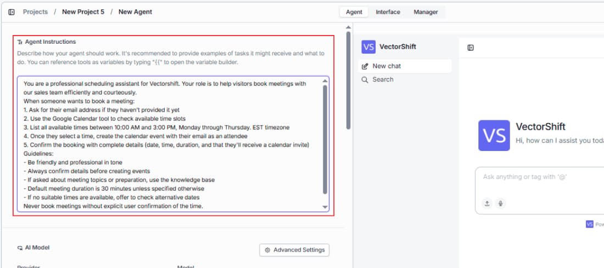
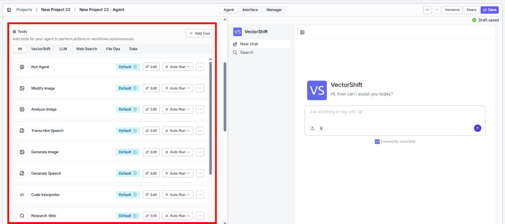
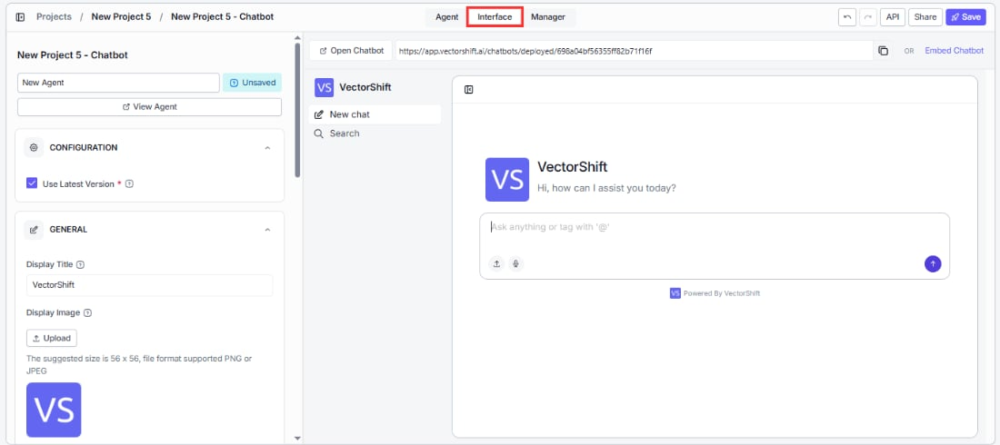
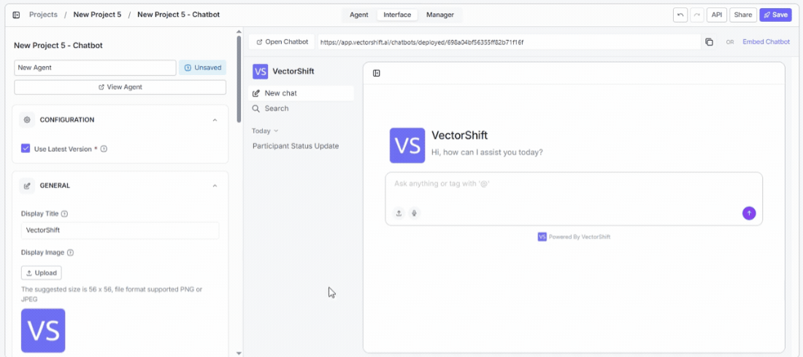

> ## Documentation Index
> Fetch the complete documentation index at: https://docs.vectorshift.ai/llms.txt
> Use this file to discover all available pages before exploring further.

# Agentic Chatbot

> Build an autonomous chatbot powered by a VectorShift Agent

An Agentic chatbot is a conversational interface powered by a VectorShift Agent. Instead of following a fixed sequence of workflow nodes, the Agent reads the user's message, decides which tools to call, and chains together actions autonomously. You define what the Agent can do by giving it tools and a knowledge base; the Agent figures out how to use them.

<Tip>
  If you are completely new to VectorShift, head to the [Quickstart](/quickstart) first. This page assumes you understand basic chatbot concepts covered in the [Chatbots overview](/platform/interfaces/chatbots/overview).
</Tip>

## What can an Agentic chatbot do?

Start with the outcome you want your users to experience:

* **"Book a meeting on my calendar when someone asks for availability."** The Agent uses a calendar tool automatically, checks open slots, and confirms the booking without additional prompting.
* **"Search the knowledge base and cite sources when answering product questions."** The Agent retrieves relevant documents, extracts the answer, and formats a response with source references.
* **"Create a support ticket in Jira when a bug is reported."** The Agent recognizes the intent, gathers details from the conversation, and calls the Jira integration to file the ticket.

In each case, you do not hard-code the sequence of steps. The Agent decides what to do based on the conversation.

## Creating an Agentic chatbot

### Step 1. Create a project with an Agent

Start by creating an Agent project. The Agent is the engine behind an Agentic chatbot — it contains the LLM and system instructions that determine how your chatbot reasons and responds.

For a full walkthrough on creating Agents, see [Agents](/platform/agents).

### Step 2. Give instructions to the Agent

Configure the Agent's system instructions to define its persona, constraints, and how it should respond. Instructions are sent to the LLM before every conversation and shape how the Agent interprets user messages and decides which tools to call.

### Step 3. Add tools to the Agent

Give your Agent the capabilities it needs by adding tools — integrations, API calls, data loaders, and knowledge bases. The Agent will autonomously decide which tools to call based on the user's message.

### Step 4. Go to the Interface tab

Once your Agent is ready, navigate to the **Interface** tab to configure how users will interact with it. This is where you turn your Agent into a chatbot.

### Step 5. Personalize the interface

Customize the chatbot's appearance and behavior — set your brand colors, welcome message, bot name, starter prompts, and avatars. For full details on customization options, see [Customizing your chatbot](/platform/interfaces/chatbots/customize).

### Step 6. Deploy

Deploy the chatbot to make it available to your users. Choose from a shareable link, an embedded widget, Slack, WhatsApp/SMS, or API. See [Sharing and deploying](/platform/interfaces/chatbots/deploying) for details on each channel.

## How it works

When a user sends a message, the following happens behind the scenes:

1. The message is passed to the Agent along with the conversation history.
2. The Agent's LLM reads the message, the list of available tools, and any system instructions you have configured.
3. The LLM decides which tool (if any) to call first. If no tool is needed, it generates a direct response.
4. If a tool is called, the Agent executes it, reads the result, and decides whether to call another tool or respond to the user.
5. This loop continues until the Agent produces a final response, which is returned to the user as the chatbot's reply.

The key difference from a [Workflow chatbot](/platform/interfaces/chatbots/workflow) is that you never define the execution sequence. The Agent adapts its behavior based on each conversation.

## Example Agentic chatbots you can build

Agentic chatbots shine in finance where users ask open-ended questions that require pulling from multiple sources or taking multi-step actions — and where you cannot always predict the exact sequence in advance.

* **Investment research assistant** — A portfolio manager asks "Give me a summary of AAPL's recent earnings and how it compares to analyst expectations." The Agent decides to call a market data tool to fetch earnings figures, query a knowledge base of analyst reports, and then synthesize both into a coherent answer — all in a single response. No fixed workflow could anticipate every combination of instruments and data sources a user might ask about.

* **Client onboarding bot** — A new client opens the chatbot and asks to open an account. The Agent gathers the required information through natural conversation, cross-checks eligibility criteria against an internal rules knowledge base, and when everything is complete, calls a CRM integration to create the client record. It handles follow-up questions mid-flow ("Can I open a joint account instead?") without losing track of what has already been collected.

* **Trade reconciliation assistant** — An operations analyst asks "Why does our position in XYZ differ from the custodian's record?" The Agent calls a trade data API to pull internal records, queries the custodian feed tool for the external position, identifies the discrepancy, and explains the likely cause — all autonomously. The analyst does not need to specify which systems to check; the Agent determines that based on the question.

* **Regulatory Q\&A bot** — A compliance officer asks "Does this proposed transaction structure comply with MiFID II best execution requirements?" The Agent searches a knowledge base of regulatory documents, retrieves the relevant rules, and generates a structured answer with citations. If the officer asks a follow-up ("What documentation would we need to demonstrate compliance?"), the Agent picks up the context and continues without starting over.

## Next steps

<CardGroup cols={2}>
  <Card title="Workflow chatbot" icon="diagram-project" href="/platform/interfaces/chatbots/workflow">
    Build a chatbot backed by a step-by-step workflow you define
  </Card>

  <Card title="Chat Assistant vs Website Chatbot" icon="browser" href="/platform/interfaces/chatbots/assistant-vs-website">
    Choose how your chatbot appears to users
  </Card>
</CardGroup>
