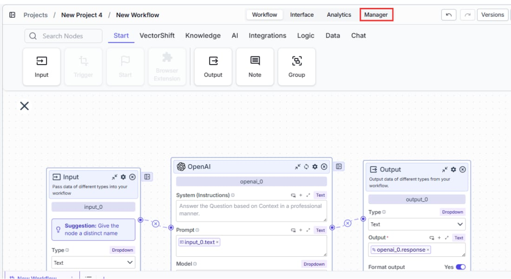
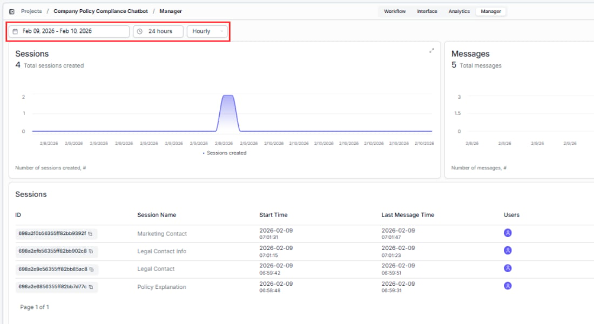
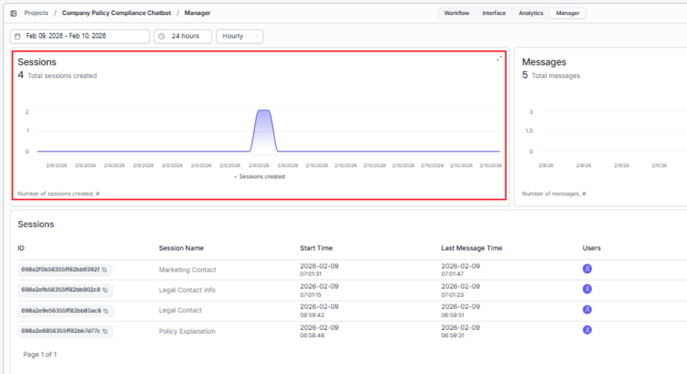
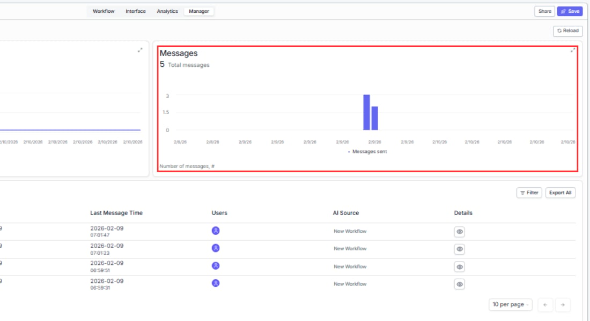
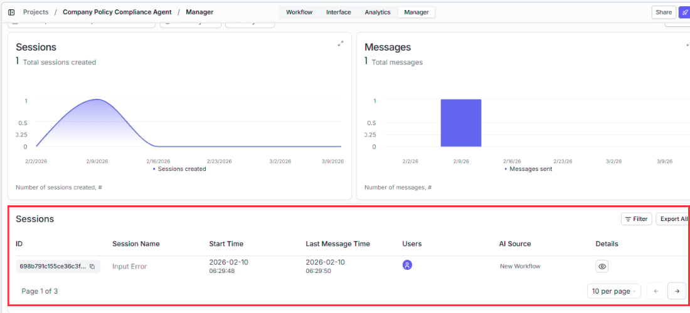
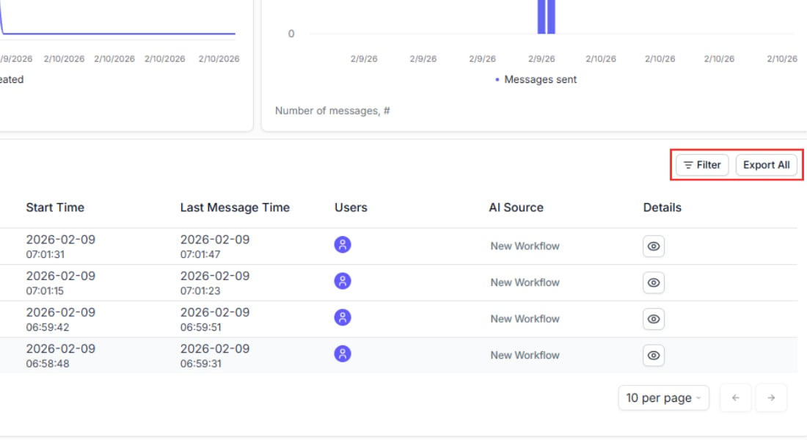
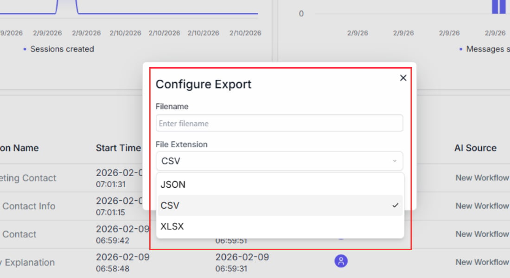

> ## Documentation Index
> Fetch the complete documentation index at: https://docs.vectorshift.ai/llms.txt
> Use this file to discover all available pages before exploring further.

# Chat analytics

> Track performance, review traces, and manage conversations from the Analytics and Manager tabs

Once your chatbot is live, you have two tabs for monitoring and reviewing it: the **Analytics** tab for workflow-level performance metrics and traces, and the **Manager** tab for conversation history, user feedback, and exports.

## Analytics tab

The Analytics tab shows performance data for the workflow or Agent powering your chatbot. It has two sub-tabs: **Dashboard** and **Traces**.

### Controls

At the top of the Analytics tab, three controls let you slice the data:

* **Date range** — presets include 24 hours, 7 days, 30 days, 3 months, 1 year, or a custom range. All charts update to match.
* **Granularity** — choose how data points are grouped: Hourly, Daily, Weekly, Monthly, Yearly, or All Time.
* **Filter** — narrow charts to a specific workflow or Agent by name.

### Dashboard

The Dashboard shows five metric panels:

#### Runs

The **Runs** area chart shows the total number of workflow executions over time. The header displays **Total runs** for the selected period. Use this to spot adoption trends, identify peak usage periods, and measure the impact of changes like adding the chatbot to a new channel.

#### Failures

The **Failures** chart shows how many runs failed during the selected period. The header displays **Total failures**. A healthy chatbot should have near-zero failures. Use this to catch broken workflows early — a sudden spike usually means a recent change introduced an error. Cross-reference with the Traces table to find the root cause.

#### Model Costs

The **Model Costs** panel shows the total spend for the selected period in USD. The breakdown table lists each model used, the number of tokens consumed, and the cost in USD. Use this to track LLM spend and compare costs across model versions.

#### Workflow Latency

The **Workflow Latency** chart shows average end-to-end workflow latency in seconds over time. Switch between the **50th**, **75th**, **90th**, and **99th** percentile views to understand your typical and worst-case response times. Use this to detect regressions after workflow changes.

#### Model Usage

The **Model Usage** chart shows total token consumption over time. Toggle between **Tokens** and **AI Credits** views. Use the **All models** dropdown to filter to a specific model. Use this to monitor consumption trends and plan capacity.

#### Average node latencies

Below the charts, the **Average node latencies** panel shows the average processing time for each node in the workflow. Use this to identify bottlenecks — if one node is consistently slow, that is where to start optimizing.

### Traces

The **Traces** sub-tab lists every individual workflow execution as a row in the **Workflow Traces** table.

| Column         | What it tells you                                                                            |
| -------------- | -------------------------------------------------------------------------------------------- |
| **Trace ID**   | Unique identifier for this run — copy it to share with support or reference in logs          |
| **Source**     | What triggered the run (e.g. a Form, the chatbot interface, or an API call)                  |
| **Status**     | Success or Failure                                                                           |
| **Start Time** | When the run began                                                                           |
| **Latency**    | How long the full run took in seconds                                                        |
| **AI Cost**    | Cost of LLM calls for this run in USD                                                        |
| **Tokens**     | Total tokens consumed                                                                        |
| **Caller**     | Who or what initiated the run (user email or system source)                                  |
| **Details**    | Click the eye icon to inspect the full trace, including per-node inputs, outputs, and timing |

Use the **Filter** button to narrow traces by status, source, or other fields.

## How to access the Manager tab

There are two ways to reach the Manager view:

1. **From the Chatbots page:** Click **Manage chatbot analytics** at the top of the Chatbots tab.
2. **From inside the chatbot builder:** Open the chatbot you want to inspect and click the **Manager** tab.

Once you are in the Manager view, use the pull-down menu at the top to select which chatbot's data you want to see. All metrics and charts update to reflect the selected chatbot.

## Understanding the Manager dashboard

The dashboard has three sections: charts that show trends at a glance, a feedback view, and a conversations table for drilling into individual exchanges.

### Date range selector

Use the date picker at the top to focus on a specific time window. All charts and the table update to match your selection. Use this to:

* **Compare periods** — check if a workflow change last week improved or worsened performance.
* **Investigate incidents** — narrow the range to a specific day when users reported problems.
* **Track growth** — expand to a monthly view to see adoption trends over time.

### Runs chart — "How much is my chatbot being used?"

The **Runs** area chart shows conversation volume over time. Each data point represents the number of chatbot runs for that day. Use this to:

* **Spot adoption trends** — a steady increase means users are finding and returning to the chatbot.
* **Identify peak hours/days** — schedule workflow updates or maintenance during low-traffic periods.
* **Measure the impact of changes** — if you added the chatbot to a new page or channel, you should see a corresponding spike.

The header shows **Total runs** for the selected period.

### Failures chart — "Is my chatbot reliable?"

The **Failures** bar chart shows how many runs failed during the selected period. A healthy chatbot should have near-zero failures. Use this to:

* **Catch broken workflows early** — a sudden spike usually means a recent workflow change introduced an error.
* **Detect rate limits** — gradual increases in failures during peak hours may indicate you're hitting API rate limits.
* **Correlate with external outages** — if failures spike across all chatbots simultaneously, the issue is likely upstream (e.g., an LLM provider outage).

Cross-reference spikes with the **Error Message** column in the conversations table below to find the root cause.

The header shows **Total failures** for the selected period.

### Feedback chart — "Are users happy with the responses?"

The **Feedback** chart visualizes the thumbs-up and thumbs-down reactions users give to bot responses. This chart only shows data if you've enabled the **Turn On User Feedback** toggle in the chatbot's [customization settings](/platform/interfaces/chatbots/assistant). Use this to:

* **Measure response quality** — a high ratio of negative feedback means your workflow's prompts, knowledge base, or LLM configuration needs work.
* **Track improvement over time** — after updating your workflow, check whether positive feedback increases.
* **Identify problem areas** — pair feedback trends with conversation transcripts to find which topics produce the most negative reactions.

The header shows **Total feedback** for the selected period.

## Conversations table

Below the charts, a table lists every conversation for the selected chatbot. Each row is one conversation thread. This is where you go from high-level trends to specific interactions.

| Column            | What it tells you                                                                                 | How to use it                                                                                              |
| ----------------- | ------------------------------------------------------------------------------------------------- | ---------------------------------------------------------------------------------------------------------- |
| **Source**        | Where the conversation came from: web (share link or embed), Slack, Twilio (WhatsApp/SMS), or API | Identify which deployment channel drives the most traffic and where to focus optimization                  |
| **Name**          | Auto-generated conversation title based on the first message (LLM summary, up to 4 words)         | Quickly scan what users are asking about without opening each conversation                                 |
| **Status**        | Success or Failure                                                                                | Filter by Failure to find and fix broken conversations                                                     |
| **Start Time**    | When the first message was sent                                                                   | Identify peak usage hours                                                                                  |
| **End Time**      | When the last message was received                                                                | Measure conversation duration — long conversations may indicate the bot is struggling to resolve the query |
| **User Email**    | The user's email (populated when SSO is enabled or the user is logged in)                         | Identify power users or follow up with users who had bad experiences                                       |
| **Details**       | **View** (read the full exchange) and **Export** (download as CSV or JSON)                        | Drill into specific conversations for quality review or debugging                                          |
| **Error Message** | Error details for failed conversations (hover to read full message)                               | Diagnose workflow failures — common errors include timeout, rate limit, and missing knowledge base         |

### Viewing a conversation

Click **View** on any row to open the full message exchange. You see every message in chronological order with timestamps. Use this to:

* **Debug unexpected answers** — read what the user asked and what the bot said to understand why a response was off.
* **Audit for quality** — spot-check conversations to ensure the bot stays on-topic and accurate.
* **Discover training gaps** — find questions the bot couldn't answer well, then update your workflow's knowledge base or prompts accordingly.

## Filtering and exporting

### Filtering — find the conversations that matter

Click the **Filter** button above the table to narrow results:

* **Status** — show only **Success** or **Failure** conversations. Use this to quickly isolate failures and investigate what went wrong.
* **Source** — filter by deployment channel (web, Slack, Twilio, API). Useful for comparing performance across channels, for example: "Are Slack users getting better answers than web users?"
* **Text search** — search by conversation name, user email, or error message content. Use this to find a specific user's conversations or all conversations that hit the same error.

### Exporting individual conversations

Click **Export** on any row and choose **CSV** or **JSON** to download that conversation's full message history. Use this when:

* You need to share a specific conversation with your team for debugging.
* A user reports a problem and you want to review exactly what happened.

### Exporting all conversations

Click **Export All** at the top of the table to download every conversation in the current date range as **CSV** or **JSON**. Use this to:

* Import into a spreadsheet for bulk analysis.
* Feed into your own analytics pipeline or BI tool.
* Create training datasets from real user conversations to improve your workflow.

## Using your analytics data

The analytics dashboard helps you answer questions like:

* **Are users satisfied?** Check the Feedback chart. A high ratio of negative reactions suggests the chatbot's responses need improvement, whether through better workflow logic, updated knowledge base content, or clearer prompts.
* **Is the chatbot reliable?** Look at the Failures chart. A sudden spike in failures likely correlates with a workflow change or an external service outage. Cross-check with the Error Message column in the conversations table to find the root cause.
* **Where is traffic coming from?** The Source column tells you which deployment channel is generating the most conversations, helping you decide where to focus optimization efforts.
* **What are users asking about?** Open individual conversations to read the actual exchanges. Look for patterns in questions that the chatbot struggles with, and use those insights to improve your workflow's knowledge base or prompts.

## Next steps

If your analytics reveal issues with chatbot performance, revisit the workflow powering it or adjust the chatbot's configuration:

<CardGroup cols={2}>
  <Card title="Workflow chatbot" icon="diagram-project" href="/platform/interfaces/chatbots/workflow">
    Review the workflow connection and input/output mapping
  </Card>

  <Card title="Chat Assistant" icon="window-maximize" href="/platform/interfaces/chatbots/assistant">
    Adjust prompts, feedback settings, and follow-up question generation
  </Card>
</CardGroup>
