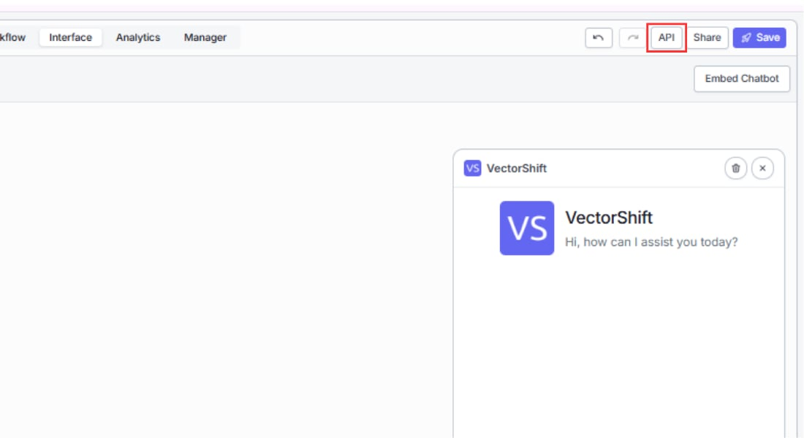

> ## Documentation Index
> Fetch the complete documentation index at: https://docs.vectorshift.ai/llms.txt
> Use this file to discover all available pages before exploring further.

# Chat via API

> Integrate chatbot functionality into your own application using the REST API

If you are building your own application and want to integrate chatbot functionality into it, you can call the chatbot directly through the VectorShift API. This gives you full control over how messages are sent and responses are displayed, and it supports both synchronous and streaming responses.

<Card title="Full API Reference" icon="book" href="/api-reference/chatbots/run">
  See the complete API reference for all chatbot endpoints — run, list, upload, and terminate
</Card>

## Prerequisites

<Warning>
  Your chatbot must be deployed before making API calls. Toggle **Deployment Enabled** in the chatbot builder's Export tab. You also need your VectorShift **API key**, which you can find by clicking your profile icon in the top-left corner of the VectorShift app, then clicking **API Keys**.
</Warning>



## How it works

You send a POST request to the chatbot endpoint with your message. VectorShift runs the connected workflow and returns the chatbot's response. To maintain conversation continuity across multiple messages, you include the `conversation_id` from the previous response in each subsequent request.

1. **First message:** Send your text without a `conversation_id`. The API returns the bot's response along with a new `conversation_id`.
2. **Subsequent messages:** Include the `conversation_id` from the previous response. The chatbot retrieves the conversation history and responds in context.
3. **New conversation:** Omit the `conversation_id` to start a fresh conversation at any time.

<Tip>
  Always store the `conversation_id` from the first response and include it in every subsequent call. Without it, each call starts a new conversation and the chatbot loses context.
</Tip>

## Authentication

Every API request must include your VectorShift API key in the `Api-Key` header. You can generate and manage API keys from your profile settings.

| Header         | Value                    |
| -------------- | ------------------------ |
| `Content-Type` | `application/json`       |
| `Api-Key`      | Your VectorShift API key |

## Request and response formats

### Endpoint

```
POST https://api.vectorshift.ai/api/chatbots/run
```

### Request body

| Field             | Type    | Required                | Description                                                                                         |
| ----------------- | ------- | ----------------------- | --------------------------------------------------------------------------------------------------- |
| `input`           | string  | Yes                     | The user's message                                                                                  |
| `chatbot_name`    | string  | Yes (or `chatbot_id`)   | The name of the chatbot to run                                                                      |
| `chatbot_id`      | string  | Yes (or `chatbot_name`) | The ID of the chatbot to run                                                                        |
| `conversation_id` | string  | No                      | The conversation ID from a previous response. Omit to start a new conversation.                     |
| `stream`          | boolean | No                      | Set to `true` to receive the response as a stream of Server-Sent Events (SSE). Defaults to `false`. |

### Response (non-streaming)

```json theme={"languages":{}}
{
  "status": "success",
  "output": "Your order #12345 is currently in transit and expected to arrive by Friday.",
  "conversation_id": "abc123def456"
}
```

| Field             | Description                                                                |
| ----------------- | -------------------------------------------------------------------------- |
| `status`          | `"success"` or `"failed"`                                                  |
| `output`          | The chatbot's response text                                                |
| `conversation_id` | Store this and include it in the next request to continue the conversation |

### Response (streaming)

When `stream` is set to `true`, the response is delivered as Server-Sent Events. Each event contains a JSON object with the current `output` text and the `conversation_id`. The final event includes the complete response.

```json theme={"languages":{}}
{"output": "Your order", "conversation_id": "abc123def456"}
{"output": "Your order #12345 is currently", "conversation_id": "abc123def456"}
{"output": "Your order #12345 is currently in transit and expected to arrive by Friday.", "conversation_id": "abc123def456"}
```

## Conversation management

Each conversation is identified by a `conversation_id`. The chatbot automatically generates a name for new conversations based on the first message (using a short LLM summary).

To manage conversations programmatically:

* **Start a new conversation:** Send a request without a `conversation_id`.
* **Continue an existing conversation:** Include the `conversation_id` from the previous response.
* **List conversations:** Use the [List Chatbots API](/api-reference/chatbots/list) to retrieve chatbot metadata, including associated conversations.

## Code examples

### Python

```python theme={"languages":{}}
import requests

API_KEY = "your_api_key"
CHATBOT_ID = "your_chatbot_id"

url = "https://api.vectorshift.ai/api/chatbots/run"

headers = {
    "Content-Type": "application/json",
    "Api-Key": API_KEY,
}

# First message (no conversation_id)
payload = {
    "input": "Where is my order #12345?",
    "chatbot_id": CHATBOT_ID,
}

response = requests.post(url, json=payload, headers=headers)
data = response.json()

print(data["output"])
conversation_id = data["conversation_id"]

# Follow-up message (with conversation_id)
payload = {
    "input": "Can I change the shipping address?",
    "chatbot_id": CHATBOT_ID,
    "conversation_id": conversation_id,
}

response = requests.post(url, json=payload, headers=headers)
data = response.json()

print(data["output"])
```

### JavaScript

```javascript theme={"languages":{}}
const API_KEY = "your_api_key";
const CHATBOT_ID = "your_chatbot_id";

const url = "https://api.vectorshift.ai/api/chatbots/run";

// First message (no conversation_id)
const firstResponse = await fetch(url, {
  method: "POST",
  headers: {
    "Content-Type": "application/json",
    "Api-Key": API_KEY,
  },
  body: JSON.stringify({
    input: "Where is my order #12345?",
    chatbot_id: CHATBOT_ID,
  }),
});

const firstData = await firstResponse.json();
console.log(firstData.output);

const conversationId = firstData.conversation_id;

// Follow-up message (with conversation_id)
const followUpResponse = await fetch(url, {
  method: "POST",
  headers: {
    "Content-Type": "application/json",
    "Api-Key": API_KEY,
  },
  body: JSON.stringify({
    input: "Can I change the shipping address?",
    chatbot_id: CHATBOT_ID,
    conversation_id: conversationId,
  }),
});

const followUpData = await followUpResponse.json();
console.log(followUpData.output);
```

### cURL

```bash theme={"languages":{}}
# First message (no conversation_id)
curl -X POST https://api.vectorshift.ai/api/chatbots/run \
  -H "Content-Type: application/json" \
  -H "Api-Key: your_api_key" \
  -d '{
    "input": "Where is my order #12345?",
    "chatbot_id": "your_chatbot_id"
  }'

# Follow-up message (include conversation_id from the first response)
curl -X POST https://api.vectorshift.ai/api/chatbots/run \
  -H "Content-Type: application/json" \
  -H "Api-Key: your_api_key" \
  -d '{
    "input": "Can I change the shipping address?",
    "chatbot_id": "your_chatbot_id",
    "conversation_id": "abc123def456"
  }'
```

## Rate limits and error handling

If the chatbot fails to run (for example, the connected workflow encounters an error), the response will have `"status": "failed"` and include an error message. Common causes include:

* The chatbot is not deployed (Deployment Enabled is off).
* The connected workflow has a configuration error.
* The API rate limit has been exceeded.

<Warning>
  API calls are subject to rate limiting. If you receive a rate limit error, wait before retrying. See [Subscriptions](/account/subscriptions/overview) for details on rate limits by plan.
</Warning>

For the full API reference, including upload, terminate, and listing endpoints, see the [API Reference](/api-reference/chatbots/run).

## Next steps

<CardGroup cols={2}>
  <Card title="Analytics" icon="chart-line" href="/platform/interfaces/chatbots/analytics">
    Track usage, review conversations, and export data
  </Card>

  <Card title="Sharing and deploying" icon="share-nodes" href="/platform/interfaces/chatbots/assistant-vs-website">
    Explore other deployment channels
  </Card>
</CardGroup>
