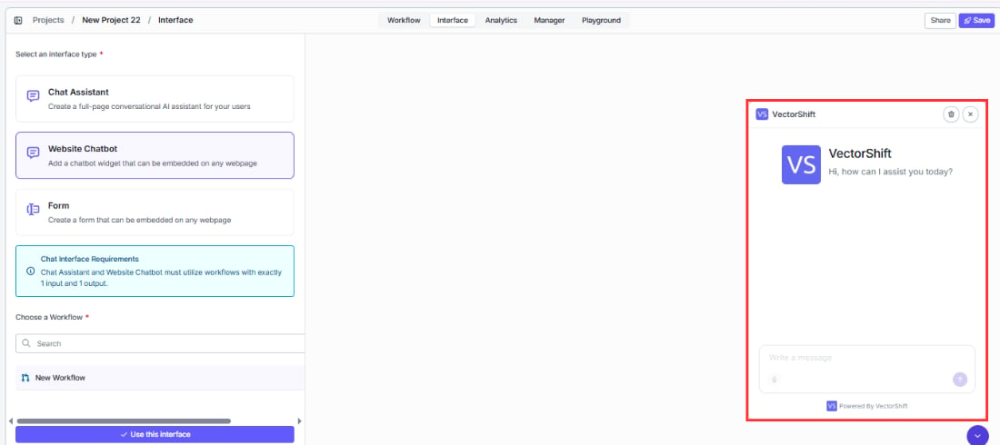

> ## Documentation Index
> Fetch the complete documentation index at: https://docs.vectorshift.ai/llms.txt
> Use this file to discover all available pages before exploring further.

# Chat Assistant vs Website Chatbot

> Understand the two display templates and when to use each one

When you create a chatbot, you choose one of two display templates: **Chat Assistant** or **Website Chatbot**. The template controls how the chatbot appears to your users. Both templates connect to the same Agent or workflow and support the same features for customization, prompts, and analytics. The difference is purely in the visual layout and how users access the chatbot.

## Key differences

| Aspect                       | Chat Assistant                                                           | Website Chatbot                                                                               |
| ---------------------------- | ------------------------------------------------------------------------ | --------------------------------------------------------------------------------------------- |
| **What it is**               | A standalone, full-page chat interface                                   | A collapsible widget that floats on your website                                              |
| **Layout**                   | Occupies the full browser window with a conversation list on the left    | Opens as an overlay in the corner of the page                                                 |
| **Best for**                 | Internal tools, dedicated support portals, team-facing assistants        | Customer-facing websites where the chatbot supplements existing content                       |
| **Typical use cases**        | Knowledge base Q\&A for employees, onboarding assistants, research tools | Live support widgets, product recommendation bots, FAQ assistants                             |
| **How users access it**      | Via a shareable link (optionally protected with SSO or password)         | Via an embedded script tag or iFrame on your website                                          |
| **Conversation persistence** | Built-in: users see their full conversation list                         | Configurable: you set how long conversations persist for returning visitors (default: 1 week) |
| **Launcher**                 | Not applicable (the chatbot is the full page)                            | Customizable launcher button with configurable icon, text, and position                       |
| **Setup complexity**         | Simpler: share a link or protect with SSO                                | Slightly more involved: embed a code snippet, configure launcher position and appearance      |

## Choosing a template

Choose **Chat Assistant** when you want to give users a dedicated, full-screen chat experience. This works well for internal teams, knowledge portals, and any situation where the chatbot is the primary interface the user interacts with.

Choose **Website Chatbot** when you want to add chat functionality to an existing website without disrupting the page layout. The chatbot appears as a small launcher button in the corner of the screen and expands into a chat window when clicked.

You can change the template at any time from the chatbot builder by opening the settings and selecting a different interface type.

<Warning>
  Switching between templates resets all deployment options (colors, messages, launcher settings) to the new template's defaults. Save any custom settings you want to preserve before switching.
</Warning>

## Next steps

<CardGroup cols={2}>
  <Card title="Chat Assistant" icon="window-maximize" href="/platform/interfaces/chatbots/assistant">
    Deploy and customize a full-page chat experience
  </Card>

  <Card title="Website Chatbot" icon="window-restore" href="/platform/interfaces/chatbots/website">
    Embed and customize a chat widget on your website
  </Card>
</CardGroup>
