> ## Documentation Index
> Fetch the complete documentation index at: https://docs.vectorshift.ai/llms.txt
> Use this file to discover all available pages before exploring further.

# Chat Assistant

> Deploy a full-page chat experience and customize it to match your brand

The Chat Assistant template gives your users a standalone, full-page chat interface. They open a link and are immediately in a conversation — no website to embed into, no launcher to configure. The chatbot is the entire experience. It works well for internal tools, dedicated support portals, and any situation where the chatbot is the primary thing users are there to do.

This page walks you through what a Chat Assistant looks like, how to configure and personalize it, and how to get it in front of your users.

## What does a Chat Assistant look like?

A Chat Assistant occupies the full browser window. On the left side, users see a conversation list showing all their previous chats. On the right side is the active conversation where they send messages and receive responses.

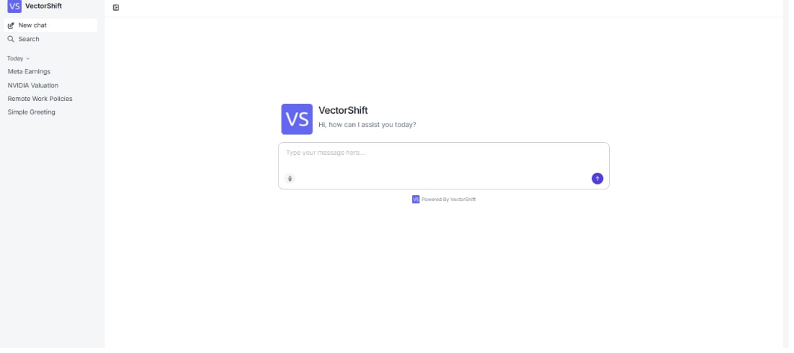

## Editing your Chat Assistant

The chatbot builder organizes settings into four panels: **Configuration**, **General**, **Style**, and **Security**. Work through them in order to configure, personalize, and secure your chatbot.

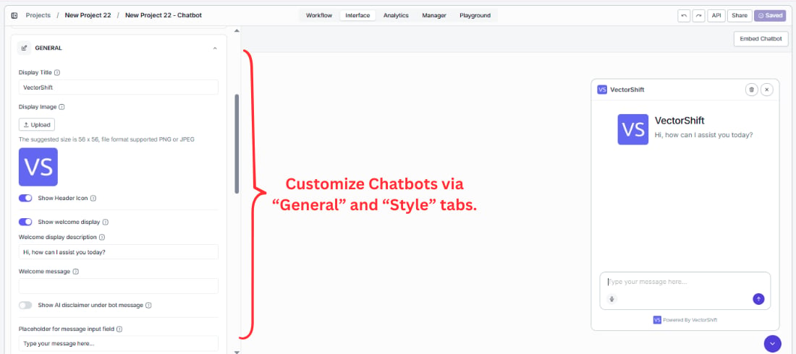

### Step 1. Configuration

Connect the chatbot to the workflow or Agent that powers it.

* **Input** — select the variable that carries the user's message into your workflow. If you pick the wrong one, the bot receives an empty input and cannot respond correctly.
* **Output** — select the variable that carries the bot's reply back to the user. This must point to the node where your final answer is generated.
* **Use Latest Version** — keep this on during active development so every change you make is reflected immediately. Pin it to a specific version before a production release to prevent accidental changes from going live.

## Customizing the user experience

### Step 2. General

The General panel is where you shape the entire look, feel, and personality of the chatbot — from the first thing users see to the label on every message.

#### Display

The display section is the first thing users see when they open the chatbot. Getting this right means users immediately understand what the bot does and trust it enough to start typing.

* **Display Title** — put your brand name here so users know they are talking to your product, not a generic tool. Replace `VectorShift` with your company name or chatbot name — for example, `Acme Advisor` for a client-facing tool, or `People Ops Assistant` for an internal HR bot.
* **Display Image** — upload your logo so your brand appears in the chat header and next to every bot response. A recognizable image builds trust, especially for client-facing tools. Recommended size: 56 × 56 px, PNG or JPEG.
* **Welcome display description** — tell users exactly what the chatbot can help with before they send a single message. Replace `Hi, how can I assist you today?` with something specific like `Ask me about your portfolio, account settings, or compliance questions.` A clear description gets users to the right question faster and reduces drop-off.

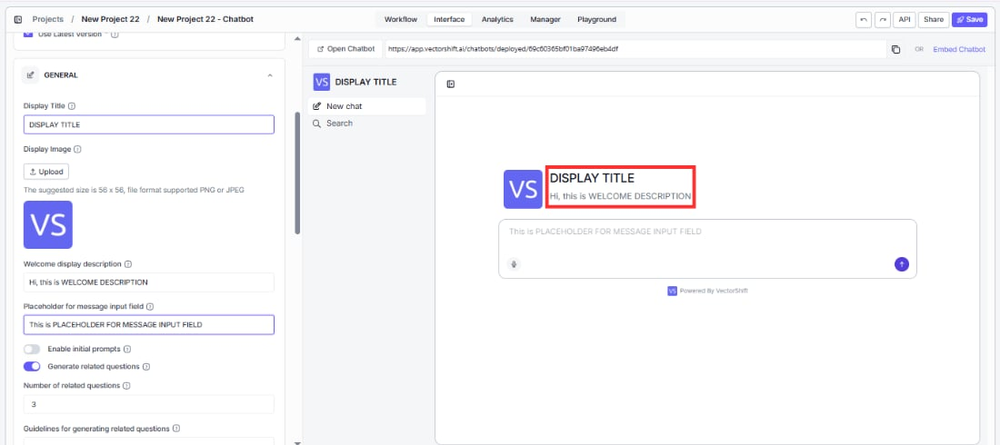

#### Message input

* **Placeholder for message input field** — guide users toward the right first question instead of leaving them staring at a blank box. Replace the generic `Write a message` with something like `Ask about your account, transactions, or portfolio...`. The more specific the placeholder, the faster users engage.

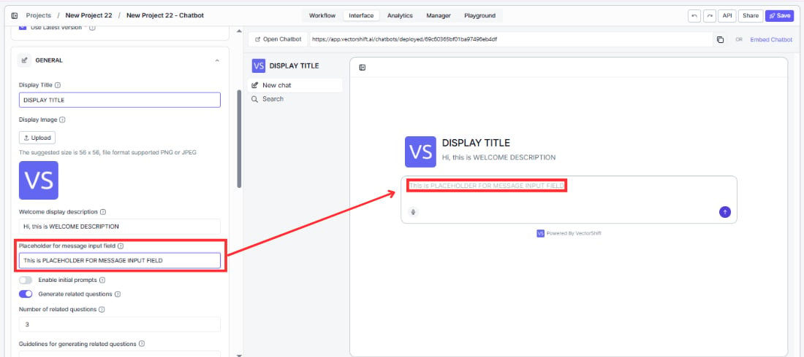

#### Suggested prompts

Give users a running start. Instead of facing a blank input box, they see clickable buttons for the most common questions and can get an answer in one click without typing anything.

Toggle **Enable initial prompts**, then click **+ Add Suggestion** to add prompts. Each suggestion has a **Title** (the button label users see) and **Content** (the message sent when clicked).

For example, a financial advisory chatbot might offer: `"What's my current portfolio allocation?"`, `"Show me recent transactions"`, and `"How do I update my risk profile?"` — the top three questions your team handles every day, now answered instantly.

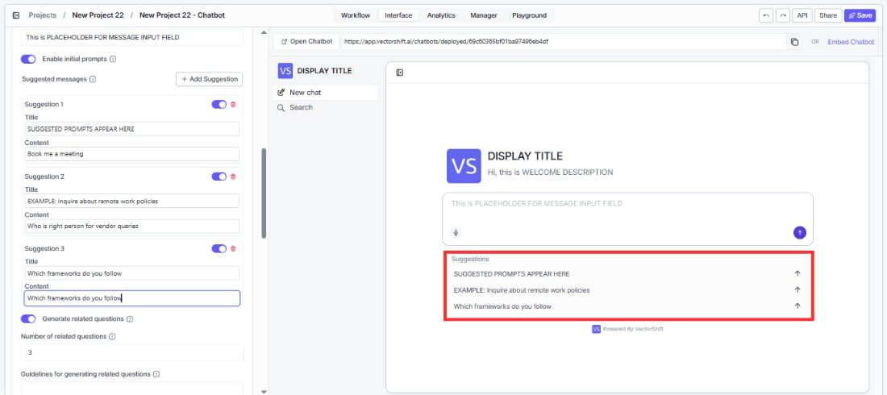

#### Follow-up questions

After the bot responds, it can suggest what to ask next — keeping users in the conversation and helping them discover capabilities they would not have thought to ask about on their own.

* **Generate related questions** — turn this on to automatically surface follow-up questions after each response. This is especially useful when your chatbot covers a broad topic and users may not know the full range of what they can ask. Enabled by default.
* **Number of related questions** — start with `3`. That is enough to spark the next question without overwhelming the screen. Increase this if your chatbot covers a wide topic area with many natural follow-ups.
* **Guidelines for generating related questions** — prevent the bot from suggesting questions it cannot handle well. For example: `Focus on portfolio performance, risk management, and tax implications. Do not suggest questions about specific stock picks or personal legal advice.` Without guidelines, follow-ups may lead users into topics the bot cannot answer confidently.

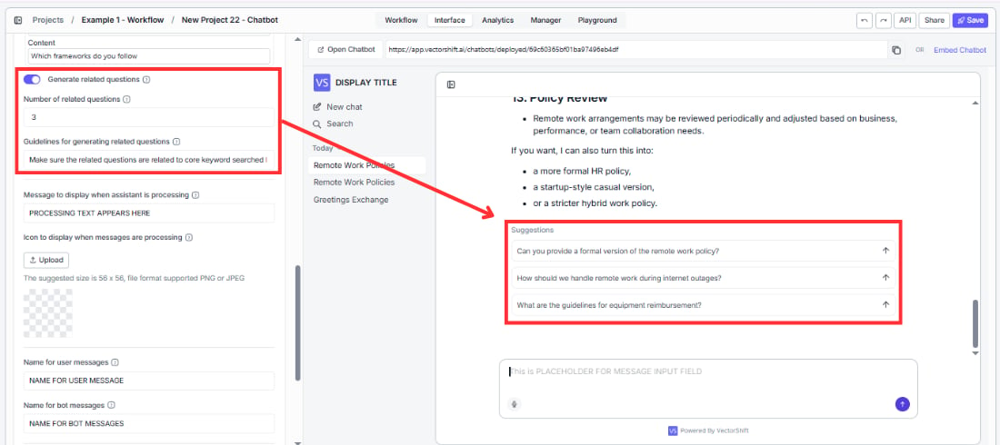

<Tip>
  If you notice users frequently hitting dead ends after follow-up suggestions, tighten the guidelines to keep suggestions within topics the bot handles well.
</Tip>

#### Message senders

These labels appear next to every single message in the conversation. Getting them right makes the chatbot feel purpose-built for your product rather than a generic tool.

* **Name for user messages** — change `User` to something that fits who is on the other end. `You` feels conversational, `Client` fits a financial services tool, `Advisor` works for an internal analyst tool.
* **Name for bot messages** — change `Assistant` to your bot's name or brand. Every response carries this label, so it reinforces your identity throughout the entire conversation. Use your product name, company name, or a persona like `Finance Bot`.

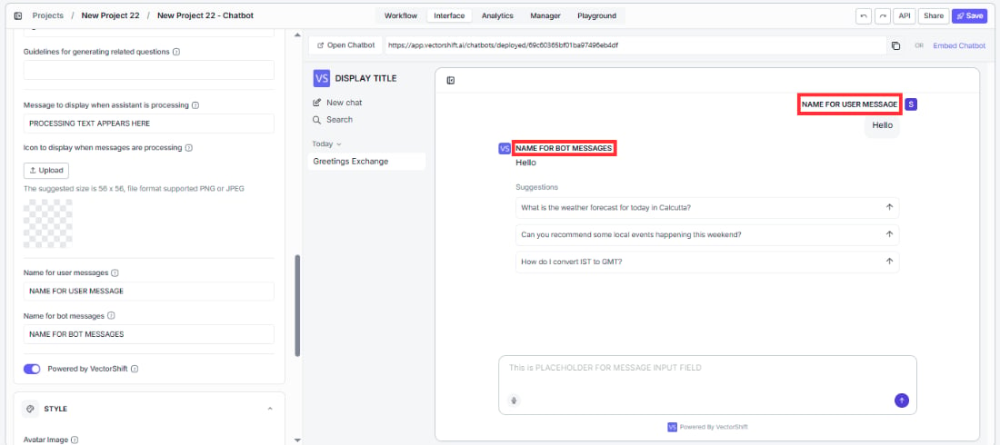

#### Processing indicator

While the bot generates a response, users see a loading state. A well-configured indicator reduces perceived wait time and reassures users that something is actually happening.

* **Message to display when assistant is processing** — replace the generic `Understanding your request...` with something that reflects what your bot is actually doing. `Analyzing your portfolio...`, `Searching your knowledge base...`, or `Checking your account...` feels more purposeful and builds user confidence during the wait.
* **Icon to display when messages are processing** — upload a custom loading icon (56 × 56 px, PNG or JPEG) to replace the default spinner. Using an animated GIF with your logo creates a polished, branded experience that reinforces trust.

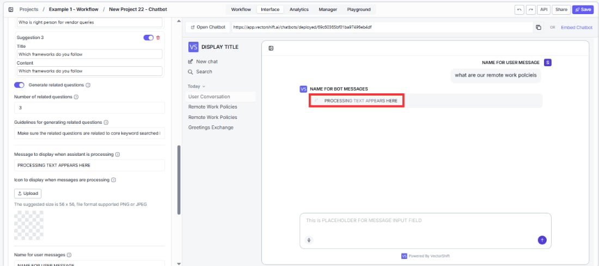

#### Branding

* **Powered by VectorShift** — turn this off if you are building a white-labeled product and do not want end users to know the underlying platform. Clients and end users will only see your branding.

## Designing your chatbot's look

### Step 3. Style

A chatbot that matches your brand feels like part of your product. One that does not looks like a third-party widget bolted on.

* **Avatar Image** — upload your logo so your brand appears in every bot response bubble, not just the header. This is the most visible branding element in an active conversation. Recommended size: 56 × 56 px, PNG or JPEG.
* **Accent color** — set this to your primary brand color so buttons, links, and interactive elements feel native to your product rather than defaulting to VectorShift purple.
* **Messages font** — match this to your product's typography. A font mismatch is a subtle signal to users that this is a third-party tool rather than a native part of your experience.

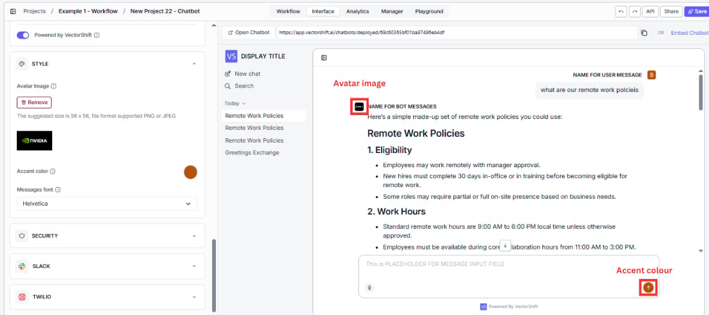

## Adding security features

By default, anyone with the link can access your Chat Assistant. The **Security** panel gives you two options to lock it down. SSO and password protection are mutually exclusive — enabling one disables the other.

### Protect with SSO Auth

Use this for internal tools where access should be limited to employees or team members with VectorShift accounts. When a user opens the link, they are redirected to VectorShift's login page. Anyone without an account is blocked before they ever reach the chatbot.

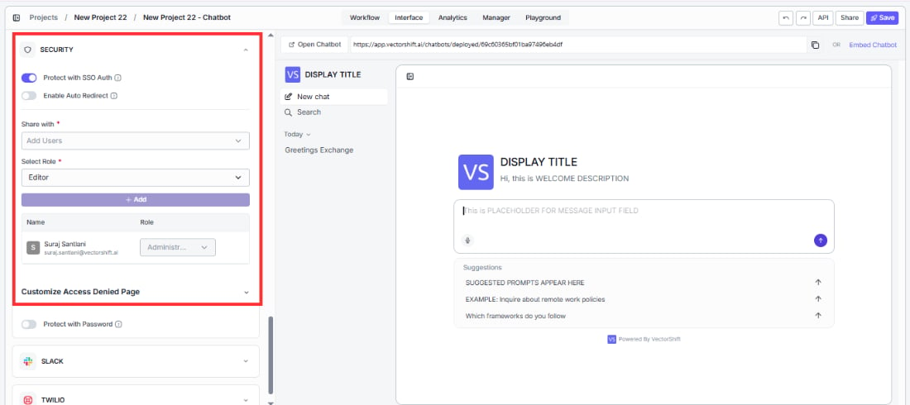

### Protect with Password

Use this to share a chatbot with a specific external group — clients, partners, beta users — without requiring them to create VectorShift accounts. Share the password directly and only people who have it can chat.

Customize the login screen under **Customize Login Page** so it matches your brand rather than showing generic defaults:

* **Change Header** — replace `Authenticate to Chatbot` with something on-brand like `Enter your access code`.
* **Change Password Text** — replace `Password` with `Access code` or whatever label fits your context.
* **Change Button Text** — replace `Submit` with `Continue` or `Enter`.

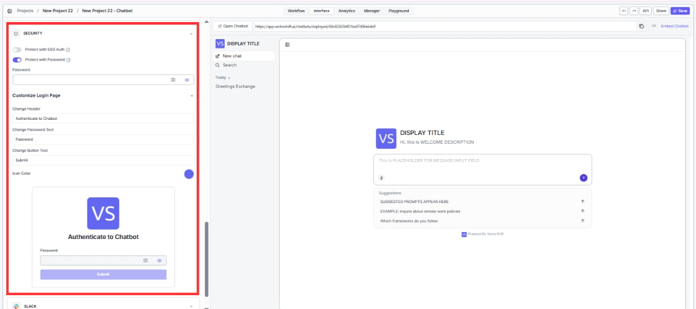

<Tip>
  Test your security setup by opening the chatbot URL in an incognito browser window before sharing it. This ensures you experience exactly what your users will see.
</Tip>

## Deploying your Chat Assistant

From the **Interface** tab, you have three ways to get your chatbot in front of users:

### Share a direct link

Click **Open Chatbot** at the top of the Interface tab to open the live chatbot in a new tab. Copy the URL to share it — by email, Slack message, or anywhere else your users will find it.

### Embed on a website

Click **Embed Chatbot** at the top of the Interface tab to open the embed modal. It provides two code snippets:

* **Script** — a `<script>` tag that adds a floating chat widget to your site. Copy and paste it into your website's HTML.
* **iFrame** — an `<iframe>` tag that embeds the chatbot inline on the page. Use this for platforms that block external scripts.

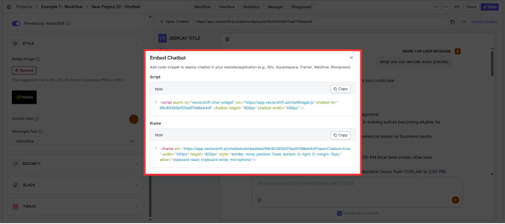

### Deploy to Slack or Twilio

Connect the chatbot to Slack or Twilio directly from the **Slack** and **Twilio** sections in the builder. See the next pages for step-by-step setup.

## Next steps

<CardGroup cols={2}>
  <Card title="Website Chatbot" icon="window-restore" href="/platform/interfaces/chatbots/website">
    Embed a chat widget on your website instead
  </Card>

  <Card title="Deploy to Slack" icon="slack" href="/platform/interfaces/chatbots/slack">
    Let your team chat with the bot directly in Slack
  </Card>

  <Card title="Analytics" icon="chart-line" href="/platform/interfaces/chatbots/analytics">
    Track usage, review conversations, and export data
  </Card>
</CardGroup>
