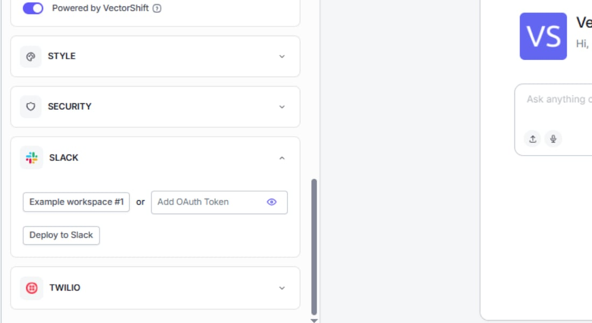
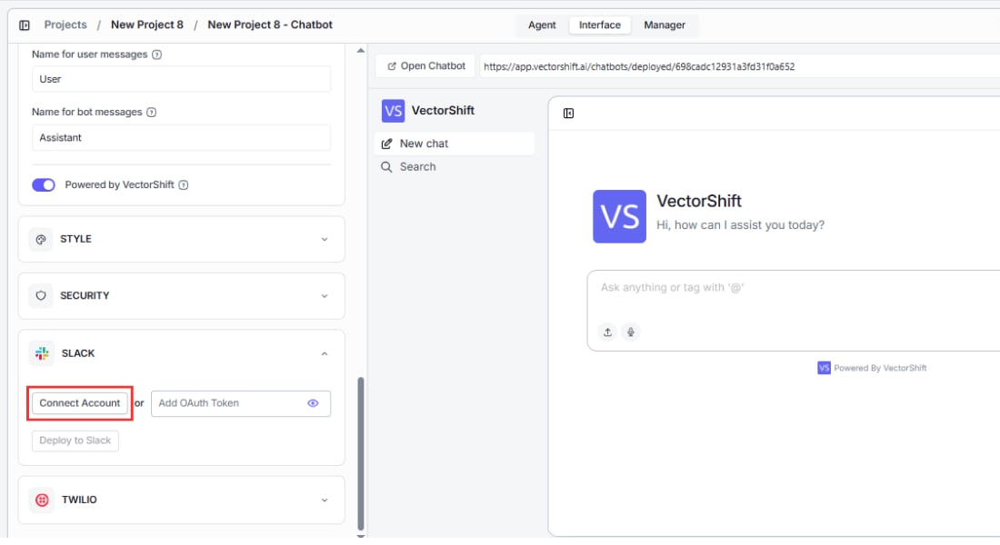
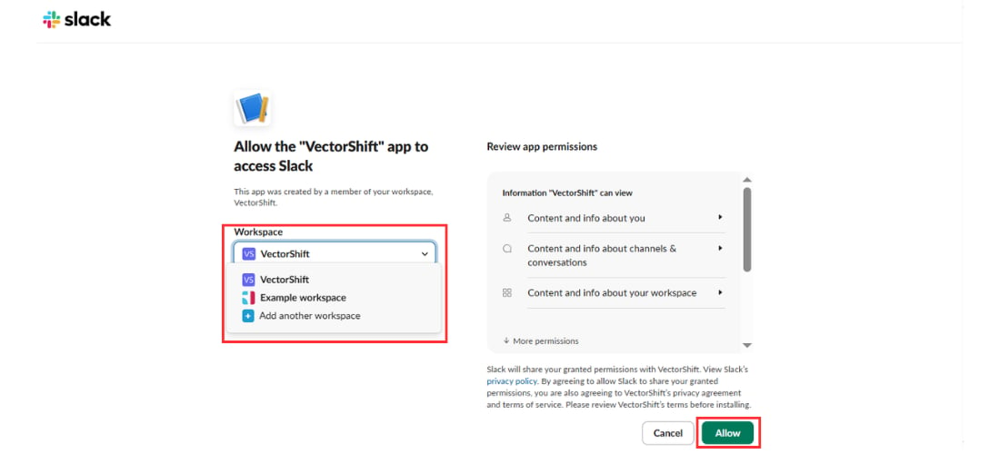
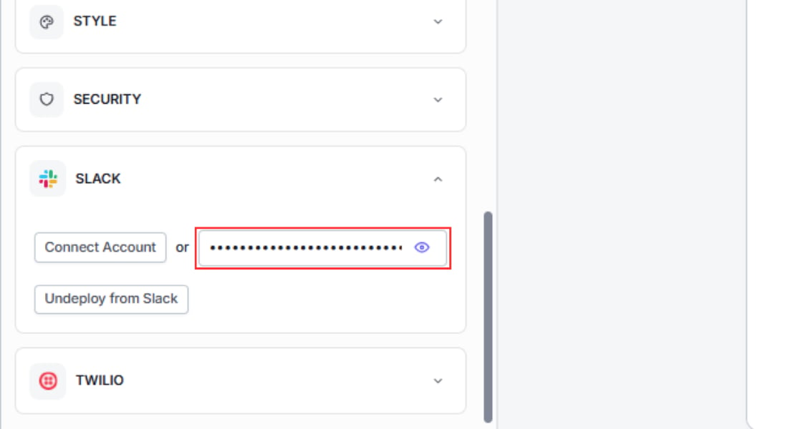
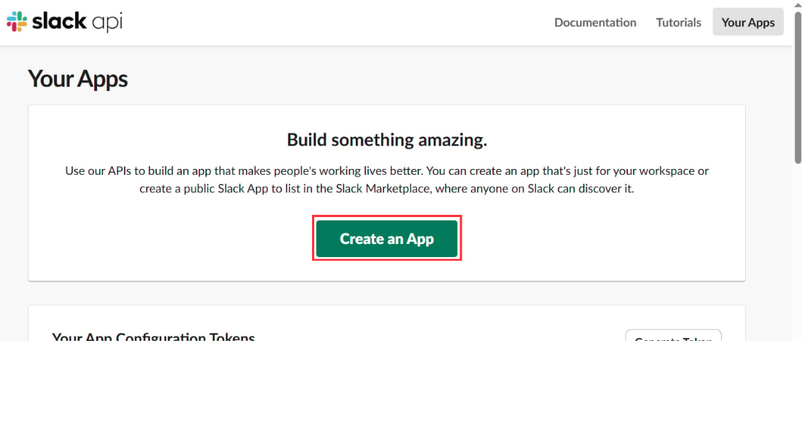
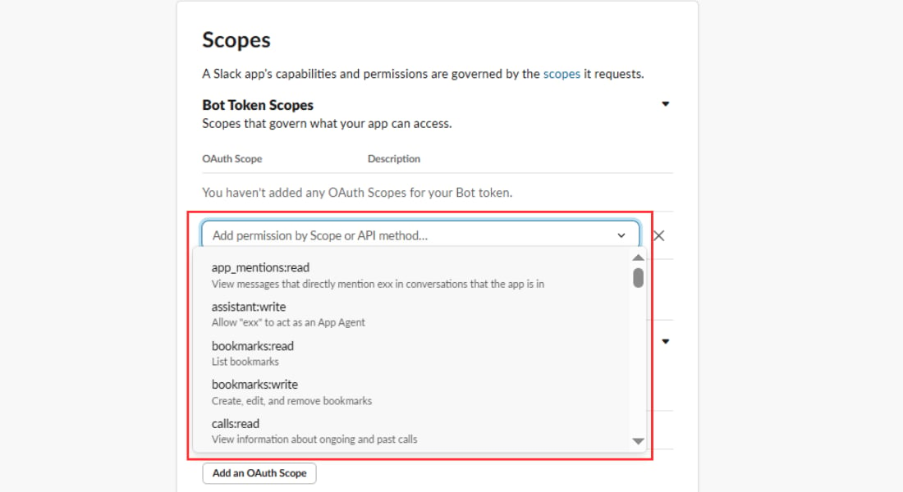
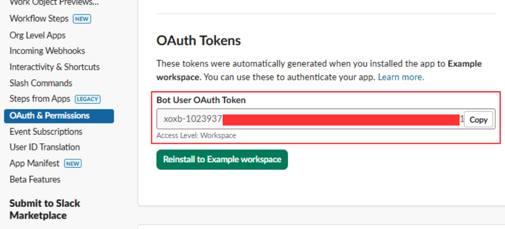

> ## Documentation Index
> Fetch the complete documentation index at: https://docs.vectorshift.ai/llms.txt
> Use this file to discover all available pages before exploring further.

# Deploy to Slack

> Let your team chat with the bot directly in your Slack workspace

Deploying your chatbot to Slack lets your team interact with it through direct messages right where they already work. Instead of opening a separate URL, users message the bot in Slack. VectorShift supports two connection methods: a one-click OAuth flow through the UI, and a manual OAuth token for more control over the Slack app configuration.

## Prerequisites

<Warning>
  Your chatbot must be deployed before connecting to Slack. Open the chatbot builder, go to the **Export** tab, and toggle **Deployment Enabled** to on. You also need a Slack workspace where you have permission to install apps.
</Warning>

## Method 1: Connect via the VectorShift UI

This is the recommended approach. VectorShift handles the OAuth flow for you.

### Step 1. Open the Export tab

Navigate to the **Chatbots** page, open the chatbot you want to deploy, and go to the **Export** tab. Select the **Slack** sub-tab.

### Step 2. Click "Connect Account"

Click the **Connect Account** button to start the OAuth flow. VectorShift opens a Slack authorization page in a new window.

### Step 3. Authorize the workspace

Select the Slack workspace you want to deploy to. Review the permissions VectorShift is requesting, then click **Allow** to grant access.

### Step 4. Deploy to Slack

After authorization, you are returned to VectorShift. Click **Deploy to Slack** to activate the bot in your workspace. You should now be able to find the bot in Slack's direct messages and start chatting with it.

## Method 2: Connect via a manually generated OAuth token

If you need more control over the Slack app configuration (for example, to set custom scopes or use an existing Slack app), you can generate an OAuth token manually and paste it into VectorShift.

### Step 1. Create a Slack app

Visit [https://api.slack.com/apps](https://api.slack.com/apps) and click **Create New App**. Follow the prompts to set up a new app in your workspace.

### Step 2. Select your workspace

Choose the workspace where you want the bot to operate.

### Step 3. Generate and copy the access token

Navigate to the **OAuth & Permissions** section of your Slack app. Install the app to your workspace and copy the **Bot User OAuth Token** that Slack generates.

### Step 4. Paste the token into VectorShift and deploy

Back in the chatbot's Export tab under the Slack section, paste the OAuth token into the token field. Click **Deploy to Slack**. The bot is now active in your workspace.

## Setting up slash commands and app mentions

Once your chatbot is deployed to Slack, users can interact with it in two ways:

* **Direct messages:** Open a conversation with the bot in the Apps section of Slack's sidebar and type a message.
* **App mentions:** Mention the bot in any channel where it has been added (for example, `@YourBot what is the status of order #12345?`). The bot reads the message after the mention and responds in the same channel.

## Managing channel permissions and bot responses

### Role-based access control (RBAC)

You can restrict who in your Slack workspace is allowed to chat with the bot by enabling **Role-Based Access Control**. When RBAC is on, only members of your VectorShift organization who have been granted access can interact with the bot. Other workspace members will be unable to get responses.

To enable RBAC, check the **Enable Role-Based Access Control** toggle in the Slack deployment section before clicking Deploy.

<Warning>
  RBAC requires that your Slack workspace members are also members of your VectorShift organization. If you have not set up an organization, see [Organizations](/account/organizations/overview).
</Warning>

### Testing

After deployment, open Slack and find the bot in your direct messages (or in the Apps section of the sidebar). Send a test message to confirm the bot responds correctly. If RBAC is enabled, test with both an authorized and an unauthorized user to verify that access control works as expected.

## Next steps

<CardGroup cols={2}>
  <Card title="Deploy via WhatsApp and SMS" icon="phone" href="/platform/interfaces/chatbots/whatsapp">
    Connect to WhatsApp or SMS through Twilio
  </Card>

  <Card title="API access" icon="terminal" href="/platform/interfaces/chatbots/api">
    Run the chatbot programmatically from your own application
  </Card>
</CardGroup>
