> ## Documentation Index
> Fetch the complete documentation index at: https://docs.vectorshift.ai/llms.txt
> Use this file to discover all available pages before exploring further.

# Website Chatbot

> Embed a chat widget on your website and customize it to match your brand

The Website Chatbot template adds a collapsible chat widget to any page on your website. Visitors see a launcher button in the corner of the screen, click it, and start chatting without leaving your site. You stay in control of how it looks, who can access it, and how long conversations persist for returning users.

This page walks you through customizing your chatbot and embedding it on your site.

## Editing your Website Chatbot

The chatbot builder has four panels: **Configuration**, **General**, **Style**, and **Advanced**.

### Configuration

Connect the chatbot to the workflow or Agent that powers it.

* **Input** — select the variable that carries the user's message into your workflow. If you pick the wrong one, the bot receives an empty input and cannot respond correctly.
* **Output** — select the variable that carries the bot's reply back to the user. This must point to the node where your final answer is generated.
* **Use Latest Version** — keep this on during active development so changes are reflected immediately. Pin a specific version before a production release to prevent unfinished changes from going live.

### General

#### Display

The display section is the first thing visitors see when they open the chatbot. Getting it right means users immediately understand what the bot does and feel confident engaging with it.

* **Display Title** — put your brand name here so users know they are talking to your product, not a generic tool. Replace `VectorShift` with your company name or chatbot name, like `Acme Support` or `Returns Helper`.
* **Display Image** — upload your logo so it appears in the chat header and next to bot messages throughout the conversation. A recognizable image builds trust before the user has sent a single message. Recommended size: 56 × 56 px, PNG or JPEG.
* **Show Header Icon** — turn this off if you want a clean, text-only header without an image. Useful when your logo does not scale well to small sizes.
* **Show welcome display** — turn this off to skip the welcome screen entirely and drop users straight into the chat. Best for returning users who already know what the bot does.
* **Welcome display description** — tell visitors what the chatbot can help with before they ask. Replace the default `Hi, how can I assist you today?` with something specific like `Ask me about your portfolio, account settings, or compliance questions`. A clear description reduces hesitation and gets users to the right question faster.
* **Welcome message** — have the bot break the ice automatically when a user opens a new conversation. A message like `Hi! I can help with portfolio questions, account settings, and compliance inquiries. What can I help you with today?` sets expectations and eliminates the blank-page effect.

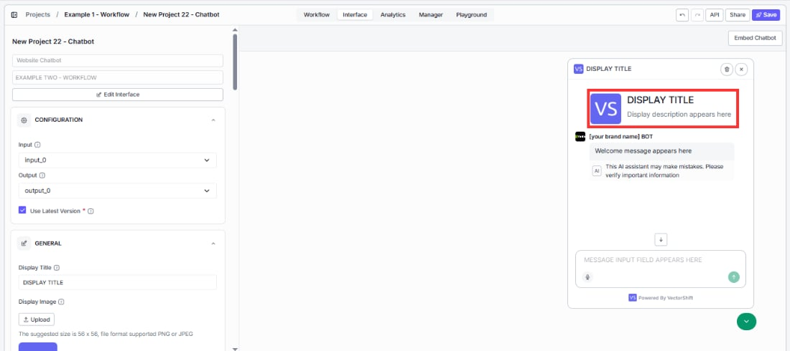

#### AI disclaimer

For regulated industries like finance, healthcare, or legal, displaying an AI notice on bot responses is often a compliance requirement — not just a nice-to-have.

* **Show AI disclaimer under bot message** — turn this on to add a visible notice to bot responses so users know they are interacting with AI, not a human. Disabled by default.
* **AI disclaimer text** — customize the wording to match your legal requirements or brand tone. The default is: `This AI assistant is provided for informational purposes only. Responses may not always be accurate or complete.`
* **AI disclaimer placement** — `On Last Message` (default) shows the disclaimer only on the most recent bot response, keeping older messages clean. Change this if your compliance policy requires it on every message.

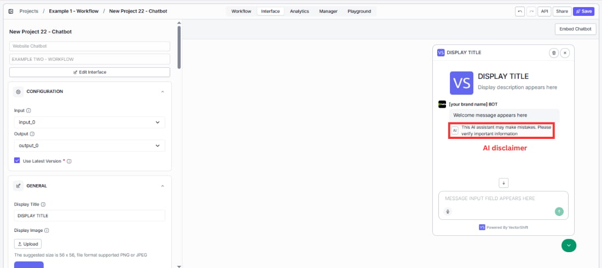

#### Message input

* **Placeholder for message input field** — guide visitors toward the right first question instead of leaving them staring at a blank box. Change `Type your message here...` to something that matches your use case, like `Ask about your portfolio or account status...`. The more specific the placeholder, the faster users engage.

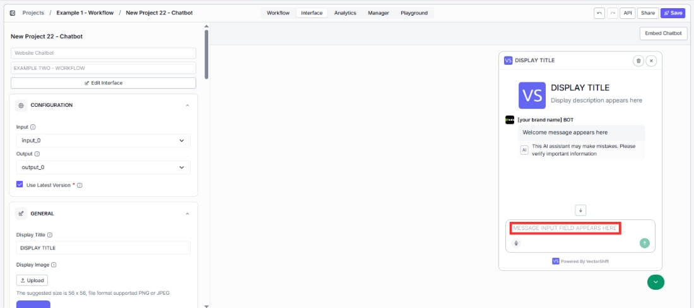

#### Suggested prompts

Give visitors a running start. Instead of a blank input box, they see clickable buttons for the most common questions and can get an answer in one click without typing anything.

Toggle **Enable initial prompts**, then click **+ Add Suggestion** to add prompts. Each suggestion has a **Title** (the button users see) and **Content** (the message sent when clicked).

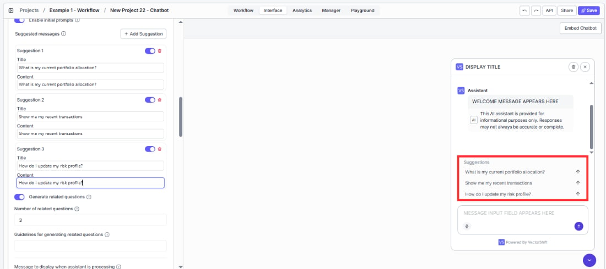

<Tip>
  For a financial advisory bot, try: `"What is my current portfolio allocation?"`, `"Show me my recent transactions"`, and `"How do I update my risk profile?"` — the top three questions your clients ask every day, now answered in one click.
</Tip>

#### Follow-up questions

After the bot responds, it can suggest what to ask next — keeping users in the conversation and helping them discover features or answers they would not have thought to look for.

* **Generate related questions** — turn this on to automatically surface follow-up questions after each response. Enabled by default.
* **Number of related questions** — `3` is a good starting point. Enough to spark the next question without cluttering the screen. Increase this if your chatbot covers a wide topic area.
* **Guidelines for generating related questions** — prevent the bot from suggesting questions it cannot handle. For example: `Focus on portfolio performance, risk management, and account settings. Do not suggest questions about specific stock picks or legal advice.` Without guidelines, follow-ups may send users down paths the bot handles poorly.

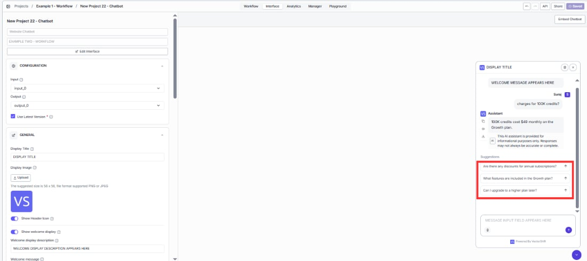

#### Processing indicator

While the bot generates a response, users see a loading state. A well-configured indicator reassures users that something is happening and reduces the feeling of waiting.

* **Message to display when assistant is processing** — replace the generic `Understanding your request...` with something that reflects what your bot is actually doing. `Analyzing your portfolio...` or `Searching our knowledge base...` feels more purposeful and specific to your use case.
* **Icon to display when messages are processing** — upload a custom loading icon (56 × 56 px, PNG or JPEG). An animated GIF with your logo creates a polished, branded experience during the wait.

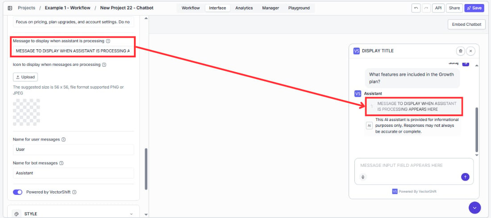

#### Message senders

These labels appear next to every message in the conversation. Small changes here make the chatbot feel purpose-built for your product.

* **Name for user messages** — change `User` to something that fits your audience. `You` feels conversational; `Customer` fits a support tool; `Visitor` works for a general website widget.
* **Name for bot messages** — change `Assistant` to your bot's name or your brand. Every response carries this label, so it reinforces your identity throughout the conversation. Use your product name or something like `Acme Advisor`.

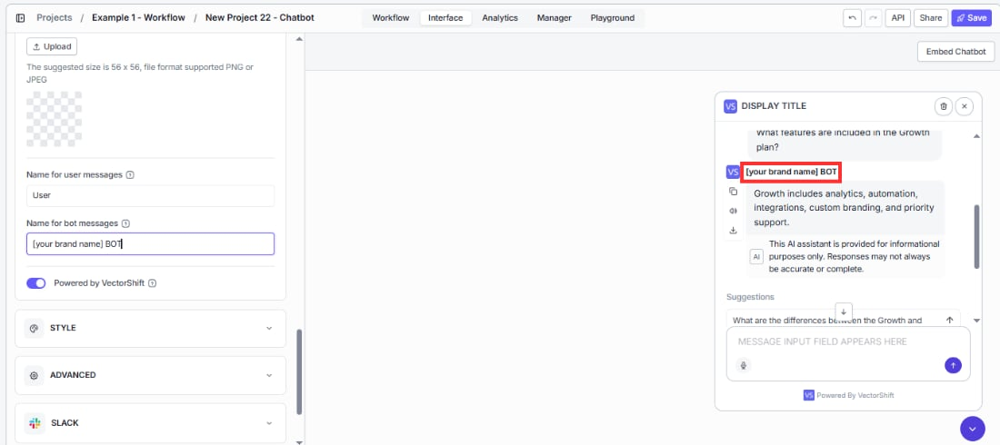

#### Branding

* **Powered by VectorShift** — turn this off if you are building a white-labeled product and do not want end users to see the underlying platform. Once disabled, only your branding is visible.

### Style

A chatbot that matches your website feels like part of the experience. One that does not looks like an external widget bolted on.

* **Avatar Image** — upload your logo so your brand appears in every bot response bubble, not just the header. This is the most visible branding element during an active conversation. Recommended size: 56 × 56 px, PNG or JPEG.
* **Accent color** — set this to your primary brand color so buttons and interactive elements feel native to your site instead of defaulting to VectorShift purple.
* **Messages font** — match this to your website's typography. A font mismatch is a subtle signal to users that the chat is a third-party add-on rather than a built-in product feature.

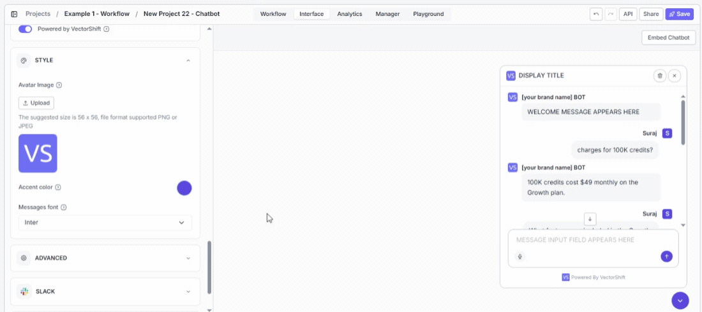

## Advanced settings

The **Advanced** panel controls how the embedded widget behaves on the page.

### Conversation persistence

Control whether returning visitors pick up where they left off or start fresh each time they visit.

* **Enable Persistence** — turn this on so returning users see their previous conversation instead of starting from scratch every visit. Enabled by default.
* **Persistence time quantity** and **Persistence time frame** — set how long the conversation stays alive before expiring. Defaults to `1 Week`. Set a number and choose a unit: Minutes, Hours, Days, Weeks, or Months.

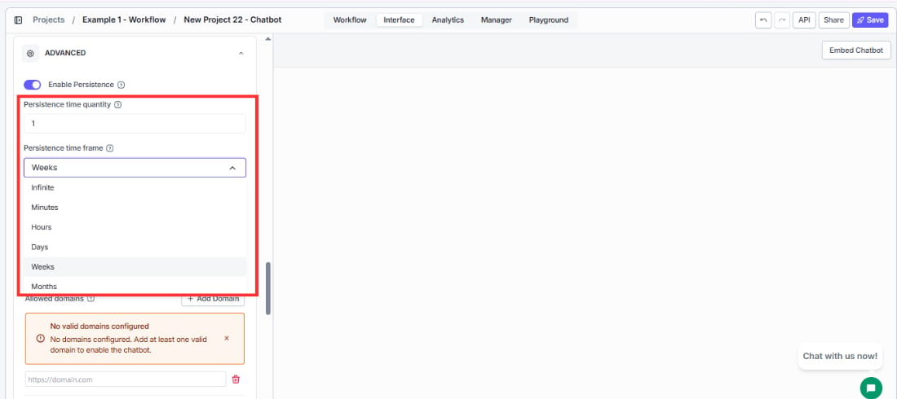

<Tip>
  A support bot benefits from longer persistence — a client who asked about a portfolio rebalancing yesterday should not have to re-explain their situation today. A product lookup bot works better with short or no persistence, since each visit is typically a fresh search.
</Tip>

### Message limit and visibility

* **Embedded chatbot should start open** — turn this on for dedicated support pages where the chatbot is the main reason users are there. Leave it off on content-heavy pages where an auto-opening widget would distract from the main experience.
* **Message limit per conversation** — set a cap to control costs on high-traffic bots. When a user reaches the limit, they need to start a new conversation. Leave blank for no limit.
* **Show remaining number of messages** — turn this on when you have a message limit set, so users are not caught off guard when they hit it. A visible counter sets expectations before the conversation gets cut off.

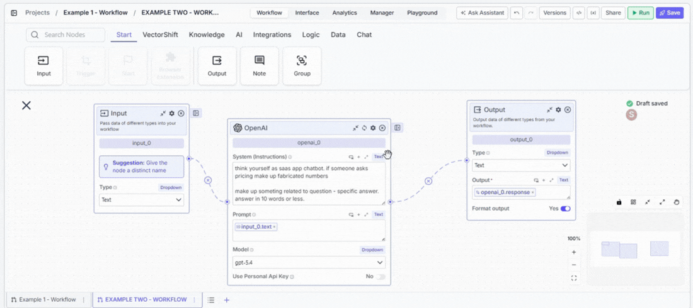

### Domain limiting

* **Limit embed to provided domains** — turn this on before going live so your chatbot only loads on your own websites. If someone copies your embed code and pastes it on their own site, this blocks the widget from loading there. Only the domains you specify will work.

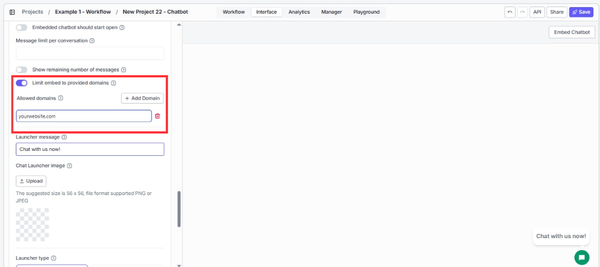

### Launcher

The launcher is the button that draws users in before they start chatting. A well-configured launcher gets more clicks without being intrusive.

* **Launcher message** — write something that speaks directly to what your visitors are there to do. `Have a question about your portfolio?` outperforms the generic `Chat with us now!` because it matches user intent the moment they see it.
* **Chat Launcher image** — replace the default chat bubble with your logo or a custom icon so the launcher looks like it belongs on your site rather than a generic widget. Recommended size: 56 × 56 px, PNG or JPEG.
* **Launcher type** — choose Icon + Chat label if you want higher click-through rates. The text label tells users what the button does and removes the hesitation that comes with an unlabeled icon.
* **Embed Position** — place the launcher where it does not overlap other fixed elements on your page such as cookie banners or help widgets. Defaults to `Right`.
* **Side spacing** — increase this if the launcher sits on top of another element on the right or left edge of your page. Defaults to `10` px.
* **Bottom spacing** — increase this if the launcher overlaps a footer bar or floating element at the bottom of your page. Defaults to `10` px.

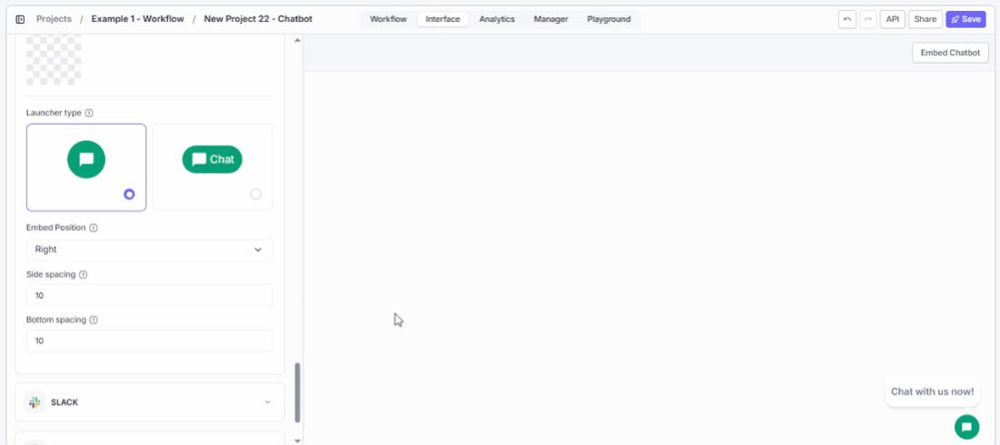

## Embedding in your site

VectorShift provides two embed methods:

|                    | Script tag (preferred)                                                                                                                                              | iFrame                                                                                                                         |
| ------------------ | ------------------------------------------------------------------------------------------------------------------------------------------------------------------- | ------------------------------------------------------------------------------------------------------------------------------ |
| **What users see** | A floating launcher button in the corner of the page. Clicking it opens a chat window that overlays the page content. Users can collapse and reopen it at any time. | The chatbot is rendered inline as a fixed box on the page. It's always visible and cannot be collapsed.                        |
| **Best for**       | Most websites — works on WordPress, Squarespace, Webflow, Framer, and custom HTML.                                                                                  | Platforms that block external scripts (e.g., Wix free plan), or when you want the chatbot inside a specific section of a page. |
| **Customization**  | Set `chatbot-height` (default 600px) and `chatbot-width` (default 400px) as attributes on the tag.                                                                  | Control `width`, `height`, `style`, and `allow` attributes directly on the `<iframe>` tag.                                     |

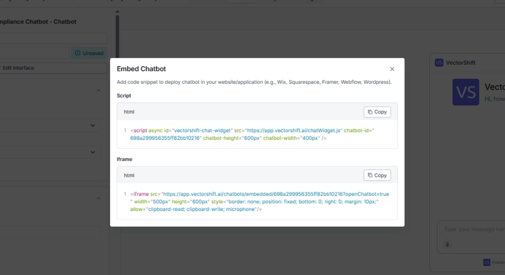

<Warning>
  Click **Embed Chatbot** at the top of the Interface tab to get your embed code. Both snippets are available in the modal that opens.
</Warning>

### Via script tag (preferred)

```html theme={"languages":{}}
<script async id="vectorshift-chat-widget"
  src="https://app.vectorshift.ai/chatWidget.js"
  chatbot-id="{chatbot_id}"
  chatbot-height="600px"
  chatbot-width="400px" />
```

Paste this into your website's HTML. For site-wide availability, add it to your footer or layout template so it loads on every page.

### Via iFrame

```html theme={"languages":{}}
<iframe
  src="https://app.vectorshift.ai/chatbots/embedded/{chatbot_id}?openChatbot=true"
  width="500px"
  height="600px"
  style="border: none; position: fixed; bottom: 0; right: 0; margin: 10px;"
  allow="clipboard-read; clipboard-write; microphone"/>
```

<Warning>
  The `allow="clipboard-read; clipboard-write; microphone"` attribute is required for clipboard operations and voice input. Do not remove it.
</Warning>

### Platform-specific guides

#### WordPress

1. Open your WordPress dashboard and create a new post (or open an existing one).
2. Click the **+** button in the block editor, search for **Custom HTML**, and add the block.
3. Paste the script tag snippet from VectorShift into the block.
4. Publish the post and verify the launcher appears on the page.

To make the chatbot available on every page, paste the script into your theme's footer widget or footer HTML section instead.

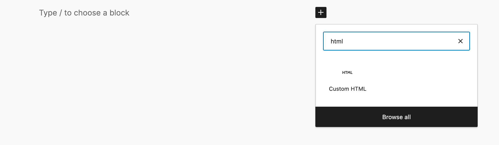

#### Wix

1. Open the Wix Editor and click **Add** in the left panel.
2. Search for and add an **Embed HTML** element to your page.
3. Paste the **iFrame** snippet (Wix's free plan does not support external script tags).
4. Drag the element's handles to make the chatbot fully visible.
5. Publish and test on your live site.

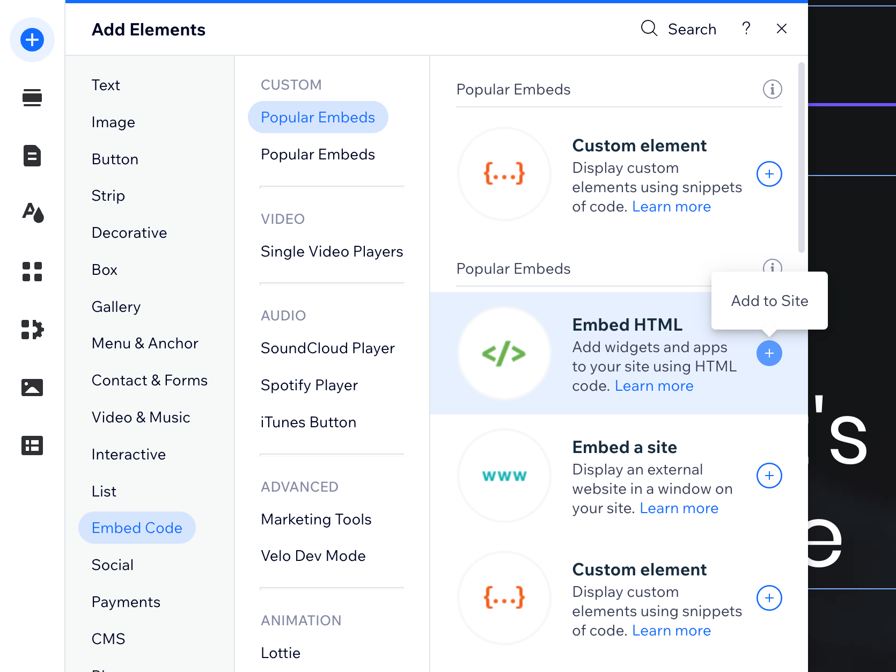

#### Bubble.io

1. Open the Bubble.io UI Builder and drag an **HTML** element onto your page.
2. Paste the script tag snippet from VectorShift.
3. Check the **Display as an iFrame** option in the element settings.
4. In the **Layout** tab, set the minimum height to `610px`.
5. Preview or deploy to see the chatbot running.

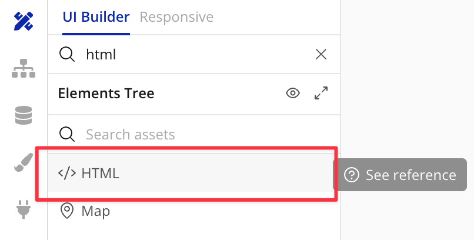

## Chrome Extension

Toggle **Deploy to Chrome Extension** in the **Chrome** panel to make this chatbot accessible through the VectorShift Chrome Extension. Once deployed, users with the extension installed can open the chatbot directly from their browser without visiting your website.

## Troubleshooting

* **The widget does not appear.** Check your browser's developer console for script errors. Verify the chatbot ID in the embed code is correct.
* **The chatbot loads but voice input does not work in the iFrame.** Verify that the `allow="clipboard-read; clipboard-write; microphone"` attribute is present on the `<iframe>` tag.
* **The script tag does not load on Wix.** Wix's free plan blocks external scripts. Switch to the iFrame method instead.
* **The launcher overlaps with other elements.** Increase **Bottom spacing** and **Side spacing**, or switch **Embed Position** from Right to Left.

## Next steps

<CardGroup cols={2}>
  <Card title="Deploy to Slack" icon="slack" href="/platform/interfaces/chatbots/slack">
    Let your team chat with the bot directly in Slack
  </Card>

  <Card title="Deploy via WhatsApp and SMS" icon="phone" href="/platform/interfaces/chatbots/whatsapp">
    Connect to WhatsApp or SMS through Twilio
  </Card>

  <Card title="Analytics" icon="chart-line" href="/platform/interfaces/chatbots/analytics">
    Track usage, review conversations, and export data
  </Card>
</CardGroup>
