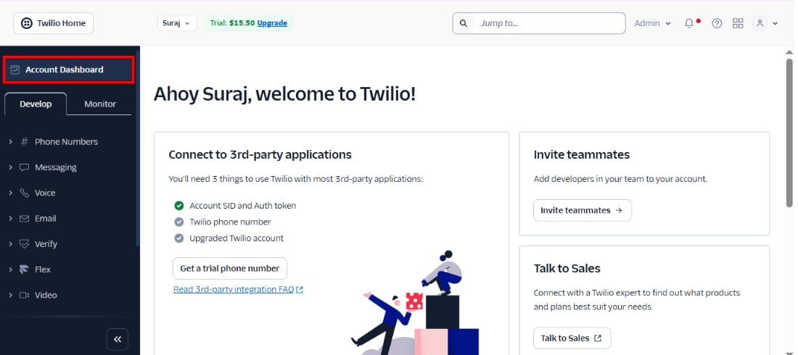
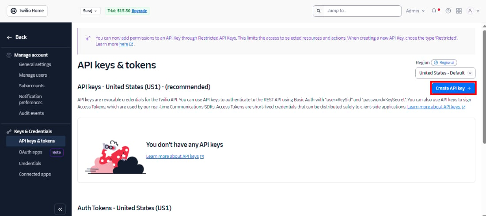
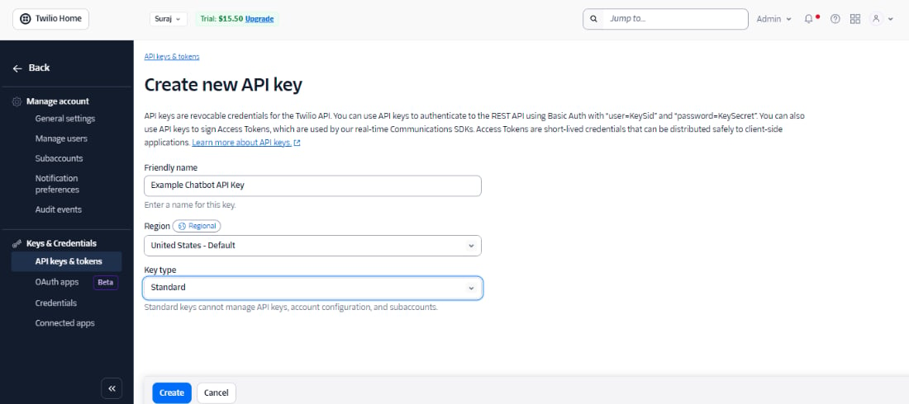
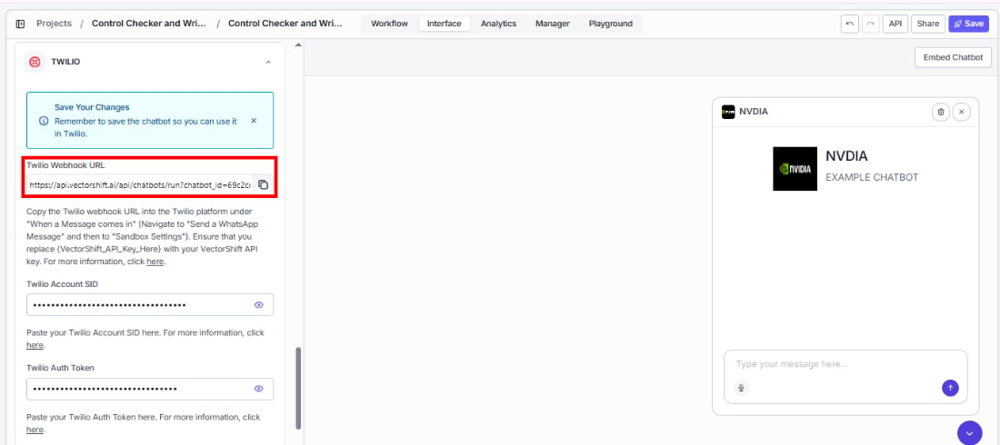
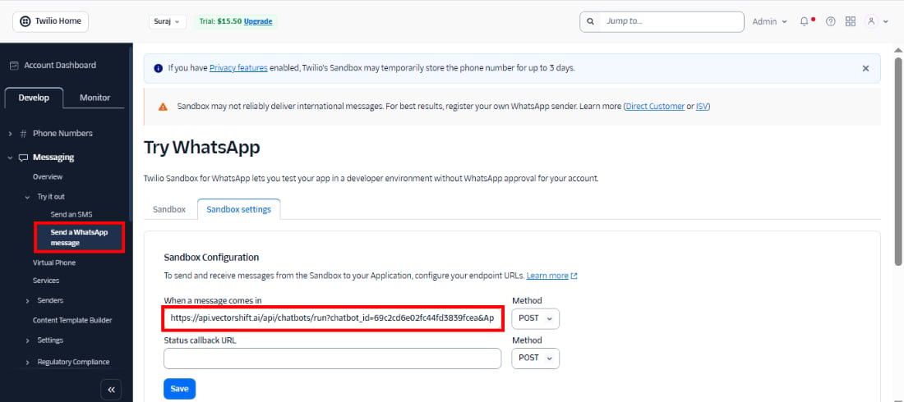
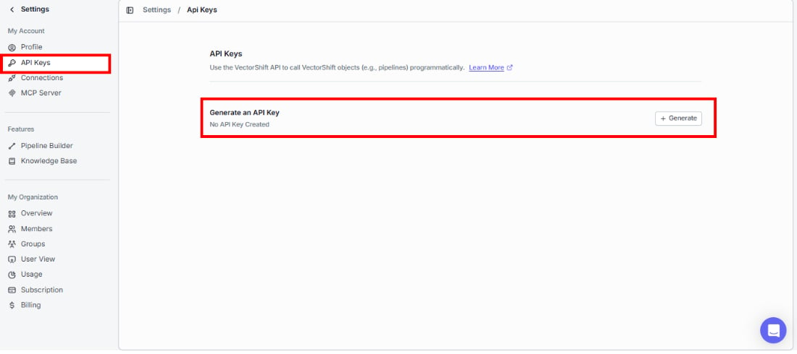
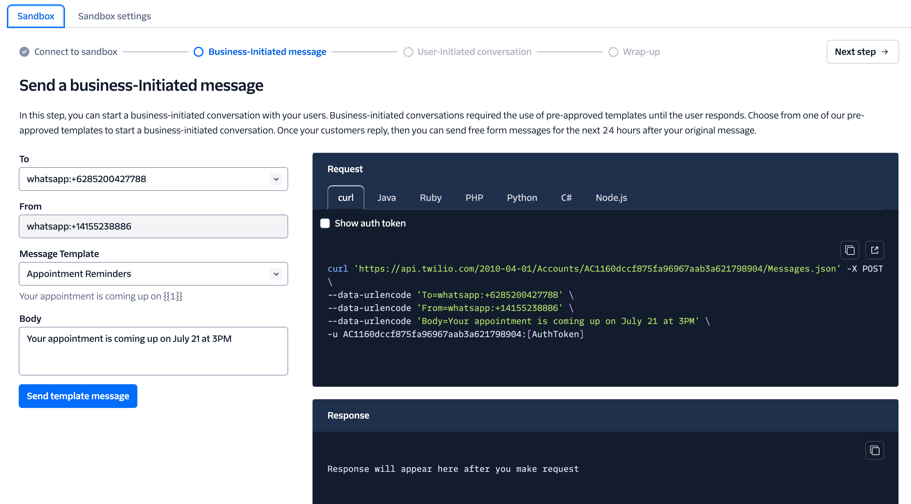
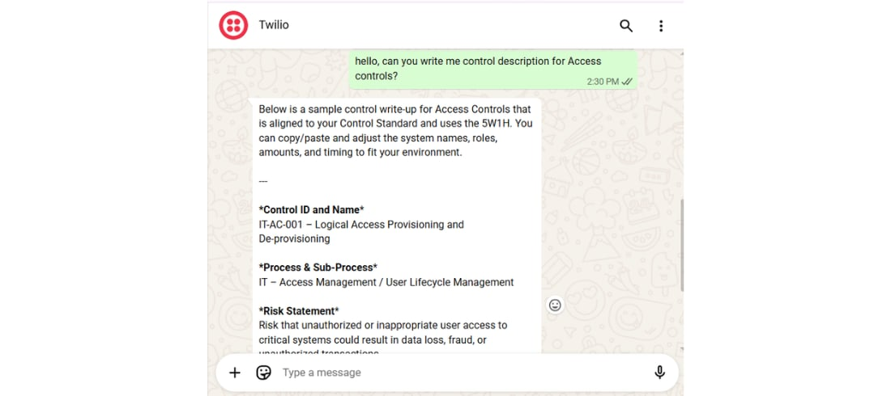

> ## Documentation Index
> Fetch the complete documentation index at: https://docs.vectorshift.ai/llms.txt
> Use this file to discover all available pages before exploring further.

# Deploy via WhatsApp and SMS

> Connect your chatbot to WhatsApp or SMS through Twilio

You can make your chatbot reachable over WhatsApp and SMS by connecting it to Twilio. VectorShift provides a webhook URL that Twilio calls every time a message arrives. The chatbot processes the message through your workflow and sends the response back through Twilio.

This guide walks through the full setup using WhatsApp as the example. The same steps apply to SMS: you configure the webhook in the SMS section of your Twilio console instead of the WhatsApp sandbox.

## Prerequisites

Before you begin, make sure you have:

* A deployed chatbot in VectorShift (toggle **Deployment Enabled** in the Export tab).
* A Twilio account. You can use Twilio's free sandbox for testing. Production use requires an approved WhatsApp Business Profile.
* Your VectorShift API key (found under your profile > **API Keys**).

## Step 1. Set up your Twilio account

### Step 1.1. Create a Twilio account

Navigate to [twilio.com](https://www.twilio.com) and sign up for an account. You will start in a sandbox environment, which is enough for testing.

### Step 1.2. Create an API key

Go to the **Manage account** page and navigate to the API Keys section. Click **Create API Key**.

### Step 1.3. Configure the API key

Give your key a name (for example, "VectorShift Chatbot") and select a region. You can leave the key type set to **Standard**.

## Step 2. Connect Twilio to VectorShift

Open the chatbot builder in VectorShift, go to the **Export** tab, and navigate to the **WhatsApp / SMS** sub-tab. You will see fields for your Twilio Account SID and Auth Token, along with a **Twilio Webhook URL** that VectorShift has generated for this chatbot.

Copy your **Account SID** and **Auth Token** from Twilio and paste them into the corresponding fields.

## Step 3. Copy the webhook URL

Copy the **Twilio Webhook URL** from the VectorShift Export tab. You will paste this into the Twilio console in the next step.

## Step 4. Configure the Twilio sandbox

### Step 4.1. Paste the webhook URL

In the Twilio console, navigate to the WhatsApp Sandbox settings. Paste the webhook URL into the **"When a message comes in"** field. Leave the **"Status callback"** field empty.

### Step 4.2. Append your VectorShift API key to the URL

The webhook URL contains a placeholder: `{VectorShift_API_Key_Here}`. Replace it with your actual VectorShift API key and click **Save**. You can find your API key under **Settings > API Keys** in VectorShift.

<Warning>
  The webhook URL contains your chatbot ID. Do not share it publicly. Anyone with the URL and a valid API key can send messages to your chatbot.
</Warning>

## Step 5. Test in the sandbox

Follow Twilio's sandbox instructions to connect your phone to the sandbox. You will typically send a specific message to a WhatsApp number that Twilio provides. Once connected, send a message and verify that your chatbot responds.

<Tip>
  Twilio splits outgoing messages at 1,600 characters. If your chatbot produces long responses, the user will receive them in multiple consecutive messages rather than one.
</Tip>

## Step 6. Move to production

The sandbox is for testing only. To use your chatbot with a real WhatsApp number, you need to apply for a WhatsApp Business Profile through Twilio. Fill out [Twilio's WhatsApp Request Form](https://www.twilio.com/whatsapp/request-access) to begin the approval process.

Once approved, update the webhook URL in your production Twilio configuration (the same URL you used in the sandbox, with your real API key appended).

## Next steps

<CardGroup cols={2}>
  <Card title="API access" icon="terminal" href="/platform/interfaces/chatbots/api">
    Run the chatbot programmatically from your own application
  </Card>

  <Card title="Analytics" icon="chart-line" href="/platform/interfaces/chatbots/analytics">
    Track usage and review conversations across all channels
  </Card>
</CardGroup>
