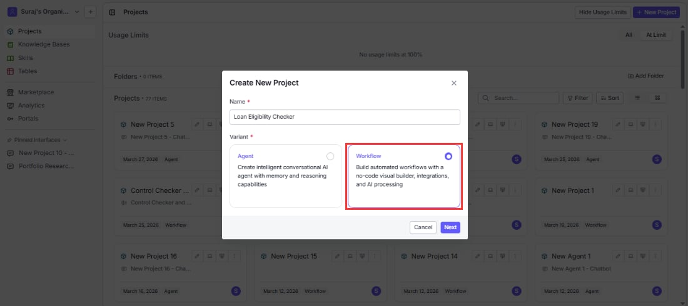
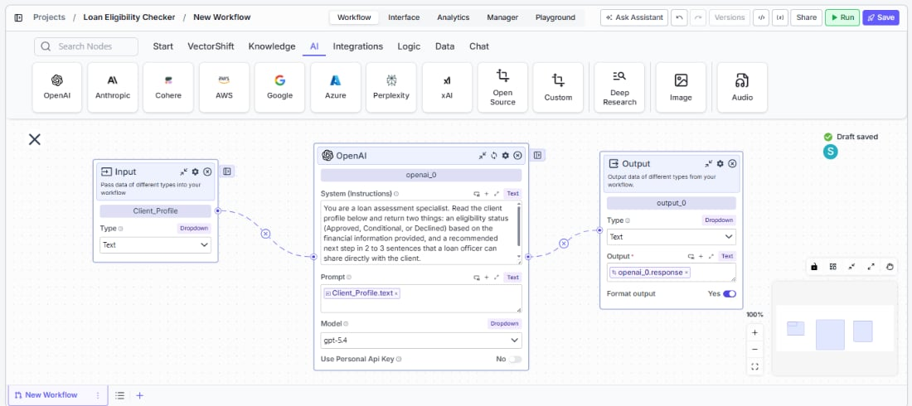
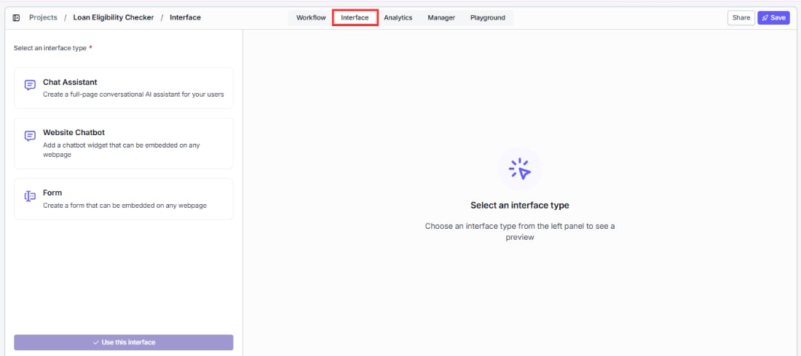
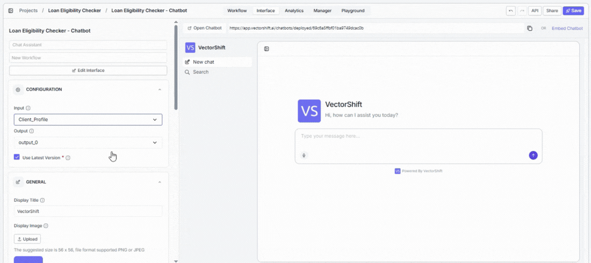

> ## Documentation Index
> Fetch the complete documentation index at: https://docs.vectorshift.ai/llms.txt
> Use this file to discover all available pages before exploring further.

# Workflow chatbot

> Build a chatbot backed by a step-by-step workflow you define

A Workflow chatbot is a conversational interface powered by a workflow where you define every step explicitly. You choose which nodes run, in what order, and how data flows between them. The workflow runs the same sequence every time a message comes in, giving you full control over the chatbot's behavior.

<Tip>
  If you are completely new to VectorShift, head to the [Quickstart](/quickstart) first. This page assumes you understand basic chatbot concepts covered in the [Chatbots overview](/platform/interfaces/chatbots/overview).
</Tip>

## What can a Workflow chatbot do?

Start with the outcome you want:

* **"Answer customer questions about orders, returns, and shipping using our help center articles."** The workflow queries a knowledge base, feeds the results to an LLM, and returns a sourced answer every time.
* **"Summarize uploaded documents and answer follow-up questions about them."** The workflow uses a [Chat File Reader node](/platform/pipelines/chat/chat-file-reader) to process uploads and an LLM to generate summaries.
* **"Collect user information step by step, then create a support ticket."** The workflow uses a Data Collector node to gather required fields before calling an integration.

In each case, you design the exact flow. The workflow does not improvise.

## What a typical chatbot workflow looks like

A Workflow chatbot is driven by a workflow you build in the workflow editor. Here is an example of a complete chatbot workflow:

Most chatbot workflows use the same core nodes:

* **Input node** — receives the user's chat message and passes it into the workflow.
* **Knowledge Base Reader node** — queries your [knowledge base](/platform/knowledge) for information relevant to the user's message.
* **LLM node** — takes the user's question, retrieved context, and conversation history, then generates a response.
* **Chat Memory node** — feeds [conversation history](/platform/pipelines/chat/chat-memory) to the LLM so it can reference earlier messages.
* **Output node** — returns the LLM's response to the user in the chat interface.

You can add, remove, or rearrange nodes to fit your use case. For a full guide on building and configuring workflows, see [Workflows](/platform/pipelines).

## Creating a Workflow chatbot

Follow these five steps to go from a workflow to a deployed chatbot.

### Step 1. Build your workflow

Create a workflow in the workflow editor with the nodes your chatbot needs (Input, LLM, Chat Memory, Knowledge Base, Output, etc.). For a full guide, see [Workflows](/platform/pipelines).

### Step 2. Add nodes to the workflow

Configure the nodes that define your chatbot's behavior. At a minimum, connect an Input node to receive the user's message, an LLM node to generate a response, and an Output node to return the reply. Add a [Chat Memory node](/platform/pipelines/chat/chat-memory) for conversation history and a [Knowledge Base Reader node](/platform/knowledge) for grounded answers.

### Step 3. Export to the Interface tab

Once your workflow is ready, navigate to the **Interface** tab to turn your workflow into a chatbot and select your workflow.

### Step 4. Personalize the interface

Customize the chatbot's appearance and behavior — set your brand colors, welcome message, bot name, starter prompts, and avatars. For full details, see [Customizing your chatbot](/platform/interfaces/chatbots/customize).

### Step 5. Deploy

Deploy the chatbot to make it available to your users. Choose from a shareable link, an embedded widget, Slack, WhatsApp/SMS, or API. See [Sharing and deploying](/platform/interfaces/chatbots/deploying) for details on each channel.

<Warning>
  Each subscription plan has a limit on the number of chatbots you can create. See [Subscriptions](/account/subscriptions/overview) for details on plan limits.
</Warning>

## Voice input

You can also use your voice to send messages. Click the microphone button in the message input area, speak your question, and click send. VectorShift transcribes your audio using Whisper and sends the transcribed text as your message.

## Example Workflow chatbots you can build

Workflow chatbots are ideal for finance use cases where the response process needs to be consistent, auditable, and grounded in specific data sources every time.

* **Client portfolio Q\&A bot** — A client opens the chatbot and asks "What is my current allocation across equities and bonds?" The workflow queries a knowledge base loaded with the client's portfolio data, passes the retrieved context to an LLM with a compliance-aware prompt, and returns a sourced answer. Every response follows the same retrieval-then-generate sequence, so the output is predictable and easy to audit.

* **Earnings report summarizer** — An analyst uploads a quarterly earnings PDF and asks follow-up questions. The workflow uses a Chat File Reader node to extract the document content, feeds it to an LLM with a summarization prompt, and keeps the full document in context for follow-up questions like "What drove the revenue increase in Q3?" The workflow never deviates from this read-then-answer flow.

* **Regulatory compliance intake bot** — A user reports a potential compliance issue through the chatbot. The workflow uses a Data Collector node to gather structured information (issue type, date, parties involved), validates the required fields are complete, then calls an integration to create a case in the firm's compliance management system. The same structured intake process runs for every submission.

* **Market data briefing bot** — Each morning, traders open the chatbot and ask for a briefing on key instruments. The workflow calls a market data API node to fetch live prices and news, passes the results to an LLM with a briefing template, and returns a formatted daily summary. Because the workflow is fixed, every briefing follows the same format and data sources.

## Next steps

<CardGroup cols={2}>
  <Card title="Chat Assistant vs Website Chatbot" icon="browser" href="/platform/interfaces/chatbots/assistant-vs-website">
    Choose how your chatbot appears to users
  </Card>

  <Card title="Agentic chatbot" icon="robot" href="/platform/interfaces/chatbots/agentic">
    Build an autonomous chatbot that picks its own tools
  </Card>
</CardGroup>
