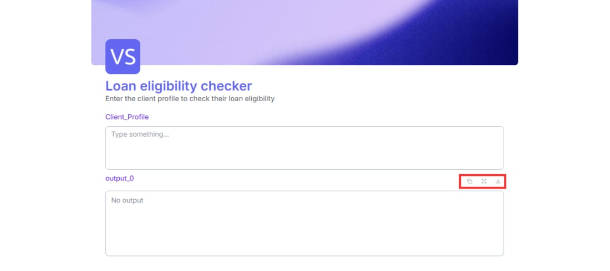
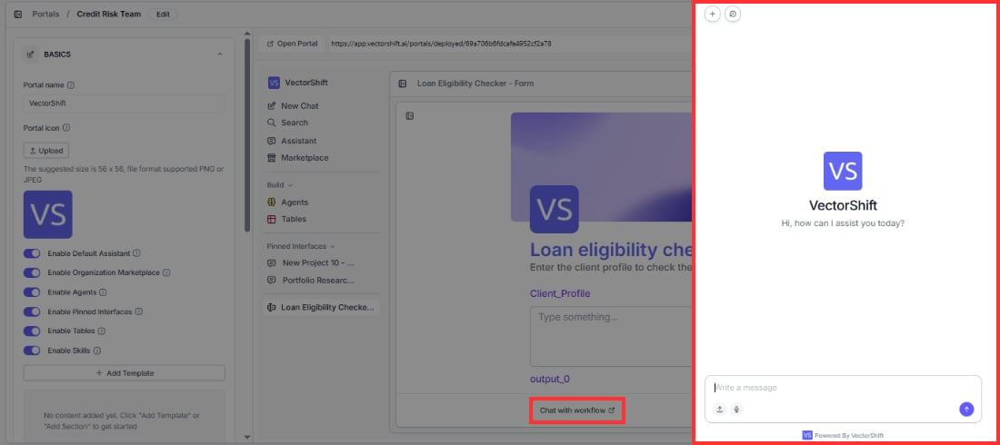

> ## Documentation Index
> Fetch the complete documentation index at: https://docs.vectorshift.ai/llms.txt
> Use this file to discover all available pages before exploring further.

# Additional Features

> Download outputs and chat with your workflow after a form submission

Once your form is live and collecting submissions, these additional features let your users do more with the results.

## Downloading form outputs

After a form runs, users can download the output in multiple formats. Look for the download option on the output block after a submission. Available formats are PDF, TXT, DOCX, and CSV.

This is useful when your form produces a report, a document draft, or a structured data output that users need to save or share.

## Chatting with your workflow

Once your form has produced an output, a "Chat with workflow" button appears at the bottom of the form. Clicking it opens a chat interface powered by GPT-4o that uses your form's outputs as its starting context. This lets users ask follow-up questions about their results, request clarifications, or explore the output further in a conversational way.

This is not a re-run of your workflow. It is a separate AI conversation that picks up where your form left off.

<Tip>This is most useful for forms that produce complex outputs like financial risk assessments, loan evaluations, or regulatory compliance reports, where users often have follow-up questions after seeing the result.</Tip>
