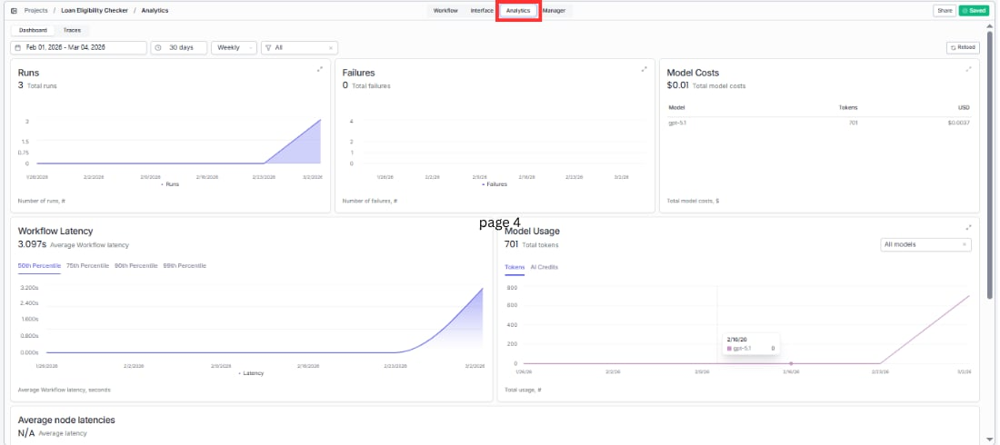
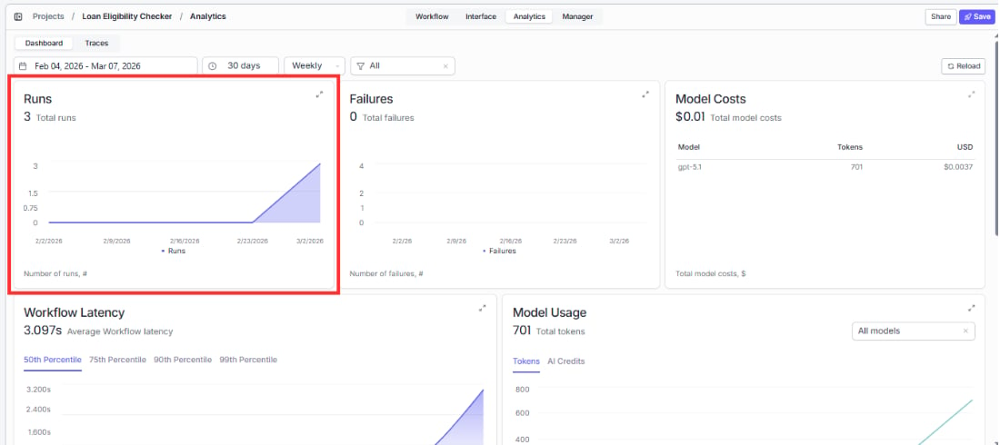
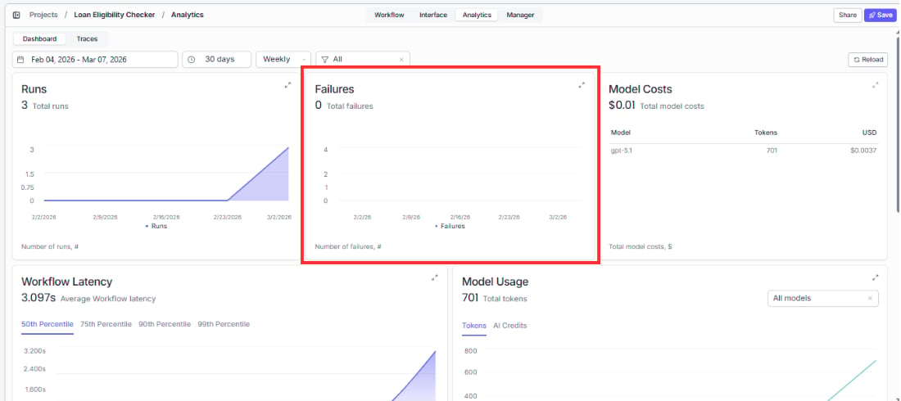
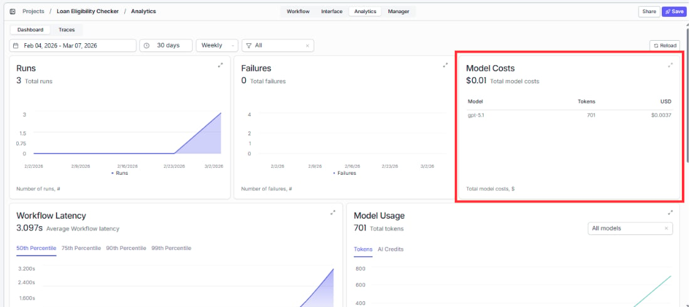

> ## Documentation Index
> Fetch the complete documentation index at: https://docs.vectorshift.ai/llms.txt
> Use this file to discover all available pages before exploring further.

# Tracking Performance

> Read your analytics and understand how your form and workflow are performing

The Analytics tab gives you a live view of how your form and its underlying workflow are performing. Get to it by clicking "Analytics" in the top navigation bar of your project.

## Filters and time range

At the top of the Analytics page you will find the controls for filtering what you see.

The date range picker on the left defaults to the last 30 days. Click it to open a calendar and set a custom start and end date.

The time period dropdown next to it gives you quick preset ranges instead of picking dates manually.

The Weekly/Monthly toggle controls how data is grouped in the charts. Weekly shows a data point for each week in your selected range. Monthly groups it by month. Switch between them depending on whether you are looking at recent trends or longer patterns.

Click Reload in the top right corner any time you want to make sure you are seeing the most current data.

## Runs

Runs shows you how many times your workflow has been triggered through the form. The number at the top is the total for your selected time range. The area chart below shows how that volume has changed over time.

An upward trend means more people are using your form. A sudden drop is worth investigating: it could mean a broken workflow, an access issue, or simply that you stopped sharing the link.

## Failures

Failures shows you how many runs did not complete successfully. The total sits at the top and the bar chart shows the trend over time.

A small number of failures is normal, especially if users are submitting incomplete inputs. But if failures are rising alongside runs, check your workflow for broken node connections, missing API keys, or inputs that are not being handled correctly.

## Model costs

Model Costs shows the total cost of all AI model usage triggered through your form in the selected period. Use this to understand how much your workflow is spending on model calls and spot any unexpected spikes.
