> ## Documentation Index
> Fetch the complete documentation index at: https://docs.vectorshift.ai/llms.txt
> Use this file to discover all available pages before exploring further.

# Building Your First Form

> Create a workflow, attach a form interface, and get your form live step by step

By the end of this page, you will have a working form connected to a live workflow that anyone can fill out and get a result from.

## What we are building

We are going to build a loan eligibility checker together. A loan officer pastes in a client's financial profile, and the form instantly returns an eligibility assessment and a recommended next step. No back and forth, no manual review, just a fast and consistent first evaluation every time.

You can follow every step using this exact example, and by the end you will know how to build any form you need.

## Step 1. Create a new project

Go to Projects in the left sidebar and click the blue "New Project" button in the top right corner.

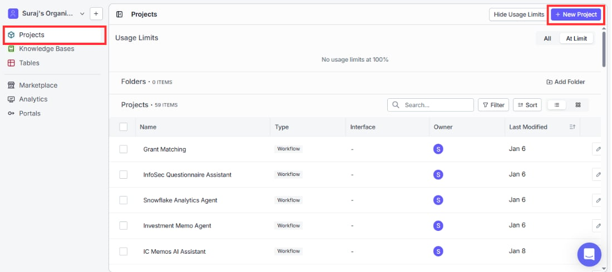

A dialog will appear asking you to name your project and choose a variant. Select "Workflow" since forms in VectorShift are built on top of workflows.

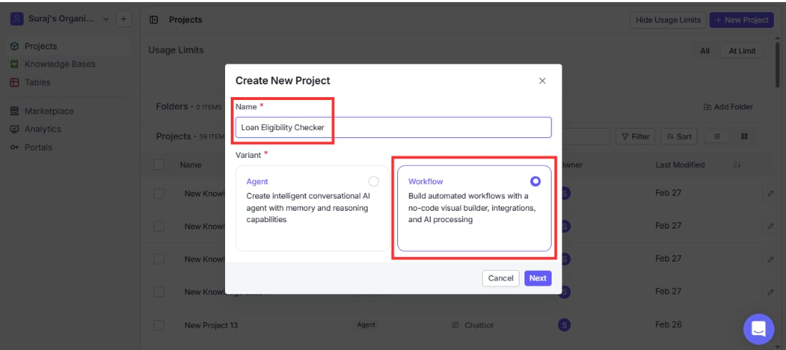

Name your project something descriptive. We are calling ours "Loan Eligibility Checker". Click Create.

**A note on naming:** Form names can only contain letters, numbers, spaces, dots, dashes, and underscores. They must be between 2 and 80 characters long and must be unique within your organization. If you see an invalid name error, check for special characters or a name that already exists in your workspace.

## Step 2. Set up your workflow

After creating your project, you land on the workflow canvas. This is where you build the logic that runs behind your form. Think of it as the engine your form drives.

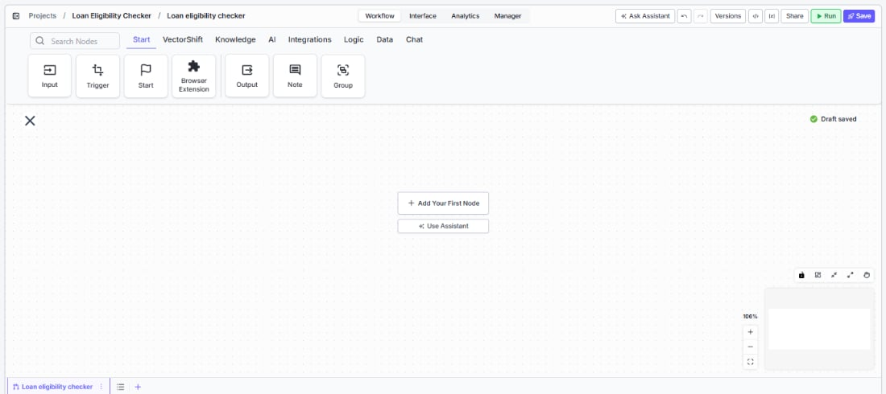

Your workflow needs three things to work with a form: an Input node to receive what the user submits, a processing node to do something with it, and an Output node to send the result back.

### Adding your Input node

Click the Start tab in the toolbar and drag an Input node onto the canvas. This becomes one of the fields on your form. Give it a clear name like "client\_profile" so you can reference it easily later.

For the loan eligibility checker, one Input node is enough since we are taking a single block of text. If you were building a mortgage assessment form, you might add three Input nodes: one for annual income, one for credit score, and one for requested loan amount.

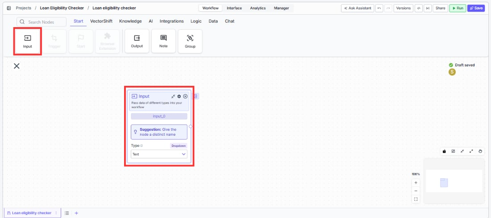

VectorShift forms support many input types beyond plain text. Depending on what your workflow needs, you can set an input to accept a file, an image, an audio recording, a number, a date, a toggle, a knowledge base, and more. To change the type, click the Type dropdown on the Input node and select what fits your use case.

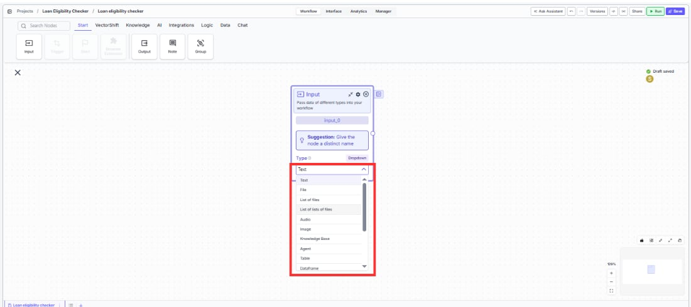

### Adding your processing node

Go to the AI tab and drag in an OpenAI or Anthropic node.

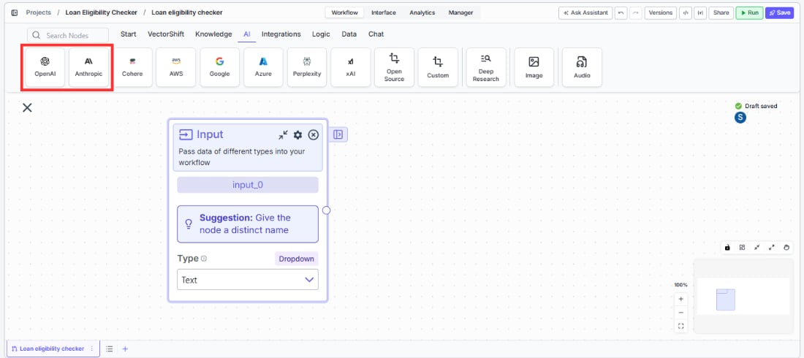

This is where the analysis happens. In the System Instructions field, tell the model exactly what you want it to do. For our analyzer:

*"You are a loan assessment specialist. Read the client profile below and return two things: an eligibility status (Approved, Conditional, or Declined) based on the financial information provided, and a recommended next step in 2 to 3 sentences that a loan officer can share directly with the client."*

In the Prompt field, reference your input node using double curly braces: `{{client_profile.text}}`

Connect the Input node to the AI node by dragging a line from the output handle of the Input node to the input handle of the AI node.

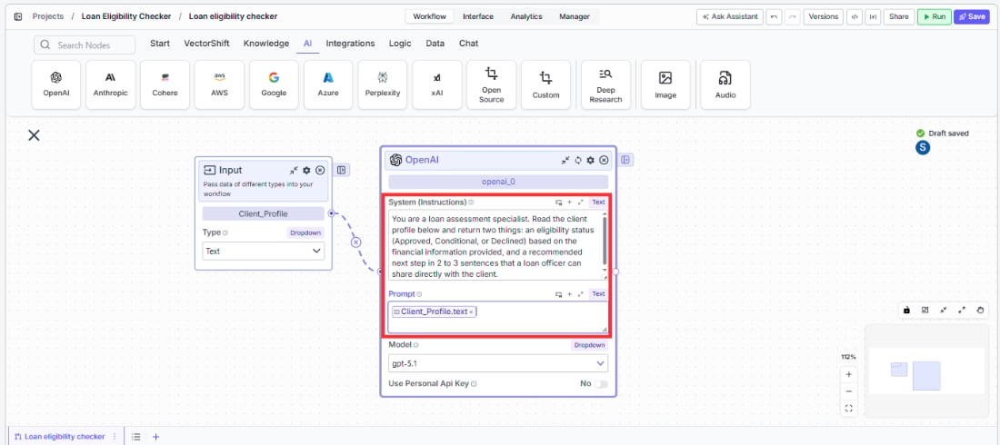

<Tip>The more specific your system instructions, the more consistent your output will be. If you want the priority level to always appear on its own line before the resolution, say that explicitly in your instructions.</Tip>

Your processing node does not have to be an AI node. You can use any node your workflow needs: an API call, a database lookup, a data transformation, or a combination of several nodes chained together.

### Adding your Output node

Go back to the Start tab and drag an Output node onto the canvas. Connect the AI node to the Output node. In the Output field, reference the AI node's response: `{{openai_0.response}}`

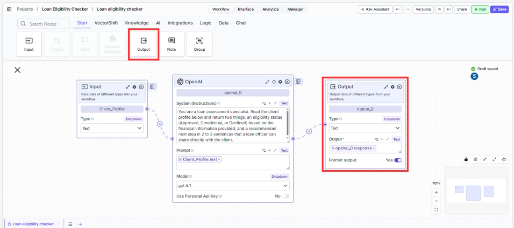

<Warning>You must have at least one Input node and at least one Output node connected before you can attach a form interface. If either is missing, the Form option will not be available in the Interface tab.</Warning>

Click the green Run button in the top right and paste a test complaint to confirm your workflow is returning sensible results before moving on.

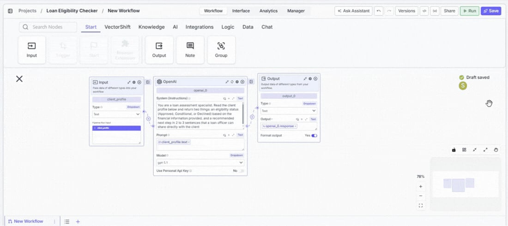

## Step 3. Attach the form interface

Once your workflow is running correctly, click "Interface" in the top navigation bar.

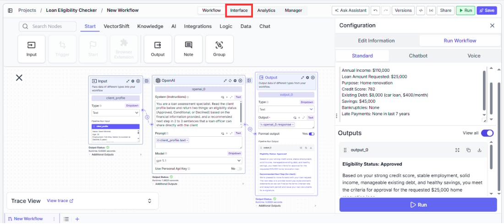

You will see three interface options. Select Form.

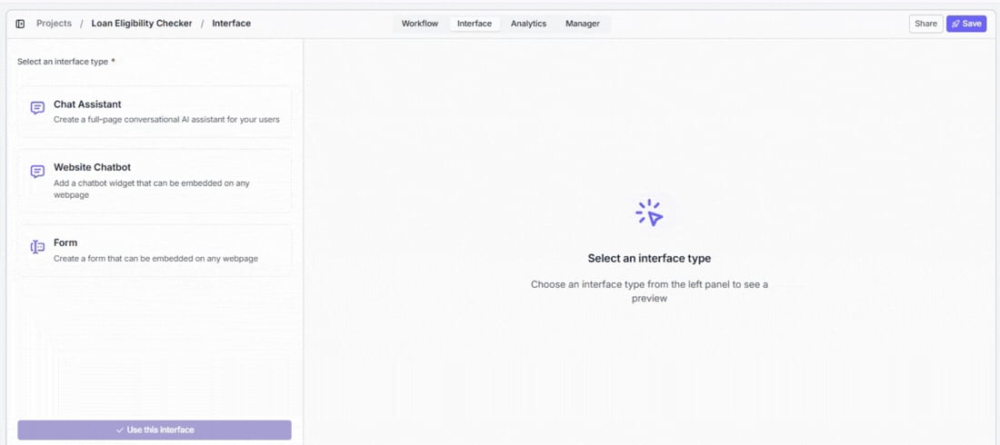

A workflow selector appears below. Find "Loan Eligibility Checker" in the list and click it. A live preview of your form appears on the right. VectorShift automatically pulls in your Input and Output nodes and renders them as form fields.

When you are happy with what you see, click the blue "Use this interface" button at the bottom of the left panel.

## Step 4. Deploy your form

After clicking "Use this interface", VectorShift creates your form and takes you to the form editor. A URL appears at the top of the screen. This is your live form link.

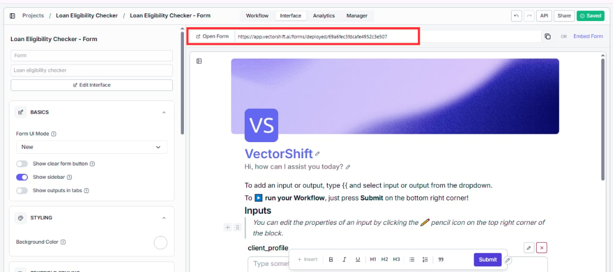

Click "Open Form" to see exactly what your users will see. Paste in a real complaint and hit Submit to confirm everything is working end to end.

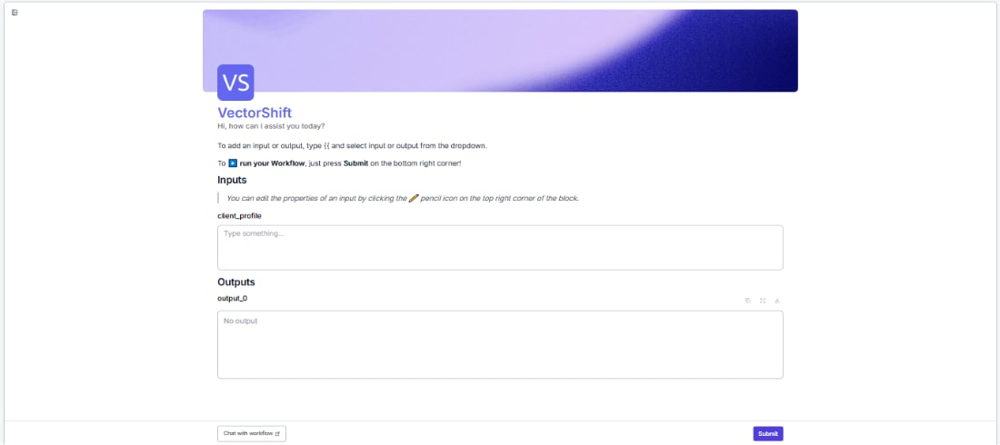

When you click Submit, a progress bar appears while your workflow processes the submission. For simple workflows this takes a second or two. For workflows that call external APIs or run multiple AI nodes, it may take longer. Once the run completes, the output appears below the input fields.

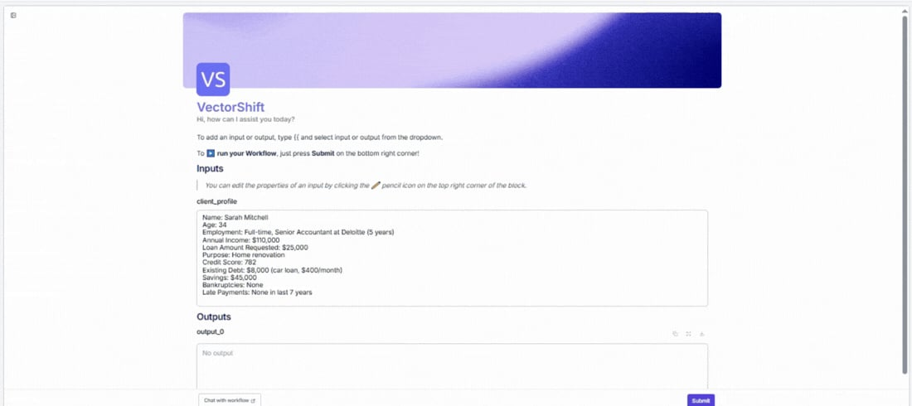

If something goes wrong during processing, an error message will appear in the form letting you know the run did not complete. If this happens, go to the Analytics tab and check the Form Responses table to see exactly where the failure occurred.

<Tip>Share the link with one person on your team before rolling it out to everyone. A quick round of real-world testing almost always surfaces something worth fixing before a wider launch.</Tip>

<Warning>Both creating and deploying a form count against your plan's usage limits. If you hit a limit, you will see a usage exceeded error. Check your plan limits in your account settings if this happens.</Warning>

## Other forms you can build the same way

Once you have built the support ticket analyzer, every other form follows the exact same steps. Here are some to try next:

* **Portfolio risk analyzer**: Analyst pastes a portfolio summary, the form returns a risk rating and a plain English breakdown of the top risk factors
* **Regulatory compliance checker**: Compliance officer submits a policy document or transaction description, the form checks it against applicable regulations and returns a pass, flag, or fail status with reasoning
* **Financial report summarizer**: User uploads or pastes a quarterly report, the form returns a concise executive summary with key figures highlighted
* **Investment memo generator**: Analyst provides a company name, sector, and thesis, the form returns a structured investment memo ready for review
* **Client onboarding form**: Relationship manager enters client details and investment goals, the form returns a recommended account type and onboarding checklist
* **Budget variance explainer**: Finance team member pastes actual vs. budget figures, the form returns a plain English explanation of the variances and suggested actions
