> ## Documentation Index
> Fetch the complete documentation index at: https://docs.vectorshift.ai/llms.txt
> Use this file to discover all available pages before exploring further.

# Personalizing Your Form

> Customize the layout, styling, security, and editing experience of your form

Your form is live but right now it looks like every other VectorShift form. This page walks you through every option available to make it feel like yours, from the layout to the colors to who can access it.

Everything you need is in the left panel of the form editor. The sections run in this order from top to bottom: Basics, Styling, Textfield Styling, Security, and Chrome. We will go through each one.

## Basics

The Basics section controls the overall behavior of your form.

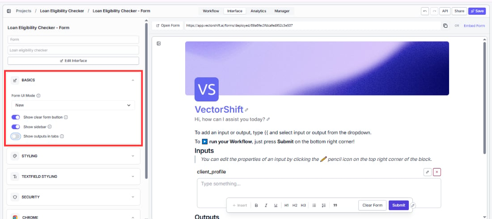

**Show clear form button** adds a button that lets users wipe all their inputs and start over. Turn this on if your form takes a lot of text input and users are likely to want to reset quickly.

**Show sidebar** displays a history sidebar on the left side of your form. When enabled, users can see their previous form submissions and results without having to resubmit. This is on by default. Turn it off if you want a cleaner, more focused experience.

**Show outputs in tabs** displays each output in a separate tab instead of stacking them vertically. This works well when your workflow produces several distinct results that you want to keep visually separate.

## Styling

The Styling section controls the overall look of the form canvas.

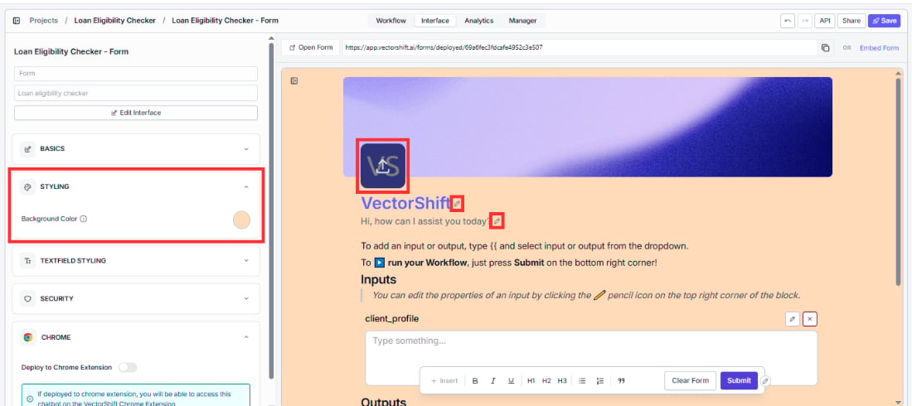

* **Background color** sets the color behind the form content. Click the color circle to open the color picker. The default is white.
* **Cover image** appears at the top of your form as a banner. Click the cover image area to open the picker. You can choose from 8 preset color options, select from a set of default images, or upload a custom image.
* **Form icon** is the logo that appears on your form alongside your title. Click it to upload your own image. The default is the VectorShift logo.

## Textfield styling

This section gives you precise control over how the text inside your form looks. Every setting has a live preview on the right so you can see changes as you make them.

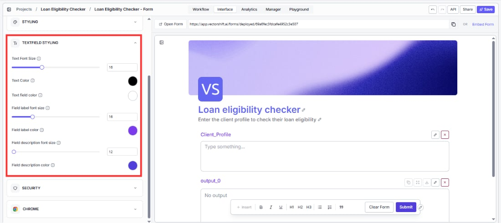

* **Text font size** controls the size of the body text in your form. Range: 12 to 24px. Default: 16.
* **Text color** sets the color of the body text. Default: black.
* **Text field color** sets the background color of the input areas where users type. Default: white.
* **Field label font size** controls the size of the label above each input field. Range: 12 to 30px. Default: 16.
* **Field label color** sets the color of those labels. Default: black.
* **Field description font size** controls the size of any description text you add beneath a field label. Range: 12 to 30px. Default: 12.
* **Field description color** sets the color of that description text. Default: black.

## Editing your form content directly

Beyond the left panel, you can also edit the form content directly on the canvas. This is where you control the text and structure your users actually see and interact with.

**Editing the title:** Click the pencil icon on the title at the top of the form preview. A popover appears with three options: Title Text, Font Size (range: 12 to 48px), and Text Color. The default title is "VectorShift". Change this to something that reflects what your form does.

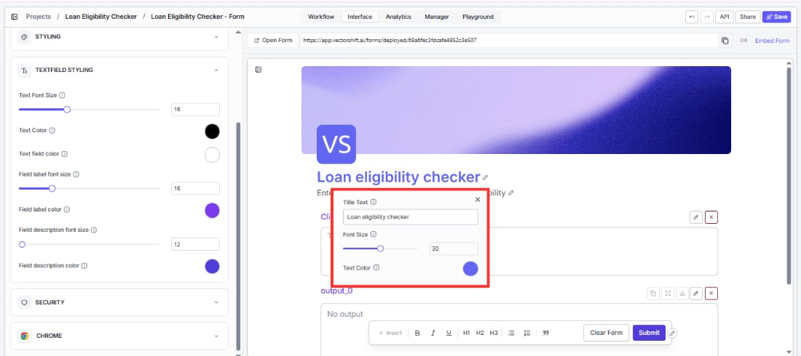

**Editing the description:** Click on the description text below the title. A popover appears with: Description Text, Font Size (range: 12 to 24px), and Text Color. The default description is "Hi, how can I assist you today?" and the default color is gray. Change both to set clear expectations for your users before they start filling out the form.

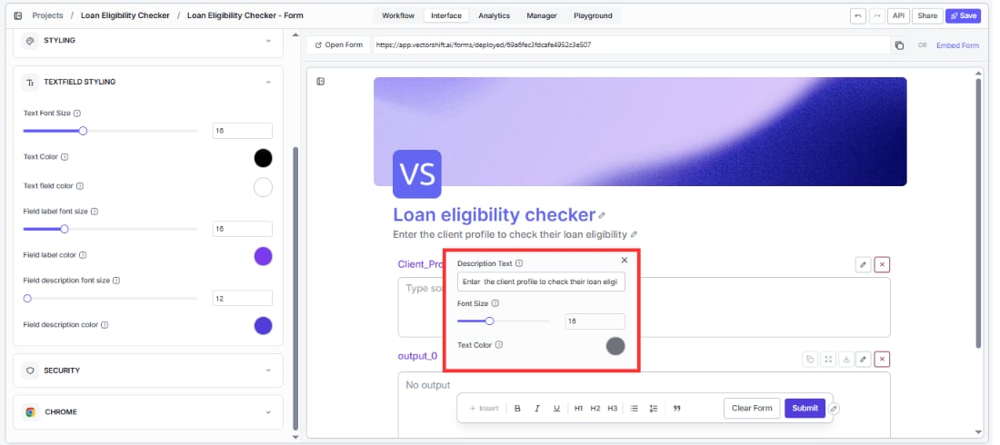

<Tip>A clear, specific description sets expectations before a user fills out a single field. For the loan eligibility checker, something like "Enter your client's financial profile to receive an instant eligibility assessment and recommended next step" tells users exactly what they are doing and what they will get back.</Tip>

**Configuring individual fields:** Click the pencil icon on any input or output block to open its configuration popover.

For input fields you can set: Field Label, Description, Placeholder text, Default Value (for text fields), whether the field is Required, and Box Height (range: 100 to 800px, default: 100px).

For output fields you can set: Field Label, Description, Placeholder text, and Box Height (range: 120 to 800px, default: 150px).

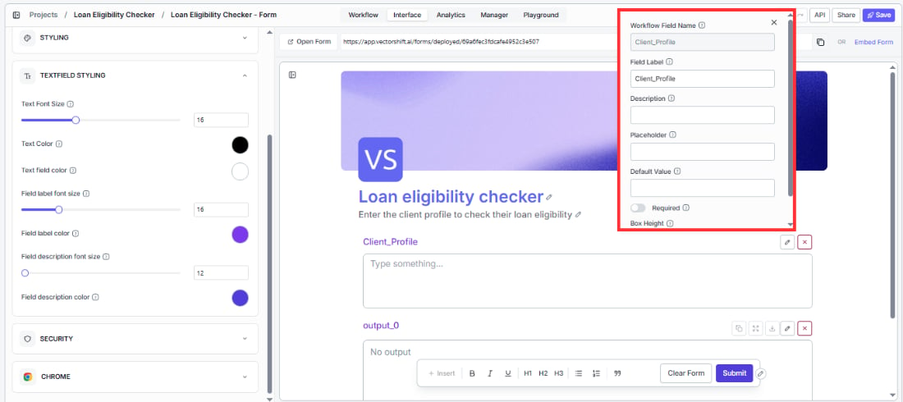

<Warning>If you mark a field as Required and a user tries to submit without filling it in, they will see a red error message beneath that field saying the field is required. Make sure your required fields have clear labels so users know what to provide.</Warning>

**Using the rich text toolbar:** At the bottom of the canvas you will see a formatting toolbar. Use this to add structure to your form content. Available options from left to right are: Insert, Bold, Italic, Underline, H1, H2, H3, Bulleted List, Numbered List, and Blockquote.

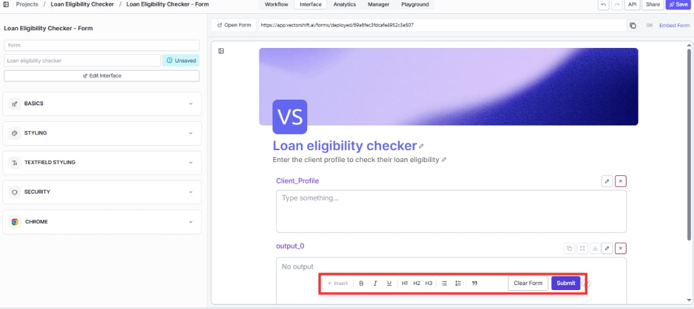

The Insert button is especially useful. Click it to insert a form input or output variable directly into your content. This lets you reference field values inside instructions or headings on the canvas itself.

**Editing the Submit button:** Click the pencil icon on the Submit button in the form preview to open its configuration popover. You can change: Button Text, Background Color, Text Color, Text Size (range: 12 to 24px, default: 13px), and Border Radius (range: 0 to 24px, default: 4px).

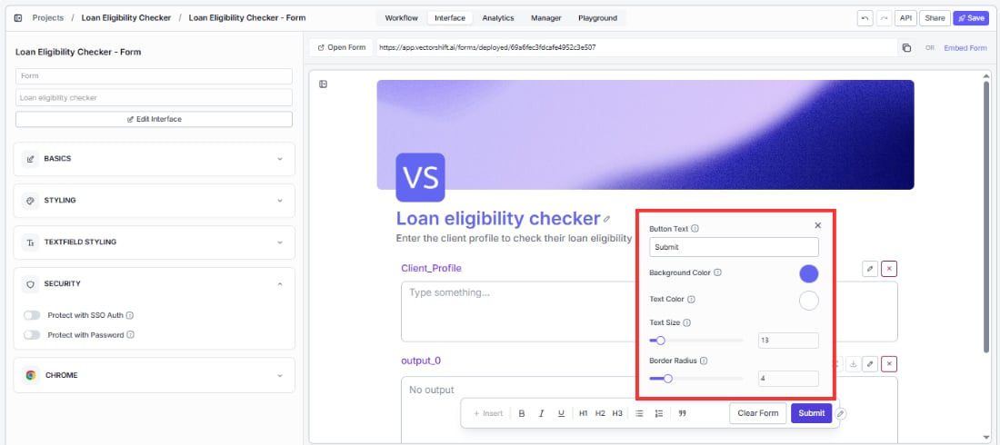

## Security

The Security section controls who can access your form.

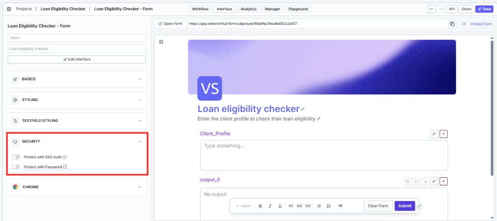

<Warning>SSO and Password protection are mutually exclusive. Enabling one will automatically disable the other. Decide which approach fits your use case before configuring either one.</Warning>

**Protect with SSO Auth** restricts access to users who sign in with your organization's work email through Single Sign-On. When this is on, VectorShift applies the same identity and access rules from your organization to the form, so only verified team members can open it. Use this when you want to keep the form internal and tied to real employee accounts.

When SSO is enabled, a third option appears: **Enable Auto Redirect**. When turned on, users who open the form are sent directly to your organization's enterprise login page instead of the VectorShift login page first.

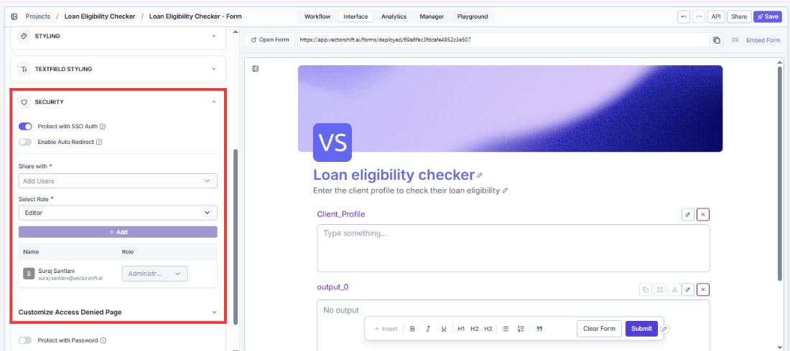

You can also expand the **Customize Access Denied Page** section to change the text users see if they try to access the form without the right permissions. You can set a custom permission message and contact text.

<Warning>Make sure your organization has SSO configured in VectorShift settings before enabling this. Turning it on without SSO set up will lock everyone out of the form.</Warning>

**Protect with Password** requires anyone opening the form to enter a password before they can see it. Set a password and share it with the people who need access.

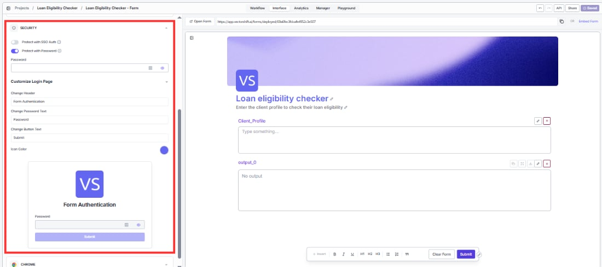

When Password is enabled, expand the **Customize Login Page** section to control what the password prompt looks like. You can change the login header (default: "Form Authentication"), the password field label (default: "Password"), the login button text (default: "Submit"), and the accent color.

## Chrome

The Chrome section lets you deploy your form directly to the VectorShift Chrome Extension.

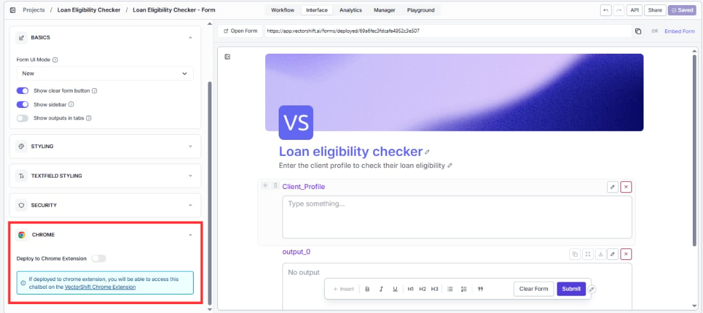

**Deploy to Chrome Extension** makes your form available inside the VectorShift Chrome Extension. Once deployed, users who have the extension installed can access and run your form directly from their browser without opening VectorShift.

<Tip>This is especially useful for forms your team uses repeatedly while browsing, like a financial report summarizer, a regulatory lookup tool, or a client briefing generator. Instead of switching tabs, they can run the form right where they are.</Tip>
