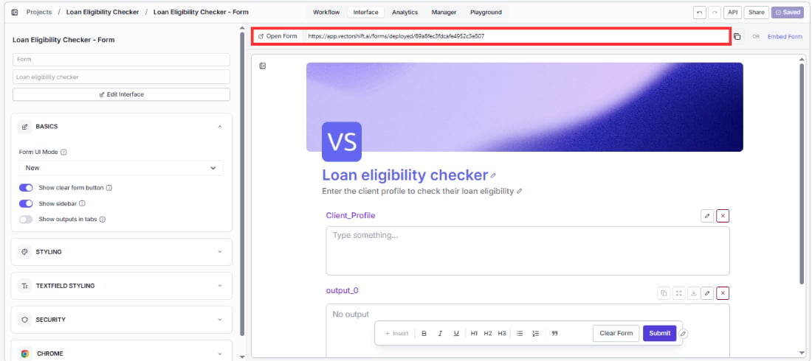
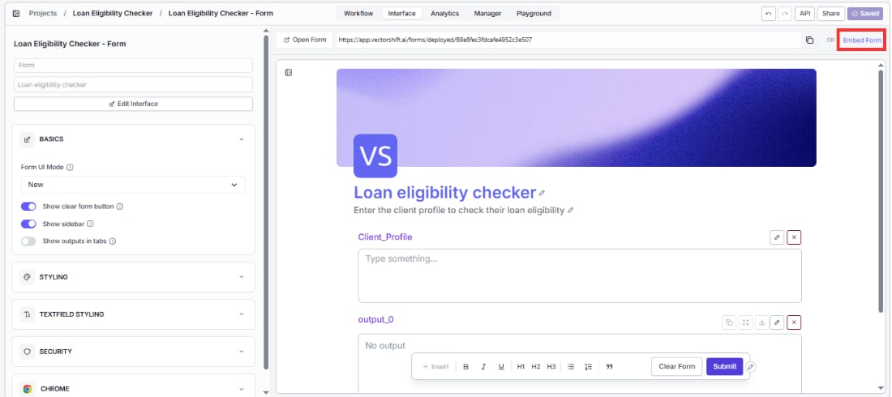
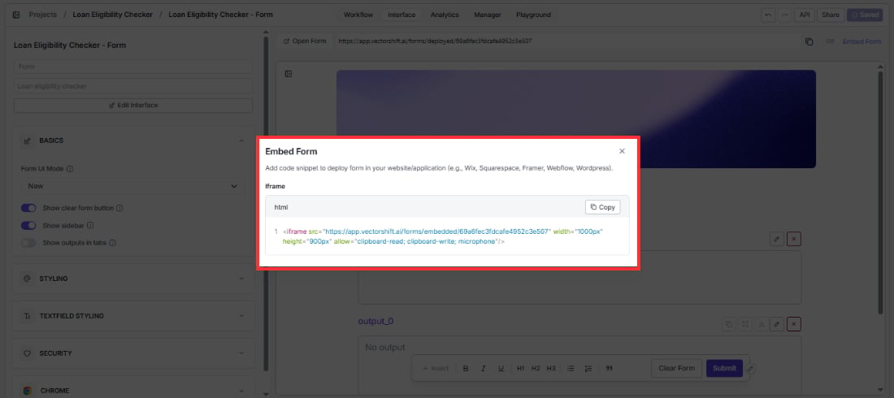
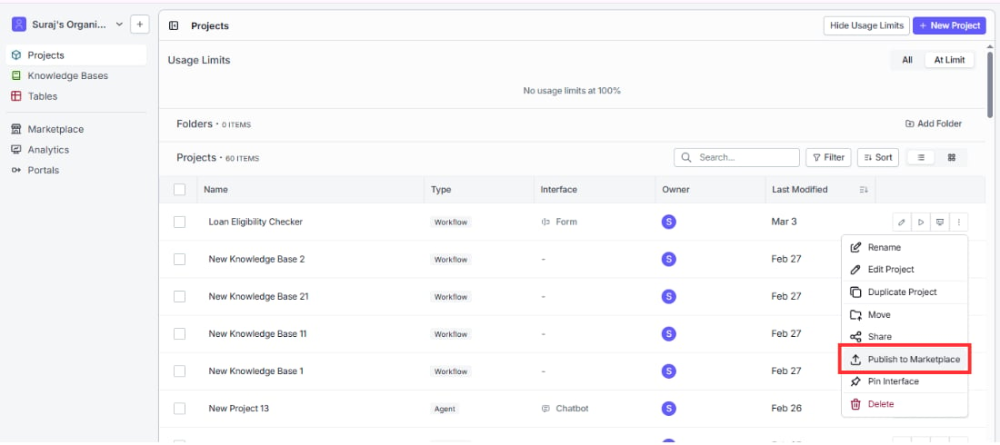
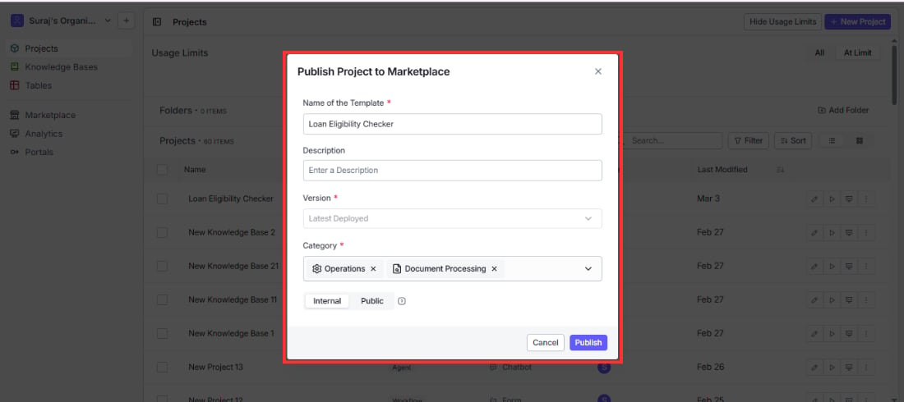
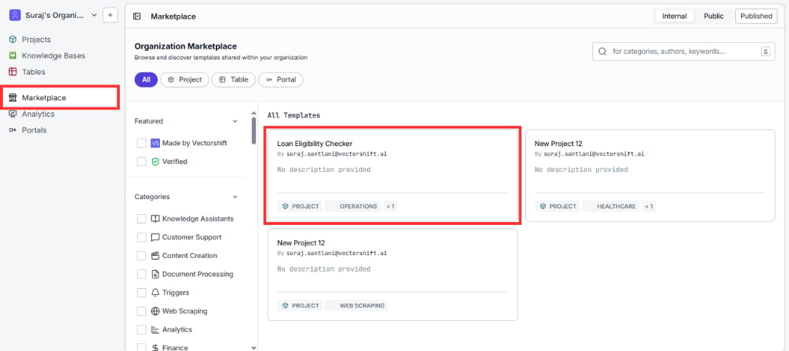
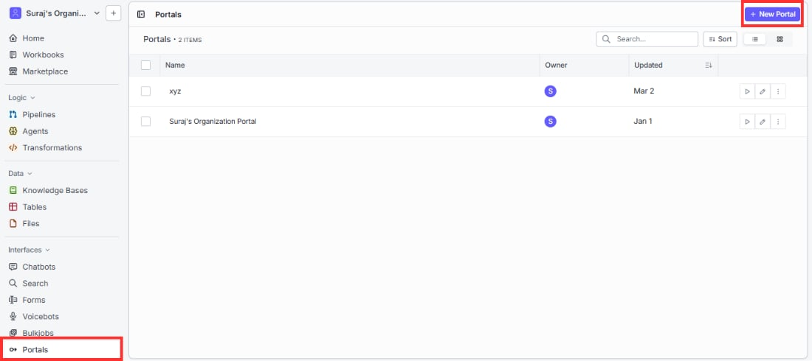
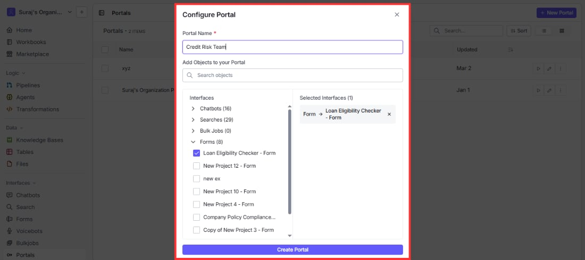
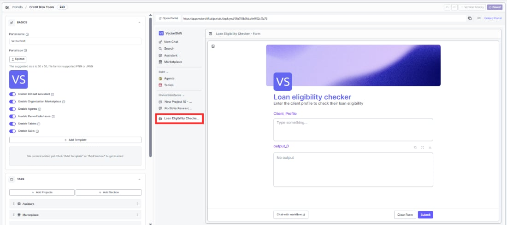
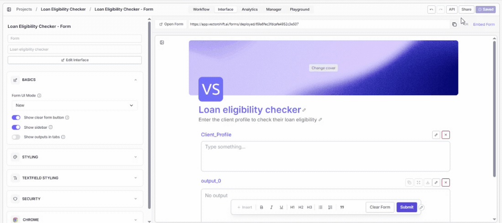

> ## Documentation Index
> Fetch the complete documentation index at: https://docs.vectorshift.ai/llms.txt
> Use this file to discover all available pages before exploring further.

# Sharing Your Form

> Share the link, embed on your site, publish to the marketplace, deploy to portals, and more

Your form is deployed and ready. This page covers every way you can get it in front of the people who need it.

## Opening and copying your form link

At the top of the form editor, you will see a URL bar showing your form's deployed address. This is your direct link. Anyone who has it can open your form in their browser right away.

Click the copy icon on the right side of the URL bar to copy the link. Share it over email, Slack, a company portal, or anywhere else your users will see it.

To check what your users will see before sharing, click "Open Form" on the left side of the top bar. This opens your live form in a new tab exactly as your users will experience it.

<Tip>Make it a habit to click Open Form and do a quick test run after every change. What looks right in the editor preview does not always match the live version perfectly.</Tip>

## Embedding your form on a website

If you want the form to live on a webpage rather than as a standalone link, click "Embed Form" on the right side of the top bar.

A dialog will appear with an iframe code snippet ready to copy.

Copy the code and paste it into your website wherever you want the form to appear. This works on Wix, Squarespace, Framer, Webflow, WordPress, and any platform that lets you add custom HTML.

You can adjust the width and height values directly in the code to fit your layout.

## Publishing to the internal marketplace

If you want teammates inside your organization to discover and use your form without you having to share a link manually, publish it to the marketplace.

To publish your form:

1. Switch to Builder view by clicking your organization name in the top left, hovering over Switch View, and selecting Builder
2. Go to Projects in the left sidebar
3. Find your form's project in the list and click the three-dot menu on the right side of its row
4. Select Publish to Marketplace

5. In the Publish Project to Marketplace dialog, fill in the following fields:
   * **Name of the Template** (required): The name that will appear in the marketplace. Defaults to your project name
   * **Description**: A short description of what the form does
   * **Version** (required): Which version to publish. Defaults to Latest Deployed
   * **Category** (required): Select one or more categories from the list: Knowledge Assistants, Customer Support, Content Creation, Document Processing, Triggers, Web Scraping, Analytics, Finance, Healthcare, Operations, Education, Legal
   * **Internal / Public**: Choose Internal to make it visible only within your organization, or Public to make it available to everyone on VectorShift

6. Click Publish

Once published, you will see a green "Your item has been published to the marketplace" confirmation at the bottom of the screen.

<Tip>Select the Finance category if your form is built for financial use cases. This makes it easier for teammates browsing the marketplace to find it alongside other finance tools.</Tip>

## Deploying to a portal

A portal is a dedicated workspace you configure and assign to specific users. When those users log in, they see only the tools and interfaces you have included, with no access to the broader VectorShift workspace. Adding your form to a portal is how you put it directly in front of end users.

To add your form to a portal:

1. Go to Portals in the left sidebar under Interfaces
2. Click an existing portal to open it, or click New Portal in the top right to create one

3. In the Configure Portal dialog, enter a Portal Name
4. Under Add Objects to your Portal, expand the Forms category or search for your form by name
5. Check the box next to your form to add it to the Selected Interfaces panel on the right
6. Click the button at the bottom to save

Once your form is added, the portal editor opens. In the left panel under Basics you will see configuration options. Make sure **Enable Pinned Interfaces** is toggled on so your form appears in the Pinned Interfaces section of the portal sidebar for your users.

To make the portal live, click Changes Deployed in the top right. A deployed URL appears at the top that you can share directly with your users, or click Embed Portal to get an iframe snippet for embedding it on a webpage.

<Tip>A portal can contain multiple interfaces side by side. For example, a loan officer portal might include a loan eligibility checker, a document summarizer, and a client briefing generator all accessible from the same sidebar. Users switch between them without ever leaving the portal.</Tip>

## Running your form through the API

If you want to trigger your form programmatically from your own application, click the "API" button in the top right corner of the form editor.

This opens the API reference for your specific form, including the endpoint, authentication details, and example code in multiple languages. Use this when you want to integrate your form into a product, automate submissions, or build a custom front end on top of your workflow.

<Tip>If you are sharing your form publicly, keep in mind that anonymous form runs are subject to rate limiting. If you expect high submission volume, consider using the API with authentication instead of the public link.</Tip>

## Deploying to the Chrome Extension

If you turned on the Chrome Extension toggle in the Chrome section of your left panel, your form is also available inside the VectorShift Chrome Extension. Users who have the extension installed can run your form directly from their browser.
