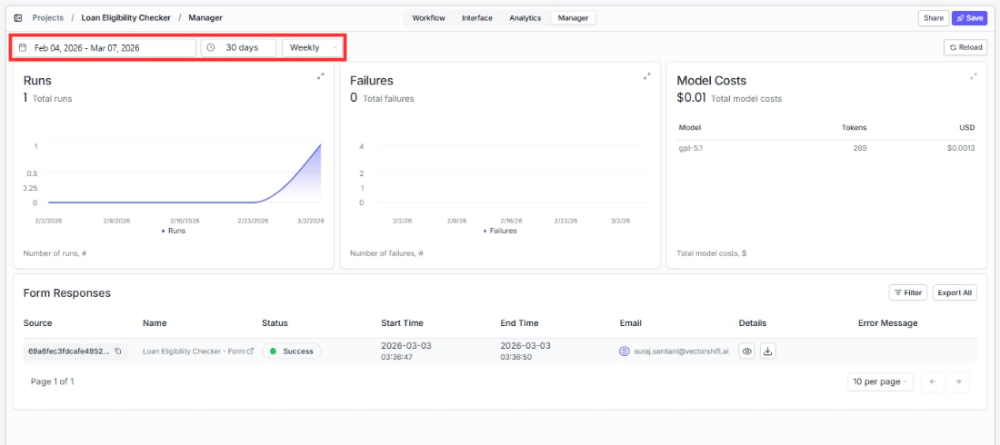
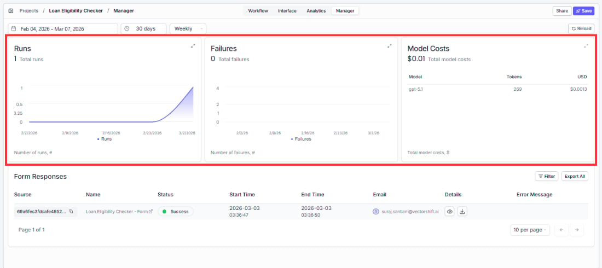
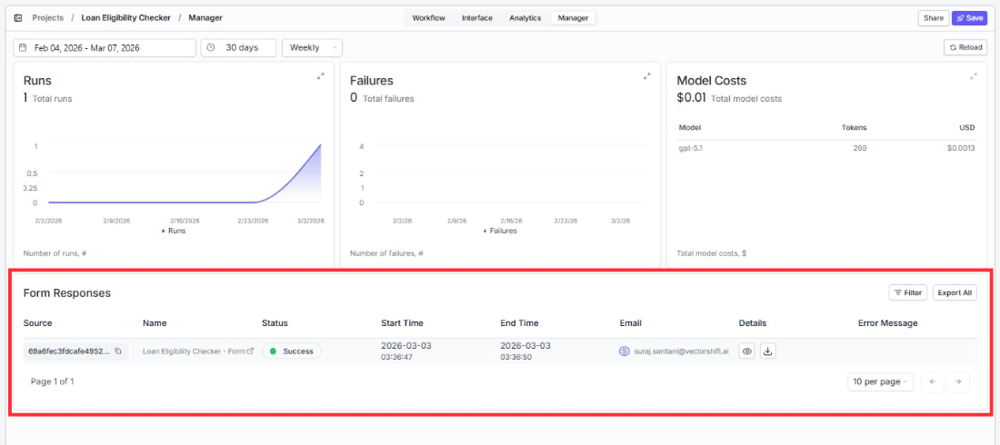
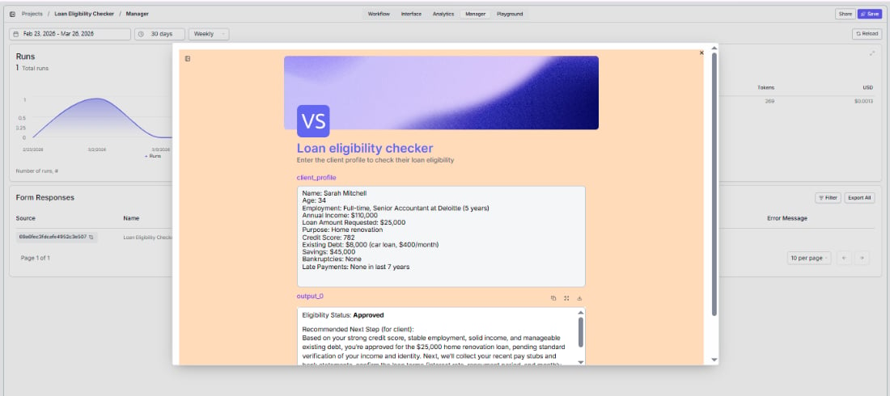

> ## Documentation Index
> Fetch the complete documentation index at: https://docs.vectorshift.ai/llms.txt
> Use this file to discover all available pages before exploring further.

# Reviewing Submissions

> View and manage what people have submitted through the Manager tab

The Manager tab gives you a view of your form activity from a submissions perspective. Where Analytics tells you how your workflow is running, Manager tells you what people are submitting and what results they are getting.

Get to it by clicking "Manager" in the top navigation bar of your project.

## Filters and time range

At the top of the Manager tab you will find a date range picker defaulting to the last 30 days and a Weekly toggle next to it. Use these to focus on a specific time window.

Click Reload to make sure you are seeing the latest data.

## Summary cards

At the top of the Manager tab you will see three summary cards side by side: Runs, Failures, and Model Costs. These give you the same top-line numbers as Analytics but viewed from the submissions perspective.

If Failures are unexpectedly high relative to Runs, go to the Analytics tab and look at the Form Responses table to find out what is going wrong.

## Form responses

Below the summary cards is the submissions table. Each row represents one form submission. Here is what each column tells you:

* **Source** shows where the submission came from, for example a direct link, an embedded form, or an API call.
* **Name** shows the form or workflow name associated with that submission.
* **Status** shows whether the run completed successfully or failed.
* **Start Time** shows when the submission was received.
* **End Time** shows when the run finished processing.
* **Email** shows the email address of the user who submitted the form, if they were logged in.
* **Error Message** shows the error detail if the run failed. Use this column to quickly identify what went wrong on a specific submission without having to dig into the full trace.
* **Details** is a clickable link that opens the full run details for that submission, including inputs, outputs, and the trace through each node.

<Tip>Filter by Status: Failure to focus only on submissions that need attention. The Error Message column will tell you at a glance what went wrong for each one.</Tip>

<Tip>If you need to follow up with a specific user about their submission, the Email column is your quickest way to find them.</Tip>

To download the output from a specific submission, open the Details view for that row and look for the download option. You can save outputs as PDF, TXT, DOCX, or CSV depending on what your workflow produces.
