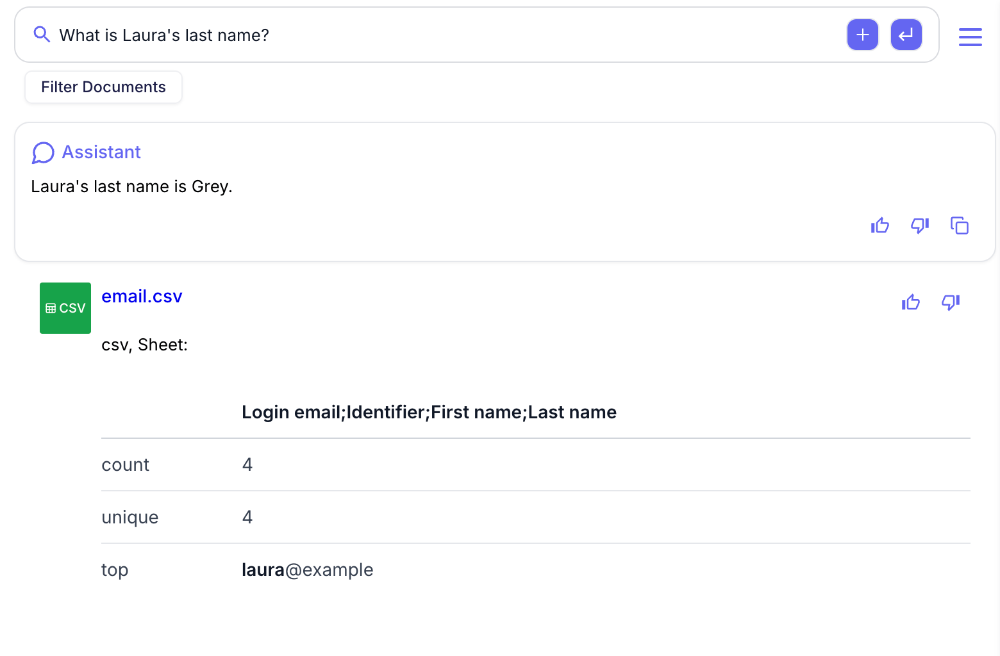
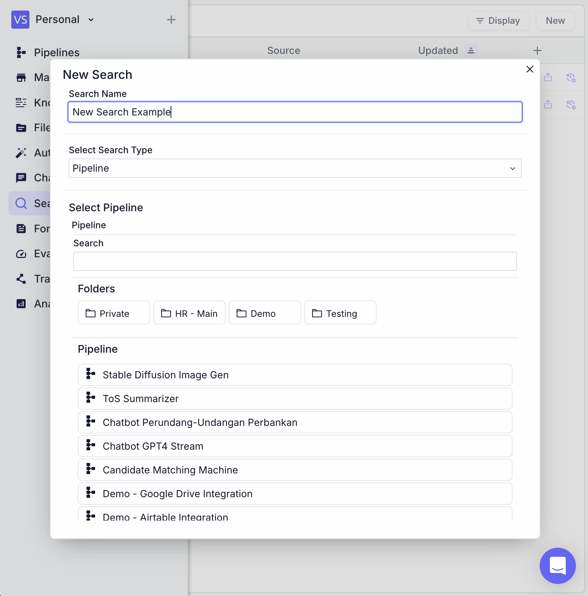
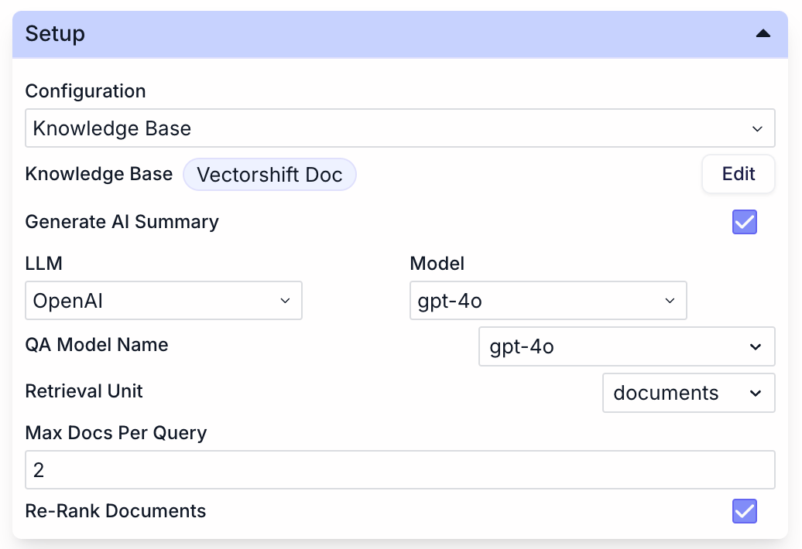
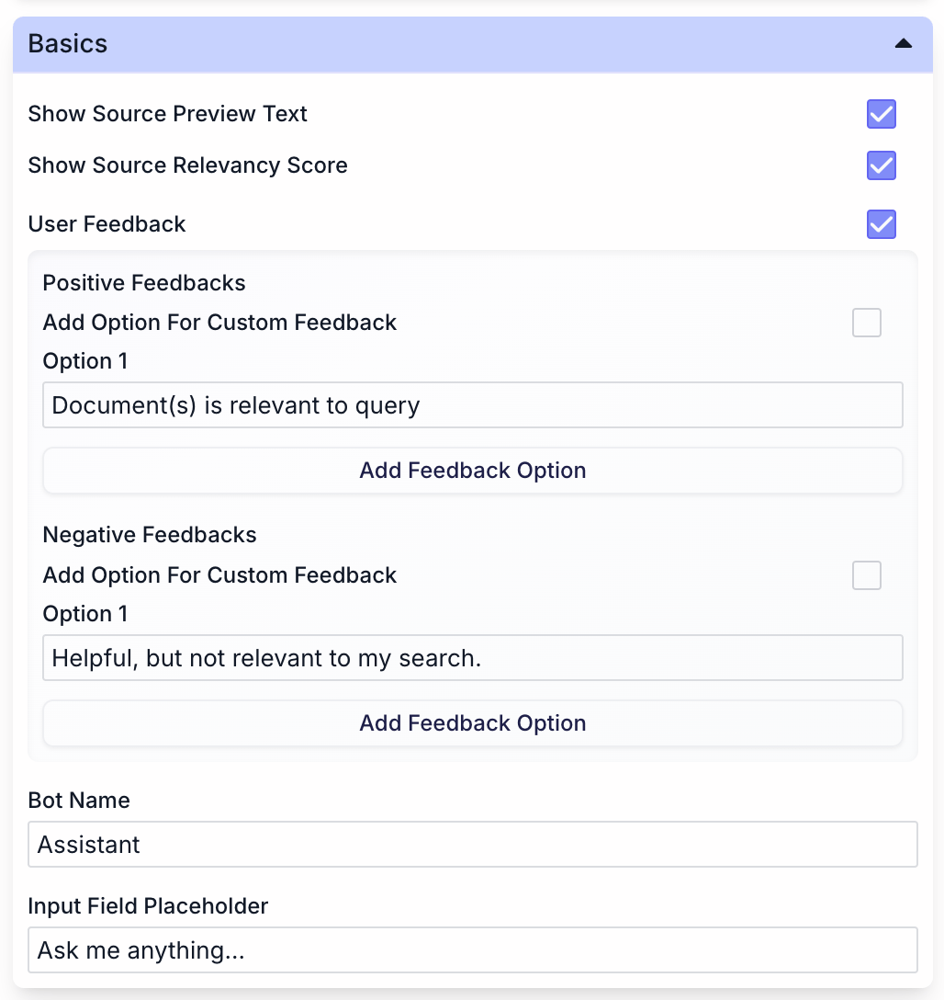
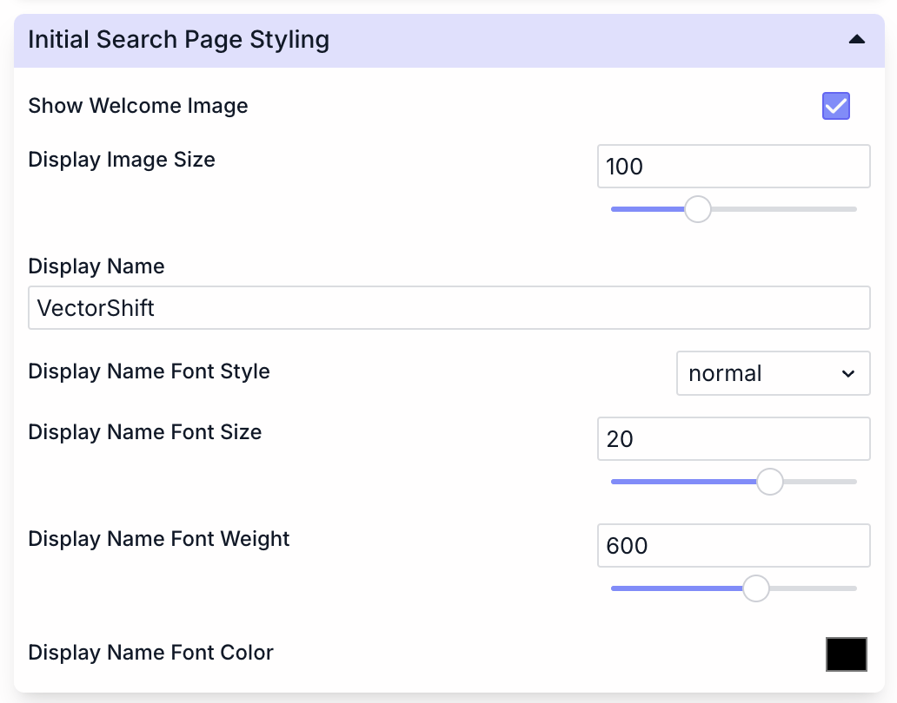
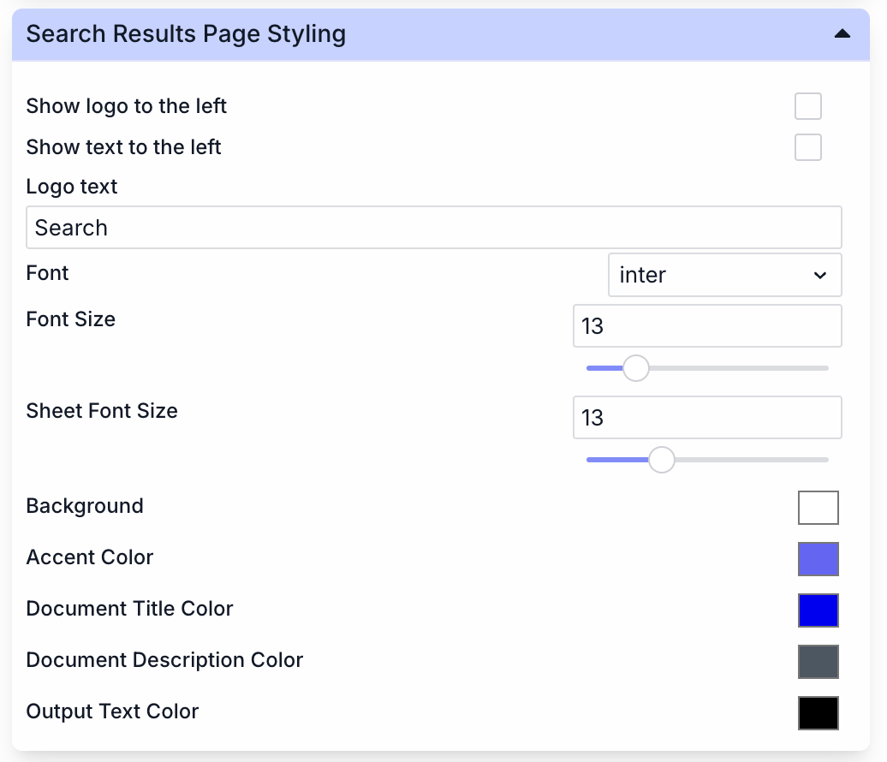
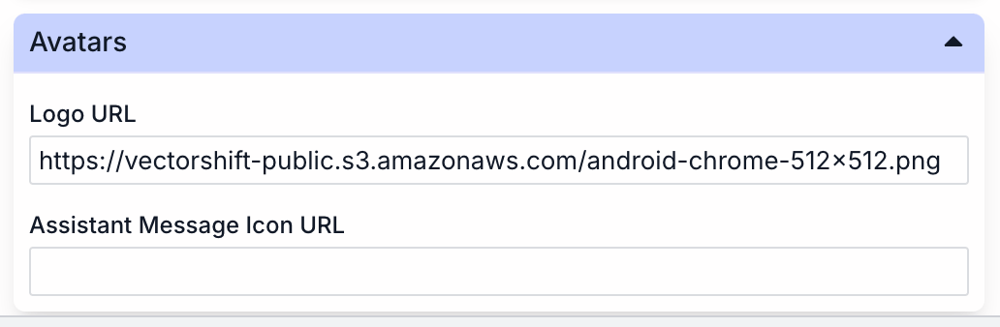
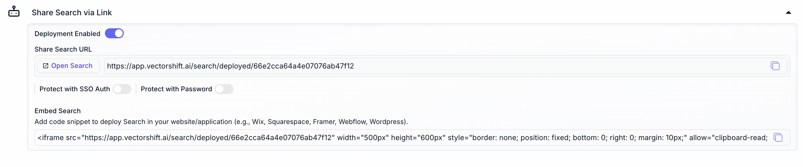

> ## Documentation Index
> Fetch the complete documentation index at: https://docs.vectorshift.ai/llms.txt
> Use this file to discover all available pages before exploring further.

# Search

> Build a custom search engine over your knowledge bases

Search is a powerful feature in VectorShift that allows you to ask questions and retrieve information based on your workflow or knowledge base.
With Search, you can quickly find answers and insights without having to manually sift through large amounts of data.
When you use Search, you can:

* Ask questions in natural language
* Get relevant answers from your workflow or knowledge base
* Explore connections between different pieces of information
* Save time by quickly accessing the information you need
* Choose to search within a specific workflow or knowledge base

Search uses advanced algorithms to understand your query and match it with the most relevant information in your data.
This makes it an invaluable tool for decision-making, problem-solving, and gaining deeper insights into your projects.

## Create a new Search Interface

To create a new search in VectorShift, follow these steps:

1. Navigate to the Search section in the left sidebar.
2. Click the "New" button on the top-right side to open the "New Search" dialog.
3. Enter a name for your search in the "Search Name" field. Choose a descriptive name that reflects the purpose of your search, such as "New Search Example".
4. Select a Knowledge Base.
5. Once you've configured all the settings, click the "Create" or "Save" button (not visible in the image) to create your new search.

## Configuration

* **Generate AI Summary:** Toggle this option to automatically generate summaries of search results using AI.

### Basics

* **Show Source Preview Text:** Enable this option to display a preview of the source text in search results. This helps users quickly assess the relevance of each result.
* **Show Source Relevancy Score:** Turn this on to display a relevancy score for each search result. This score indicates how closely the result matches the user's query.
* **User Feedback:** Enable the User Feedback option to collect valuable insights from users about their search experience.
* **Positive Feedback:** Configure options for positive user feedback.
* **Negative Feedback:** Configure options for negative user feedback.
* **Bot Customization:** Enter a name for your search assistant.
* **User Interface:** Customize the placeholder text in the search input field.

### Initial Search Page Styling

You can personalize the initial search page to create a welcoming and branded experience:

* **Show Welcome Image:** Toggle this option to display a welcome image on the search page.
* **Display Image Size:** Adjust the size of the welcome image using the slider.
* **Display Name:** Enter the name you want to show on the search page.
* **Display Name Font Style:** Choose from various font styles.
* **Display Name Font Size:** Set the font size for the display name.
* **Display Name Font Weight:** Adjust the font weight.
* **Display Name Font Color:** Select a color for the display name text.

### Search Results Page Styling

You can customize the appearance of the search results page:

* **Logo and Text:** Choose to show a logo and text on the left side of the page.
* **Logo Text:** Set the text that appears as the logo (default is "Search").
* **Font:** Select the font for the search results page (currently set to "inter").
* **Font Size:** Adjust the main font size (set to 13).
* **Sheet Font Size:** Set the font size for sheet elements (also set to 13).
* **Colors:** Customize various color elements.

### Avatars

* Logo URL: Set the URL for your logo. The current logo is set to "[https://vectorshift-public.s3.amazonaws.com/android-chrome-512×512.png](https://vectorshift-public.s3.amazonaws.com/android-chrome-512×512.png)".
* Assistant Message Icon URL: You can add a custom icon for the assistant's messages by entering a URL in this field.

## Export

### Share Search via Link

You can easily share your search with others:

* **Deployment Enabled:** Toggle this switch to enable or disable sharing.
* **Share Search URL:** A unique URL is generated for your search. You can copy this link to share with others or use the "Open Search" button to test it.
* **Security Options:**
  * **Protect with SSO Auth:** Enable this for Single Sign-On authentication.
  * **Protect with Password:** Set a password for accessing the shared search.

### Embed Search

To integrate the search into your website or application:

* Use the provided iframe code snippet to embed the search functionality.
* The code is compatible with various platforms like Wix, Squarespace, Framer, Webflow, and WordPress.
