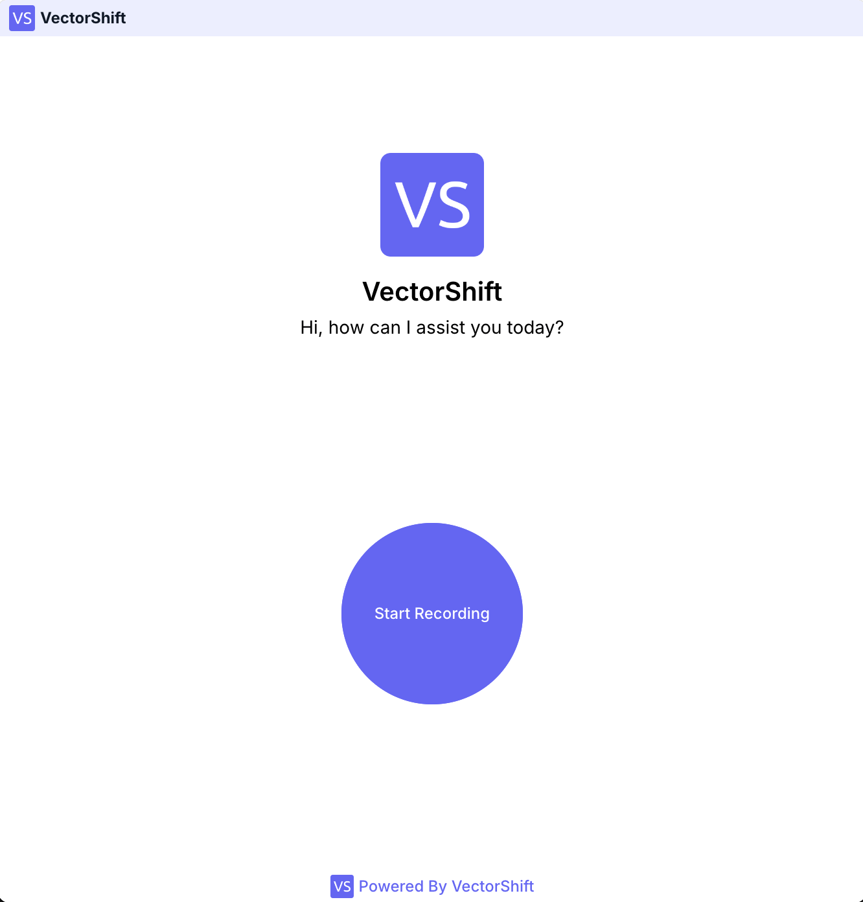
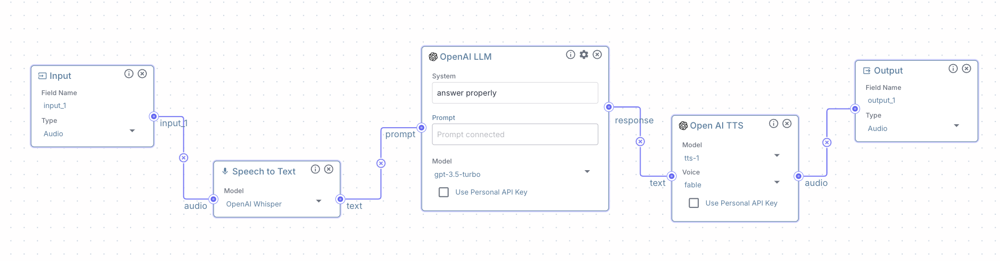
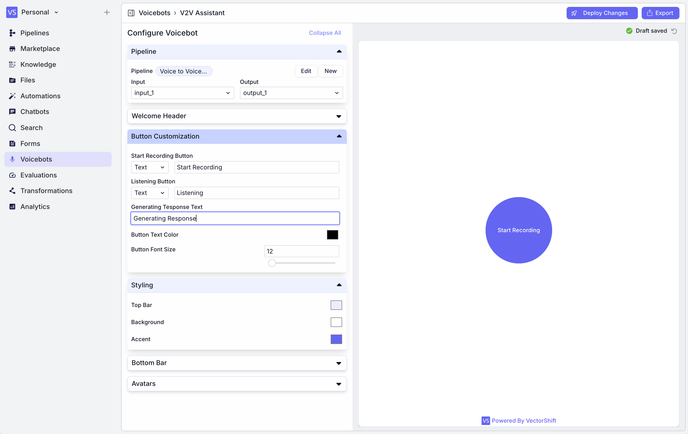
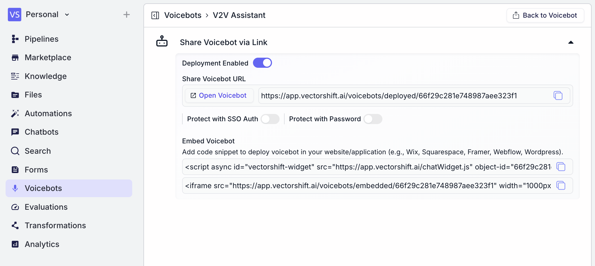

> ## Documentation Index
> Fetch the complete documentation index at: https://docs.vectorshift.ai/llms.txt
> Use this file to discover all available pages before exploring further.

# Voicebots

> Interact with your workflows in real-time using voice

Voicebots are AI-powered virtual agents that can engage in voice conversations with users.
They combine speech recognition, natural language processing, and text-to-speech technologies to provide automated voice interactions.

<Note>
  Only workflows with audio input and output can be assigned as voicebot.
</Note>

## Create a new Voicebot

To create a new voicebot, take the following steps:

1. Go to the "Voicebots" menu, and click "New" on the top-right side of the window.
2. Name your voicebot and select a workflow to work on. You can only choose a workflow with audio input and output.
3. Customize your voicebot UI.

## Configuration

### Workflow

The workflow settings allow you to configure the input and output for your voicebot:

* **Workflow:** Choose a workflow to make it a Voicebot. Only a workflow with audio input/output can be selected.
* **Input:** Select a node from the dropdown to specify the audio input source.
* **Output:** Choose a node from the dropdown to define where the voicebot's responses will be directed.

### Welcome Header

The Welcome Header section lets you customize the initial appearance and message of your voicebot:

* **Show Top Bar:** Enable this to display a top bar in the voicebot interface.
* **Show Welcome Header:** Toggle this to show or hide the welcome message.
* **Show Close Icon:** Enable this to allow users to close the voicebot.
* **Display Image Size:** Adjust the slider to set the size of any displayed images.

### Welcome Header

The Welcome Header section lets you customize the initial appearance and message of your voicebot:

* **Display Name:** Enter the name of your voicebot.
* **Display Description:** Set a welcome message or brief instruction.
* **Font Styles:** Choose between normal or other styles for the name and description.
* **Display Description Alignment:** Set the alignment of the description text.
* **Font Sizes:** Adjust the font sizes for the display name and description.
* **Font Weights:** Set the boldness of the fonts for the name and description.
* **Font Colors:** Select colors for the display name and description text.

### Buttons

In the Button Customization section, you can tailor the appearance and text of various interactive elements in your voicebot interface:

* **Start Recording Button:** You can customize the text that appears on the button users click to begin speaking.
* **Listening Button:** This button's text is displayed while the voicebot is actively listening to the user's speech.
* **Generating Response Text:** This field allows you to set the text that appears while the voicebot is processing the user's input and formulating a response.
* **Button Text Color:** Choose the color of the text on your buttons.
* **Button Font Size:** Adjust the size of the text on your buttons.

### Styling

The Styling section lets you customize the overall look of your voicebot interface. You can set colors for three main elements:

* **Top Bar:** Currently set to white.
* **Background:** Also set to white.
* **Accent:** Set to a purple shade, which is used for highlights and interactive elements.

### Bottom Bar

The Bottom Bar section allows you to add and customize a footer for your voicebot interface:

* **Powered by VectorShift:** You can choose to display "Powered by VectorShift" in the bottom bar by checking this box.
* **Bottom Bar Text:** Enter any additional text you want to appear in the bottom bar.
* **Bottom Bar Redirect URL:** If you want the bottom bar to be clickable and lead to a specific webpage, enter the URL here.
* **Bottom Bar Icon URL:** You can add an icon to the bottom bar by providing a URL to the image file.

### Avatars

* **Assistant Image URL:** Enter the URL of the image you want to use as your voicebot's avatar.
* **Launcher URL:** This field is for specifying an image to be used as the launcher icon for your voicebot.

## Export

* **Deployment Enabled:** Toggle this switch to activate your voicebot.
* **Share Voicebot URL:** A unique URL is generated for your voicebot. You can click "Open Voicebot" to test it directly. Copy the URL to share it with others.
* **Protect with SSO Auth:** Enable this if you want to restrict access using Single Sign-On authentication.
* **Protect with Password:** Toggle this on to set a password for accessing your voicebot.

### Embedding your Voicebot

You can integrate the voicebot into your website or application using two methods:

1. **Script Embedding:** Use the provided `<script>` tag to add the voicebot as a widget. This method is suitable for various platforms like Wix, Squarespace, Framer, Webflow, and WordPress.
2. **iFrame Embedding:** An `<iframe>` code snippet is provided for embedding the voicebot directly into your web page. You can adjust the width and height attributes as needed.

To use either embedding method:

1. Copy the respective code snippet.
2. Paste it into the HTML of your website where you want the voicebot to appear.
3. Adjust any parameters if necessary.
