> ## Documentation Index
> Fetch the complete documentation index at: https://docs.vectorshift.ai/llms.txt
> Use this file to discover all available pages before exploring further.

# Adding Data to Your Knowledge Base

> Bring in your content from anywhere — files, integrations, URLs, and tables — so your team can search it all in one place

Once your knowledge base is created, bring in the content your team needs to search. Upload files from your computer, connect the apps your team already uses, scrape web pages, or pull in existing VectorShift data — mix and match however you like within a single knowledge base.

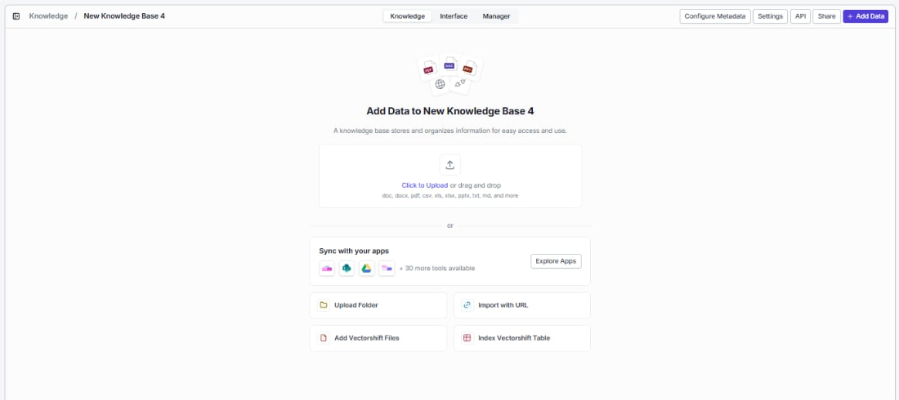

## Upload files

The fastest way to get started — drag and drop files directly into the upload zone, or click **Click to Upload** to browse your computer.

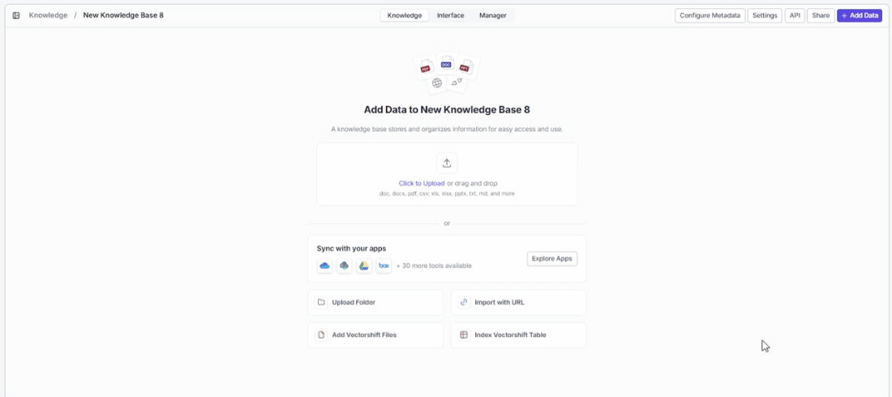

**Supported file formats:**

| Category     | Formats                                     |
| ------------ | ------------------------------------------- |
| Documents    | doc, docx, pdf, pptx, txt, md               |
| Spreadsheets | csv, xls, xlsx                              |
| Images       | JPEG, PNG, GIF, BMP, TIFF, WebP             |
| Audio        | MP3, WAV, OGG, FLAC, AAC, M4A, WMA          |
| Video        | MP4, MOV, AVI, WMV, FLV, MPEG, MKV, WebM    |
| Data         | JSON                                        |
| Archives     | ZIP (automatically extracted and processed) |

Once you select files, they appear below the upload zone with their name and file size so you can review before processing:

* Click **Delete** next to any file to remove it from the queue.
* Click **Index Files** to start processing. VectorShift automatically chunks, embeds, and indexes everything using your configured settings.

<Tip>Upload multiple files at once — drag and drop is the fastest way to add a large batch.</Tip>

<Tip>Have a ZIP archive? Just upload it directly. VectorShift automatically extracts and indexes the individual files inside.</Tip>

## Upload folder

Need to index an entire directory at once? Click **Upload Folder** to select a folder from your machine. All supported files inside are uploaded and indexed together, and the folder structure is preserved in your knowledge base for easy organization.

## Add integration

Keep your knowledge base automatically up to date by connecting the tools your team already uses. Click **Explore Apps** in the **Sync with your apps** section to browse available integrations and pull data directly into your knowledge base.

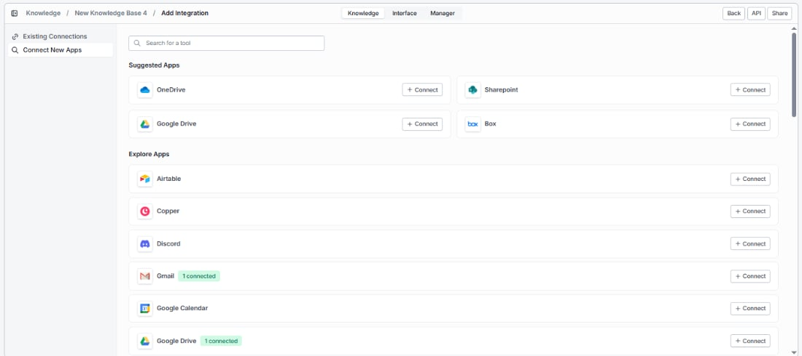

The integration page is organized into two sections:

* **Existing Connections** — apps you've already connected, showing their status (e.g., Gmail with 1 connected, Google Drive with 1 connected). Click any connected app to select which data to pull in.
* **Connect New Apps** — browse all available integrations. **Suggested Apps** appear at the top for quick access, with the full list under **Explore Apps**. Use the search bar to find a specific app, then click **+ Connect** to authenticate.

For the full list of available integrations, see the [Reference](/platform/knowledge/reference#available-integrations) page.

### Adding a new integration

Find the app you want under **Connect New Apps** and click **+ Connect**. Complete the authentication flow to grant VectorShift access, and the integration will appear under **Existing Connections** — ready to pull in data.

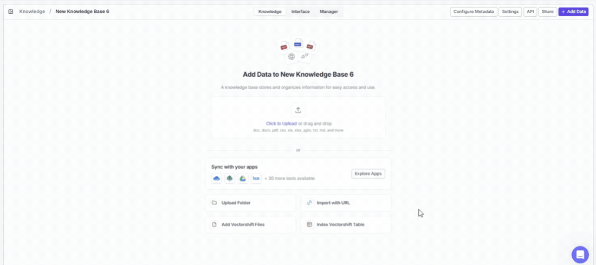

### Selecting an existing integration

Already connected an app? Click on it under **Existing Connections** to choose exactly which data to bring in — specific files, folders, channels, or other items depending on the app.

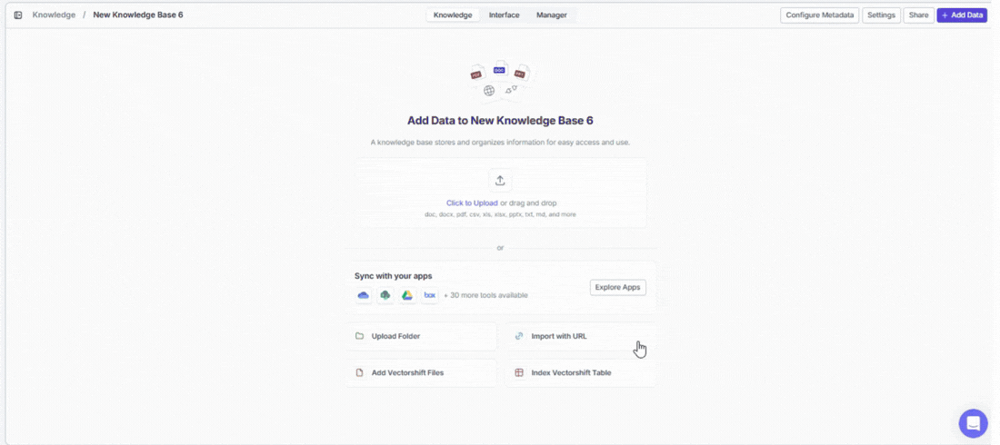

### Updating permissions

Need to expand or restrict what VectorShift can access? Click on the integration under **Existing Connections** and modify the access scope — no need to disconnect and reconnect.

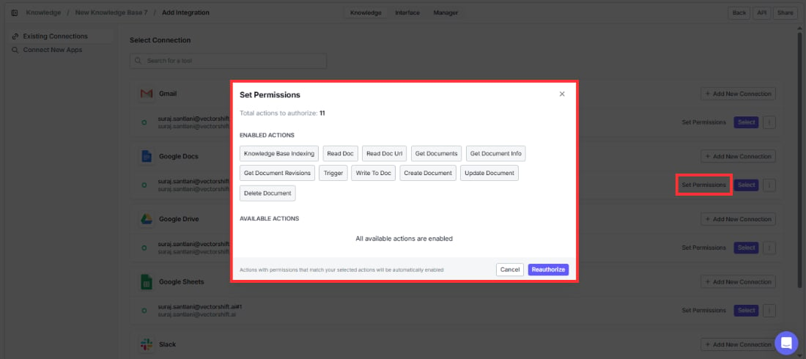

### Setting a default account

If you have multiple accounts for the same app (e.g., two Slack workspaces), set one as the default so the right data flows in automatically.

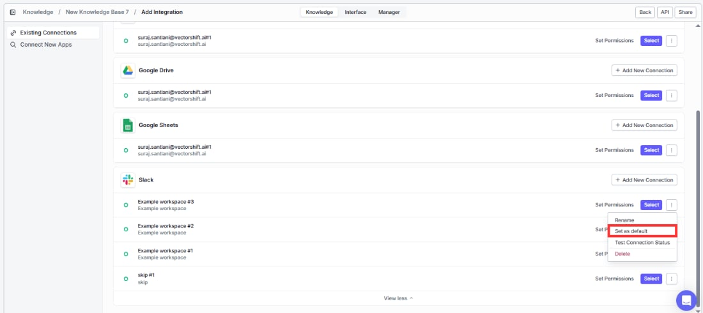

### Testing connection status

Connected integrations show the number of active connections at a glance. If a connection has issues, re-authenticate by clicking **+ Connect** again to restore the sync.

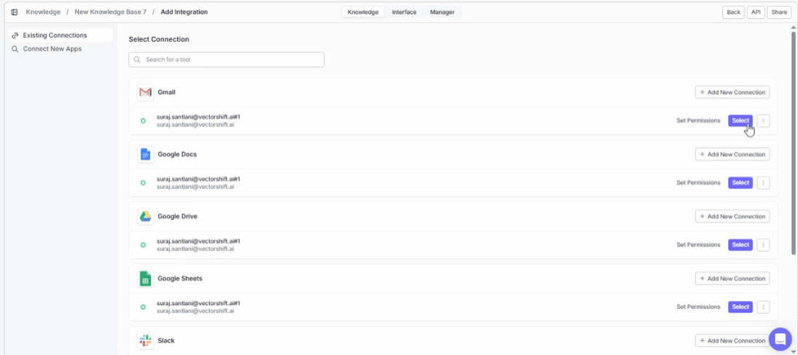

### Changing rescrape frequency

Control how often VectorShift checks for new or updated content from your integrations. More frequent syncing keeps search results fresher; less frequent syncing reduces processing load.

<Tip>Once connected, integrations stay synced automatically — so when your team adds new files to Google Drive or posts in Slack, the content becomes searchable without any manual work.</Tip>

## Import with URL

Make any web page or entire website searchable. Click **Import with URL** to scrape content and add it to your knowledge base.

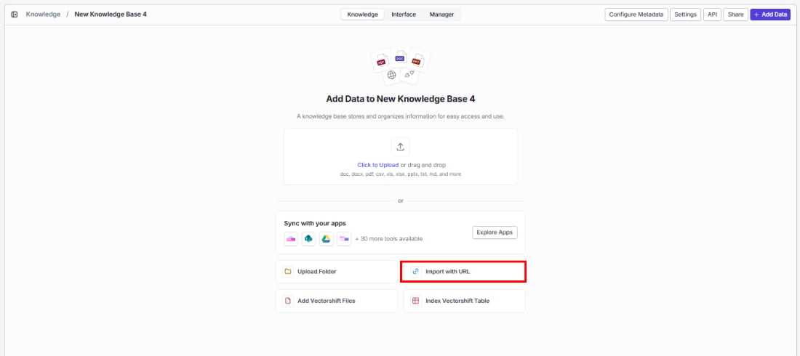

**URL** (required)

Enter the web page URL you want to scrape (e.g., [https://example.com](https://example.com)). To import multiple URLs at once, click **Upload CSV** to the right of the field and upload a CSV file containing your URLs.

**Scrape subpages**

Index an entire documentation site or blog from a single root URL. Check this box to automatically crawl and scrape all linked pages.

When you enable Scrape subpages, additional fields appear to help you scope the crawl:

| Field              | What it controls                                               | Default |
| ------------------ | -------------------------------------------------------------- | ------- |
| Max Recursive URLs | The maximum number of pages to scrape                          | 100     |
| Max Depth          | How many link levels deep to crawl from the root URL           | 5       |
| Same Domain Only   | When on, only scrapes pages on the same domain as the root URL | On      |
| Load Sitemap       | When checked, uses the site's sitemap to discover pages        | Off     |

<Tip>For large sites, start with a lower Max Depth (2 or 3) and Same Domain Only turned on to keep the crawl focused. You can always add more URLs later.</Tip>

**Rescrape frequency**

Keep your indexed web content up to date automatically. Choose how often VectorShift re-scrapes the URL to pick up changes:

| Option  | Behavior                      |
| ------- | ----------------------------- |
| Never   | Scrape once and do not update |
| Daily   | Re-scrape every day           |
| Weekly  | Re-scrape every week          |
| Monthly | Re-scrape every month         |

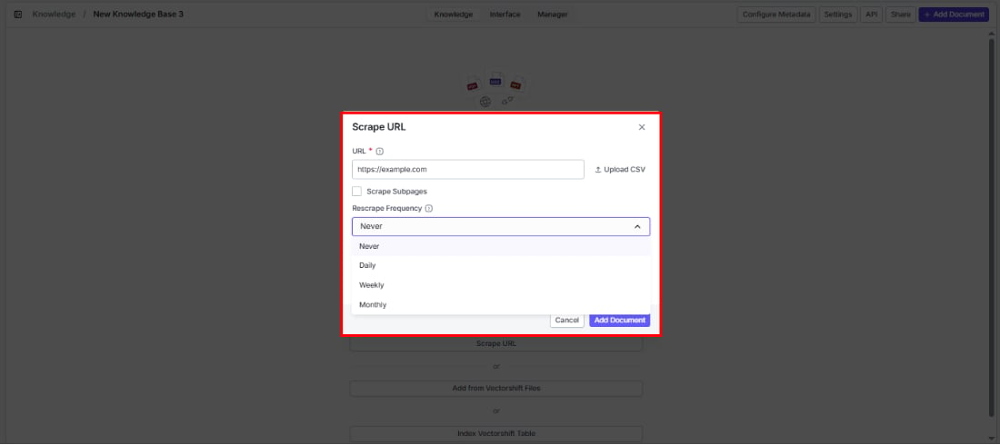

**Advanced settings**

Expand this section to access additional scraping options:

* **Use Proxy**: Route the scrape through a proxy — helpful when the target site blocks direct requests.
* **Use Personal Apify key**: Use your own Apify API key for more control over web scraping. You can enter it here in the URL indexing dialog or in the knowledge base's advanced settings.

Click **Add Document** to start scraping, or **Cancel** to close the dialog.

<Tip>For websites that update frequently (like news sites or product docs), set a rescrape frequency so search results always reflect the latest content — no manual re-indexing needed.</Tip>

## Add from VectorShift files

Already have files in VectorShift's file storage? Reuse them here instead of uploading again. Click **Add VectorShift Files** to browse and select files.

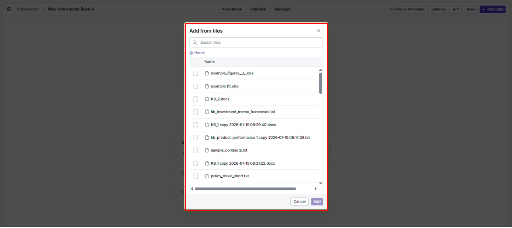

* Use the search bar to find a specific file.
* Navigate folders starting from **Home**.
* Select one or more files using the checkboxes.
* Click **Add** to import the selected files into your knowledge base, or **Cancel** to close.

## Index VectorShift table

Make your structured data — CRM records, product catalogs, inventories — searchable with natural language. Click **Index VectorShift Table** to select a table to index.

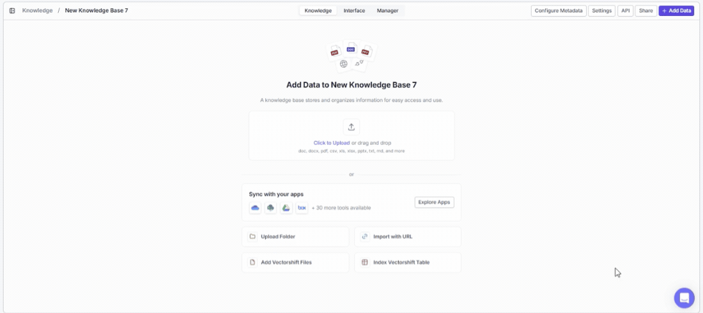

* Use the search bar to find a specific table.
* Navigate from **Home**.
* Select a table using the checkbox.
* Click **Index** to index the table's data into your knowledge base, or **Cancel** to close.

<Tip>Once indexed, your team can ask questions like "Which customers renewed last quarter?" and get answers directly from the table data.</Tip>
