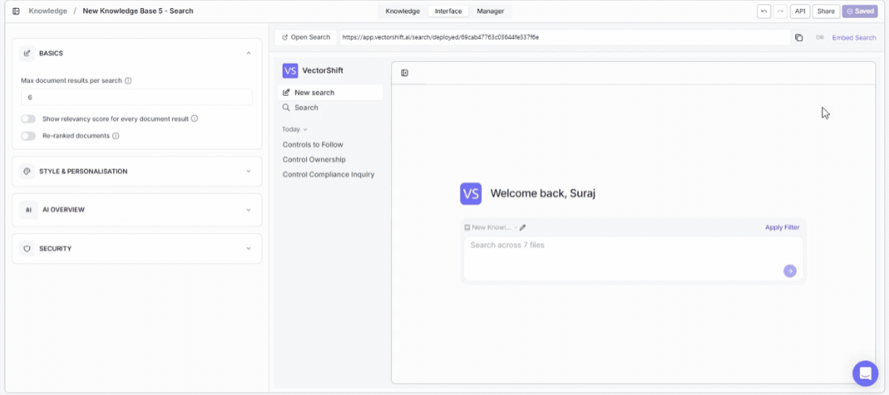

> ## Documentation Index
> Fetch the complete documentation index at: https://docs.vectorshift.ai/llms.txt
> Use this file to discover all available pages before exploring further.

# Accessing the API

> Add knowledge base search to your own apps, backends, or automations with ready-to-use code snippets

Build search into your own products. The API panel gives you ready-to-use code snippets so you can integrate knowledge base search into any application, backend, or automation — in minutes.

To open it, click the **API** button in the top-right area of the knowledge base detail page (on the Interface tab).

<Note>You need to save your search interface before accessing API features. If you see a "Save your search" banner at the top of the dialog, click Save on the Interface tab first.</Note>

## Endpoint

The API exposes one endpoint:

**POST /search/\{id}/run**

This runs a search with your provided inputs. It supports both regular responses and SSE (Server-Sent Events) streaming.

## Request preview

The dialog provides a code snippet showing exactly how to call the endpoint. View the snippet in four languages by clicking the tabs:

* **Python**
* **JavaScript**
* **cURL**
* **HTTP**

Click **Copy** to copy the snippet to your clipboard.

## Key parameters

| Parameter        | What it does                                                                                                            |
| ---------------- | ----------------------------------------------------------------------------------------------------------------------- |
| input\_message   | The search query text (e.g., "Sample input message here")                                                               |
| conversation\_id | An optional identifier for maintaining conversation context across multiple queries (e.g., "text")                      |
| is\_deployed     | Set to true to use the deployed search configuration                                                                    |
| alpha            | A numeric value (e.g., 0.5) that controls the balance between semantic and keyword search when hybrid search is enabled |

## Authentication

All API requests require a Bearer JWT token in the Authorization header. The code snippet includes a placeholder showing where to insert your token.

## Full API reference

<CardGroup cols={2}>
  <Card title="Knowledge Base API Reference" icon="code" href="/api-reference/knowledge-bases/index">
    Create, fetch, list, query, index, and delete knowledge bases and documents.
  </Card>
</CardGroup>
