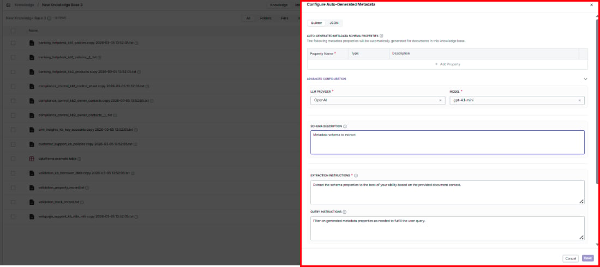

> ## Documentation Index
> Fetch the complete documentation index at: https://docs.vectorshift.ai/llms.txt
> Use this file to discover all available pages before exploring further.

# Configuring Metadata on an Existing Knowledge Base

> Improve search filtering and organization by adding or updating auto-generated metadata at any time

Want to help your users filter search results more effectively? You can add or update structured metadata on any existing knowledge base — no need to recreate it.

## Opening the metadata editor

Click **Configure Metadata** in the top-right area of the knowledge base detail page.

This opens the same metadata configuration dialog used during [knowledge base creation](/platform/knowledge/creating#configure-metadata).

## What you can configure

### Schema properties

Define what metadata fields the AI should extract from each document. Each property has:

| Field         | Purpose                                                                      |
| ------------- | ---------------------------------------------------------------------------- |
| Property Name | The name of the metadata field (e.g., `category`, `author`, `document_type`) |
| Type          | The data type — String, Number, Boolean, Object, Array, or Enum              |
| Description   | A description to guide the AI on what to extract from each document          |

Click **+ Add Property** to add fields, or remove existing ones you no longer need.

Switch between **Builder** mode (visual editor) and **JSON** mode (read-only view of the generated schema — useful for copying into API calls or external tools).

### Advanced configuration

Fine-tune how the AI extracts metadata to get more accurate, consistent results:

* **LLM provider** and **Model**: Choose which AI model performs the extraction (e.g., OpenAI / gpt-4.1-mini).
* **Schema description**: Give the AI context about what kinds of documents it will process and what the metadata is for.
* **Extraction instructions**: Set specific rules for how values should be extracted (e.g., "Always extract dates in ISO 8601 format" or "If the author is not explicitly stated, leave the field empty").
* **Query instructions**: Tell the search system how to apply metadata filters when users search — this ensures filters behave the way your users expect.

### Context configuration

<Note>These options require **Advanced Document Analysis** to be enabled in the knowledge base's permanent settings.</Note>

Give the AI more surrounding context to improve extraction accuracy:

* **Document item context**: Choose how much of each document the AI sees — Short Summary (fast), Long Summary (more accurate), or Full Document (most accurate, uses more tokens). You can select one or more.
* **Sibling context**: Enable when related documents in the same folder share context (e.g., chapters of the same report).
* **Parent context**: Enable when your folder structure carries meaning (e.g., documents inside a "Legal" folder should be recognized as legal documents).

## Saving changes

Click **Save** to apply your changes, or **Cancel** to discard.

<Warning>Updated schemas only apply to newly indexed documents. Existing documents keep their original metadata — reindex them if you want the new schema applied.</Warning>
