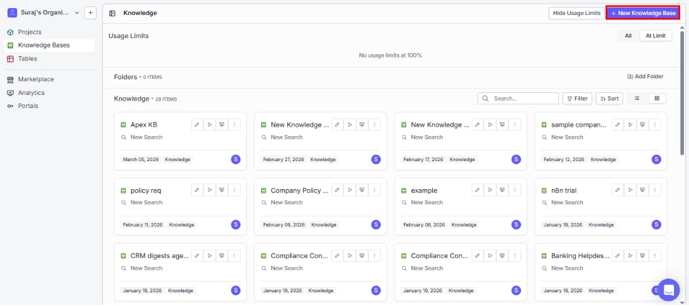
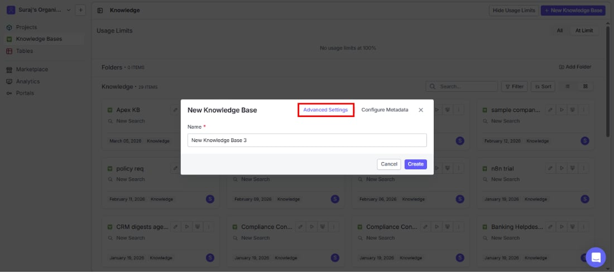
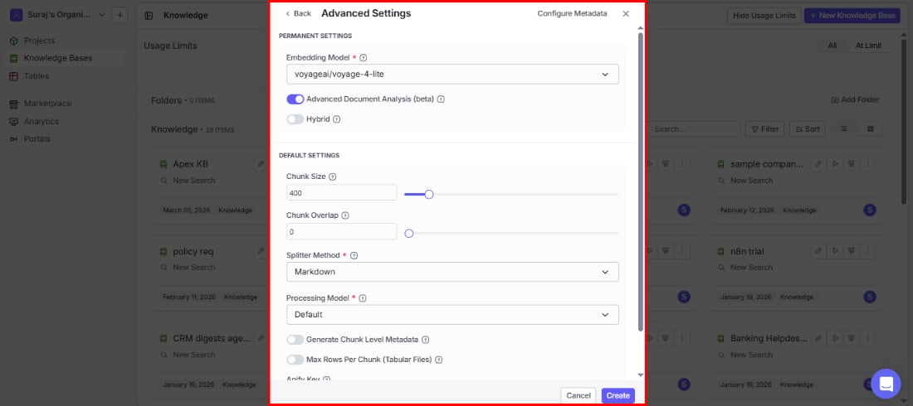
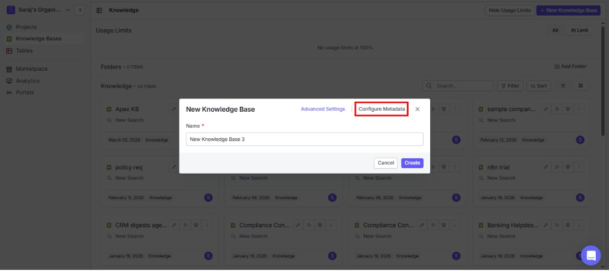
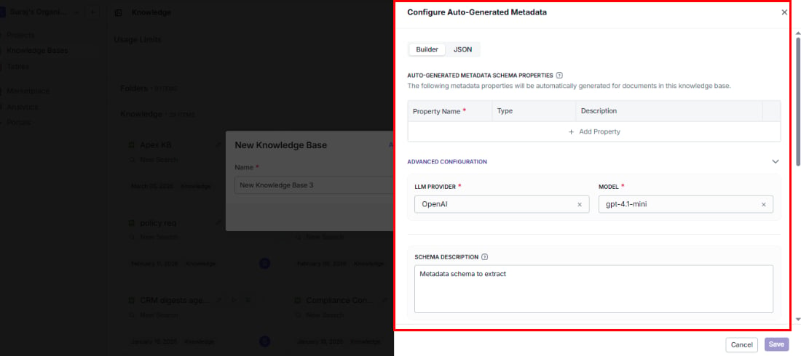
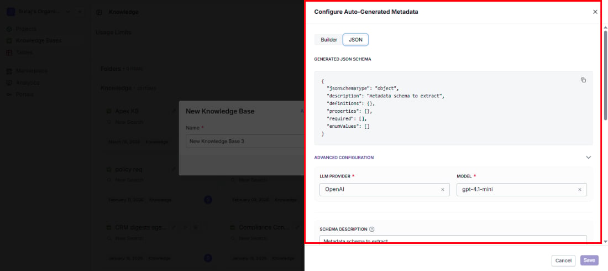

> ## Documentation Index
> Fetch the complete documentation index at: https://docs.vectorshift.ai/llms.txt
> Use this file to discover all available pages before exploring further.

# Creating a New Knowledge Base

> Get started in minutes — name your knowledge base, choose how documents are processed, and optionally set up auto-generated metadata

Ready to make your content searchable? Click the **+ New Knowledge Base** button in the top-right corner of the Knowledge Base listing page.

You can be up and running in under a minute — just give it a name and click Create. Or, if you want more control over how your documents are processed and searched, configure advanced settings and metadata before creating.

## Naming your knowledge base

* **Name**: Choose a clear, descriptive name so your team can easily find this knowledge base later. It appears in listings, search interfaces, and anywhere else it's referenced.

VectorShift auto-fills a default name (e.g., "New Knowledge Base 1"). You can rename it at any time.

Click **Create** to get started with default settings, or explore the **Advanced Settings** and **Configure Metadata** tabs to customize behavior upfront.

## Advanced settings

These settings shape how your documents are processed, chunked, and searched. They're divided into two groups: **permanent settings** that are locked after creation (because they affect the underlying data structure), and **default settings** you can adjust anytime.

### Permanent settings

These are locked once you create the knowledge base, so choose carefully.

**Embedding model** (required)

The embedding model determines how well your search understands the meaning behind queries. It converts document chunks into vectors — and since all your data is embedded with this model, changing it later would require re-processing everything.

The default is **openai/text-embedding-3-small**.

Models are available from OpenAI, VoyageAI, Cohere, and Google, grouped by provider in the dropdown.

<Tip>The default (openai/text-embedding-3-small) works well for most use cases. If you're working with multilingual content or specialized domains, explore VoyageAI and Cohere options for potentially better results.</Tip>

**Advanced document analysis (beta)**

Get richer, more accurate search results by enabling enhanced document analysis. This uses advanced techniques to understand document structure — especially helpful for complex documents like PDFs with tables, headers, and mixed layouts. When enabled, VectorShift generates a **short summary** and a **long summary** for each indexed item, which improve metadata extraction accuracy and search relevance.

<Warning>This feature uses LLM calls to generate summaries for each indexed item, which will incur additional charges.</Warning>

**Hybrid**

Help your users find exactly what they're looking for, even when specific terms matter. Hybrid search combines semantic (meaning-based) search with keyword matching — so searches for product names, error codes, or policy numbers return the right results even when the exact wording matters.

### Default settings

These apply to all new documents but can be adjusted later — either globally in Settings or per individual document. Start with sensible defaults and fine-tune as you learn what works best for your content.

**Chunk size**

Controls how much content goes into each searchable piece (measured in tokens). The default is 400.

* **Smaller chunks (200–300)** → more precise answers for fact-based questions like "What is our refund policy?"
* **Larger chunks (500–800)** → better for questions that need surrounding context like "Summarize the Q3 report findings"

**Chunk overlap**

Prevents important information from being lost when a document is split across chunk boundaries. The default is 0 (no overlap). Increase this if you notice search results missing context that spans two chunks. Must be less than the chunk size.

**Splitter method** (required)

Choose the method that best matches your document structure for the most relevant search results:

| Method   | Best for                                                                                |
| -------- | --------------------------------------------------------------------------------------- |
| Sentence | Unstructured text like emails, transcripts, or plain-text docs                          |
| Markdown | Documents with clear heading structure — splits respect headings, paragraphs, and lists |
| Dynamic  | Mixed or varied formats — automatically adapts its splitting strategy to the content    |

<Tip>Not sure? Start with **Dynamic** — it handles most document types well. Switch to **Markdown** if your docs are well-structured, or **Sentence** for raw text.</Tip>

<Note>Code files (Python, JavaScript, TypeScript, Go, Rust, SQL, YAML, Dockerfiles, and 100+ other formats) are automatically split along meaningful boundaries like functions and classes, regardless of the splitter you choose here.</Note>

**Processing model** (required)

The processing model determines how accurately text is extracted from your files. Choosing the right one for your content type can significantly improve search quality:

| Model         | Best for                                                            |
| ------------- | ------------------------------------------------------------------- |
| Default       | General purpose text extraction                                     |
| Llama Parse   | Structured documents with complex layouts                           |
| Textract      | AWS-powered extraction, good for forms and tables                   |
| Docling       | Document understanding with layout awareness                        |
| Mistral OCR   | Scanned documents and images with text                              |
| Contextual AI | Context-aware document processing                                   |
| Reducto       | High-fidelity document parsing with layout understanding            |
| Unstructured  | Flexible extraction for a wide range of unstructured document types |

**Generate chunk level metadata**

Automatically tag each chunk with metadata during indexing so your users can filter search results by specific attributes — helpful for narrowing results by category, date, or document type.

**Max rows per chunk (tabular files)**

Keep spreadsheet search results focused by limiting how many rows from CSVs or Excel files go into a single chunk. Without this, large spreadsheets can produce oversized chunks that dilute search relevance.

**Apify key**

If you plan to scrape URLs and want to use your own Apify account instead of VectorShift's built-in scraping, enter your API key here. This is optional.

## Configure metadata

Save hours of manual tagging by letting VectorShift automatically extract structured metadata from every document. Set up fields like category, author, date, or any custom property — and the AI labels each document for you as it's indexed.

Click the **Configure Metadata** tab in the creation dialog to define your schema.

### Builder mode

Define your metadata schema visually — no JSON required. Just add fields, pick types, and describe what the AI should extract.

**Auto-generated metadata schema properties**

Define what metadata fields the LLM should extract from each document:

| Column                   | What to enter                                                                 |
| ------------------------ | ----------------------------------------------------------------------------- |
| Property Name (required) | The name of the metadata field (e.g., "category", "author", "document\_type") |
| Type                     | The data type of the field (see supported types below)                        |
| Description              | A description to guide the LLM on what to extract                             |

Click **+ Add Property** to add more fields.

**Supported property types:**

| Type    | Description                                                                             |
| ------- | --------------------------------------------------------------------------------------- |
| String  | Text values. Allows additional configuration for Pattern (regex validation) and Format. |
| Number  | Numeric values. Allows setting constraints (see below).                                 |
| Boolean | True/false values.                                                                      |
| Object  | Nested structured data.                                                                 |
| Array   | A list of values.                                                                       |
| Enum    | A predefined set of allowed values.                                                     |

**String type options**

When you select String as the type, two additional fields appear:

* **Pattern**: A regex pattern to validate extracted values (e.g., `^\d{4}-\d{2}-\d{2}$` for date strings).
* **Format**: A predefined format constraint. Available formats: DateTime, Date, Time, Duration, Email, Hostname, IPv4, IPv6, UUID.

**Number type constraints**

When you select Number as the type, constraint fields appear:

| Constraint        | What it does                                                                      |
| ----------------- | --------------------------------------------------------------------------------- |
| Minimum           | The lowest allowed value (inclusive)                                              |
| Maximum           | The highest allowed value (inclusive)                                             |
| Exclusive Minimum | The lowest allowed value (exclusive, meaning the value must be greater than this) |
| Exclusive Maximum | The highest allowed value (exclusive, meaning the value must be less than this)   |
| Multiple Of       | The value must be a multiple of this number                                       |

### Advanced configuration

Fine-tune how the AI extracts metadata to get more accurate and consistent results:

* **LLM provider**: Choose the AI provider (e.g., OpenAI).
* **Model**: Pick the specific model (e.g., gpt-4.1-mini).
* **Schema description**: Give the AI additional context about your intent — what kinds of documents it will see and what the metadata is for.
* **Extraction instructions**: Guide the AI's behavior with specific rules (e.g., "Always extract dates in ISO 8601 format" or "If the author is not explicitly stated, leave the field empty").
* **Query instructions**: Tell the search system how to apply metadata filters when users search — this ensures filters work the way your users expect.

### Context configuration

Give the AI more surrounding context to improve metadata accuracy — especially useful when a document's meaning depends on its relationship to other documents.

<Note>These options require **Advanced Document Analysis** to be enabled in the knowledge base's permanent settings.</Note>

**Document item context**

Choose how much of each document the AI sees when extracting metadata:

| Option        | What it provides                                          |
| ------------- | --------------------------------------------------------- |
| Short Summary | A brief overview — fast and cost-effective                |
| Long Summary  | A detailed summary — better accuracy for nuanced content  |
| Full Document | The complete content — most accurate but uses more tokens |

You can select one or more of these options.

**Sibling context**

Enable this when related documents in the same folder share context. For example, if a folder contains multiple chapters of a report, the AI can use the other chapters to better understand and tag each one.

**Parent context**

Enable this when your folder structure carries meaning. For example, documents inside a "Legal" folder can automatically be recognized as legal documents, improving tagging accuracy.

### JSON mode

Click the **JSON** tab to switch to a read-only JSON view of your metadata schema. This shows the generated JSON schema based on the properties you defined in the Builder. You can copy the JSON from here for use in API calls or external tools, but edits must be made through the Builder tab.

Click **Save** to save your metadata configuration, or **Cancel** to discard changes.

<Tip>You do not need to configure metadata during creation. You can always set it up later using the Configure Metadata button on the knowledge base detail page.</Tip>
