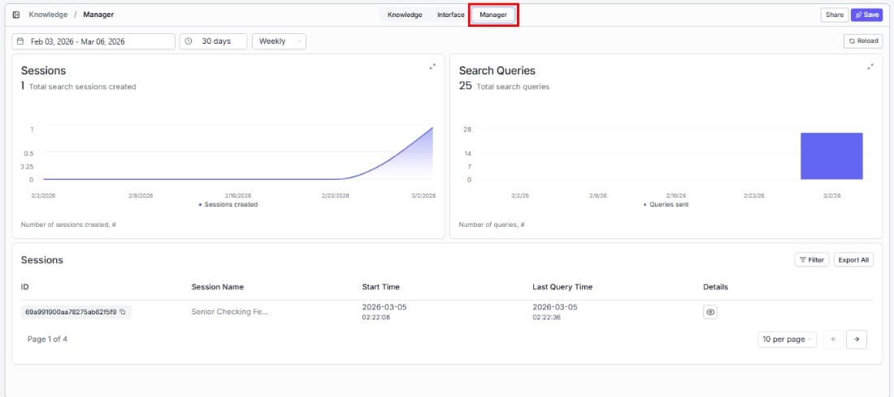
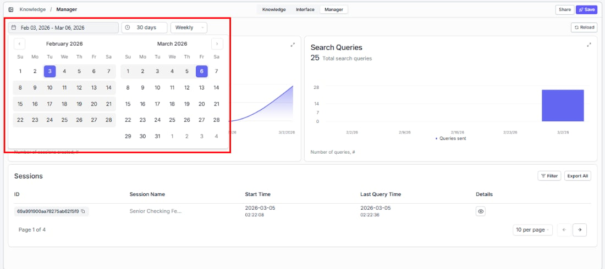

> ## Documentation Index
> Fetch the complete documentation index at: https://docs.vectorshift.ai/llms.txt
> Use this file to discover all available pages before exploring further.

# Monitoring Usage with the Manager Tab

> Understand how your search is being used — track sessions, query trends, and identify content gaps

See who's searching, how often, and what they're asking. The Manager tab helps you understand adoption, spot trends, and identify content gaps — so you can keep improving the search experience based on real usage data.

To access it, open a knowledge base and click the **Manager** tab in the top navigation.

## Setting the date range

At the top of the Manager tab, controls let you define the time period for all the data shown below.

**Date range picker**

Click the date range field to select a custom start and end date (e.g., "Jan 28, 2026 - Feb 28, 2026").

**Quick presets**

Quickly zoom in on the time period that matters:

| Preset   | Time range             |
| -------- | ---------------------- |
| 24 hours | Last 24 hours          |
| 7 days   | Last 7 days            |
| 30 days  | Last 30 days (default) |
| 3 months | Last 3 months          |
| 1 year   | Last year              |
| Custom   | Define your own range  |

**Aggregation**

A dropdown to the right of the presets lets you choose how data is grouped on the charts (e.g., Weekly).

**Reload**

Click the **Reload** button in the top-right corner to refresh the data with the latest numbers.

## Sessions and search queries metrics

Two charts give you a clear picture of adoption and engagement:

**Sessions**

Track how many people are using your search over time. The total count appears at the top. Click the expand icon to see trends in more detail.

**Search Queries**

Understand search volume — how many questions are being asked. A single session can contain multiple queries, so this metric shows overall engagement depth. Click the expand icon to enlarge.

## Sessions table

Drill into individual sessions to see what users searched for and when — useful for identifying common questions and content gaps:

| Column          | What it shows                               |
| --------------- | ------------------------------------------- |
| ID              | The unique session identifier               |
| Session Name    | The name or label of the session            |
| Start Time      | When the session began                      |
| Last Query Time | When the last query in the session was sent |
| Details         | Link to view full session details           |

* **Filter**: Narrow the sessions list by specific criteria.
* **Export All**: Download the full sessions data for analysis.
* **Pagination**: Navigate between pages using the arrow buttons. You can also change how many sessions appear per page (e.g., 10 per page).
