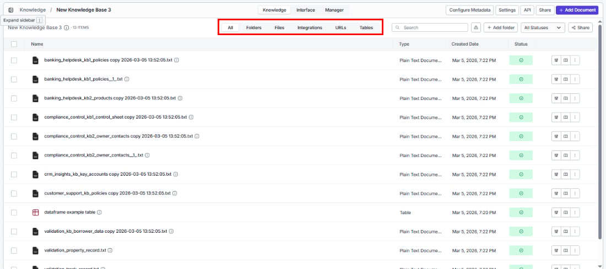
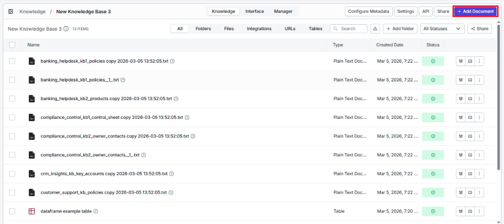
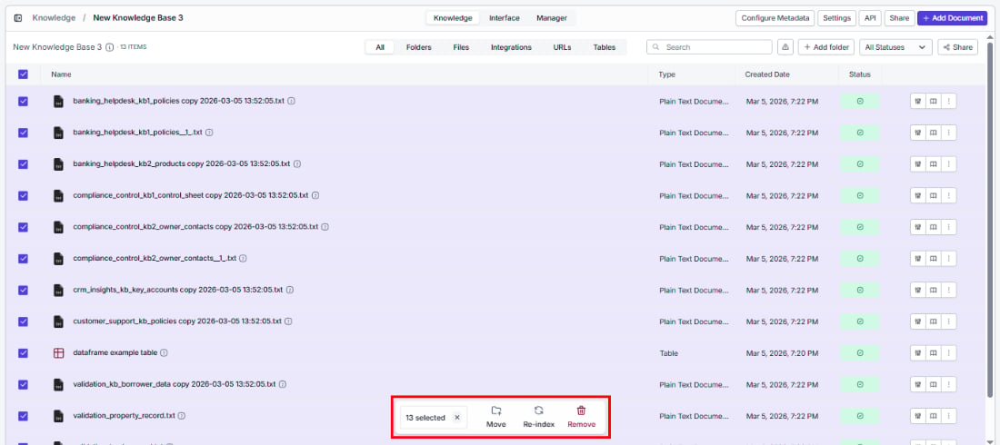
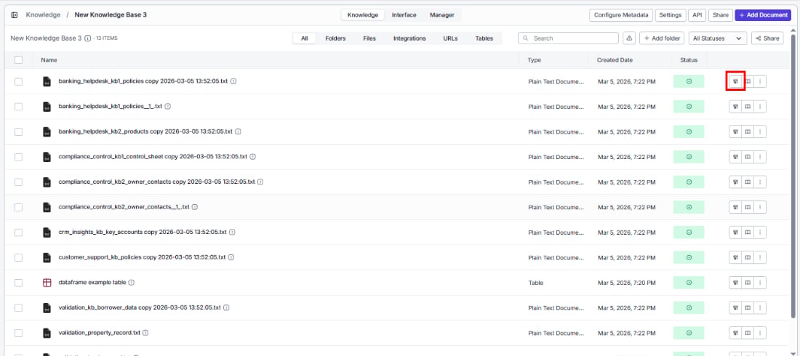
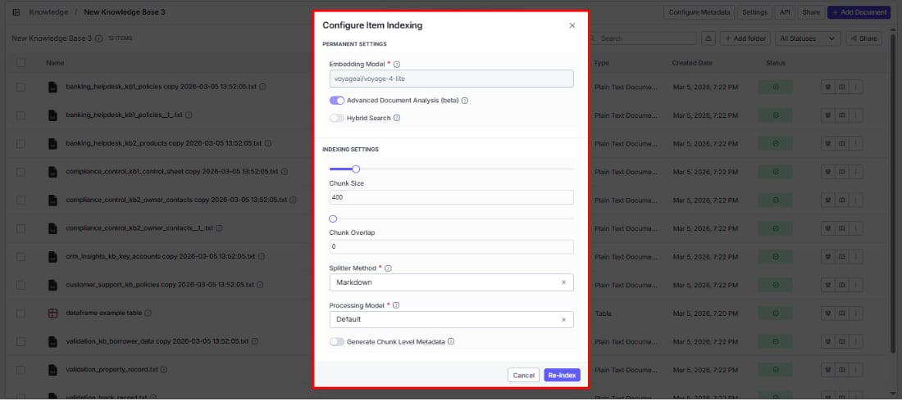
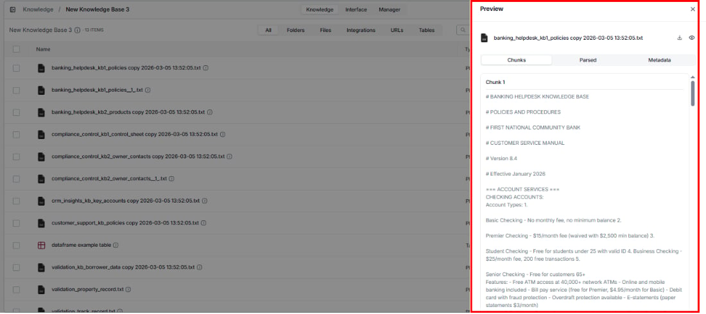
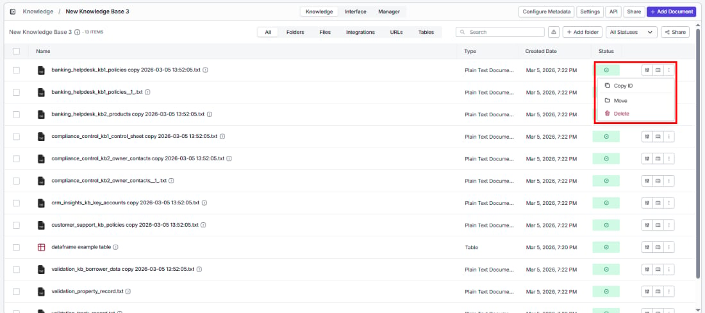

> ## Documentation Index
> Fetch the complete documentation index at: https://docs.vectorshift.ai/llms.txt
> Use this file to discover all available pages before exploring further.

# Managing Documents

> Keep your knowledge base healthy — track indexing status, organize content, and fine-tune how individual documents are processed

Once your data is indexed, the Knowledge tab becomes your control center. See at a glance which documents are searchable, which are still processing, and which need attention — then organize, reindex, or remove content to keep your search results accurate.

## Document list

The document list is organized with filter tabs across the top and a table below.

### Filter tabs

Quickly find what you're looking for by filtering documents by source:

| Tab          | What you'll see                                             |
| ------------ | ----------------------------------------------------------- |
| All          | Every document regardless of source                         |
| Folders      | Documents organized into folders within this knowledge base |
| Files        | Documents added via file upload                             |
| Integrations | Documents synced from connected apps                        |
| URLs         | Documents added via URL scraping                            |
| Tables       | Documents indexed from VectorShift tables                   |

### Columns

| Column       | What it shows                                                       |
| ------------ | ------------------------------------------------------------------- |
| Name         | The document name (auto-generated from the file name and timestamp) |
| Type         | The file type (e.g., Plain Text Document)                           |
| Created Date | When the document was added                                         |
| Status       | Current processing status                                           |

### Status values

Know exactly where each document stands in the indexing process:

| Status     | What it means                                                                    |
| ---------- | -------------------------------------------------------------------------------- |
| Success    | Ready to search — fully processed and indexed                                    |
| Processing | In progress — being chunked, embedded, and indexed (shown as a spinner)          |
| Failed     | Something went wrong — click Retry to try again                                  |
| Warning    | Partial issues — shown for folders when one or more items inside failed to index |

You can filter the list to show only documents with a specific status by clicking the **All Statuses** dropdown above the table.

### Alert banners

In certain situations, the document list displays informational alert banners:

* **"Parent folder already selected to Sync"**: A parent folder is already queued for syncing. To customize indexing settings for individual items inside, remove the parent folder sync first.
* **"Items cannot be deleted individually"**: Documents inside a recursive URL folder can only be removed by deleting the entire folder.

### Other list controls

* **Search**: Find a document by name using the search bar.
* **+ Add folder**: Create a folder within the knowledge base to organize your documents. Folder names must be at least 3 characters long and can only contain letters, numbers, and underscores.
* **Share**: Share documents with other users.
* **+ Add Document**: Add more content directly — opens a dropdown with all available indexing options (upload files, add integration, scrape URL, etc.).

## Bulk actions

Save time by acting on multiple documents at once. Select documents using the checkboxes, then use the bulk action buttons:

| Action  | What it does                                                           |
| ------- | ---------------------------------------------------------------------- |
| Reindex | Re-processes all selected documents with the current indexing settings |
| Move    | Moves all selected documents to a folder within the knowledge base     |
| Delete  | Permanently removes all selected documents                             |

Click **Clear Selection** to deselect all documents.

## Actions on individual documents

Each document row has action icons on the right side and a three-dot menu.

### Configure item indexing

Need different processing for a specific document? Click the settings icon (first icon) to override the knowledge base defaults and reindex with custom settings — without affecting any other documents.

The dialog has two sections:

**Permanent settings**

These reflect the knowledge base-level settings. Some can be toggled per document:

1. **Embedding model**: Shows the model selected during knowledge base creation (read-only).
2. **Advanced document analysis (beta)**: Toggle on or off for this document.
3. **Hybrid search**: Toggle on or off for this document.

**Indexing settings**

Customize these for this specific document to improve its search results:

1. **Chunk size**: Adjust the slider or enter a value. Overrides the knowledge base default for this document only.
2. **Chunk overlap**: Adjust the slider or enter a value. Must be less than the chunk size.
3. **Splitter method**: Choose Sentence, Markdown, or Dynamic.
4. **Processing model**: Choose the processing model for this document.

Click **Re-index** to reprocess the document with the new settings, or **Cancel** to discard.

<Tip>This is especially useful when one file type needs different handling — for example, a scanned PDF that needs Mistral OCR while your other docs work fine with the Default model.</Tip>

### Item preview

Verify how VectorShift processed your document — inspect chunks, parsed content, and metadata to make sure everything looks right. Open the preview by:

* Clicking the **preview icon** (second icon) on the document row
* Clicking directly on the **document name** in the list

Both open the same preview drawer with three tabs:

| Tab      | How it helps                                                                                               |
| -------- | ---------------------------------------------------------------------------------------------------------- |
| Chunks   | See how your content was divided — useful for diagnosing why search results may be too broad or too narrow |
| Parsed   | View the extracted text as the processing model sees it — verify nothing was missed or misread             |
| Metadata | Check the document's metadata, including any auto-generated fields — confirm tags are accurate             |

For documents with a **Failed** status, the preview icon is replaced with a **Retry** button. Click it to retry indexing.

### Three-dot menu

Click the three-dot icon (last icon) to access additional options:

| Option  | What you can do                                                                                           |
| ------- | --------------------------------------------------------------------------------------------------------- |
| Copy ID | Copy the document's unique identifier to your clipboard — useful for API calls or workflow configurations |
| Move    | Organize by moving the document to a folder within this knowledge base                                    |
| Delete  | Permanently remove the document from the knowledge base                                                   |
