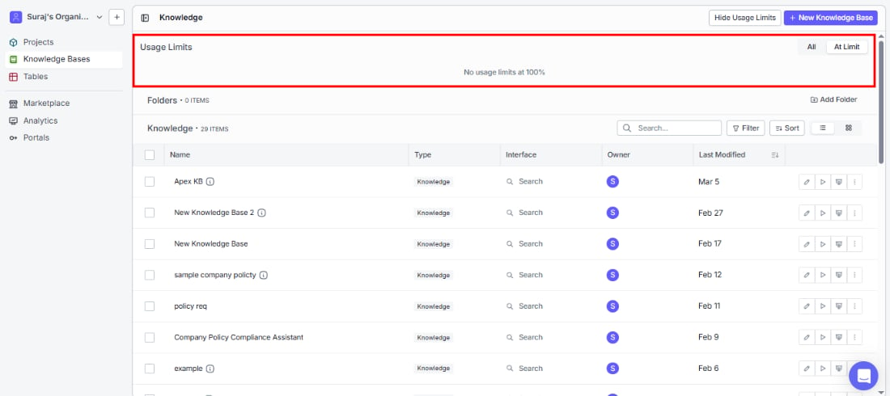
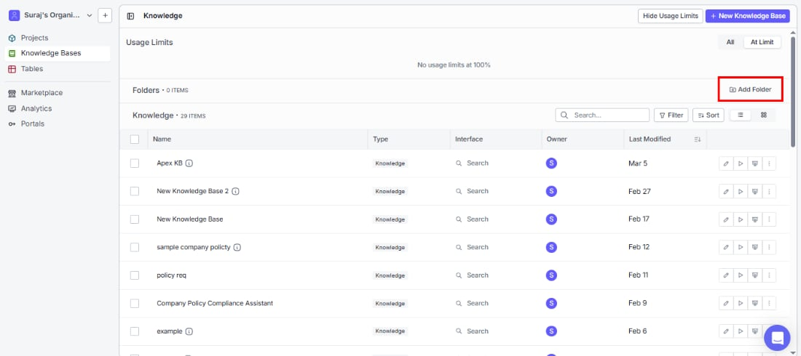
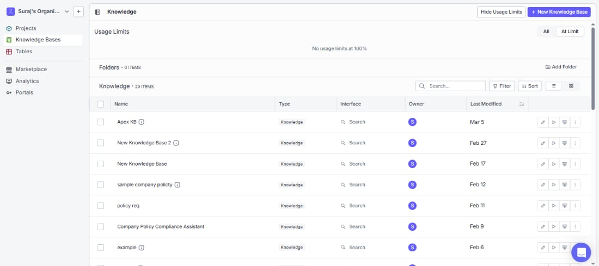
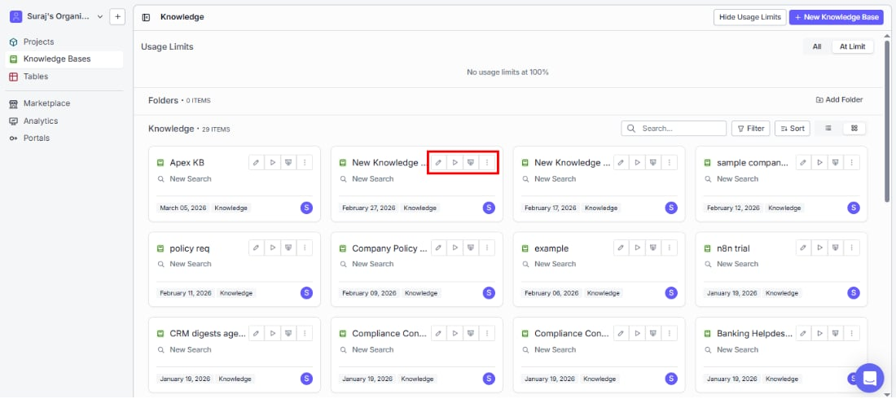
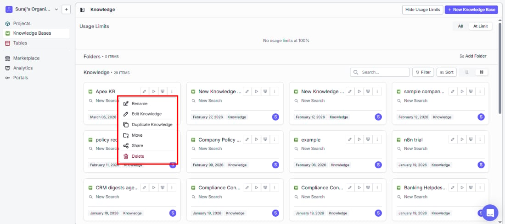

> ## Documentation Index
> Fetch the complete documentation index at: https://docs.vectorshift.ai/llms.txt
> Use this file to discover all available pages before exploring further.

# Overview

> Turn your documents, files, and live data into an AI-powered search experience

## What is a knowledge base?

A knowledge base helps your team — or your customers — get instant, accurate answers from your own documents, files, and data using plain language. No more digging through folders or scrolling through PDFs.

Here's what you can accomplish:

* **Help employees find answers instantly** — search internal docs in plain language and get direct, cited answers instead of hunting through files
* **Resolve customer questions faster** — power a support assistant that pulls answers straight from your help center, so customers get help 24/7
* **Unlock insights from contracts and reports** — ask natural language questions across hundreds of documents and surface the information that matters
* **Keep everything up to date automatically** — connect tools like Google Drive, Slack, or Gmail so new content becomes searchable as soon as it's added

You can also plug a knowledge base into VectorShift workflows and portals to drive chatbots, automations, and workflows across your organization.

## How a knowledge base works

When you add a document, VectorShift automatically processes it so your team can search it. Here's what happens behind the scenes:

1. **Ingestion** — Bring in your content however works best: upload files (documents, images, audio, video, ZIP archives), connect an integration, scrape a URL, or pull data from VectorShift files and tables.
2. **Chunking** — Documents are broken into smaller, meaningful pieces so the AI can pinpoint exactly what's relevant to each query. You choose the splitter method (Sentence, Markdown, or Dynamic) and chunk size. Code files are automatically split along function and class boundaries.
3. **Processing** — A processing model reads and extracts text from your files. Different models are optimized for different content — for example, scanned PDFs vs. structured documents.
4. **Embedding** — Each chunk is converted into a vector (a numerical representation) using an embedding model. This is what makes semantic search possible: the system understands meaning, not just keywords.
5. **Search and retrieval** — When someone searches, the system finds the most relevant chunks, retrieves them, and an LLM generates a clear answer with citations back to the source documents.

You'll see these concepts (chunk size, splitter method, embedding model, processing model) throughout the configuration screens. You don't need to understand them deeply to get started — VectorShift provides sensible defaults — but knowing the flow helps when you want to improve search quality.

## Usage limits

Keep your knowledge bases running smoothly by monitoring capacity with the **Usage Limits** banner at the top of the listing page. It tells you at a glance whether any knowledge base is approaching or has hit its limit — so you can take action before search quality is affected.

* **All** tab: see usage status across all your knowledge bases.
* **At Limit** tab: quickly find knowledge bases that need attention.

You can collapse the banner by clicking **Hide Usage Limits** in the top-right corner, and bring it back whenever you need it.

## Folders

As you create more knowledge bases, folders help you stay organized. Click **Add Folder** on the right side of the Folders section to create one. Move existing knowledge bases into folders using the three-dot menu on any row.

## Browsing your knowledge bases

Find the knowledge base you need quickly using the listing page:

| Column        | What it shows                                |
| ------------- | -------------------------------------------- |
| Name          | The name of the knowledge base               |
| Type          | Always shows "Knowledge"                     |
| Interface     | The interface type (e.g., Search)            |
| Owner         | The user who created it                      |
| Last Modified | The date the knowledge base was last updated |

You can customize the columns displayed by clicking the column settings icon to the right of the Last Modified header.

* **Search** for a knowledge base by name using the search bar above the list.
* **Filter** to narrow the list by specific criteria.
* **Sort** to reorder by any column.
* **Switch views** between list view (table rows) and grid view (visual cards) using the toggle icons next to Sort.

## Quick actions on each knowledge base

Get to what you need in one click from any knowledge base row:

**Icon actions (left to right):**

| Icon   | Action                          | What you can do                                                   |
| ------ | ------------------------------- | ----------------------------------------------------------------- |
| Pencil | Edit knowledge base             | Jump straight into managing documents and settings                |
| Play   | Run knowledge base              | Test your search by running queries instantly                     |
| Chart  | Manage knowledge base analytics | See how your search is being used — sessions, queries, and trends |

## Three-dot menu options

| Option              | What you can do                                          |
| ------------------- | -------------------------------------------------------- |
| Rename              | Change the knowledge base name                           |
| Edit Knowledge      | Open the knowledge base editor (same as the pencil icon) |
| Duplicate Knowledge | Create a copy of the knowledge base                      |
| Move                | Organize by moving the knowledge base into a folder      |
| Share               | Invite other users or teams and assign roles             |
| Delete              | Permanently delete the knowledge base                    |

<Tip>The Edit knowledge base icon and the "Edit Knowledge" option in the three-dot menu do the same thing. Use whichever is more convenient.</Tip>
