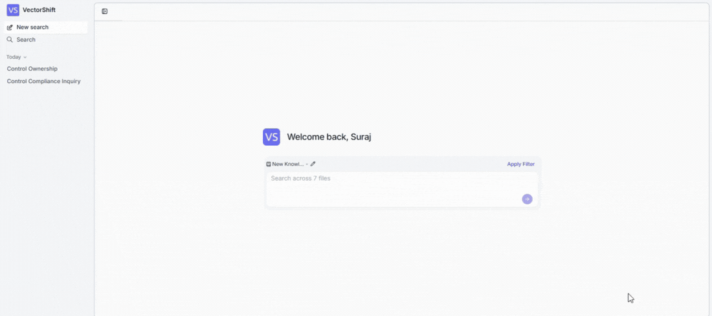
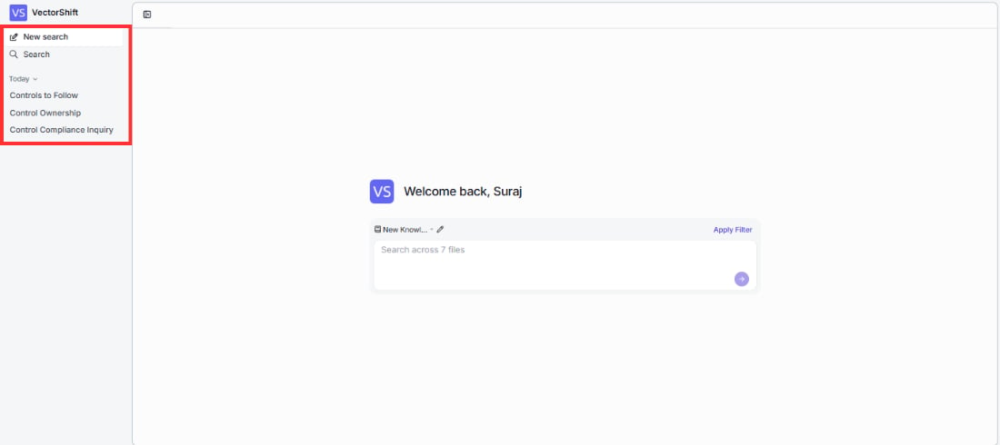

> ## Documentation Index
> Fetch the complete documentation index at: https://docs.vectorshift.ai/llms.txt
> Use this file to discover all available pages before exploring further.

# Using the Search Experience

> Ask questions in plain language and get AI-generated answers with source citations — instantly

Here's what the search experience looks like in action — whether you're testing it yourself or your users are searching the deployed interface. For the best experience, open the search using the deployed URL (via **Open Search** on the Interface tab) to view it in full screen.

## Running a search query

Type a question or keyword into the search bar and press Enter. The AI reads your indexed documents and returns a clear, cited answer in seconds.

Before searching, you can:

* **Switch knowledge bases** — click the knowledge base name above the search bar to search a different one.
* **Edit the selection** — click the pencil icon to change which knowledge base is active.
* **Narrow your search** — click **Apply Filter** to focus on specific files and get more targeted results.

## Reading search results

Every search returns two things: a clear AI-generated answer and the sources it drew from — so you can trust the answer and verify it when needed.

**AI-generated overview**

The main area shows a natural language answer to your query, with inline citations linking back to the source documents. You can see exactly where each piece of information came from — no need to take the AI's word for it.

**Sources panel**

On the right side, verify the answer at a glance:

* A **Sources** badge shows how many documents were used.
* Each source document is listed with relevant snippets, so you can check the AI's answer against the original content.
* Click the search and filter icons to explore sources further.

## Managing search conversations

Never lose a previous search — the left sidebar keeps your full search history organized so you can pick up right where you left off.

* **New search** — start a fresh session anytime.
* **Search history** — past searches appear grouped by date (e.g., "Today"). Click any previous search to revisit its results instantly.
* **Search tab** — browse your complete search history.
