> ## Documentation Index
> Fetch the complete documentation index at: https://docs.vectorshift.ai/llms.txt
> Use this file to discover all available pages before exploring further.

# Setting Up the Search Interface

> Build a branded, AI-powered search experience your team or customers can start using right away

Turn your knowledge base into a polished search experience your team or customers can use right away. The Interface tab lets you control how your search looks, behaves, and who can access it — with a live preview so you can see every change as you make it.

To access it, open a knowledge base and click the **Interface** tab in the top navigation.

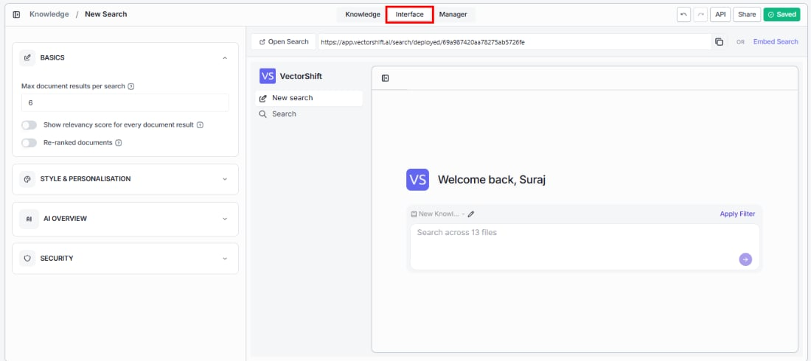

The left side of the screen shows all configuration sections. The right side shows a live preview that updates as you make changes.

## Basics

Shape what your users see when they search.

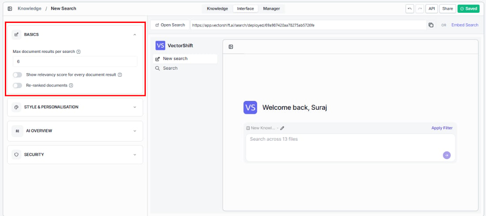

**Max document results per search**

Set how many document results appear per query (default: 6). More results give users more to explore; fewer results keep the experience focused and faster to scan.

**Show relevancy score for every document result**

Let users gauge how closely each result matches their query — useful for power users who want to evaluate result quality at a glance.

**Re-ranked documents**

Surface the most relevant results first by adding an extra ranking step after retrieval. Especially helpful for broad queries where the first pass might not perfectly order the results.

## Style and personalisation

Make the search experience feel like part of your brand.

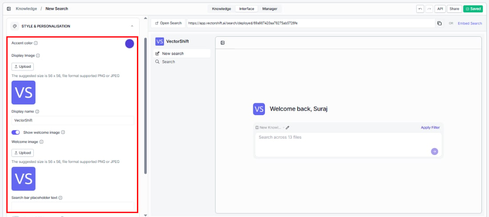

**Accent color**

Choose the accent color used throughout the search interface (buttons, highlights, links) using the color picker.

**Display image**

Upload your logo or avatar to appear in the search interface. Suggested size is 56 x 56 pixels. Supported formats: PNG, JPEG.

**Display name**

Set the name that appears at the top of the search interface (e.g., your company name).

**Show welcome image**

Toggle this on to greet users with a welcome image when they first land on the search page.

**Welcome image**

Upload the image that appears above the welcome message.

**Search bar placeholder text**

Guide your users with custom placeholder text (e.g., "Search our knowledge base..." or "Ask a question...").

**Enable initial prompts**

Help new users get started by showing suggested questions before they type — this reduces the blank-page problem and shows what the search can do.

## AI overview

Shape the quality and accuracy of AI-generated answers your users receive.

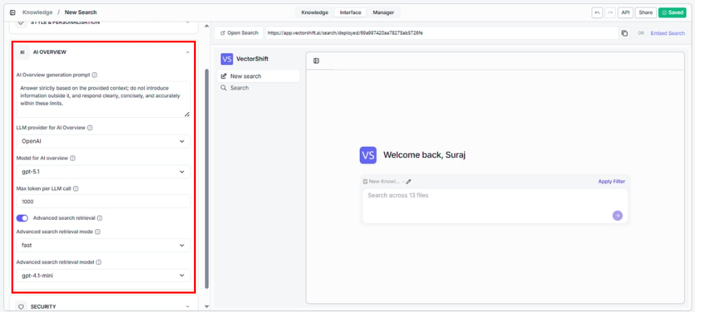

**AI overview generation prompt**

Define instructions for how the AI generates answers. For example: "Answer strictly based on the provided context; do not introduce information outside it, and respond clearly, concisely, and accurately within these limits."

**LLM provider for AI overview**

Select the AI provider used to generate answers (e.g., OpenAI).

**Model for AI overview**

Select the specific model used to generate answers (e.g., gpt-4o-mini).

**Max token per LLM call**

Set the maximum number of tokens the AI can use per response. The default is 1000.

**Advanced search retrieval**

Get more accurate answers by adding an LLM-powered retrieval step that refines which chunks are used before generating the answer.

**Advanced search retrieval mode**

Balance speed and accuracy based on what your users need:

| Mode     | When to use                                                          |
| -------- | -------------------------------------------------------------------- |
| fast     | High-volume or real-time search where speed is critical              |
| accurate | Precision-focused search where getting the right answer matters most |

**Advanced search retrieval model**

Select the model used for the advanced retrieval step (e.g., gpt-4.1-mini).

<Tip>Start with the default AI overview prompt and adjust based on user feedback. If answers are too verbose, add instructions to be concise. If answers miss important details, widen the prompt to allow more thorough responses.</Tip>

## Security

Control who can access your search — keep it open for public use or restrict it to the right people.

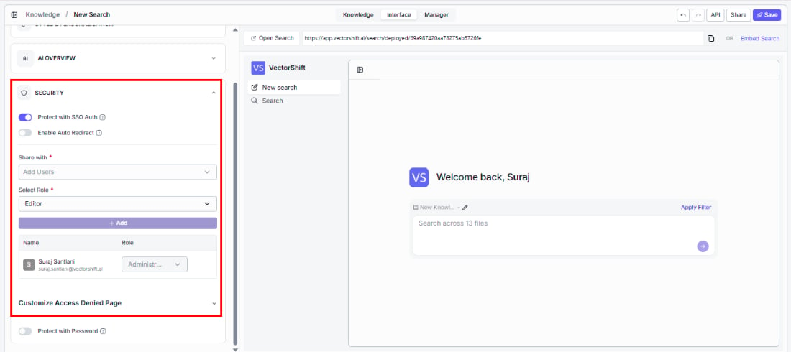

**Protect with SSO Auth**

Ensure only authenticated team members can access the search by requiring SSO (Single Sign-On) login.

**Protect with Password**

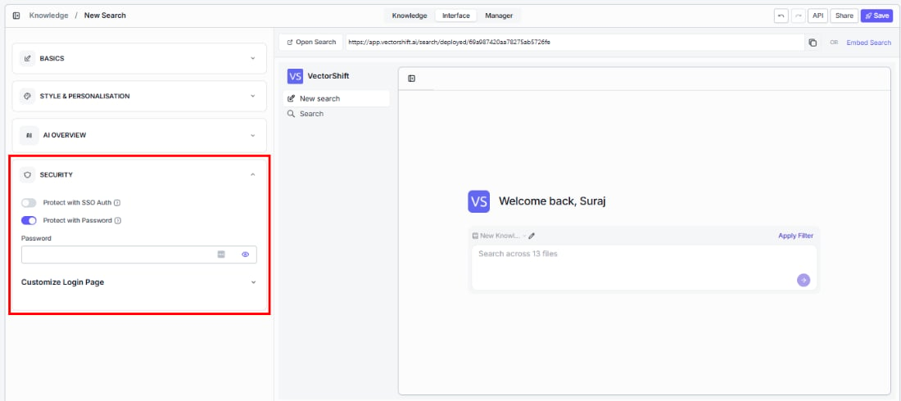

Add a simple password gate — useful for sharing with clients or partners who don't have SSO access.

<Tip>Building an internal knowledge base? SSO Auth keeps it secure without any extra steps for your team. For a public-facing search, leave both toggles off.</Tip>

## Deploying your search

Your search is ready to go live. Share it as a direct link or embed it into any website.

### Open Search

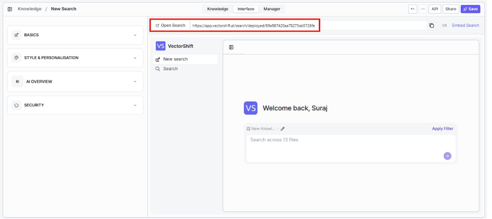

At the top of the Interface tab, you'll see a URL like `https://app.vectorshift.ai/search/deployed/....` — this is the direct link to your deployed search. Click **Open Search** to open it in a new tab, or use the copy button to share the URL with your team.

### Embed Search

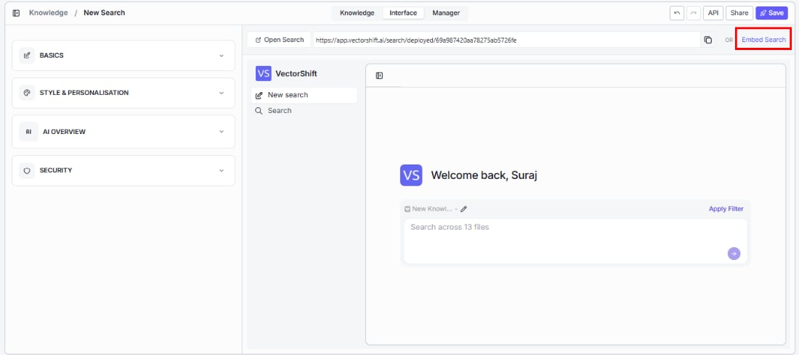

Add search directly to your website or app. Click **Embed Search** to get an iframe code snippet you can drop into any platform — Wix, Squarespace, Framer, Webflow, WordPress, or custom HTML.

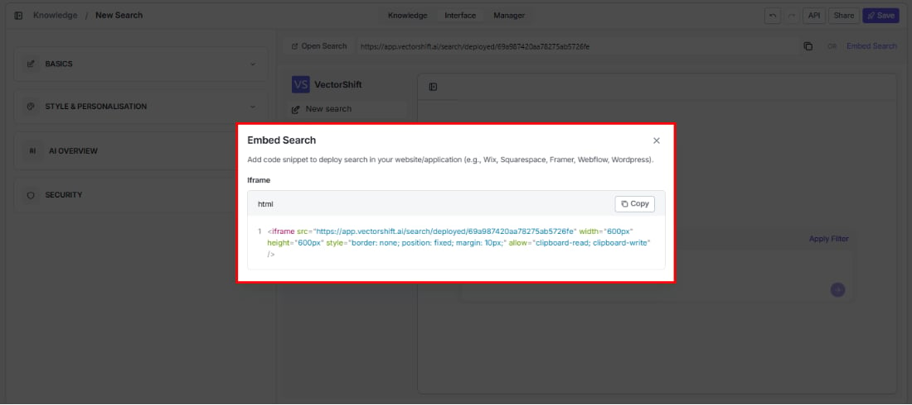

The dialog shows the HTML iframe code with a **Copy** button.

### Save

Click the **Save** button in the top-right corner to save your current interface configuration. The button shows a green "Saved" indicator once your changes are saved.

<Tip>Always click Save after making changes. The live preview updates in real time, but your changes are not persisted until you save.</Tip>

## Applying search filters

Help your users get more targeted results by narrowing their search to specific files in the knowledge base.

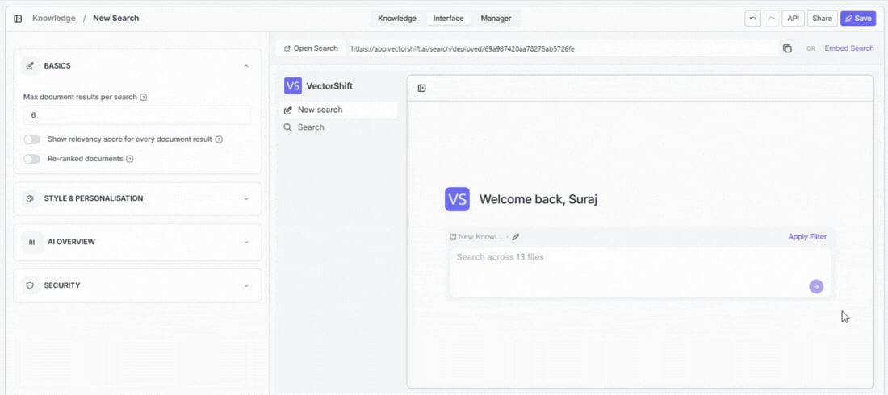

Click **Apply Filter** in the search preview (or in the deployed search) to open the Filter modal. This modal shows the knowledge base contents, and you can select or deselect individual files to include or exclude them from the search scope.

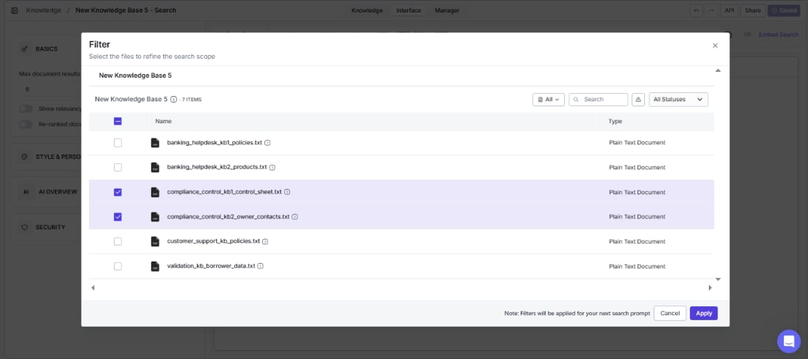

Use the **Search** bar and **All Statuses** dropdown within the filter modal to quickly find specific files. Selected files are highlighted with a checked checkbox.

A note at the bottom of the modal reads: "Filters will be applied for your next search prompt."

Click **Apply** to save the filter, or **Cancel** to discard.
