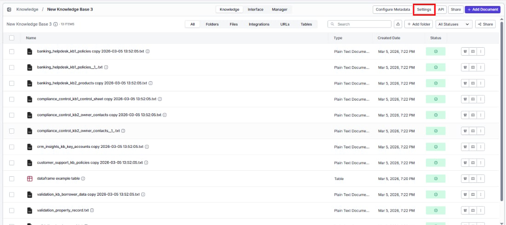
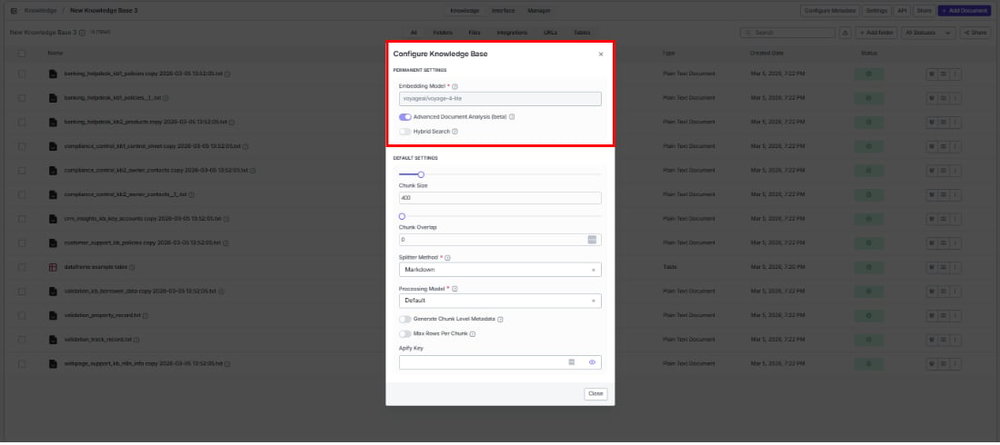
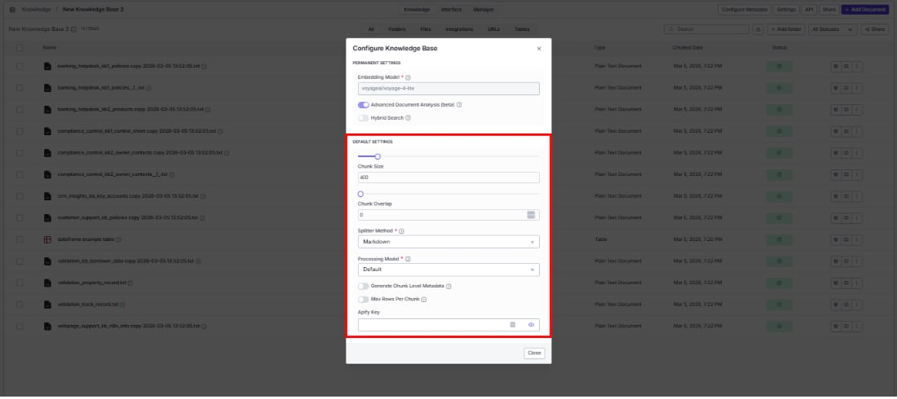

> ## Documentation Index
> Fetch the complete documentation index at: https://docs.vectorshift.ai/llms.txt
> Use this file to discover all available pages before exploring further.

# Knowledge Base Settings

> Improve search quality by adjusting how your knowledge base processes and indexes documents

Search results not quite right? The Settings panel lets you adjust how documents are processed and indexed so you can improve search quality over time. Click the **Settings** button in the top-right area of the knowledge base detail page.

You'll see the same settings from creation, with one key difference: permanent settings are now read-only.

## Permanent settings

These were locked at creation time.

**Embedding model**

Shows the model selected during creation. This can't be changed because all your data was embedded with this model — switching would require re-processing everything from scratch.

**Advanced document analysis (beta)**

Enable or disable enhanced document analysis for newly added documents. When on, the AI generates summaries that improve metadata extraction and search relevance.

**Hybrid search**

Turn this on when your users search for specific terms (product names, policy numbers, error codes) alongside conceptual questions — it combines keyword and semantic matching so both types of queries return accurate results.

## Default settings

These settings apply to all new documents going forward. Already-indexed documents keep their original settings — to update those, use the per-document Configure Item Indexing option.

**Chunk size**

Control how much content goes into each searchable piece. Smaller chunks (200–300) give more precise, focused answers; larger chunks (500–800) provide more surrounding context for complex questions.

**Chunk overlap**

Reduce information loss at chunk boundaries by letting consecutive chunks share some content. Increase this if search results seem to miss context that spans two chunks. Must be less than the chunk size.

**Splitter method**

Choose how documents are divided into chunks — pick the method that matches your content:

| Method   | Best for                                                       |
| -------- | -------------------------------------------------------------- |
| Sentence | Unstructured text like emails, transcripts, or plain-text docs |
| Markdown | Documents with clear heading structure                         |
| Dynamic  | Mixed or varied formats — adapts automatically                 |

<Note>Code files are automatically split along meaningful boundaries (functions, classes) regardless of the method you choose here.</Note>

**Processing model**

Choose the model that handles your document types best:

| Model         | Best for                                                            |
| ------------- | ------------------------------------------------------------------- |
| Default       | General purpose text extraction                                     |
| Llama Parse   | Structured documents with complex layouts                           |
| Textract      | Forms and tables (AWS-powered)                                      |
| Docling       | Layout-aware document understanding                                 |
| Mistral OCR   | Scanned documents and images with text                              |
| Contextual AI | Context-aware document processing                                   |
| Unstructured  | Flexible extraction for a wide range of unstructured document types |

**Apify key**

Enter or update your Apify API key for URL scraping. Optional — leave blank to use VectorShift's built-in scraping.

Click **Close** to save and close the settings panel.

<Tip>**Search results not relevant enough?** Start by adjusting chunk size and splitter method. For fact-based queries ("What's our return policy?"), try smaller chunks (200–300). For context-heavy questions ("Summarize the findings"), try larger chunks (500–800).</Tip>

<Tip>Changes to default settings only apply to newly added documents. To update existing documents, reindex them individually from the document list.</Tip>
