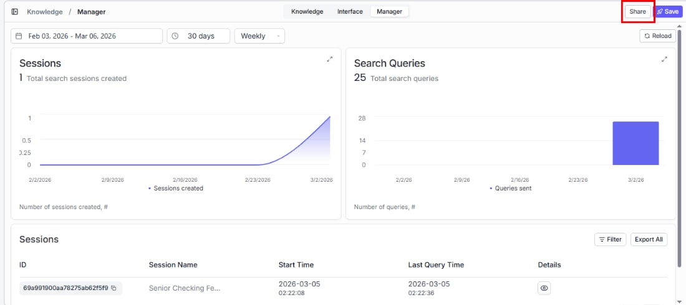

> ## Documentation Index
> Fetch the complete documentation index at: https://docs.vectorshift.ai/llms.txt
> Use this file to discover all available pages before exploring further.

# Sharing a Knowledge Base

> Give your team access to the knowledge bases they need — with the right level of control

Give your team access to the knowledge bases they need — with the right level of control. Share with individual users or entire teams and assign roles so everyone has appropriate permissions.

## Sharing with team members

Open the Share dialog from either location:

* Click the **Share** button in the top-right area of the knowledge base detail page.
* Click the three-dot menu on any knowledge base in the listing page and select **Share**.

Both open the same dialog.

### Share with

Click the **Add Users** dropdown to search for and select users or teams in your organization.

### Select Role

Assign the right level of access based on what each person needs to do:

| Role          | What they can do                                                                |
| ------------- | ------------------------------------------------------------------------------- |
| Viewer        | Search and browse — ideal for end users who just need answers                   |
| Editor        | Full editing access — add/remove documents, adjust settings, and manage content |
| Administrator | Everything an Editor can do, plus invite others and manage roles                |

Click **+ Add** to add the selected users or teams with the chosen role.

### Current users

Below the Add button, a list shows everyone who currently has access. Each row displays the user's name, email, and current role. You can change a user's role at any time by clicking the role dropdown next to their name.
