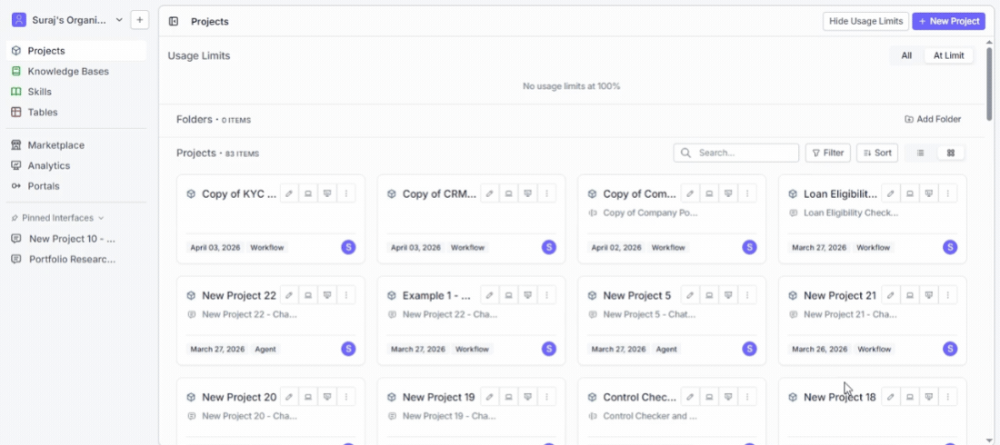
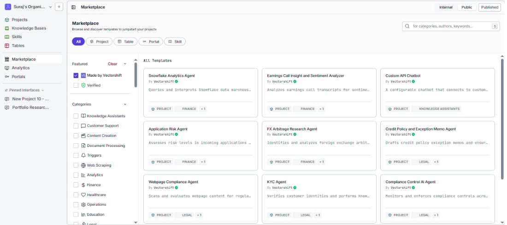
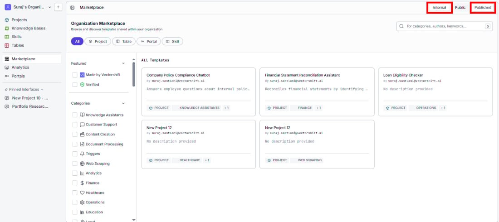
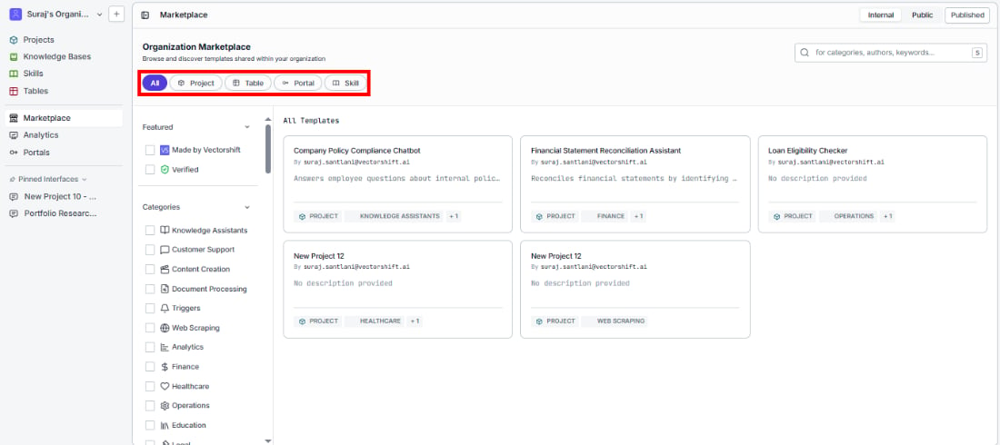
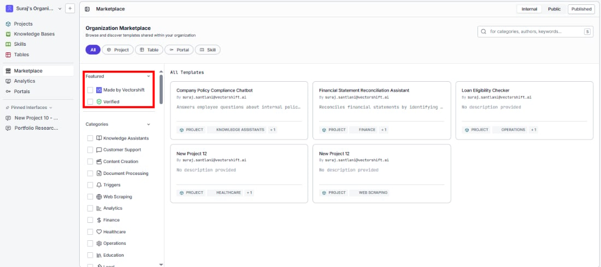
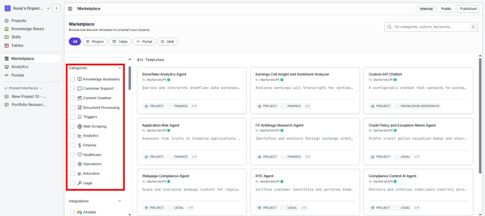
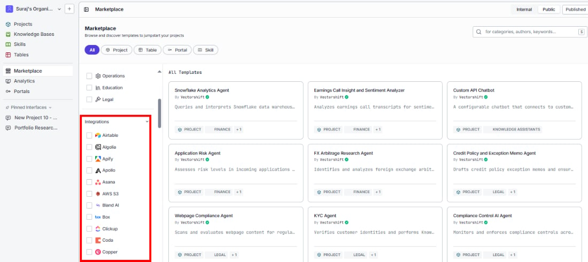
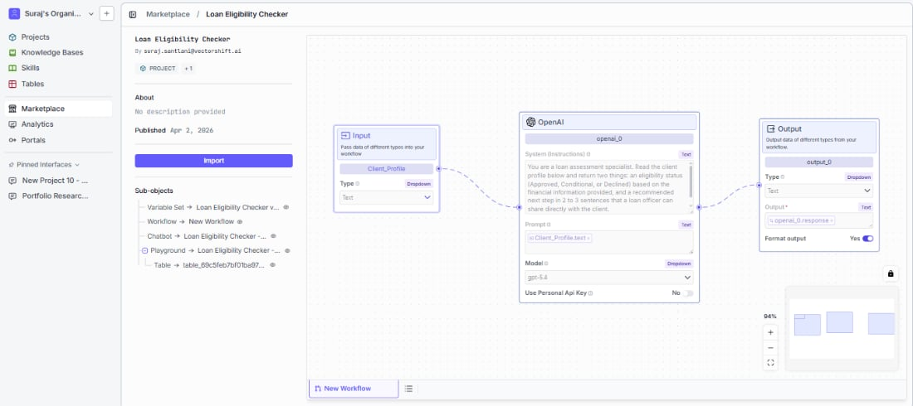

> ## Documentation Index
> Fetch the complete documentation index at: https://docs.vectorshift.ai/llms.txt
> Use this file to discover all available pages before exploring further.

# Overview

> Skip the setup and start from a working template - browse and preview chatbots, workflows, and automations built by your team or the VectorShift community

Instead of building every workflow from scratch, you can find a working template in the Marketplace and import it into your workspace. A task that might take hours to set up, like a compliance chatbot with a knowledge base and tuned system prompt, can be running in minutes.

For example, you could search the Marketplace for "policy compliance," preview the template to see exactly how it is built, import it with one click, swap in your own company handbook as the knowledge base, and deploy it as a chatbot the same day.

## Get started

1. Click **Marketplaces** in the left sidebar. This opens the Marketplace page where all available templates are listed.
2. Browse or search for a template that fits your use case using the tabs, filters, and search bar described below.
3. Click a template card to preview its workflow and confirm it is the right fit.
4. Click **Save Workflow** in the top-right area of the detail page to import the template into your workspace.

## Where templates come from

### Marketplace tab

This tab shows templates published by VectorShift, verified publishers, and the broader community. Anyone with a VectorShift account can browse these. This is where you go when you want to find a general-purpose starting point, explore what others have built, or discover new patterns.

### Organization Published tab

This tab shows templates that members of your organization have shared internally. Only people within your organization can see them. This is where you go when your team has published standardized workflows for common tasks, and you want to reuse what has already been tested and approved.

## Narrow your search

### Filter by object type

The tabs at the top of the template grid let you narrow results to a specific object type:

* **All** - shows every template regardless of type
* **Project** - full project templates with workflows and configurations
* **Table** - structured data table templates
* **Portal** - portal-based templates for end-user experiences
* **Skill** - reusable skill templates you can plug into other workflows

### Filter by featured

The left sidebar includes a **Featured** section with two checkboxes you can toggle:

* **Made by VectorShift** - show only templates built by the VectorShift team
* **Verified** - show only templates that have been reviewed and verified

### Filter by category

Below the Featured section, the **Categories** section lists checkboxes for every template category. Select one or more to show only templates that match:

* **Knowledge Assistants**
* **Customer Support**
* **Content Creation**
* **Document Processing**
* **Triggers**
* **Web Scraping**
* **Analytics**
* **Finance**
* **Healthcare**
* **Operations**
* **Education**
* **Legal**

You can combine multiple category filters to find templates that span more than one area.

### Filter by integration

Below Categories, the **Integrations** section lists the third-party services that templates connect to, such as Airtable, Algolia, Apify, Asana, AWS S3, Box, Clickup, Databricks, Discord, and many more. If you already know which integration your workflow needs to work with, check its name here to see only templates that use it. This is the fastest way to find a template that is already wired up to the tools your team relies on.

## Read a template card

Each template appears as a card in the grid. Before clicking through to the detail page, you can scan the card to decide if it is worth exploring:

* **Template name** - what the template is called
* **Author** - who published it, shown with their name
* **Description** - a short summary of what problem it solves or what it does
* **Object type tag** - a label like PROJECT, TABLE, or PORTAL that tells you the type of template
* **Category tag** - a label like KNOWLEDGE ASSISTANTS, CUSTOMER SUPPORT, or HEALTHCARE that tells you the template's domain

## Preview a template

Click a template card to open its detail page. This shows you exactly what you will get before you commit to importing:

* The template name and category tags at the top
* A read-only view of the full workflow canvas with all nodes and their connections, so you can understand the logic and structure
* A **Sub Items** section at the bottom listing any dependencies the template needs (such as knowledge bases or sub-workflows)

<Tip>
  Spend a moment on the preview before importing. Check that the node types, data flow, and overall structure are close to what you need. It is faster to customize a template that matches your use case than to reshape one with a very different architecture.
</Tip>

## Use cases

* **Answer employee policy questions** - Find a compliance chatbot template, connect your company handbook, and deploy an internal assistant that answers HR and policy questions without manual research.
* **Reconcile financial statements** - Start from a reconciliation template to automate matching line items and flagging discrepancies across accounts, cutting hours of manual review.
* **Help users understand their legal rights** - Use a legal rights chatbot template to stand up an assistant that answers questions based on your legal knowledge base, so users get answers without waiting for a lawyer.
* **Handle common support tickets** - Find a customer support template with pre-configured chat memory and data collection to resolve frequent requests automatically.
* **Onboard new hires faster** - Grab an HR chatbot template to build an assistant that answers new-hire questions from your internal documentation, reducing the load on your people team.
* **Analyze sales calls at scale** - Start from a call analyst template to summarize recorded calls and extract key insights, so your team spends time acting on findings instead of listening to recordings.

<Tip>
  If you build something useful based on a marketplace template, consider publishing your customized version back to your organization's marketplace so teammates can benefit from your improvements. See [Publish to Marketplace](/platform/marketplaces/publish) for how.
</Tip>

## Related pages

<CardGroup cols={2}>
  <Card title="Publish to Marketplace" icon="upload" href="/platform/marketplaces/publish">
    Share your own projects so others on your team or in the community can reuse them
  </Card>

  <Card title="Ready-to-use templates" icon="grid-2" href="/platform/marketplaces/templates">
    Browse all available pre-built templates by category
  </Card>

  <Card title="Workflows" icon="diagram-project" href="/platform/pipelines/overview">
    Understand how to build and edit the workflows inside imported templates
  </Card>
</CardGroup>

## Common issues

For troubleshooting, visit the [Support](/support) page.
