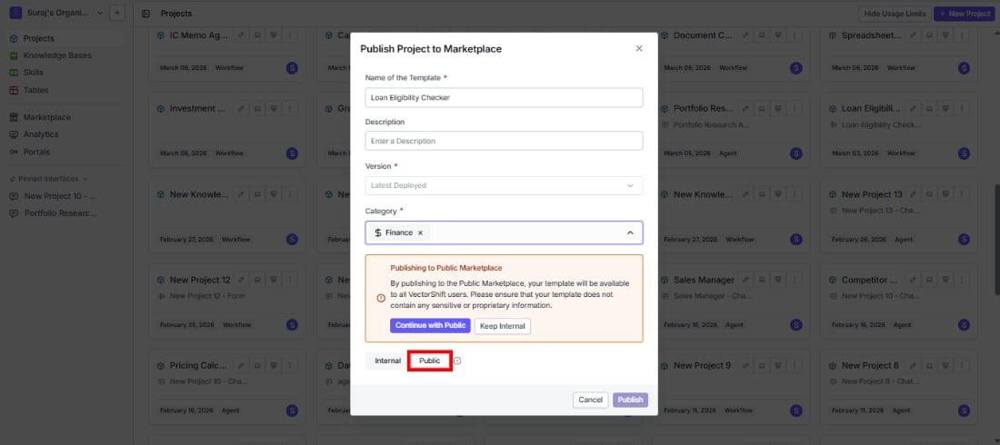
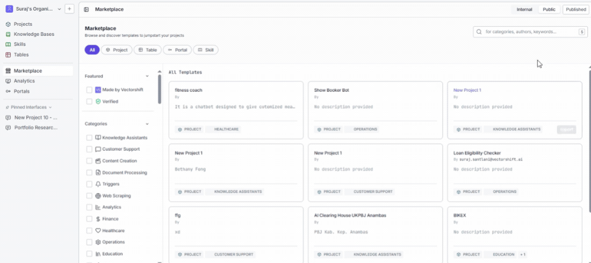
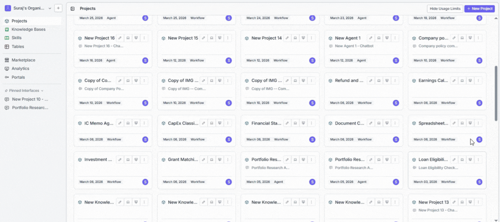

> ## Documentation Index
> Fetch the complete documentation index at: https://docs.vectorshift.ai/llms.txt
> Use this file to discover all available pages before exploring further.

# Publish to Marketplace

> Turn a finished project into a reusable template that your team or the entire VectorShift community can import and build on

Once you have built a workflow that works well, you can publish it to the Marketplace so others can import it and start from your work instead of building from scratch. Choose to share it just within your organization, or make it available to every VectorShift user.

For example, if your team spent a week perfecting a customer support chatbot with the right prompts, knowledge base setup, and conversation flow, you can publish it internally so every other team can import it, connect their own data, and be up and running the same day.

## Publish a project step by step

1. Go to the **Projects** page by clicking **Projects** in the left sidebar. You will see a list of all your projects.

2. Find the project you want to share and open its context menu (right-click or click the menu icon on the project card). Select **Publish to Marketplace**. This opens the publish dialog.

3. In the **Name of the Template** field, enter the name you want others to see when browsing the Marketplace. This defaults to your project name, but you can change it to something clearer. For example, instead of "New Project 5," use a name like "Loan Eligibility Checker" that tells people exactly what it does. This field is required.

4. In the **Description** field, write a short summary of what the template does, what problem it solves, and what kind of input it expects. This is optional but strongly recommended because it is the first thing people read when deciding whether to import your template.

5. Open the **Category** dropdown and select one or more categories that describe your template's purpose. You can type in the search box inside the dropdown to quickly find the right option. At least one category is required. The available categories are:
   * **Knowledge Assistants**
   * **Customer Support**
   * **Content Creation**
   * **Document Processing**
   * **Triggers**
   * **Web Scraping**
   * **Analytics**
   * **Finance**
   * **Healthcare**
   * **Operations**
   * **Education**
   * **Legal**

6. Under **Visibility**, choose who should be able to see and import your template:
   * Select **Internal** to share the template only with members of your organization. It will appear under the **Organization Published** tab in the Marketplace.
   * Select **Public** to make the template available to all VectorShift users. It will appear under the **Marketplace** tab.

7. **If you selected Public:** A confirmation message appears warning you that the template will be visible to all VectorShift users. Read the message and choose:
   * **Continue with Public** to go ahead and publish publicly.
   * **Keep Internal** if you change your mind and want to limit visibility to your organization.

8. Click **Publish** at the bottom of the dialog. Your template is now live in the Marketplace and others can start importing it immediately.

<Warning>
  Public templates are visible to every VectorShift user. Before publishing publicly, make sure your template does not contain sensitive data, hardcoded API keys, internal credentials, or business logic that should stay within your organization.
</Warning>

## Manage your published templates

After publishing, you can view and manage everything you have shared from the **Published** section of the Marketplace page.

### View what you have published

Click **Marketplaces** in the left sidebar, then open the **Published** tab. This shows all templates you (or your organization members) have published. You can filter by category or object type to find a specific one.

### Remove a template from the Marketplace

If a template is outdated, has been replaced, or was published by mistake, you can unpublish it:

1. Open the **Published** tab in the Marketplace.
2. Find the template you want to remove and click the unpublish action on its card.
3. A confirmation dialog asks you to confirm. Once you confirm, the template is removed from the Marketplace and others can no longer import it.

<Note>
  Unpublishing a template removes it from the Marketplace, but it does not affect copies that others have already imported. Their imported projects continue to work independently.
</Note>

## Use cases

* **Save your team from duplicate work** - Publish a well-tested workflow internally so other teams can reuse it instead of spending days building the same thing.
* **Standardize how your organization works** - Share approved templates for common tasks like document processing or data extraction so every team follows the same proven approach.
* **Give back to the community** - Publish a template publicly to help other VectorShift users who are trying to solve a problem you have already figured out.
* **Get new hires productive faster** - Publish starter templates internally so new team members can import working examples, explore how they are built, and learn by doing.
* **Enable cross-department collaboration** - Publish an analytics workflow that sales, marketing, and operations can each import and customize with their own data sources.

<Tip>
  Test your template end to end before publishing. Run it with realistic inputs, check that it produces the right outputs, and make sure it does not depend on resources (like a specific knowledge base) that others will not have access to. A template that works out of the box gets imported and trusted.
</Tip>

<Tip>
  Put effort into the name and description. Templates with clear, specific names like "Invoice Data Extractor" get found and imported far more often than vague names like "New Project 3." A good description that mentions the input type, what the workflow does, and what output to expect helps others decide quickly.
</Tip>

## Related pages

<CardGroup cols={2}>
  <Card title="Browse the Marketplace" icon="store" href="/platform/marketplaces/overview">
    See what your published templates look like from a browser's perspective
  </Card>

  <Card title="Ready-to-use templates" icon="grid-2" href="/platform/marketplaces/templates">
    Browse all available pre-built templates by category
  </Card>

  <Card title="Workflows" icon="diagram-project" href="/platform/pipelines/overview">
    Build and refine the workflows you want to share
  </Card>

  <Card title="Chatbots" icon="comment" href="/platform/interfaces/chatbots/getting-started">
    Create chatbot projects worth sharing with your team
  </Card>
</CardGroup>

## Common issues

For troubleshooting, visit the [Support](/support) page.
