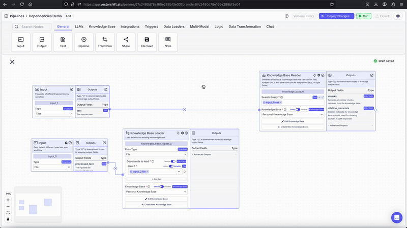

> ## Documentation Index
> Fetch the complete documentation index at: https://docs.vectorshift.ai/llms.txt
> Use this file to discover all available pages before exploring further.

# Dependencies

> Force certain nodes to run after others

Workflows in VectorShift are automatically structured so that nodes don't start running before the previous nodes finish.
For example, if an LLM node uses the output of a [Knowledge Base Reader](/platform/pipelines/knowledge/knowledge-base-reader), in its prompt input, the LLM will not start running until the KB Reader finishes.

In some cases, however, you may want a node to wait until a previous node finishes, even if the node doesn't directly depend on any of the previous node's inputs.
For example, you may want to load a file into a Knowledge Base using a [Knowledge Base Loader](/platform/pipelines/knowledge/knowledge-base-loader) and then query it after it loads using a [Knowledge Base Reader](/platform/pipelines/knowledge/knowledge-base-reader).
The KB Loader doesn't have any outputs, but the KB Reader still needs to wait for it to finish before starting.
In such a situation, you can use the Dependencies input on the KB Reader node to ensure it waits for the KB Loader before starting.

To access the Dependencies input, click the gear icon on the top-right of the node to open the settings.
Then scroll down until you see "Advanced Settings", and click it to expand the section.
Once expanded, you will see an input called Dependencies, which accepts a list of values of type `Path`.
The `Path` type is a special type that only works in the Dependencies input.
Every valid node has a hidden output with the `Path` type called "complete".
Putting a node's "complete" output in another node's Dependencies input will ensure that the second node waits for the first to finish before the second node starts.

