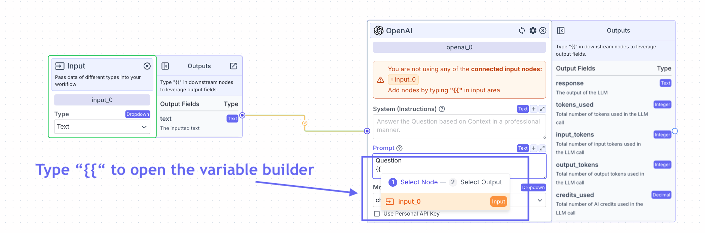

> ## Documentation Index
> Fetch the complete documentation index at: https://docs.vectorshift.ai/llms.txt
> Use this file to discover all available pages before exploring further.

# Variables

> Type `{{` in any text field to open the variable builder

Variables are used to reference specific node outputs of upstream nodes.
When the workflow runs, the output field representing the variable will replace the variable in the field.

In the above example, the text output field from the input node (whatever is inputted by the user), will replace the variable in the prompt of the LLM.

Variables have the following format: `{{[Node name].[Output]}}`

Variables always begin with double curly braces, `{{` and end with double curly braces `}}`.

After typing double curly braces within an input field, the variable builder will appear.

The variable builder has two steps:

1. Select the node. At step 1, all the available nodes currently used on the canvas will appear.
2. Select the output field. At step 2, all the available output fields from the selected node from Step 1 will appear.

At step 1 (selecting the node), the variable builder will only show nodes that have output fields with compatible types with the input in question.

At step 2 (selecting the output field), only output fields with compatible types will be shown.

**Considerations:**

* If a variable is invalid, the variable will be highlighted in red. The error along with suggestions on how to correct the error will be shown on the node. Common errors include:
  * Invalid variable: you are using an invalid node name. Node names are displayed at the top of each node and you can only reference nodes that are currently on the canvas. Delete the variable when you have an invalid variable.
  * Output Field is not selected / wrong: this error occurs when the output field (the text after the “.” in the variable) is not correct. The available output fields for an identified node is on the side panel on the right of the node.
  * You are not using any of the connected variables: another node is connected to the node in question, but none of the output fields are used. You can open the variable builder by typing `{{`.
  * You are using nodes that are not connected: an output field of a variable is utilized from a node that is not connected. Connect the node by connecting its output edge to the node in question’s input edge.
