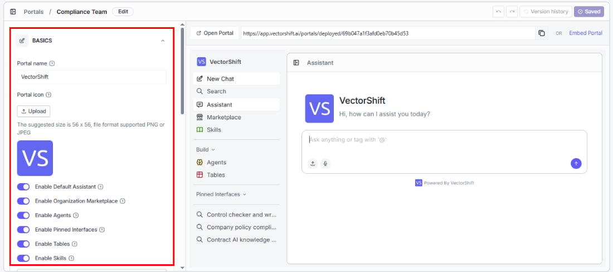
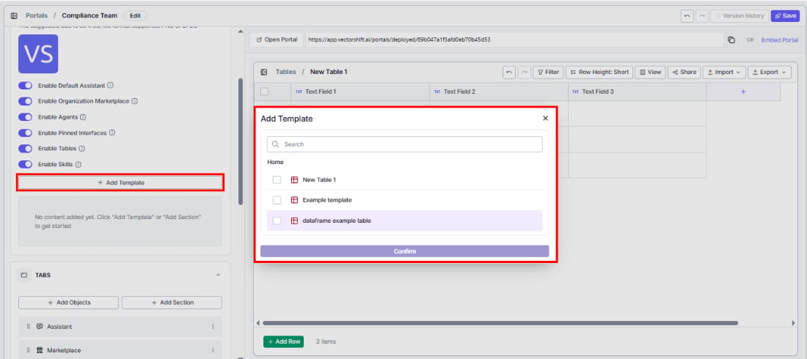
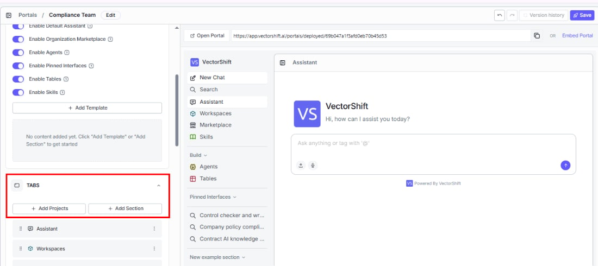
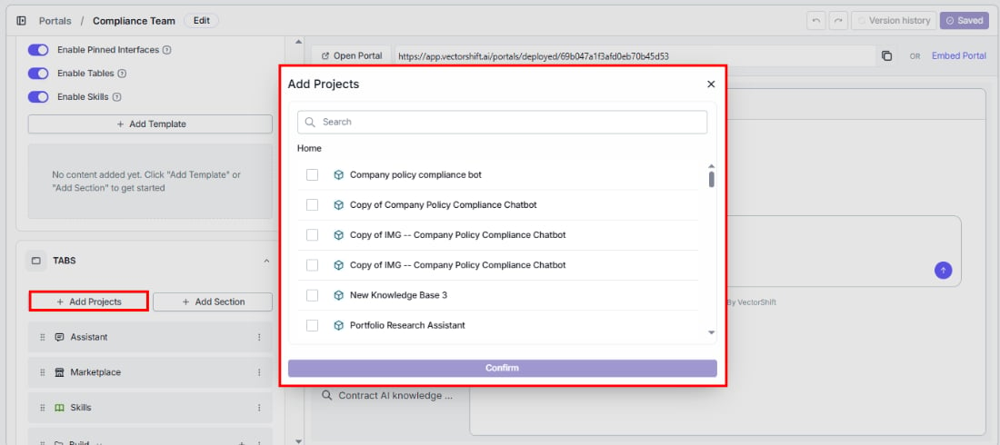
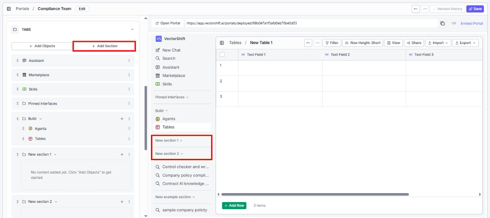
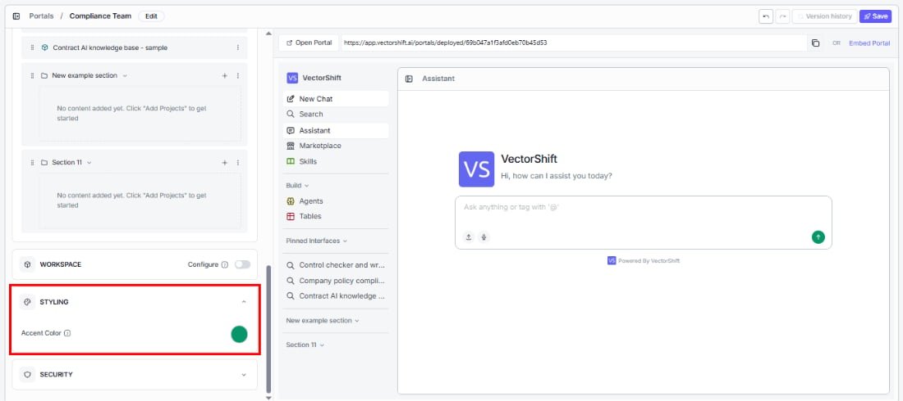
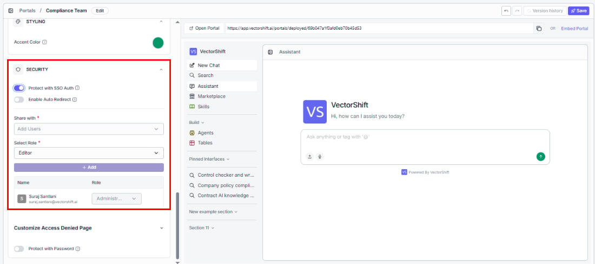
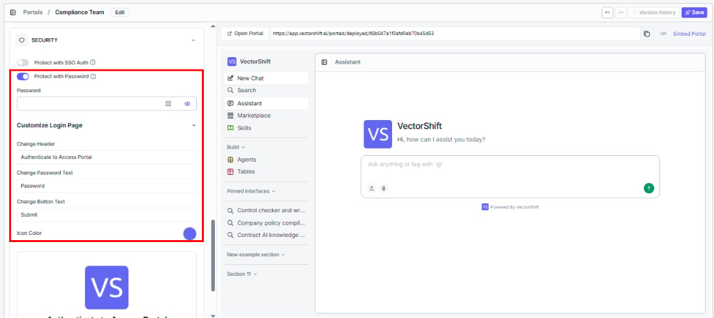

> ## Documentation Index
> Fetch the complete documentation index at: https://docs.vectorshift.ai/llms.txt
> Use this file to discover all available pages before exploring further.

# Configuring a Portal

> How to configure portal settings including basics, tabs, workspace, styling, and security

Click **Edit Portal** on any portal to open the editor. The left panel is where you configure everything; the right panel shows a live preview that updates as you make changes — so you can see exactly what your users will get before you save.

The top bar gives you **Undo / Redo** controls, access to **Version history** (to browse or restore previous configurations), and a **Save** button.

The configuration panel is organized into four sections: Basics, Tabs, Styling, and Security. Workspace configuration has its own dedicated page — see [Workspace](/platform/portals/workspace).

## Basics

This is where you define what your portal is and what it offers.

### Portal name

The name your users see. Choose something descriptive — "Customer Support Hub" is more helpful than "Portal 1."

### Portal icon

Upload a custom icon (PNG or JPEG, 56x56px recommended) to give your portal a recognizable identity. This appears in the top left corner of the portal.

### Feature toggles

These toggles control what your users can access inside the portal. Turn on only what is relevant to your audience — a cleaner portal means less confusion and faster onboarding.

* **Enable Default Assistant**: Give users an agentic chat interface where they can ask questions, tag specific interfaces with `@`, and upload files.
* **Enable Organization Marketplace**: Let users discover and deploy templates from your organization's shared library.
* **Enable Agents**: Let users view, interact with, and build their own agents inside the portal.
* **Enable Pinned Interfaces**: Surface specific interfaces directly in the sidebar for one-click access.
* **Enable Tables**: Let users view and work with data tables, or create their own.
* **Enable Skills**: Let users view and create reusable content blocks that agents and interfaces can reference.

<Tip>Less is more. If your support team only needs the assistant and two pinned interfaces, disable everything else. They will thank you for the clean experience.</Tip>

### Add Template

If you have enabled Tables, you can provide your users with a head start by adding table templates. Click **+ Add Template** to select one of your existing tables as a starting point. Users can then create new tables from that template or build from scratch.

## Tabs

This is where you shape what your users see in the sidebar — and in what order.

### Add Projects

Click **+ Add Projects** to make your existing projects and workflows directly accessible to portal users. Browse or search the list, select what you want to include, and click Confirm.

<Note>Portals cannot be added as tabs inside other portals — this prevents circular references.</Note>

### Add Section

Keep your sidebar organized by grouping related tabs under collapsible headings. For example, create a "Research Tools" section and add all your research interfaces under it, so users do not have to hunt through a flat list.

### Tab list

The tab list shows everything currently in your portal's sidebar, in the order users will see it. The defaults are:

* **Assistant:** The agentic chat interface.
* **Marketplace:** Your organization's template library.
* **Build** (section): Contains Agents and Tables.
* **Pinned Interfaces** (section): Quick-access interfaces you have pinned.
* **Skills:** The skills library.
* Any projects you added during creation appear below these.

### Rearranging and removing tabs

You have full control over the sidebar layout. Drag any tab using the handle on the left to reorder it — the order here is exactly what your users see. Use the three-dot menu on the right to:

* **Edit:** Rename or reconfigure a tab.
* **Delete:** Remove it from the portal entirely.

Put the most important items at the top and remove anything that does not serve your audience.

<Tip>Every default tab can be removed. If your users do not need the Marketplace or Build section, delete them — the portal only shows what you choose to keep.</Tip>

<Tip>Interfaces you pin inside a portal also appear pinned in the main Builder and Console views of your organization. Pinning is shared across views.</Tip>

## Styling

Make the portal feel like your product, not a generic tool.

### Accent color

Set the primary accent color used for buttons, highlights, and active states throughout the portal. Click the color circle to open the picker.

<Tip>Match this to your brand or your client's brand. A small detail like accent color goes a long way in making the portal feel like a native product rather than a third-party tool.</Tip>

## Security

Control who can access your portal and how they authenticate.

### Protect with SSO Auth

Require users to authenticate via Single Sign-On before they can access the portal. This is the recommended option for enterprise deployments where access should be tied to your identity provider.

* **Enable Auto Redirect:** When turned on, unauthenticated users are sent straight to the SSO login page instead of seeing an access denied screen — a smoother experience for your users.

### Share with (required)

Add specific users by name or email who should have access to this portal.

### Select Role (required)

Assign a role to control what each user can do:

* **Runner:** Can use the portal but cannot view or edit its configuration or any sub-objects.
* **Editor:** Can use, view, and edit the portal and its sub-objects.
* **Administrator:** Full control — can use, view, edit, delete, and share the portal and its sub-objects.

Click **+ Add** to confirm. The table below shows everyone who currently has access and their role — you can change roles directly from the table.

### Customize Access Denied page

When someone without permission tries to access your portal, they see an access denied screen. You can customize it to match your tone:

* **Permission Text:** The main message. Defaults to "You do not have permission to access this portal."
* **Contact Text:** Guidance on what to do next. Defaults to "Please contact the owner to request access."
* **Icon Color:** The color of the icon on the screen.

### Protect with Password

Set a password that users must enter before accessing the portal. This is a simpler alternative to SSO — useful for quick demos, external stakeholders, or situations where you do not need identity-based access control.

### Customize Login page

Make the password login screen feel on-brand. A live preview updates as you edit:

* **Change Header:** The heading text. Defaults to "Authenticate to Access Portal."
* **Change Password Text:** The label for the password field. Defaults to "Password."
* **Change Button Text:** The button label. Defaults to "Submit."
* **Icon Color:** The icon color on the login screen.

## Version history

Every time you save your portal configuration, it is preserved. Click **Version history** in the top bar to browse previous versions and restore any of them with one click.

<Tip>Save a version before making big changes — it gives you a clean restore point if something does not work out.</Tip>
